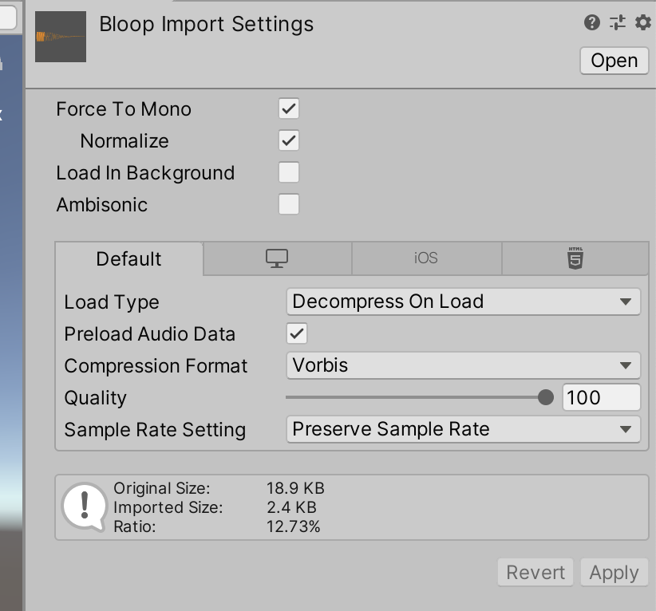
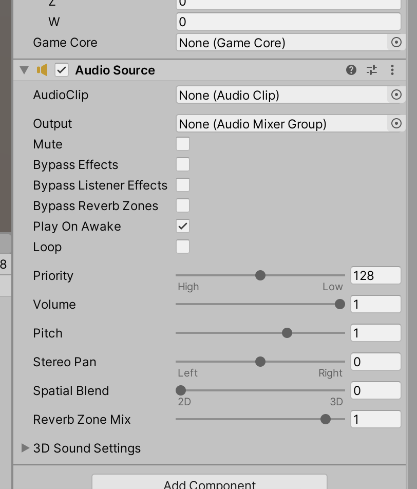
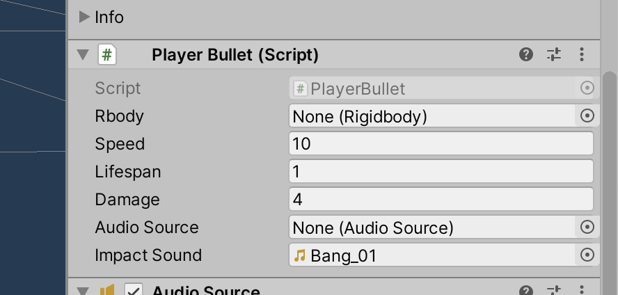
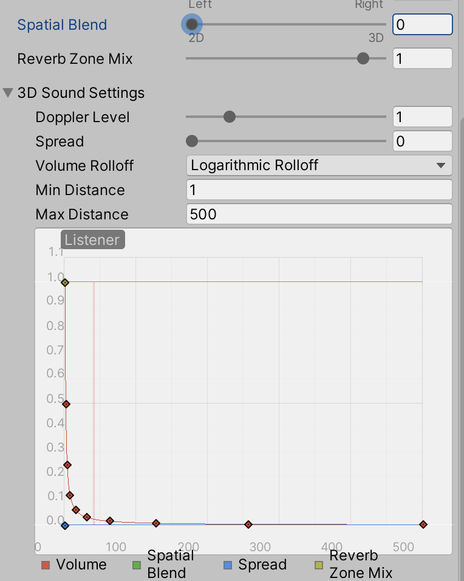

# Unit 11: Audio

<!-- TOC START min:2 max:4 link:true asterisk:false update:true -->
- [Introduction](#introduction)
- [Goal](#goal)
- [Process](#process)
  - [Sourcing the audio](#sourcing-the-audio)
  - [Setting up the project and assets](#setting-up-the-project-and-assets)
  - [Creating the projectile sound](#creating-the-projectile-sound)
  - [Creating the impact sound](#creating-the-impact-sound)
  - [Making the audio spatial](#making-the-audio-spatial)
  - [Adding music](#adding-music)
- [Wrap-Up](#wrap-up)
- [Further Material](#further-material)
<!-- TOC END -->

## Introduction

In this unit we will integrate audio into our game. Boom!

There are two (2) main kinds of audio in games: **diegetic** and **non-diegetic**.

Diegetic audio is audio that occurs within the game world itself. This could be explosions, creature roars, dialogue, and the like: anything that, if you were in the narrative, you could hear.

Non-diegetic audio happens *outside* of the narrative. A soundtrack, for example, can be heard by the human player, but probably not the character they are playing.

The way audio works in Unity is through 3d simulation. You can have an **AudioSource**, which generates audio at a particular location, and an **AudioListener**, which hears audio at a particular location. Unity then *attenuates* the audio by distance, making far sounds quieter. So if the AudioSource and AudioListener are far apart, the audio heard will be quite quiet. In addition, you can also create stereo (left/right) effects.

## Goal

In this unit we'll make the player projectiles have associated sound effects.

## Process

### Sourcing the audio

There are plenty of places to get free sound effects (see below for some). When you're grabbing files, make sure it's in one of these formats:

| Format | Extensions |
|---     |            |
| MPEG layer 3 | .mp3 |
| Ogg Vorbis | .ogg |
| Microsoft Wave | .wav |
| Audio Interchange File Format | .aiff / .aif |
| Ultimate Soundtracker module | .mod |
| Impulse Tracker module | .it |
| Scream Tracker module | .s3m |
| FastTracker 2 module | .xm |

And pay attention to any licenses for attribution crediting.

For this project, we have supplied a couple of files you can use:

- Gun shot

### Setting up the project and assets

1. If you do not have one already, create a folder in your name project folder caller "Audio".
2. Import into this folder any audio assets you'd like to use.

    > Some will be provided for you, but you should make the effort to find or make audio to match your game.

3. For any given sound effect (*not* music), make sure you set the **Force To Mono** in the Inspector:

    

    > For all sound effects, we want it to be mono. Music should be stereo.

4. Check that your `Main Camera` object has an *AudioListener* component. If it doesn't, add one.

    > Unity has a *spatial audio* system, which means that sounds change their stereo position (left and right) and attenuation (louder or quieter depending on distance) based upon where the sound is compared to the one AudioListener in the scene.
    > This is why we want diegetic audio to be in mono -- so we can move it around in stereo where we want it to be. If it's already stereo, we can't position it.
    > Note that you are only allowed *one* AudioListener per scene. You'll get a warning otherwise.

### Creating the projectile sound

Next, we'll make a sound every time we shoot a projectile. When you're creating a diegetic sound, consider where that sound should originate. In this case, the sound will come from the player.

1. On your Player object, add a new component of type **AudioSource**.

    

    > Working in conjuction with the AudioListener, an AudioSource is a source for audio. When you ask the AudioSource to play a sound, Unity calculates its location and distance to the AudioSource to determine stereo and volume.
    > With an AudioSource, you can drag your audio into the **AudioClip** slot, and have it play that sound. But it can only play *that* sound, which is quite restrictive. So we're going to play audio through code.

2. Open your `PlayerAttack` script.
3. Add a new class variable to hold our AudioSource component and one to hold the sound itself:

    ```C#
    public class PlayerAttack : MonoBehaviour
    {
        public GameObject playerBulletPrefab;
        public Transform nozzle;
        public float reloadTime = 0.6f;
        public bool reloading;
        public AudioSource audioSource;
        public AudioClip bulletSound;
    ```

4. And set the audioSource variable in the `Start` method:

    ```C#
        // Start is called before the first frame update
        void Start()
        {
            audioSource = GetComponent<AudioSource>();
        }
    ```

    > This kind of variable setup is quite common in basic games, and we've already used it in this project.

5. In the editor, drag your bullet sound into the `bulletSound` slot.
6. Then we can change the `Update` method to play a sound when we fire a bullet:

    ```C#
        void Update()
        {
            if (Input.GetButton("Fire1") && !reloading)
            {
                Debug.Log("Fire!");
                Instantiate(playerBulletPrefab, nozzle.position, nozzle.rotation);
                audioSource.PlayOneShot(bulletSound); // Play the bullet sound!
                StartCoroutine("Reload");
            }
        }
    ```

    > Dude that's easy

### Creating the impact sound

Next we're going to have the bullet make a sound when it hits something. This is a little more complicated: at the moment, when our bullet hits something, it destroys itself. If we ask it to make a sound, we'll never hear the sound -- when the bullet destroys itself, it also destroys its ability to make sound.

There are many ways around this. The most basic would be to have a *wrapper* object for our bullet prefab, so our geometry isn't on the same object as the code. We did this for our Player -- but not for the bullet! What were we thinking? Well we've learned from that mistake, and now we know that every object in the game should have a wrapper.

Instead, we'll do some object-component management, because that's good to know. What we do is that we'll turn off the geometry rendering and collision, play the sound, and destroy the object when the sound is done.

1. Open the PlayerBullet prefab for editing, and the `PlayerBullet` script.
2. Just like for the player, add your class variables and set the `audioSource` in code:

    ```C#
    public class PlayerBullet : MonoBehaviour
    {
        public Rigidbody rbody;
        public float speed = 10f;
        public float lifespan = 1f;

        public int damage = 4;

        public AudioSource audioSource;
        public AudioClip impactSound;

        // Start is called before the first frame update
        void Awake()
        {
            rbody = GetComponent<Rigidbody>();
            audioSource = GetComponent<AudioSource>();
            rbody.AddRelativeForce(Vector3.forward * speed, ForceMode.Impulse);
            Destroy(gameObject, lifespan);
        }
    ```

    > Now we're going to play the audio before we destroy the gameObject. In order to do that, we'll need to use a coroutine, just like we did for the autofire projectiles. This time, however, we'll dynamically find out how long the audio is, and use that as our duration.

3. After your existing code in `PlayuerBullet`, add a new coroutine:

    ```C#
        private IEnumerator HandleBulletCollision()
        {
            GetComponent<MeshRenderer>().enabled = false; // turn off the renderer, so it disappears
            GetComponent<Collider>().enabled = false; // turn off collision, so it doesn't collide
            audioSource.PlayOneShot(impactSound); // play the sound
            yield return new WaitForSeconds(impactSound.length); // wait for the duration of the sound
            Destroy(gameObject); // remove the bullet
        }
    ```

    > Here, we're turning off (`enabled = false`) two components: the renderer, and the collider, so the bullet disappears and stops colliding with things. Then we play the audio, wait for the duration of the audio, and then destroy the object.

4. Lastly, let's edit our `OnCollisionEnter` code to stop destroying there, and instead call the coroutine:

    ```C#
        private void OnCollisionEnter(Collision other)
        {
            if (other.transform.root.gameObject.TryGetComponent(out Health health))
            {
                health.Damage(damage);
            }
            // Destroy(gameObject);
            StartCoroutine("HandleBulletCollision");
        }
    ```

5. Back in the editor, make sure you edit your prefab to add your audioClip to the new slot in the PlayerAttack component:

    

### Making the audio spatial

So we now have some audio, but by default in Unity, the audio is *not* spatial -- it's **2d** audio. Which is fine for our purposes, and correct for music. But let's make our sound effects a little fancier by making them **3d** audio.

This next section is optional for your game, so don't stress if you don't get to it.

1. Back in your Player object, check out the AudioSource component:

    

    > Note how there is a slider from 2d to 3d called `Spatial Blend`, and it defaults to 2d. Also, if you expand the `3d Sound Settings`, the `Volume Rolloff` is set to **Logarithmic Rolloff`.

2. Slide the `Spatial Blend` slider all the way to 3d.

    > Now when you play the game, chances are you won't hear your bullet sound any more. This is because the attenuation setting -- the rolloff, or how quickly the sound fades out with distance -- is set to **logarithmic**, which is very aggressive.

3. Set the `Volume Rolloff` to **Linear Rolloff**.

    > This uses a more gentle attenuation, so we can hear the bullets again. Depending on your camera follow settings, the more off-center your player is, the more stereo effect you'll get.
    > It'll be pretty subtle, but when you apply the same settings to the impact and to enemies, the effect will be more pronounced.

4. In your PlayerBullet prefab, make the same changes to the AudioSource component.

### Adding music

Now we'll add a soundtrack. This audio will be non-diegetic 2d audio, which will start at the start of the level, and loop throughout the game.

Because it's not spatial audio, it doesn't really matter where we attach the AudioSource component. But becuase we might want the audio to continue after the end of the level, we're going to add it to our existing `GameCore` object -- which, as we saw in the Scene Management unit, gets saved between levels.

1. In your `GameCore` object, add an AudioSource component.

    > If you do not have a GameCore, just add a new empty GameObject, call it `Music`, and add an AudioSource component.

2. Drag your music into the `AudioClip` slot in the AudioSource component.
3. Turn on both `Play On Awake` and `Loop` checkboxes.

    > Now when you play your game, you'll have an awesome soundtrack. Play with the `Volume` slider as needed.

## Wrap-Up

In this unit, we used the combination of `AudioListener` and `AudioSource` components to create diegetic sound effects in 3d spatial audio, and non-diegetic music in 2d audio. We also revisited the very useful coroutine pattern, to make sure our audio finishes playing before we destroy it's gameObject.

## Further Material
- [Unity Manual on the AudioSource component](https://docs.unity3d.com/Manual/class-AudioSource.html)
