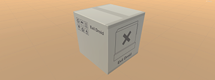
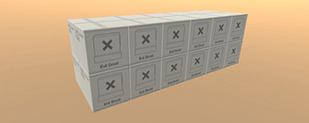

# Week 08: Top-Down Shooter: Boxes

## Introduction

## Adding boxes

- Open your Models folder and create a subfolder called **Props**.
- Open the Props folder and import the `CardboardBox.fbx` asset from the GitHub archive.
- Drag the model into the Scene window and hit F to frame it.

## Texturing the Cardboard Boxes

- Go to your Textures folder and create a new folder called **CardboardBox**.
- Import the two CardboardBox textures from the GitHub archive to the CardboardBox folder.
- Go to your Materials folder and create a new folder called **Props**.
- In that folder, create a new material called **CardboardBoxMat**.
- Apply the CardboardBoxMat material to the box mesh in the Scene view so that we can see changes as we add textures to the material.
- With CardboardBoxMat still selected, ensure that the material Shader is set to Standard at the top
of the Inspector.
- Hit the Albedo circle selector () in the Inspector to open up the Textures assets bin.
- Double-click the **CardboardBox01\_1001\_BaseColor** texture asset to set it as the Albedo.
- Next, hit the Metallic circle selector and choose the black **CardboardBox01\_1001\_Metallic**
texture asset.
- Set Smoothness to 0.1.
You should now have a snazzy-lookin’ cardboard box in your scene.

> We won’t bother with Normal and Height maps for this asset as they won’t add anything to such
a flat asset as this.

> If we test the game now, we’ll phase right through the box without affecting it. For it to respond to collisions, we need to add a Box Collider and a Rigidbody.

## Adding Physics to the Box

If we test the game now, we’ll phase right through the box without affecting it. For it to respond to collisions, we need to add a Box Collider and a Rigidbody.

-	Add Box Collider and a Rigidbody components to the CardboardBox object.
-	Test the game. The box should now react when you bump into it.

> Note: Unity primitives come with a collider by default, but custom models do not. It’s our job to add suitable colliders to the models we make and import.

## Creating Prefabs

So that we can deploy cardboard boxes quickly and easily later, we should preserve the work we’ve done on this one by upgrading it to a Prefab.
- Open your project’s Prefabs folder.
- In the Hierarchy, rename the CardboardBox to CardboardBoxSingle
- Drag the CardboardBoxSingle from the Hierarchy into the Prefabs folder.
You can now drag it from the folder into the scene to add more collidable boxes.
- Select CarboardBoxSingle in the Hierarchy.

> Notice, at the very top of the inspector, that we now have a Prefab section with three buttons next to it. Hitting Select selects the original prefab in the Project window. Hitting Revert undoes any changes we made to the instance of the prefab in the scene. Apply applies any changes we made in the scene to the original prefab—this will cascade those changes to every other instance of the prefab throughout our scene.

## Making a Stack of Boxes

Box physics are fun as heck, so let’s make a stack of boxes and save it as a prefab to deploy whenever and wherever we like.
- Create an Empty Game Object and name it CarboardBoxStack.
- Drag a CardboardBoxSingle prefab from the Hierarchy and drop it on the new Empty.
It should now be a child of CardboardBoxStack.
- Select CardboardBoxSingle and hit CTRL+D to duplicate it (CMND+D on Mac).
- Use the Move tool (W) to position the duplicate alongside the first box.
- Continue in this way until you have a stack of boxes that looks something like this:
- Collapse the CardboardBoxStack ‘group’ in the hierarchy and drag it into your Prefabs
folder.
- Hit Play and mess around with the boxes... FUN\!\!\!

## Applying Changes to the Prefab

- When you’re done, add a CarboardBoxSingle prefab to the Hierarchy and select it.
- In the Rigidbody component, reduce its Mass to 0.5.
- At the top of the Inspector, hit Overrides and then Apply All.

> This has not only applied the change to the CardboardBoxSingle Prefab in the folder and any instances in the Hierarchy, but all the boxes in the stack, too—making them all a little bit easier to push when we bump into them.
