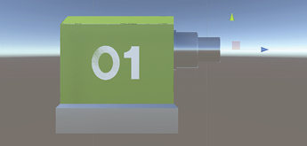
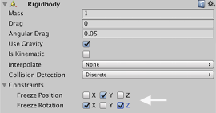
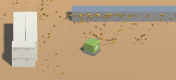
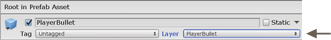
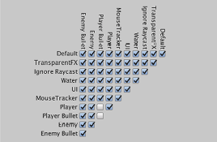
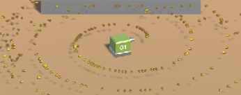

# Week 08: Top-Down Shooter: Projectiles

## Introduction

And now the moment you’ve all been waiting for… Projectiles! Firing projectiles involves instantiating new bullets, firing them in a given direction, calibrating reload/interval times and setting up a projectile range and expiry time.

## Defining the bullet origin point

> Our player already has a gun, but if we instantiated bullets from the player’s position, bullets would emerge from its centre and interfere with the Player’s BoxCollider. So we’ll use an Empty GameObject to define the bullet’s origin.

- In the Hierarchy, select Player01.
- In the top menu bar, go to **GameObject » Create Empty Child**.
> Creating an Empty Child automatically positions the Empty as a child of the currently selected obect.

- Rename the Empty and call it **ProjectileOrigin**.
- Position the Empty a small distance in front of the gun barrel end. Something like this:



## Listening for player fire input

> Unity comes preconfigured with some standard inputs. In the **Edit » Project Settings » Input configuration**, there are Fire1, Fire2 and Fire3 axes mapped to respective mouse buttons (as well as key and joystick input).

- Open your Scripts folder.
- Create a new script and call it **FireProjectile**.
- Select Player01 in the Hierarchy and add the FireProjectile script as a component.
- Add your namespace.
- Delete the `Start()` method and adjust the `Update()` method as follows:

```C#
void Update()
{
    // If Fire1 input is received…
    if (Input.GetButton("Fire1"))
    {
        // we use a method to fire the bullet
        FireBullet();
    }
}
```

> The  Update()  method will run on every frame of the game (constantly). If it registers Fire1 input, it will call a method that will instantiate the bullet. First, we’ll just test for input. So we’ll make a fire method that just has a `Debug.Log` in it.

- Add the following `FireBullet` method:

```C#
void FireBullet()
{
    // Testing that the fire method is being called
    Debug.Log("Firing bullet");
}
```

> Save the script and head back to Unity.

- Hit Play to test it out.

> The console should log ‘Firing bullet’ when you use the Left Mouse Button (LMB).

## Creating a Bullet Prefab

> Now that we know that the method works, we should give the player something to fire at stuff. We’ve provided you with a model of a basic bullet for you to use for this purpose.


- Open your Models folder and import the **Bullet.fbx** asset.
- Drag the bullet model into your Hierarchy and position it a origin `(0, 0, 0)`.
- Create an Empty GameObject and name it **PlayerBullet**. Ensure it is also positioned at origin.
- Drag Bullet onto PlayerBullet to make it a child of the PlayerBullet Empty.
- Hit F to focus on it in the viewport.
- Apply the Gold material to the bullet (this should be in your Materials folder).

> Notice that the bullet is pointing in the same direction as the blue (Z-axis) arrow. For our purposes in this project, Z will always be ‘forward’.

- Drag the PlayerBullet object into your Prefabs folder to save it as a prefab.
- Delete the instance of PlayerBullet that’s in the Hierarchy.  

## Instantiating Prefabs

> The bullet will be instantiated within the `fireBullet()` method that we’ve begun writing in the FireProjectile script.

- Open up the FireProjectile script.
- Add two new public variables - and a header - at the start of the script.

```C#
public class FireProjectile : MonoBehaviour
{
    [Header("Public References")]
    public Transform bulletOrigin;
    public GameObject bullet;
}
```

> The header is simply a label that will appear in the Inspector.

- Now, adjust the existing `FireBullet()` method so that it looks like this:

```C#
void FireBullet()
{
    // Testing that the fire method is being called
    // Debug.Log("Firing bullet");

    // Instantiate the bullet at the point of origin
    Instantiate(bullet, bulletOrigin.position, bulletOrigin.rotation);
}
```

> Here, we’re simply saying “Instantiate (what to instantiate, where to put it, and at what rotation)”

- Save the script and head back to Unity.
- Select Player01.
- Drag the ProjectileOrigin GameObject from the **Hierarchy** into the empty Bullet Origin field in the Inspector.
- Drag the PlayerBullet prefab from the **Project** tab into the empty Bullet field.

> Note: **DO NOT** drag PlayerBullet from the Hierarchy - we deleted this instance of the bullet on the previous page. This needs to be the version that’s in the Prefabs folder.

- Save your scene.
- Hit Play to test the game.

> Bullets should now instantiate at the given point of origin—but they have no velocity—so they just sit there in mid-air.


> Next, we’ll apply some force to the bullet as it’s instantiated.

## Adding Projectile Velocity

> We can use Rigidbody physics to apply a force to each bullet as it spawns.

- Select the PlayerBullet in its Project folder.
- Add a Rigidbody component in the Inspector.
- In the Constraints dropdown, add physics constraints to the bullet so that it looks like this:



- Go to your Scripts folder and create a new script called PlayerBullet.
- Go to your Prefabs folder, select the PlayerBullet prefab and hit Add Component.
- Use the search bar to find PlayerBullet and add that new script as a component.
- In the Player Bullet (Script) component, double-click the PlayerBullet script to open in your editor.
- Add your namespace, delete the `Update` method and add the following:

```C#
public class PlayerBullet : MonoBehaviour
{
    [Header(“BULLET SETTINGS”)]
    public float speed = 100;

    void Start()
    {
        //	Gives the bullet forward force when instantiated
        gameObject.GetComponent<Rigidbody>().AddRelativeForce(Vector3.forward * speed);
    }
}
```

- Save the script and head back to Unity.
- Select the PlayerBullet prefab and add to it a Capsule Collider` component.
- With the PlayerBullet prefab still selected, hit Open Prefab at the top of the Inspector.
- In the Capsule Collider component, set Radius to 0.08
- Set Height to 0.3
- Set Direction to Z-Axis.
- Hit the left-pointing arrow at the top of the Hierarchy window to return to your scene.
- Save the scene and test the game.

> The bullets now have some velocity but they collide with each other and deflect, creating undesired results.



## Filtering Physics

> To avoid projectile-on-projectile collisions, we can use Layers in combination with the project’s physics settings.

- In the top menu bar, go to Edit » Project Settings then choose Tags and Layers.

> If this window is not currently docked, perhaps dock it next to the Inspector for later.

- Starting in User Layer 9, create 4 new layers called:
    - Player
    - Player Bullet
    - Enemy
    - Enemy Bullet

> Hop back over to the Inspector tab (if you docked the Project Settings window).

- Select the PlayerBullet prefab in its folder and assign it to the Player Bullet layer.

You’ll find this at the top of the Inspector:



- If a dialogue pops up, choose `Yes, change children`.
- Select **Player01** in the Hierarchy and assign it to the Player layer in the same way.
When asked whether to apply the change to its children; say yes.
- Again, choose Yes, change children.

## Layer Collision Matrix

> Now that the layers are set up, we need to tell Unity what should collide with what. We can do this using the Layer Collision Matrix.

- In the top menu bar, go to Edit » Project Settings » Physics.
- Uncheck boxes so that the matrix looks like this:



> This stops the Player from colliding with its own bullets and stops its bullets from colliding with each other.

- Save the scene and test the game.

> The bullets no longer collide, but they move slowly and never expire… endlessly occupying memory — we’ll fix that soon.



## Projectile ForceMode

> There are four `ForceModes` available in Unity: `Force`, `Acceleration`, `Impulse`, and `VelocityChange`. The default value is `Force` — which is is applied continuously along the direction.

> You can read more about it here: [Unity documentation: ForceMode](https://docs.unity3d.com/ScriptReference/ForceMode.html).

> Impulse adds an instant/explosive force to a rigidbody—that is; an initial burst rather than a continuous application of force—much like a gun firing a bullet!

- Add a `ForceMode.Impulse` parameter to the end of your existing  `AddRelativeForce` line in the PlayerBullet script:

```C#
void Start()
{
    //	Gives the bullet forward force when instantiated
    gameObject.GetComponent<Rigidbody>().AddRelativeForce(Vector3.forward * speed, ForceMode.Impulse);
}
```

- Also in the PlayerBullet script, adjust your `speed` public float variable to a value of 10.
- Save the script and head back to Unity.
- With the PlayerBullet prefab selected, ensure that the speed variable is set to 10 here, also.
- Hit Play to test the game.

> There isn’t much noticeable difference because we reduced the ‘speed’ value—but the bullets actually move about 10x faster.

- You can tweak the bullet’s speed variable until you have a velocity that you’re happy with.

> Be aware that fast objects might clip through walls.

## Projectile Intervals

> Currently there is basically no reload / interval time between each projectile that is fired. Even if this weapon is intended to be rapid-fire, we should create a variable that lets us adjust the rate of fire. That way, if we later use our FireProjectile script for a rocket (for example) we can adjust this variable to something more suited to a rocket-launcher.

- Open your FireProjectile script.
- Add the following public and private variables just beneath your existing ones.

```C#
public class FireProjectile : MonoBehaviour
{
    [Header(“Public References”)]
    public Transform bulletOrigin;
    public GameObject bullet;
    public float timeBetweenBullets = 0.15f;

    // PRIVATE VARIABLES:
    float timer;
```

- Adjust the `Update()` method so that it only fires if enough time has passed, then reset the timer like this:

```C#
void Update()
{
    // Tie ‘timer’ to the game clock
    timer += Time.deltaTime;

    //	If Fire1 input is received ..
    if (Input.GetButton(“Fire1” && timer >= timeBetweenBullets))
    {
        FireBullet();
        // reset timer for next bullet
        timer = 0;
    }
}   
```

- Save and test. You should now be able to adjust the player’s rate of fire via the `timeBetweenBullets` variable in the Inspector.

> Just a quick note to clear up the difference between the two: Time.time refers to the time (in milliseconds) since the start of gameplay. Time.DeltaTime refers to the duration of one ‘frame’. As each frame represents a different workload (depending on the number and weight of calls made during that frame) the duration will vary very slightly from frame to frame.

## Projectile Lifetime

> Currently, the bullets never disappear once instantiated, thereby occupying memory forever and potentially crashing the game... So we’ll add a ‘projectile lifetime’ variable and a ‘destroy’ method to the PlayerBullet script.

- Open the `PlayerBullet` script.
- Beneath your existing `speed` variable, add the following variable:

```C#
public class PlayerBullet : MonoBehaviour
	{
		[Header(“BULLET SETTINGS”)]
		public float speed = 10;
        public float bulletLifetime = 1f;
```

- In your  Start()  method, add this ‘Destroy’ code:

```C#
void Start()
		{
			//	Gives the bullet forward force when instantiated
			gameObject.GetComponent<Rigidbody>().AddRelativeForce
			(Vector3.forward * speed, ForceMode.Impulse);

            // Destroy the bullet after an amount of time
            Destroy(gameObject, bulletLifetime);
		}
	}

```

- Now, after the  Start()  method, add an `OnCollisionEnter` handler to deal with bullet impacts:

```C#
            // Destroy the bullet after an amount of time
            Destroy (gameObject, bulletLifetime);
		}

        void OnCollisionEnter(Collision other)
        {
            // Destroy the bullet
            Destroy(gameObject);
        }
	}
}
```

- Save and test.

> Bullets should now disappear on contact with the wall and the boxes. Bullets that don’t collide with any objects will also evaporate after one second.
