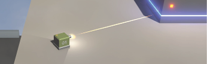
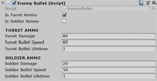

# Week 11: Top-Down Shooter: upgrading Line renderer & Enemy Bullets

## LINE RENDERER MKII
  
  



Before we get into adding the enemy ‘Solider’ unit, let’s make a couple of very quick upgrades. One is in preparation for the Solider’s addition to the project. The first, though, will be to our line renderer. Currently, the line renderer is very blocky and cartoony. This improvement will make it look slightly more realistic (and generally cooler).

- 	Download the **LineRendererMaterialMkII** package from **Stream**.

-	Right-click your **Assets** (root) folder and **Import Package » Custom Package**.
-	Once you’ve imported the package, go into your **Materials** folder and locate the
**lineRendererMaterialMk2** material. It should be in a new materials folder (called _LineRenderer_).
-	Select the player’s **ProjectileOrigin** in the **Hierarchy** and expand the **Materials** dropdown in t
eh **Line Renderer** component (in the **Inspector**).
- Replace the **Element 0** material with the new **Mk2** version.
-	Hit **Play** to test it out. It should fade in more subtly, like this:

 


-	Make the same adjustment to your **Turret prefab.**

# ENEMY BULLET MKII


The other upgrade we’ll make is to the Turret’s bullet. I’ve prepared an _EnemyBullet_ script for you that contains booleans that allow you to state which type of enemy is firing the bullet (and therefore how fast it should fly and how much damage to deliver). So, we should implement it in preparation for the Solider unit that we’ll add next. It also checks whether the object that it collides with has a Health script (which will allow the player to receive damage). If that object does have a Health script, it will convey damage to that script to use accordingly.

-	Download the **EnemyBullet** and **PlayerHealth** scripts from the **Stream** assets and import t
hem as New Assets to your project’s **Scripts** folder.


>Note: Tempting as it may be to import all the new scripts that are on Stream (to save time later), it’s not advised. Doing so will cause errors. I strongly recommend you import them as and when the PDFs say to.

>Also note: Our project now has lots of scripts.. it’s a good idea to make folders to organise these. eg. Enemy, Player, Gadgets, Cameras and Utility (for scripts like ObjectExpiry).

- 	Open the new scripts and add your **namespace** (if you’re using namespaces in your project).

-	Select the **TurretBullet** (in the your **Prefabs** folder) and remove the **TurretBullet** script
componn.
- Replace it with the new **EnemyBullet** script.
-	In the **Enemy Bullet** script component, check **Is Turret Ammo**.

You can add to this script for as many different enemies as you have in your game.

-	You can test it out, but you’ll notice no immediate change. This was just in preparation for what comes next.
