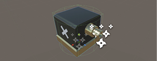

# Week 12: Top-Down Shooter: ENEMY SOLDIERS

It’s happening. We’re adding the soldier unit\! This bad guy will have the ability to seek you out and attack you. To achieve this, the new unit will need a Nav Mesh Agent component and we’ll need to build an actual NavMesh that the Soldier will use to navigate the map.

## PREPARING THE SOLDIER UNIT
Our enemy soldier is basically an evil version of our own droid. It looks like Player01 but has a bad-ass, black paint-job. To save time, I’ve prepared a textured (and partly scripted) Soldier package for you to download.

-	Right-click your **Assets** folder and import the **Soldier** package from the **Stream** downloads.

  This package includes:
          • A Soldier texture set
          • SoldierMat material
          • A Soldier (unit) prefab
          • Attached Nav Mesh Agent component
          • Attached **SoldierControl** script
          • Attached **SoldierFire** script
          • SoldierBullet prefab
          • A trigger sphere
          • Attached **SoldierTrigger** script

-	Open each of the above scripts (indicated in bold) and add your **namespace** (if your project
uses namespaces).

-	Go into your **Prefabs** folder and drag the **Soldier** prefab into the **Hierarchy** to position it at origin.

-	Add the **EnemyHealth** and **EnemyDeath** scripts as components of the **Soldier**.

-	Select the **Soldier** in the **Hierarchy** and, In the **Inspector**, check that all exposed references (in all components) are connected.

  If the _Smoke Effect_ field is empty or contains a _‘dummy’_ object, reimport the Unity Standard
  Assets. **IMPORTANT:** Remember that the Smoke reference object comes from the Soldier
  unit’s hierarchy—not from the folder (as we did with the player and the turret).

  If the _Soldier_ unit is invisible, select the _DroidModel_ object in the Hierarchy and check if the _Player 01_ Mesh is used in the _Mesh Filter_ component. You may need to manually reconnect
  this using the version in your _Models_ folder.

-	Select the **TriggerSphere** and make sure the **This Soldier** reference is connected.

  The This Soldier reference refers to the parenting Soldier object in the Hierarchy.

  

## THE NAVMESH:

AI Navigation requires the use of a simplified geometrical plane, often called a _Navmesh._
The navmesh enables characters to plot a path around the various complex items in a scene.

To create the _NavMesh_, we first need to specify which objects the agent can / should travel upon and / or avoid.

-	Select your main ground object. It doesn’t matter if this is a cube or a plane or a model that
you’ve imported or whatever. Select the thing (or things) that you’re using as the ground or
floor. We need to make that thing traversable by the Soldier.

-	In the top-top right of the **Inspector**, set your ground object/s to **Static**.

-	Select any walls and permanently placed objects in your scene and set those to **Static.**

>Note: Don’t include anything that you want to be able to move. eg. cardboard boxes.

-	Select the **Turret** prefab in its folder.

  As turrets can be removed from the game (destroyed), this requires a slightly different
approach..

- 	In the dropdown list beside (to the right of) the **Static** checkbox in the **Inspector**, choose **Navigation Static**. And, yes: apply this to children.

- 	In the top menu bar, go to **Window » AI » Navigation.**

  This opens the Navigation window—this can be docked alongside your Inspector and
Lighting tabs.

- 	In the **Bake** tab of the **Navigation** window, hit **Bake**.

  This bakes a navigation mesh for your agents to follow. Your level should now be covered
  by blue geometry (if you can’t see this, check Show NavMesh in the bottom-right of the Scene
  viewport).

  The blue area indicates where the agents are able to go. Notice that agents are not allowed
  to go right up against walls and to the edge of your ground plane. This helps avoid problems
  such as the agent getting snagged on objects. If you increase the Agent Radius attribute and
  re-bake, that buffer zone / area will become wider.

-	Go back to the **Inspector** and make sure the **Soldier** is selected.

-	Familiarise yourself with the **Nav Mesh Agent** component. This is where you can make further adjustments to the way the _Soldier_ unit moves.

-	Check the **Overrides** dropdown at the top of the **Inspector** to see if there are any changes that need to be applied to the prefab.

-	Hit **Play** and test this out.

The _Soldier_ should actively pursue and attack you as long as you’re within its _TriggerSphere._
Alter the scale of this sphere if you’d like to adjust the Soldier’s range.
