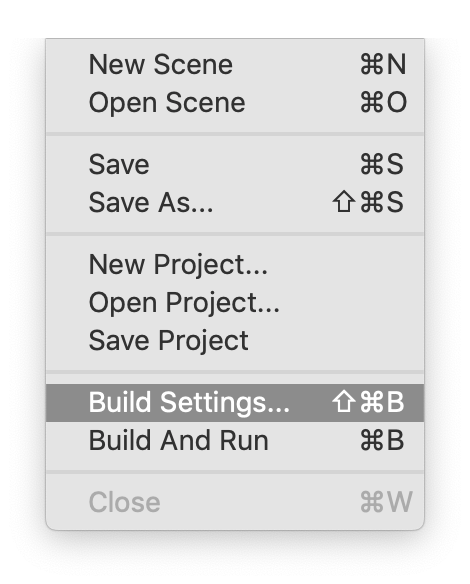
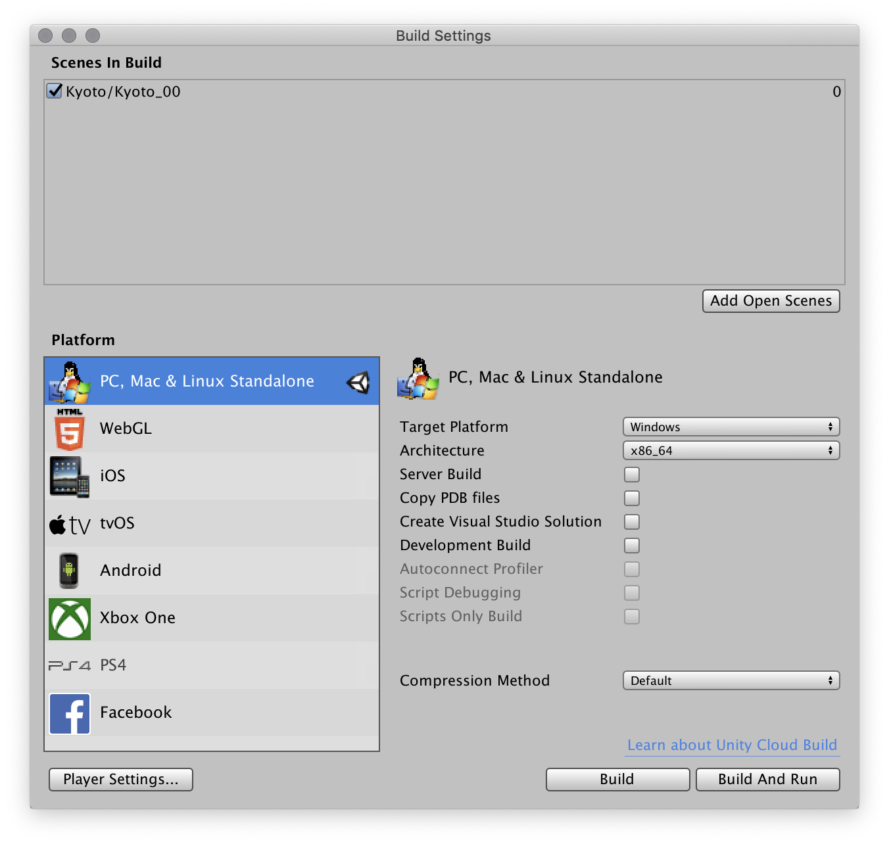

# Building Your Game

## Introduction

The process of “building” or compiling your game is when Unity takes all of your scripts and assets, and packages them into an executable, able to run on the specific platform you built for.

Unity can build across many platforms, including Windows, Mac, Linux, Web, XBox, PS4, Switch, etc. Some platforms require further costs or packaging to complete the process.

It's best if you compile your game for the platform you’re developing on.

Unity also has a “Cloud Build” service for a fee, which builds your game in the cloud for multiple platforms.

Truly, we live in the future.

## Build Steps
Once your game is ready to be built, and all your errors are gone, you’re ready to build.

1. Click on **Build Settings…** in the **File** menu.

2. In the Build dialog, make sure you add any scenes you need in the game. At the very least you need to add the current scene. The Add Open Scenes button is very useful.

The order of the scenes is important – the first scene (marked `0` on the far left side) will be the first scene loaded. So if you have a loading or splash screen, make sure it’s at the top.

3. If you decide to change target platforms, be prepared for a wait while Unity recompiles your assets and code. It can take a while.
4. When you’re ready, you can click the **Build** button.
5. Make sure to save it somewhere useful. Depending upon your platform, you may end up with both an executable file and a data folder.

> On Mac, your entire game will be one application.

> On Windows, you'll get an exe and a **data folder**. Make sure you keep the **data folder** in the same place as the executable. Your game will not  play without it.
