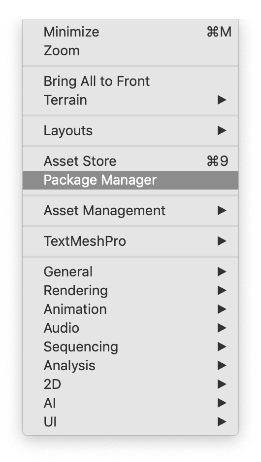
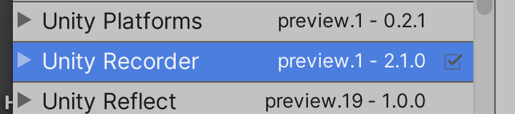
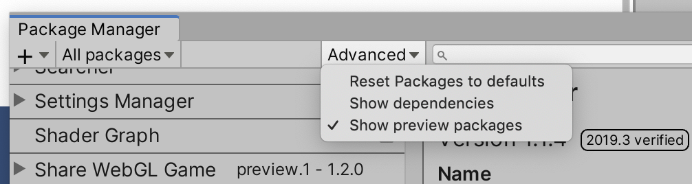
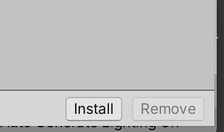
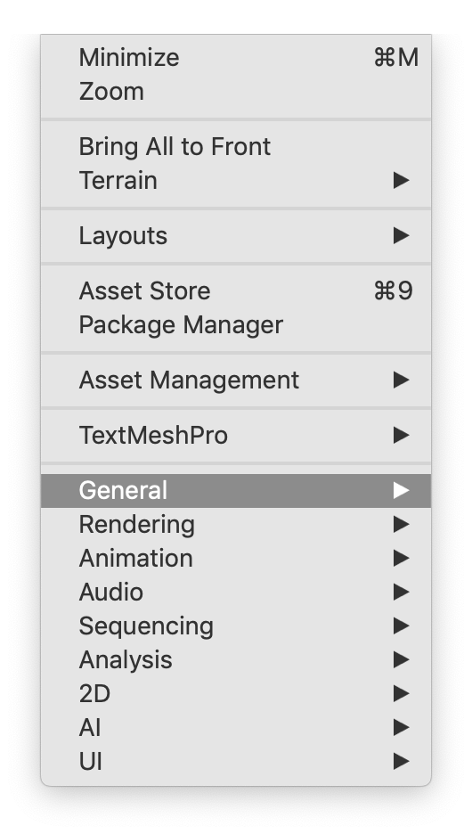
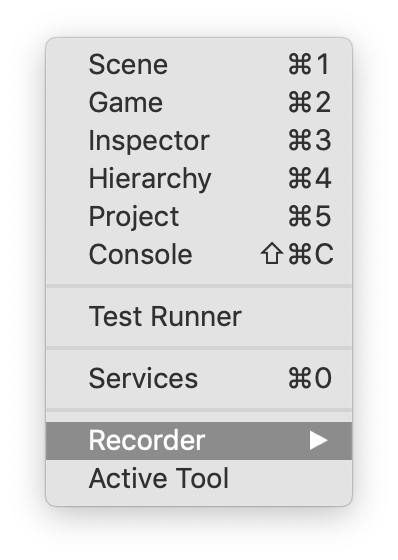
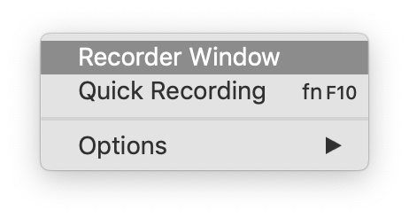
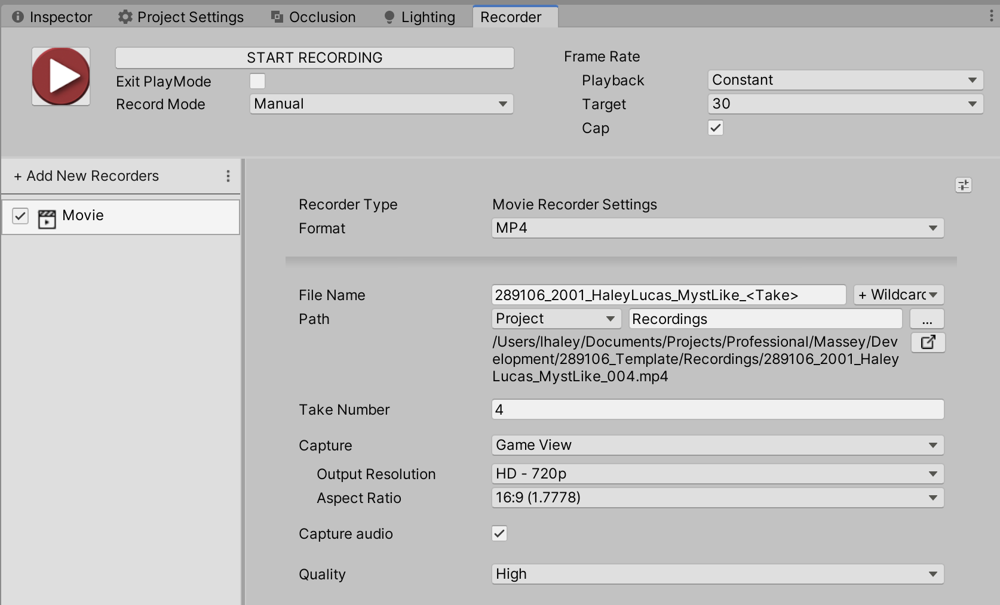

# Recording Your Game

## Introduction

For each submission, you will be required to submit a video of a complete run-through of your game. To facilitate this, you can use the Unity Recorder package.

Installing packages can be tricky, and some packages are definitely alpha versions and will break your game. So please be careful, and only install those packages you know you need.

## Installation

- Open your project in Unity
- Go to the `Window>Package Manager` menuitem

- Find the Unity Recorder package. You might need to wait a moment while Unity downloads the list of available packages.

- If it doesn't show up, turn on the `Preview` packages under the `Advanced` menu.

- At the very bottom right of the panel, click Install.

- Close the Package Manager panel.

## Recording

- Go to the `Window>General>Recorder>Recorder Window` menuitem.

- This will open the **Recorder Window** panel. I recommend you dock it alongside your Inspector panel.
- In the Recorder Window panel, click the **Add New Recorders** button and change the settings to match this image. Change the filename as necessary.

- Click the **Start Recording** button, and go for it. When you stop the game, it will stop recording.
- If needed, record multiple versions and edit them together to get all your content.
