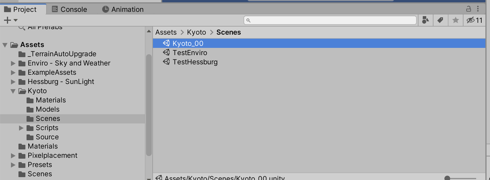
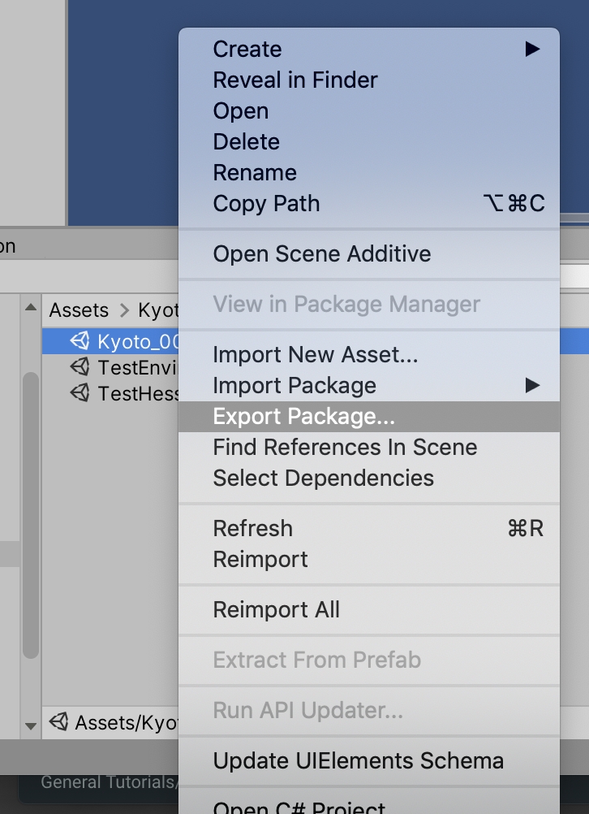
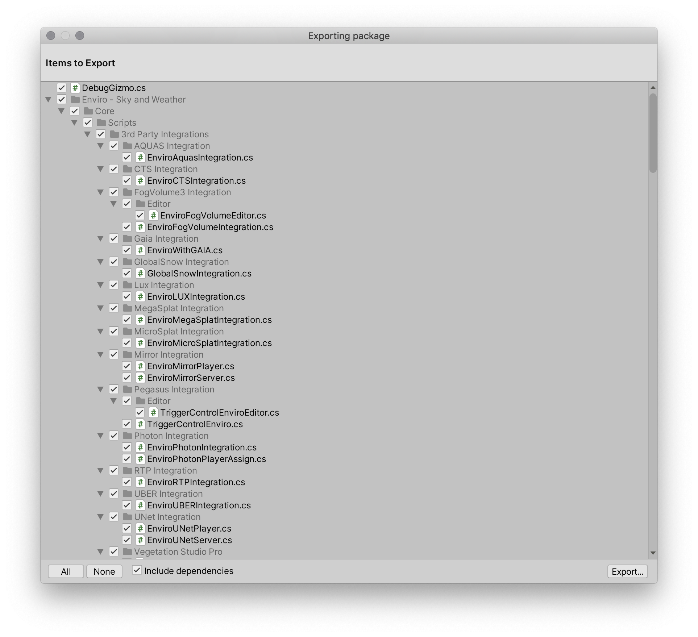
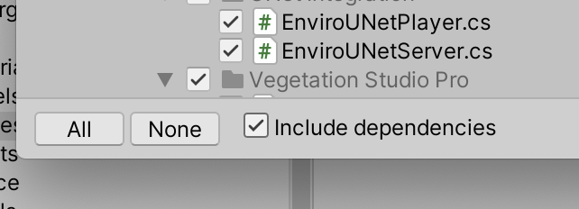
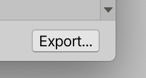

# Sending Me Your Scenes

## Introduction

This tutorial follows the [making packages](making_packages.md) tutorial, so if you haven't read that one yet, please do.

When you're looking for assistance with your project, or if you are submitting your work for assessment, it's a good idea to create a package of your scene, rather than sending the whole Unity project. This tutorial will walk you through making a package from your scene.

## Packaging up your scene

- Open your project in Unity.
- In the `Project` tab, find the scene(s) you're looking to send.

- Right-click on the **Scene**, and choose `Export Package…`

- A new dialog will pop up. It will include a bunch of items that will export.

- Make sure the  `Include dependencies` checkbox is checked.

- Click the `Export` button.

- Save it somewhere useful. It will create a `.assetpackage`, which is already a zip file, so you can just email/upload that file straight away.
