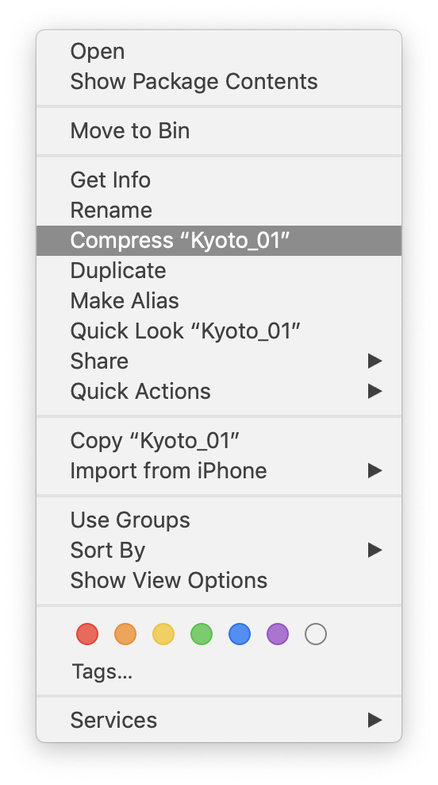
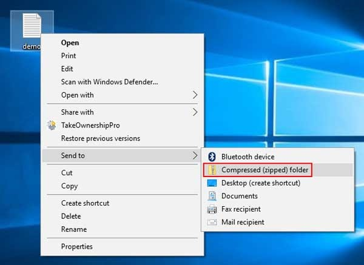

# Uploading Your Game

## Introduction

In this brave new Covid-19 world, we’ll be needing to upload our built games to the internet for others to try. This is just a short tutorial to make sure you’re uploading all you need to.
Upload Steps

Once your game has been built, the first step is to create a zip archive of the game. This process is different for Windows and Mac.

## Mac
Find the file in the Finder. Right-click on it, and choose Compress.

## Windows
When you build for Windows, Unity makes **two** items – *both of which are critical to the game*. The first is the executable, named after your project (e.g. Kyoto_01.exe). The second item is the data directory, named after your project with a `_Data` suffix (e.g. `Kyoto_01_Data`).
Select both of those items, right-click, and choose Send to > Compressed (zipped) folder**.

## Upload Options
You should now have **one (1) zip file** that contains your game. You can now upload it to the cloud.
There are a lot of different options out there for sharing your work. Some useful links include:

- Google Drive (10Gb size limit). Free with your gmail account.
- OneDrive.
- WeTransfer. 2Gb limit per transfer. Make sure to click the circle with three dots and choose Get transfer link. Links expire after 1 week.
- Mega
- Dropbox
