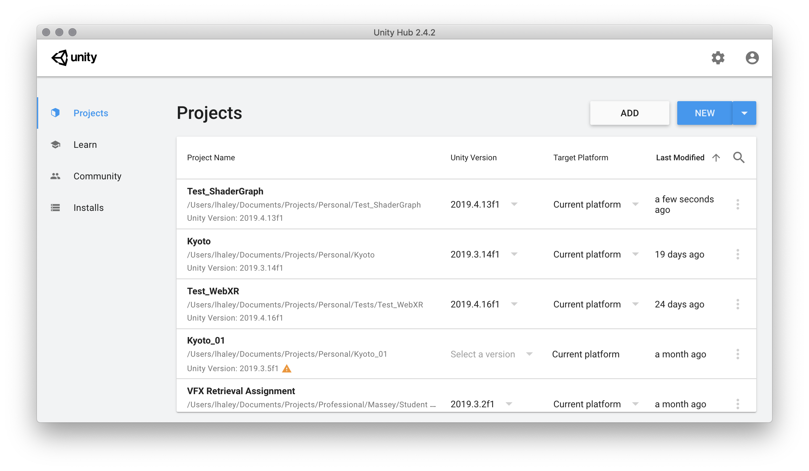
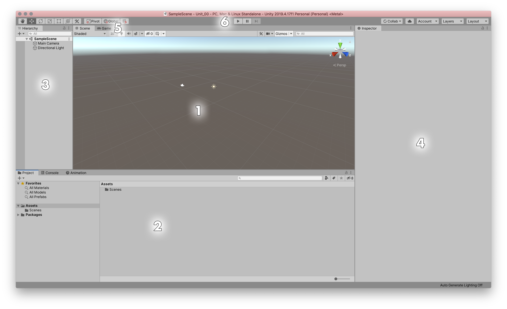

# Unit 00: Orientation

## Introduction

For this course, we'll be taking a dive into Unity as a game development platform. We'll be making a top-down shooter game over the next 12 weeks.

> This first unit will be light on information, as the majority of content is better presented in-person in the workshop. This document will help as a reminder.

## Goal

The goal of this unit is to become familiar with the Unity workspace and usage. These are fundamental skills that will be carried throughout the rest of the course and onwards.

## Process

### Opening Unity

Unity gets updated frequently, and often the different versions can have quite large codebase differences. To avoid issues with breaking code with updating, Unity has a separate application called Unity Hub that allows users to install different versions, and open projects in the correct versions.

Open Unity Hub from the Start menu, and create a new project using version [[NEED VERSION FROM ITS]].

From the selection of templates, choose the "Massey" template, and let Unity open.

### The User Interface

#### UI panels

1. Scene

    This is where you can manipulate objects in a 3d space.

2. Project

    These are all of the assets available in your project.

3. Heirarchy

    These are the assets/GameObjects that are currently in your scene.

4. Inspector

    This is a contextual panel, allowing you to manipulate the currently selected objects.

5. Game

    Behind the Scene panel is the Game panel, which shows what your game actually looks like during play.

6. Playmode

    The play button starts and stops the game.

> Pay attention to this button -- it acts as a toggle, so to stop the game you must push the Play button again. The Pause button is used during debugging.

> Remember that any changes you make while the game is in the play mode will not be saved when you exit the play mode.

## Wrap-Up

## Further Material