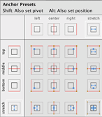
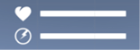
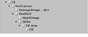

[//]: # (Document markdown file 011.md generated by Crawler 1.0.0 on Tue Apr 21 2020 11:08:29 GMT+1200)
  
  
  
  
  
  
  
  
  
  
TUTOR: DAVID PETERS
  
EMAIL: D.PETERS1@MASSEY.AC.NZ
  
ENGINE VERSION: UNITY 2019.1
DOCUMENT VERSION: 289.106.011.1
  
LINE RENDERER MKII
  
  
  
  
  
  
Before we get into adding the enemy ‘Solider’ unit, let’s make a couple of very quick upgrades. One is in preparation for the Solider’s addition to the project. The first, though, will be to our line renderer. Currently, the line renderer is very blocky and cartoony. This improvement will make it look slightly more realistic (and generally cooler). 
- 	Download the LineRendererMaterialMkII package from Stream.
-	Right-click your Assets (root) folder and Import Package » Custom Package.
-	Once you’ve imported the package, go into your Materials folder and locate the 
LineRendererMaterialMk2 material. It should be in a new materials folder (called 
LineRenderer).
-	Select the player’s ProjectileOrigin in the Hierarchy and expand the Materials dropdown in 
the Line Renderer component (in the Inspector). 
-	Replace the Element 0 material with the new Mk2 version.
-	Hit Play to test it out. It should fade in more subtly, like this:
-	Make the same adjustment to your Turret prefab.
The other upgrade we’ll make is to the Turret’s bullet. I’ve prepared an EnemyBullet script for you that contains booleans that allow you to state which type of enemy is firing the bullet (and therefore how fast it should fly and how much damage to deliver). So, we should implement it in preparation for the Solider unit that we’ll add next. It also checks whether the object that it collides with has a Health script (which will allow the player to receive damage). If that object does have a Health script, it will convey damage to that script to use accordingly.
-	Download the EnemyBullet and PlayerHealth scripts from the Stream assets and import 
them as New Assets to your project’s Scripts folder.
Note: Tempting as it may be to import all the new scripts that are on Stream (to save time later), it’s not advised. Doing so will cause errors. I strongly recommend you import them as and when the PDFs say to.
  
ENEMY BULLET MKII
  
  
ADDING THE PLAYER’S HEALTH HUD
Let’s get some visual feedback happening.
-	Go into your project’s Images folder and import the HUD images from the Stream downloads 
as New Assets.
-	Hold SHIFT and select all items in the Images folder.
-	In the Inspector, set Texture Type to Sprite (2D and UI).
-	Hit Apply.
-	Just above the viewport, hit the 2D button to switch the view to 2D mode.
-	In the Inspector, create a new Empty GameObject and name it UI.
-	Right-click the UI Empty and choose UI » Canvas.
-	Rename the new Canvas HUDCanvas.
-	In the Canvas component in the Inspector, check that the Target Display is the same as 
your game’s camera...
eg. If CameraIsometric is Targeted to to Display 2 in it’s Camera Component, set the 
HUDCanvas to target Display 2.
-	With the HUDCanvas selected, hit Add Component in the Inspector, search for
Canvas Group and add one. 
-	In the newly created Canvas Group component, uncheck both of the checkboxes. We don’t 
need it to be interactable and we don’t want it to block raycasts. 
Read about Canvas Groups here.
-	Right-click the HUDCanvas in the Hierarchy and choose Create Empty. 
-	Rename the new Empty to HealthUI.
-	In the Inspector, open the Anchor Presets, hold ALT and SHIFT and choose the top-left 
option. This will move the anchor, pivot and position of the HealthUI object.	
  
  
  
  
  
  
  
  
  
  
  
  
  
Also note: Our project now has lots of scripts.. it’s a good idea to make folders to organise these.
eg. Enemy, Player, Gadgets, Cameras and Utility (for scripts like ObjectExpiry).
- 	Open the new scripts and add your namespace (if you’re using namespaces in your project).
-	Select the TurretBullet (in the your Prefabs folder) and remove the TurretBullet script 
component.  
-	Replace it with the new EnemyBullet script.
-	In the Enemy Bullet script component, check Is Turret Ammo.
You can add to this script for as many different enemies as you have in your game. 
-	You can test it out, but you’ll notice no immediate change. This was just in preparation for 
what comes next.
ADDING THE PLAYER’S HEALTH SCRIPT
It’s high time we raised the stakes in our game. The player needs adversity for the game to be interesting, so let’s make it so the player can sustain damage from the enemy turret.
-	Select Player1 (parent) in the Hierarchy and add the PlayerHealth script as a component.
-	You can test this out now, but Object Reference errors will appear before long. You should, 
however, see the Player’s Health variable decrease as the turret bullets hit the player 
character. 
Take some time to explore the component and script contents and begin getting your head 
around how it works. Much will be revealed as we proceed.
We’ll need to create a HUD and populate those empty references to make those errors go away.
This will, of course, also provide us (and the player) with visual feedback as to what condition their condition is in.
  
IMPLEMENTING A
HEALTH SYSTEM
  
  
  
  
  
  
  
  
  
-	Rename the duplicated HealthSlider to PowerSlider.
-	Open the PlayerHealth script and uncomment all references to the power system.
To help with this, I’ve numbered them off from 1 - 11.
-	Save the script and head back to Unity.
ADDING THE DAMAGE IMAGE
-	Right-click the HUDCanvas and choose UI » Image.
-	Rename the new image to DamageImage. This is going to be a full-screen [red] overlay that 
flashes when the player takes damage.
-	Drag DamageImage and drop it between HUDCanvas and Health UI—as you see here:
PREPARING THE DAMAGE IMAGE
-	Select the DamageImage.
-	In the Inspector, open the Anchor Presets, as before.
-	While holding ALT and SHIFT, choose the bottom-right option to stretch the image to fill the 
whole screen. Your entire canvas should now have a white background.  
  
  
  
  
  
  
  
  
  
-	In the Inspector, set the HealthUI’s Width to 150 and its Height to 100.
  
-	Right-click the HealthUI Empty in the Hierarchy and choose UI » Image.
-	Name the image HeartImage.
-	Move the cursor into the viewport and F to frame the HeartImage.
-	In the Inspector, give the image Width and Height values of 30 each.
-	In the Image component, use the circle selector (      ) to assign the HeartWhite100px 
image.
-	Again, right-click the HealthUI in the Hierarchy but this time, choose UI » Slider.
-	Rename Slider to HealthSlider.
-	Expand the HealthSlider dropdown in the Hierarchy and delete the Handle Slide Area 
Object.
-	Also delete the Background Object.	
-	Reselect the HealthSlider Object and, in the Inspector, set Transition to none.
-	Set the Max Value to 1000 and slide the Value up to 1000.	
-	In the Rect Transform component, give the slider an X position of 110.
-	In the Hierarchy, expand the Fill Area dropdown and select the Fill object.
-	In the Image (Script) component, Set the Source Image to None.
-	If you’d like to change the colour of the slider, you can do so here via the Color swatch.
(I’m leaving mine white).
DROID POWER SUPPLY (OPTIONAL)
The playerHealth script has commented methods that you can uncomment to implement a power system. The droid’s power will run out over time and need to be refilled—possibly via pick-ups (eg. batteries). If you’d like to implement this:
-	Duplicate the HealthUI Object and rename it to PowerUI.
-	With the PowerUI Object selected, lower it Pos Y value to about -40 in the Inspector.
This will position it beneath the Health slider.	
-	Rename the duplicated HeartImage to PowerImage.
-	In the Inspector, replace the HeartWhite100px with JuiceWhite100px.
  
  
  
  
  
IMPROVING UI GRAPHICS
Your UI elements probably look a bit pixelated and nasty. This could be few a few reasons—but the best fix for this that I’ve come across is actually in the Game window—rather than the image import settings etc.
-	Without pressing Play, go to your Game view.
-	In the top-right of the window, click on the dropdown to the right of Display (It probably says 
Free Aspect).
-	Uncheck Low Resolution Aspect Ratios.
-	OPTIONAL: Choose 16:9. 
-	Roll your mouse wheel to zoom out a bit so that the UI elements are back in view. 
They should look a little better, now.
COMPLETING THE HEALTH SYSTEM: PLAYER DEATH
We now have the means to track health and provide visual feedback to the player. The last thing we need is to handle the player’s death when health reaches zero.
-	Go into your Scripts » Player folder and import the PlayerDeath script from the Stream 
downloads.
-	Open it up and add your namespace (if your project is using namespaces).
-	Take a moment to familiarise yourself with the script’s contents.
-	Save the script and head back to Unity.
-	Add the PlayerDeath script as a new component of the Player01 (parent) Object.
-	With Player01 selected, drag the DroidModel (mesh object) into the empty Droid slot.
The PlayerDeath script will make this invisible when the player dies.
-	Deselect Player01 and in the top menu bar, choose GameObject » Create Empty.
-	Rename the new Empty to SpawnPoints.
-	Position the SpawnPoints Empty at origin (0, 0, 0).
-	Right-click SpawnPoints and choose Create Empty.
-	Rename this SpawnPoint01.
-	Reposition the new SpawnPoint wherever in the map you’d Player01 to respawn when it 
dies. 
-	Check that SpawnPoint01 is positioned at ground level—else the player will appear to be 
floating when it respawns. You may need to lower it to about -0.53.
  
-	Click on the Color swatch and lower the alpha (A) channel down to zero. Later, we’ll both 
colour the background and increase its alpha value via script.
-	Come out of 2D view and select Player01.
-	With the cursor in the Scene viewport, hit F to Focus / Frame / Find Player01.
-	Drag the HealthSlider into the empty Health Slider field in the PlayerHealth (Script) 
component in the Inspector to connect the reference.
-	Drag the PowerSlider into the empty Power Slider field in the Inspector.
(If implementing the droid power system).
-	If you haven’t added the Unity Standard Assets to your project, do so now.
-	Locate the Smoke prefab in the Unity Standard Assets but DO NOT drag it into the empty 
field in the Inspector just yet.
-	We want the smoke effect to follow the player, so we’ll add the effect to the player, itself:
Drag the Smoke prefab from its folder / the Project window into the Inspector—and make it 		a child of the Player01 (parent) Object.
-	Ensure that the Smoke prefab is located at origin (0, 0, 0)—it should be eminating from the 
Player’s location. You may need to remove it from the Player01 hierarchy and position both it 
and the player at origin before adding Smoke as a child.
-	Now drag that instance of Smoke from the Hierarchy into the empty Smoke Effect field in 
the Player Health (script) component in the Inspector.
Player01 should now have no empty slots in the Player Health component.
-	In the Player Health (Script) component, click the Color swatch to open it.
-	Give it a Hexadecimal value of FF2600 (those are zeros) and give the alpha channel (A) a 
value of about 150.
-	Close the Color window.
-	Hit Play and test this out. It’s not finished yet, but you should see:
•	The value of Health goes down in the HealthSlider and in the Health field in the Inspector.
•	The screen should flash red when an enemy bullet hits the player.
•	The Damage Critial checkbox should become checked when the player’s health reaches a 
value of 200.
•	The droid should start smoking when damage is critical.
•	You should also lose control of the player when the value of Health reaches zero.
•	The Is Dead checkbox should also become checked when that value reaches zero.
•	Player’s power should go down slowly over time. You can speed up this decrease by 
tweaking the Power Efficiency value.
  
We’ve just used a tag (Player) to check a boolean in another script. This is a great tool to add to your toolbelt. Just remember to place it in the  Update  method if you need a script to constantly check that other script.
NOTES:
To adjust how long the game waits before respawning you, adjust the Restart Delay value in the Player Death (Script) component in the Inspector.
To adjust when the player begins smoking (due to taking damage), alter the Critical Damage Level value in the Player Health (Script) component in the Inspector.
FINISHING UP:
Before we end this PDF, we should apply those changes to our Player01 prefab and try to synch up those damage flashes with the line renderer (if you haven’t already) - as the discrepancy might be very noticable, now.
-	Select Player01 in the Hierarchy.
-	At the top of the Inspector, click the Overrides dropdown and Apply All changes that we’ve 
made to the prefab.	
-	Go to your Prefabs folder and select TurretBullet.
-	Check that Turret Bullet Speed is set to about 80. This should make it so the line renderer 
hits at roughly the same time as the screen flashes red.
-	While you’re there, you might as well set Soldier Bullet Speed to 80, too.
-	If you haven’t already, open the TurretBullet prefab, select the Bullet object and disable the 
Mesh Renderer, making it invisible. The bullet will still deliver the appropriate damage to the 
player, but won’t look as odd.
  
WEEK 11 - PLAYER HEALTH + HUD
  
  
  
  
-	Drag the instance of Smoke from Player01’s Hierarchy into the Smoke Effect field, as we did 
before. This will allow the PlayerDeath script to switch it off as part of the respawn process.
-	While we’re here, we can squash a bug before it happens. With Smoke selected (in 
Player01’s Hierarchy), look in the Inspector for a Particle System Destroyer (Script) 
component. 
-	If you find one there, uncheck its main checkbox (top-left of the Particle System Destroyer 
(Script) component) to disable it. This will keep the Smoke effect in the game, thus avoiding
a MissingReferenceException error.
-	Locate ExplosionBigCustom in your folders and add that to the empty Explosion Effect 
field in the Player Death (script) component.
-	And that should just about do it. Hit Play to test this out.
The player should explode spectacularly when health reaches zero. The player should then 
respawn at the location you specified—with fresh health and power.
STOPPING ENEMIES FROM SHOOTING AT YOUR CRISPY, CHARRED CORPSE
That’s just really dark, so let’s stop that from happening. We’ll need to add to the TurretFire script and tell it that the player is effectively ‘out of range’ when it dies. This will also mean that the player won’t begin its next life ‘within range’—so it’s an important step either way.
-	Open your TurretFire script.
-	After the second  if  statement in your  void Update(), add a third  if  statement like this: 
-	Save the script and head back to Unity.
The enemy should stop shooting at you when you die, and you should begin the next life ‘out 
of range’ of the turret (assuming your spawn point is far enough away from the turret.
  
TurretFire
  
  
  
t
  
  
  
// If the player is dead, consider it to be ‘out of range’
if (GameObject.FindWithTag(“Player”).GetComponent<PlayerDeath>().playerIsDead == true)
{
playerIsWithinRange = false;
  
}
  
// Effects timer
if (effectsTimer <= 0)
  
{
  
// Disable light
  
DisableEffects();
  
}
  
// If the player is dead, consider it to be ‘out of range’
if (GameObject.FindWithTag(“Player”).GetComponent<PlayerDeath>().playerIsDead == true)
{
playerIsWithinRange = false;
  
}
}
  
  
  
  
  

  
