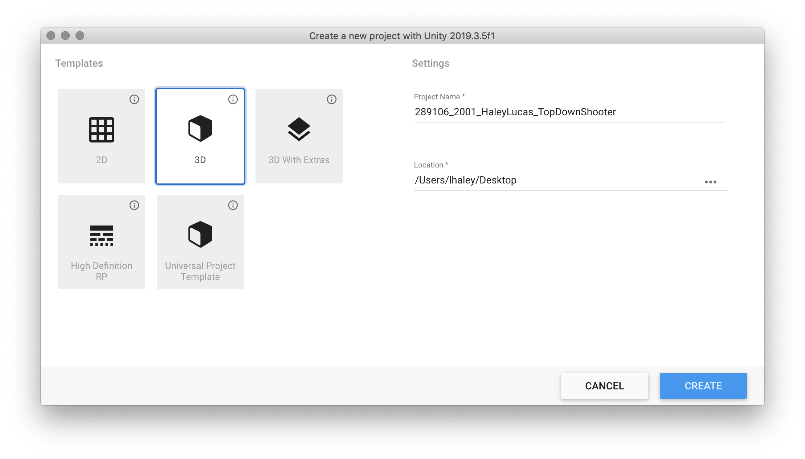
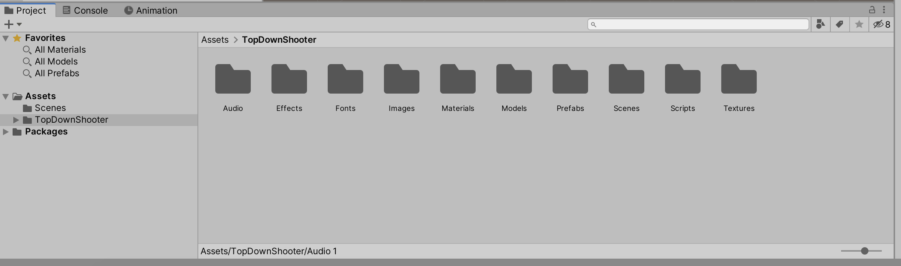
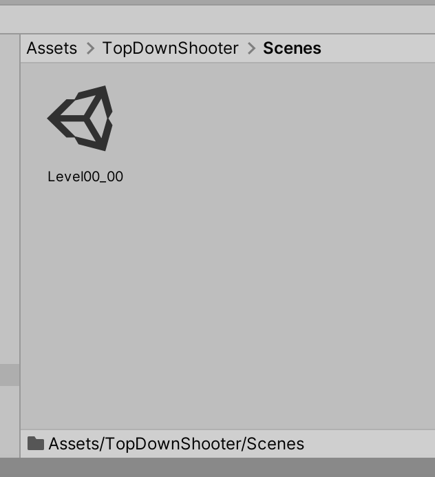
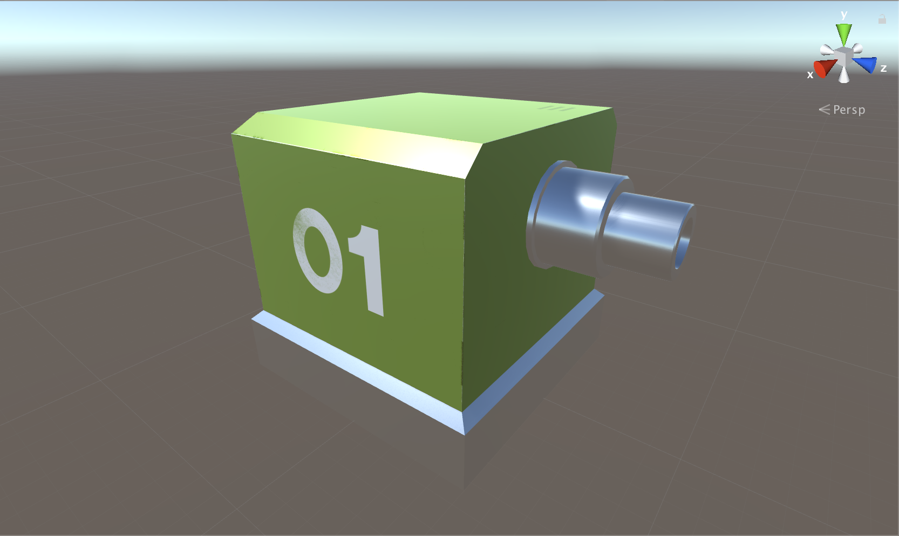
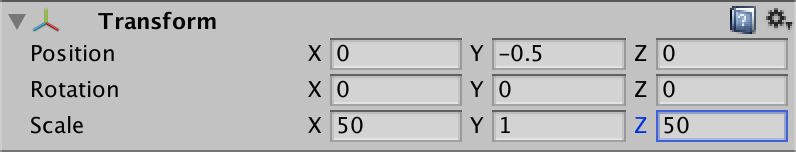
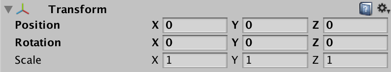
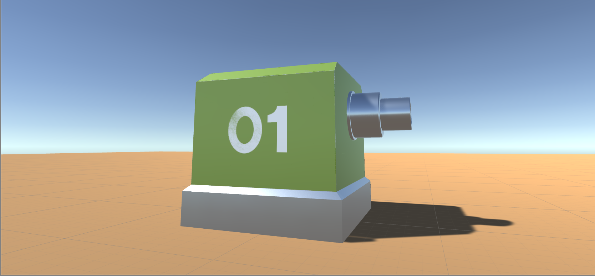
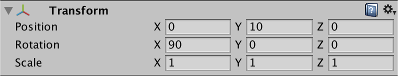

# Week 07: Top-Down Shooter: Project Setup

## Introduction

In this series of workshops, you’ll be building a top-down or isometric shooter game. Notable differences to your Myst-like / Island game include:

- 2.5D or isometric graphics
- A follow-cam
- AI agents
- Navigation mesh that allow the bad guys to chase you around corners
- projectiles
- health and damage, including user interface
- and a greater emphasis on hand-eye coordination and reaction-based gameplay

### Group Work

For this project, you are encouraged to work in pairs. Two people is the default number of people per team.

In certain circumstances, you may work solo or in a group of three—but these arrangements are to made by special negotiation with your tutor. All partners need to be in your own workshop.

We suggest you try to work with someone that has complimentary skills to your own. For example, if you love your coding, find an artist who focuses on environment and props. If you love your modeling and animation and want to focus on that, you may be able to form a group of 3.

As before - (but this time, with stricter adherence) - we’ll run to concurrent projects.

1. SOLO WORKSHOP PROJECT

    - keep this safe and backed up on your Media Server drive
    - add to it each week
    - use this project for experimentation

2. GROUP ASSIGNMENT PROJECT

   - Worked on by both team members
   - Each member is expected to give 7 hours of self-directed time to the project per week. ie. a pair will contribute 14 hours to each project per week as ‘homework’.
   - The final project should look like 70 hours of work in total.

### Initial Assets

You’ll find a range of initial assets on Stream. Download all of those now and let’s make a start on our workshop projects.

## Set Up

1. Create a project in the regular way

2. Once Unity has loaded, in the Assets root folder, create a **TopDownShooter** folder, and 10 new folders and name them as follows:
- TopDownShooter
    - Audio
    - Effects
    - Fonts
    - Images
    - Materials
    - Models
    - Prefabs
    - Scenes
    - Scripts
    - Textures

> Pay careful attention to capitalisation and spelling.

3. Import the TopDownShooter_Assets.unitypackage from the Stream site.

> Note how your assets are placed into the correct folders.

4. In the top file menu Save As and call the scene *Level00_00*.

> Make sure it’s saved to the **TopDownShooter>Scenes** folder.

## Create a Player01 Material

- Go to your Materials and create a subfolder (alongside Basic) called Characters.
- Inside that folder, right click and Create » Material.
Call it Player01Mat.
- Select DroidModel in the Hierarchy, look over in the Inspector and make sure the Materials dropdown is expanded.
- Hit the Element 0 circle selector &#10687; and choose **Player01Mat** from the material options. This way we can observe changes in the model as we build that material.
- Select Player01Mat in its folder in the Project tab, and look to the Inspector.
- Hit the **Albedo** circle selector and choose the green Player01_1001_BaseColor texture. The model should now have a basic paint-job in the Scene window.
- Hit the **Metallic** circle selector and choose the black Player01_1001_Metallic texture. The model should now have a reflective gun barrel and base.
- Hit the Normal Map circle selector and choose the purple Player01_1001_Normal texture. This will have very little effect, in this case, but can have a profound effect in some cases. Low-poly rocks, for example, can suddenly look photorealistic at this point.
- You should now have something like this in your Scene view:

## Create a Player01 Prefab
> Unity has a Prefab asset type that allows you to store a GameObject object complete with its components and properties. The prefab acts as a template from which you can create new object instances in the scene. Any edits made to a prefab asset are immediately reflected in all instances produced from it but you can also override components and settings for each instance individually.

- Simply drag the Player01 (Parent) GameObject from the **Hierarchy** into your **Prefabs** folder.

> Now, changes made to Player01 (and applied) in this scene will cascade throughout all instances of Player01 in your project. We’ll learn more about Prefabs soon.

## Add the Ground

- Create a new Cube GameObject and call it Ground
- Manually enter its Transform values as follows:

- Go to your Materials folder and drag the YellowDark material out and drop it on the cube to set this as its material.

## Check Player Transform

- Before we move on, double-check that both the **Droid** and **Player01** GameObjects in the Project tab each have their transform settings set like this:

The droid should be sitting on the Ground cube neatly like this:

## Setting up the Camera

> PLEASE NOTE: in the PDF it has information about using an isometric view. We are not allowing that view, as it causes too many issues than it offers benefits.

- Rename your **Main Camera** in the Hierarchy to **CameraTopDown**.
- Select CameraTopDown.
- Set its Transform properties as follows:

- In the Camera component (in the Inspector), switch the Projection method from Perspective to Orthographic.
- Adjusting the Size property effectively adjusts the camera’s Field of View. Tweak this value to achieve a good frame on your player and its surroundings. I recommend a value of about 6.

> You can see in the Camera Preview insert (in the Viewport) what this looks like. Testing your game will obviously give you an even better idea of how this looks.

- Drag the camera into your **Prefabs** folder to save it as a prefab.
- Save your scene

>  Cool! Next step is to create a script to handle player control. We'll see that in the next workshop handout.
