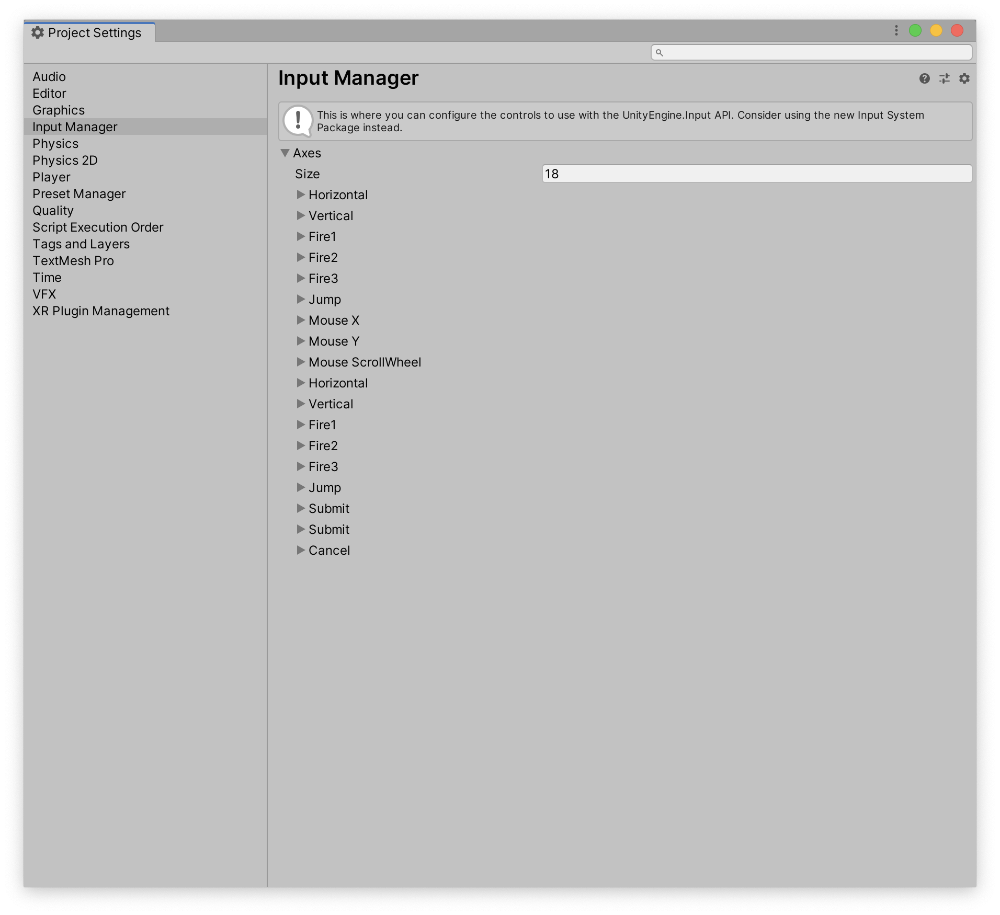
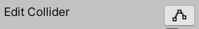
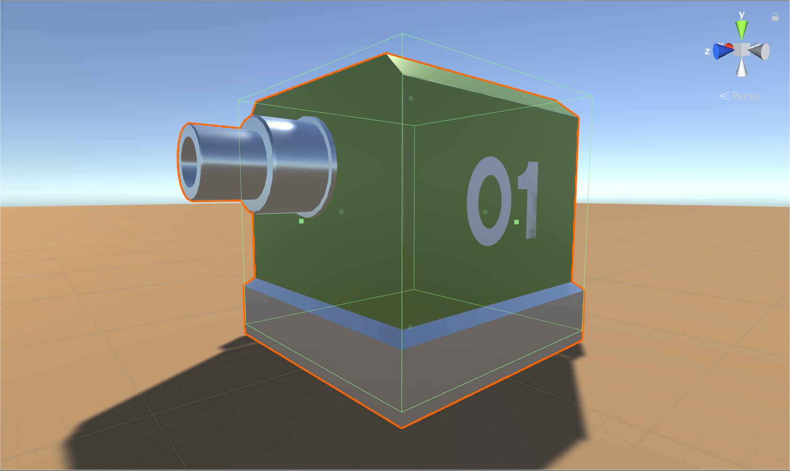
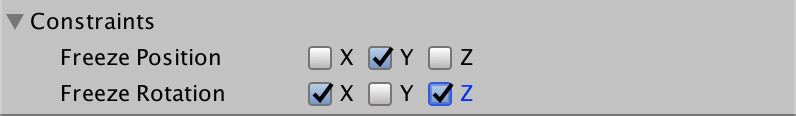
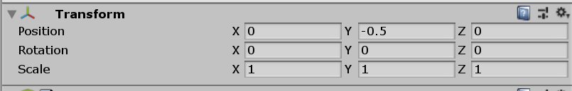

# Week 07: Top-Down Shooter: Player Control

## Introduction
In the last handout, we made a new Unity project, and set up a player and camera for our top-down shooter. This workshop we'll make the player move.

## Listening for Input

> The Unity **InputManager** allows the developer to define the project’s various input axes and actions.

- Via the top menu bar, go to **Edit » Project Settings**
- In the Inspector, choose **Input Manager**.



> This is the InputManager. If you expand the Horizontal and Vertical dropdowns, you can see that horizontal input is made via the ← and → arrow keys as well as A and D—while vertical input is made via the ↑ and ↓ arrow keys as well as W and S.

> In our previous project, we used an existing script to control our character.
This time, we’ll be making our own.

> Let’s being by getting our game to listening for user input, so that we can move our character.

- In your Scripts folder, create a new C# script and call it PlayerControl.
- Add your namespace.
- Attach the script to the **Player01** GameObject (as a component in the Inspector).
- Adjust and add to the script as follows:

```C#
using System.Collections;
using System.Collections.Generic;
using UnityEngine;

namespace LucasHaley
{
  public class PlayerControl : MonoBehaviour
  {
    // Update gets called once per frame
    void Update ()
    {
      // This declares a private variable of type 'float', names
      // it 'vertical' and get the vertical axis values, i.e.
      // up and down arrows or w and s keys
      float vertical = Input.GetAxis("Vertical");

      // if vertical DOES NOT equal zero (as a float)
      if (vertical != 0f)
      {
        // Test for input
        Debug.Log("Vertical value: " + vertical);
      }
    }
  }
}
```

- Save the script and test the game. Any vertical input (up/down cursor keys, W/S keys, analog sticks, etc.) will log a vertical value between -1 and 1.
- Now, edit the above code so that, *instead of printing out the values in the console*, the vertical input value is instead added to the Player’s current Z-position – ie. makes Player01 move. Begin by ‘commenting out’ the Debug.Log we wrote, and adding the following line:

```
      // Test for input
      // Debug.Log("Vertical value: " + vertical);
      transform.Transform(Vector3.forward * vertical);
```

- Save the script and test it out. The player character should now move along the Z axis when vertical input is received.

> Note: This approach will prove a little problematic once obstacles are added to the scene—but we’ll leave it like this for now.

- Save your project.

## Dealing with Obstacles

> The player needs to respond correctly to the environment—ie. it should somewhat adhere to the gamer’s expectations of physics. An obvious example: *Player01* shouldn’t pass through walls. This will take several steps to get right.

### Add a Wall

- Add a new cube to your scene and call rename it to **Wall**.
- Scale it to about `(10,1,1)` and move it into position in front of **Player01**.
- Apply the material **BuildingMetal** to the wall.
- Save and test — the player will pass through the wall.

### Allowing Collisions

- Add a BoxCollider to Player01.
- Hit the  button to edit the collider.
- Use the lil’ green dots on the collider to reshape it to fit **Player01**.

> Note: Don’t have the box extend to cover the gun barrel as this will interfere with bullet instantiation. Raise the base of the collider so that it’s a little bit above the ground.



- Save the project.

### Rigidbody Physics

> The Rigidbody component hooks a gameObject into the Unity Physics system.

> Instead of using a Rigidbody to enact gravity, we’ll use one to constrain the Player’s movement. We can also use the Rigidbody to tap into additional physics features such as AddForce.

- Select Player01 in the Hierarchy.
- Add a **Rigidbody** component to the **Player01** GameObject
(**Add Component » Physics » Rigidbody**)
- Uncheck the **Use Gravity** option.
- Set Constraints as you see here:



> We’re allowing the player to spin on its Y axis and move laterally - but not up and down.

- If you test the game now, you’ll see that the player still has free movement up and down - but, despite adding a BoxCollider, we’re can still move through the wall.

> This is because we are using the `Transform()` function, which ignores physics and collisions. It effectively _teleports_ the player from one position to the next, without checking to see if it collides with anything in between.

> Instead, we'll use **Forces**.

### Adding Forces

> Now that Player01 has a Rigidbody component, it can be moved using AddForce() .
However, this is better utilised via the FixedUpdate() method than the base Update() method that we’re currently using — as FixedUpdate() is called with each physics step (rather than each new frame of the game). Physic calculations are therefore more accurate, as they are at regular time intervals instead of how quickly frames can be redrawn (i.e. dependent upon your video card).

> Check out the [Rigidbody.AddForce](https://docs.unity3d.com/ScriptReference/Rigidbody.AddForce.html) entry in the Unity documentation for more info.

- Edit the PlayerControl script so that Update() becomes a FixedUpdate() method.
- Then replace the transform.position line with an `AddForce` that acts on the Rigidbody.

```C#
using System.Collections;
using System.Collections.Generic;
using UnityEngine;

namespace LucasHaley
{
  public class PlayerControl : MonoBehaviour
  {
    // FixedUpdate gets called once per physics solve
    void FixedUpdate ()
    {
      // This declares a private variable of type 'float', names
      // it 'vertical' and get the vertical axis values, i.e.
      // up and down arrows or w and s keys
      float vertical = Input.GetAxis("Vertical");

      // if vertical DOES NOT equal zero (as a float)
      if (vertical != 0f)
      {
        // Test for input
        // Debug.Log("Vertical value: " + vertical);
        // transform.Transform(Vector3.forward * vertical);
        GetComponent<Rigidbody>().AddForce(Vector3.forward * vertical);
      }
    }
  }
}
```

- Test and see if you can go through the wall.

## Refactoring

> Refactoring refers to the process of restructuring existing code—improving code readability and reducing complexity—without changing the external behaviour.

> If we were to add horizontal movement in the same way, our code would look like the below example. We create a new private variable called horizontal. Then we duplicate the vertical if condition for the horizontal axis—meaning that we’re evaluating **two** if conditions in every physics frame.

```C#
using System.Collections;
using System.Collections.Generic;
using UnityEngine;

namespace LucasHaley
{
  public class PlayerControl : MonoBehaviour
  {
    // FixedUpdate gets called once per physics solve
    void FixedUpdate ()
    {
      // This declares a private variable of type 'float', names
      // it 'vertical' and get the vertical axis values, i.e.
      // up and down arrows or w and s keys
      float vertical = Input.GetAxis("Vertical");
      float horizontal = Input.GetAxis("Horizontal");

      // if vertical DOES NOT equal zero (as a float)
      if (vertical != 0f)
      {
        // Test for input
        // Debug.Log("Vertical value: " + vertical);
        // transform.Transform(Vector3.forward * vertical);
        GetComponent<Rigidbody>().AddForce(Vector3.forward * vertical);
      }

      // if horizontal DOES NOT equal zero (as a float)
      if (horizontal != 0f)
      {
        // Test for input
        // Debug.Log("Horizontal value: " + horizontal);
        // transform.Transform(Vector3.right * horizontal);
        GetComponent<Rigidbody>().AddForce(Vector3.right * horizontal);
      }

    }
  }
}
```

> Again, the code above is **only an example**.

> Now, for a game as small as our project, this wouldn't be too big of a hit on the computing power needs for the game. And there is a danger in "early optimisation". But **refactoring** is the process of taking code that works, and making it work better and in more places.

> By having code that works in more places, it means that conversely, you only need to improve/fix code in one place.

> Back in ye olde days, individual shops would give credit to customers. They would have their own records of credit given. With credit cards, however, that credit is consolidated into one card, usable with many shops. And there's only one place you need to check your current credit debt.

> Let's take a look at some ways we can improve the code above.

### Multiple GetComponent Calls

> The code above calls `GetComponent<Rigidbody>()` twice. Any time you see that happening, see it as an opportunity for refactoring. In this instance, instead of calling `GetComponent<Rigidbody>()` twice, we will create a variable to store the value of that call, and just use that variable any time we need it. This is called a **component variable**.

- Declare a component variable at the top of your code, of the type of component you're looking to save.

```C#
using System.Collections;
using System.Collections.Generic;
using UnityEngine;

namespace LucasHaley
{
  public class PlayerControl : MonoBehaviour
  {
      public Rigidbody rbody;
```

- We then need to assign that variable. When we want to create a **component variable**, it's useful to assign it in the `Start`method.

```C#
using System.Collections;
using System.Collections.Generic;
using UnityEngine;

namespace LucasHaley
{
  public class PlayerControl : MonoBehaviour
  {
      public Rigidbody rbody;

      void Start ()
      {
          rbody = GetComponent<Rigidbody>();
      }
```

> Now whenever we need the rigidbody, we can just use `robdy`instead of calling `GetComponent<Rigidbody>()` over again.

```C#
// if vertical DOES NOT equal zero (as a float)
if (vertical != 0f)
{
  // Test for input
  // Debug.Log("Vertical value: " + vertical);
  // transform.Transform(Vector3.forward * vertical);
  rbody.AddForce(Vector3.forward * vertical);
}

// if horizontal DOES NOT equal zero (as a float)
if (horizontal != 0f)
{
  // Test for input
  // Debug.Log("Horizontal value: " + horizontal);
  // transform.Transform(Vector3.right * horizontal);
  rbody.AddForce(Vector3.right * horizontal);
}
```

### Unnecessary Boolean Checks

> Checking if the correct keyboard keys are pressed is a good idea. But Unity has cleverly built-in this functionality into the `GetAxis` method.

> The `GetAxis` method returns a float, with values from 0 to 1. Luckily, booleans can also be seen as 0 (false), and non-0 (true). We use this in our original check. But we can skip the check, and just use the returned value - if the key isn't pressed, we'll be mulitplying by 0, which is 0. So no movement!

- Remove the if checks

```C#
  rbody.AddForce(Vector3.forward * vertical);
  rbody.AddForce(Vector3.right * horizontal);
```

### Multiple AddForce Calls

> Much like calling `GetComponent()`twice, we also call `AddForce`twice. Let's refactor that too.

> While `Vector3.forward` and `Vector3.right` are very useful shortcuts, we can consolidate them by using a [new Vector3](https://docs.unity3d.com/ScriptReference/Vector3-ctor.html).

```C#
// FixedUpdate gets called once per physics solve
void FixedUpdate ()
{
  // This declares a private variable of type 'float', names
  // it 'vertical' and get the vertical axis values, i.e.
  // up and down arrows or w and s keys
  float vertical = Input.GetAxis("Vertical");
  float horizontal = Input.GetAxis("Horizontal");

  // Add forces to the rigidbody to make it move
  rbody.AddForce(new Vector3(horizontal, 0f, vertical));
}
```

> This code is much shorter, more efficient, and easier to read. All great results from refactoring!

- Test this new code, and see if it works.
- Note that your character will probably move *really* slow. That's okay - we'll change that with our next step.

## Improving Physics: Thrust and Drag

> Now that we've engaged the physics engine, let's fine tune it.

### Thrust

> As noted the `GetAxis` function returns values from 0 to 1. Those aren't big enough to make the character go fast. So we'll multiply those values by a new **thrust** variable that we can control in the Unity interface.

- In the PlayerControl script, add this `public float` variable. We’re making it public so that you can fine-tune the player’s thrust from the Inspector.
- We'll also make the default value 300, just for a starting point.

```C#
public Rigidbody rbody;
public float thrust = 300f;

void Start ()
{
    rbody = GetComponent<Rigidbody>();
}
```

- Next, we'll multiply our force by our new thrust.

```C#
// Add forces to the rigidbody to make it move
rbody.AddForce(new Vector3(horizontal, 0f, vertical) * thrust);
```

- Save and test. Feel free to change the `thrust` value in the editor to suit.

> You should also notice that while your character moves faster, it also doesn't slow down. To fix this, we'll add some `drag` to the character.

### Drag

> **Drag** is the amount of air  resistance working on a body. 0 means no resistance, and infinity means the body will stop immediately.

- Select **Player01**, and in the **Rigidbody** component, set the **Drag** value to 20.

- Save and test.

- Experiment with this value until it feels right for the game that you’re making.

## Rotating and Following the Mouse

> Now we've got the character moving, let's get them rotating - we'll make it so the character always looks where the mouse is pointing. This will allow us to target bad guys and blow ‘em up. We’ll use a **raycast** to achieve this.

> **Raycasting** entails firing an invisible ray from a given axis of a given object. This is used for various applications—for example, a raycast from an object could be used to determine what if there’s something in front of it, allowing avoidance action to be taken.

> You can learn more about raycasting [here](https://docs.unity3d.com/Manual/CameraRays.html).

> Orienting the player using the mouse position requires an awareness of what/where the mouse points to in virtual space — something that can be revealed using a raycast. There are two contexts at play here - the virtual 3d world, and the 2d space of our screens. We'll need to work from one to the other.

> To accomplish this, we'll set up a virtual 'floor' in the scene, and shoot a ray  from the point of the mouse, and see where it hits on that floor. We can then point the character at that point.

- In Unity, add an Empty GameObject to your scene and rename it MouseTracker.
- In the Inspector, add a BoxCollider component (to the new MouseTracker Empty). It now has only a Transform component and a BoxCollider component.
- In the BoxCollider, enable the `Is Trigger` option.
- Adjust the box collider’s Size settings to `50, 1, 50`.
- Set the MouseTracker’s Transform properties as follows. This matches the position of the ground. The closer the MouseTracker object is to your ground plane, the more accurate the results will be.



- Above the Inspector, find the Layers dropdown (it’s currently set to Default). Expand the dropdown and choose **Add Layer...**
- In the Layers section of the resulting window, type *MouseTracker* in the User Layer 8 field. This adds a custom layer.
- Reselect the MouseTracker empty GameObject in the Hierarchy.
- Assign the MouseTracker Empty GameObject to the MouseTracker layer via the Layer
dropdown that we just used (in the Inspector).
- With the MouseTracker object now all set up, open the PlayerControl script and add the
following code to the end of your `FixedUpdate()` method:

```C#
// Add forces to the rigidbody to make it move
rbody.AddForce(new Vector3(horizontal, 0f, vertical) * thrust);

// now use a raycast to make it rotate towards the mouse
Ray mouseRay = Camera.main.ScreenPointToRay(Input.mousePosition);
RaycastHit mouseHit;

// if the raycast hits layer 8 (MouseTracker), then…
if (Physics.Raycast (mouseRay, out mouseHit, Mathf.Infinity, 1<<8))
{
    // make the character point towards the mouse
    transform.LookAt(new Vector3(mouseHit.point.x, transform.position.y, maouseHit.point.z));
}
```

> In our new code; The Physics.Raycast function returns true or false based on whether or not the ray hits something.

> The method parameters mouseRay, out mouseHit, Mathf.Infinity and 1<<8 represent the following (respectively):

Variable | Duty
-------- | ----------
ray | Origin of the ray (in this case, the main camera).
hitInfo | Information about the hit (coordinates) is assigned to this variable. This is an advanced C# feature, where a method can change an input parameter.
maxDistance | Maximum distance the ray registers collisions (in this case, infinity).
layerMask | Selectively ignores objects (in this case, only layer 8 is detected). This uses [bitmasking](https://docs.unity3d.com/Manual/Layers.html) techniques, which is a very old but still used technique.

> Don’t panic if this doesn’t make sense. At this level, it’s okay to simply smile and nod. We’re nearly done.

- Save the script and head back to Unity.
- Before testing this out, ensure that any cameras in the scene are tagged with
MainCamera. ie.:
- Select CameraTopDown (if it is in your Hierarchy).
- In the top-left of the Inspector is a Tag dropdown. If this doesn’t say
MainCamera, expand the dropdown menu and apply the MainCamera tag.
- Now you can test it out!

> The player should now rotate on its Y axis to face the mouse cursor. This is because transform.LookAt(mouseHit.point) points to where the mouse’s raycast
intercepts any object on the MouseTracker layer (in this case, just the MouseTracker object).

- Save the scene. You’re done!

## Complete PlayerControl Script

```C#
using System.Collections;
using System.Collections.Generic;
using UnityEngine;

namespace LucasHaley
{
  public class PlayerControl : MonoBehaviour
  {
      public Rigidbody rbody;
      public float thrust = 300f;

      void Start ()
      {
          rbody = GetComponent<Rigidbody>();
      }

    // FixedUpdate gets called once per physics solve
    void FixedUpdate ()
    {
      // This declares a private variable of type 'float', names
      // it 'vertical' and get the vertical axis values, i.e.
      // up and down arrows or w and s keys
      float vertical = Input.GetAxis("Vertical");
      float horizontal = Input.GetAxis("Horizontal");

      // Add forces to the rigidbody to make it move
      rbody.AddForce(new Vector3(horizontal, 0f, vertical) * thrust);

      // now use a raycast to make it rotate towards the mouse
      Ray mouseRay = Camera.main.ScreenPointToRay(Input.mousePosition);
      RaycastHit mouseHit;

      // if the raycast hits layer 8 (MouseTracker), then…
      if (Physics.Raycast (mouseRay, out mouseHit, Mathf.Infinity, 1<<8))
      {
          // make the character point towards the mouse
          transform.LookAt(new Vector3(mouseHit.point.x, transform.position.y, mouseHit.point.z));
      }
    }
  }
}
```
