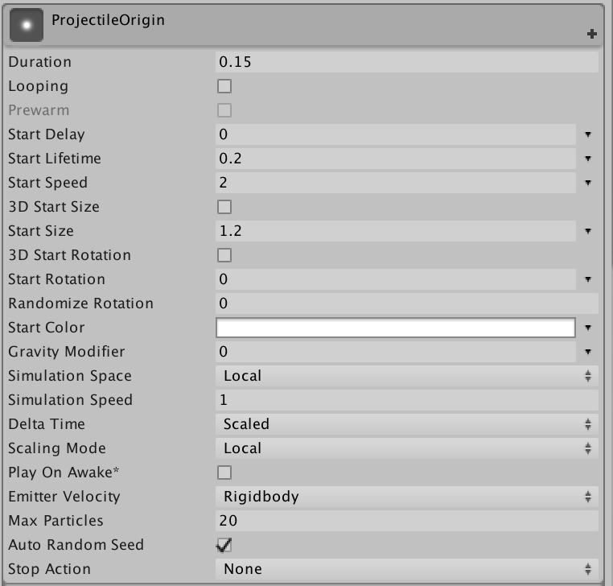
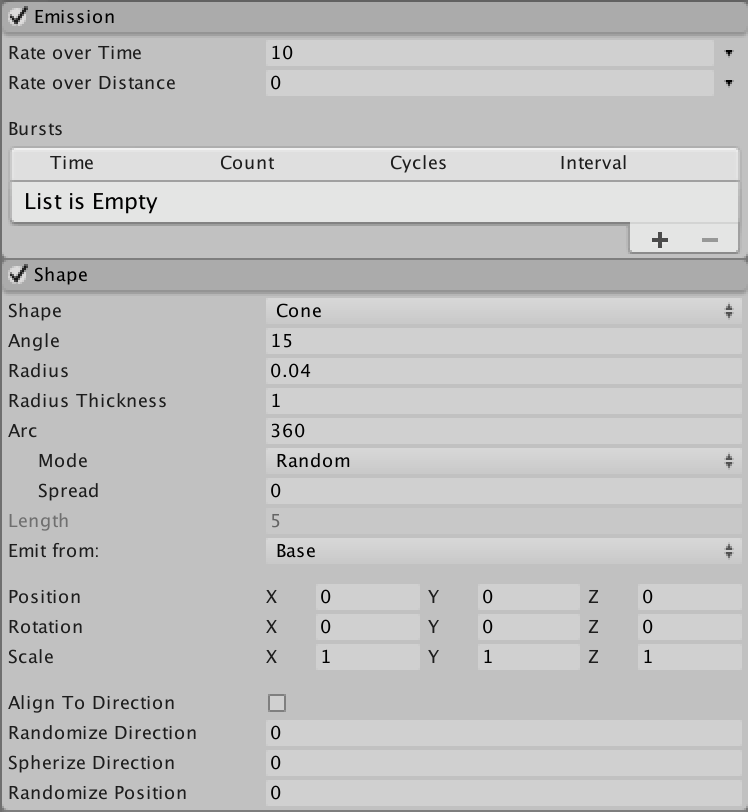
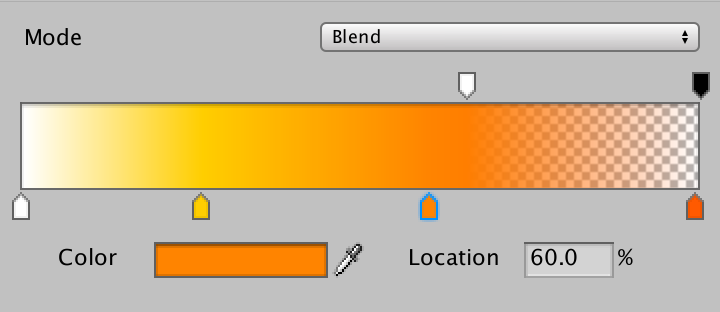
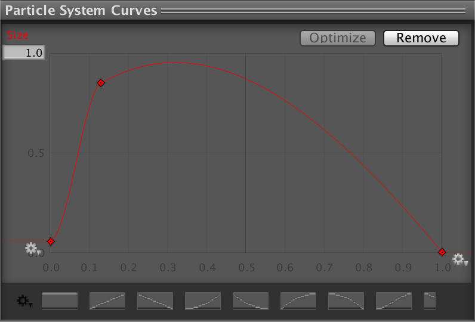

# Week 08: Top-Down Shooter: Particles

## Introduction
Unity has a powerful particle effects system (called Shuriken—hence the ‘shuriken wheels’ icon we see when we create one). Particle effects are a good method for creating effects like moving liquids, smoke, clouds, flames and magic spells.

Our projectile system is functional but it could use some additional polish. We’ll start by adding a muzzle-flash effect that instantiates at the end of the gun when the player fires the weapon.

## Creating the Particle

- Save your project. (Because: computers).

- Select the ProjectileOrigin GameObject in the Hierarchy.

- Add a Partcile System component in the Inspector.

- In the main ProjectileOrigin dropdown (in the Particle System) set the properties as follow:



- Enable Emission and set Rate Over Time to 10.

- In the Shape dropdown, set its properties as follow:



- Enable the Colour Over Lifetime dropdown and click the colour swatch to edit its gradient.

- Add markers and adjust colours roughly as indicated below.

> The alpha channel (transparency) is adjusted by using the markers above the graph (a black alpha channel indicates that it’s completely transparent) while colour markers can be added by clicking below it.



- Next, enable Size Over Lifetime and click the graph in the dropdown.

> This should display the graph (with its handles) in the Particle Systems Curve editor at the very bottom of the inspector. If you don’t see it, you may need to drag it upward [from a minimised state].

- In the Particle Systems Curve editor, tweak the graph so that it looks something like this:

> Double-click on the curve to add points.



- Enable Renderer (it’s the last drop-down in the Particle System component).

- Go into your Materials folder, and create a subfolder called Particle.

- Open the Particle folder, right-click, Import New Asset and import the FlareParticleMaterial from the GitHub downloads.

- Reselect ProjectileOrigin in the Hierarchy.

- Assign FlareParticleMaterial to the Material field in the Renderer dropdown (of the Particle System component).

## Invoking the Particle System through Code

> That’s all the fiddly stuff. Now, we just need to add a few lines of code to make the particle system play when the gun is fired.

- Open the FireProjectile script and add the indicated lines of code inside the fireBullet() method).

```C#
// Instantiate the bullet at the point of origin
            Instantiate(bullet, bulletOrigin.position, bulletOrigin.rotation);

            // Stop the particle system (if it’s already playing)
			bulletOrigin.GetComponent<ParticleSystem>().Stop();

			// Play the particle system
			bulletOrigin.GetComponent<ParticleSystem>().Play();
		}
	}
}

```

- Save and test.

> You should now see some muzzle-flash when you fire the gun.

> By all means keep tweaking the Particle System if you see room for improvement. There are also tutorials on YouTube that may offer a different approach.

> Also keep in mind that a flame-thrower can be created in a similar way...

> That’s it for now. Next time, we’ll make the gun flash light and make a sound when fired, and add an enemy to shoot at.
