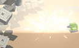
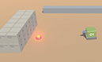
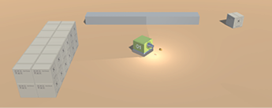

# Week 09: Top-Down Shooter: Finishing Projectiles

## Introduction
In this PDF, we’ll add a proximity mine that can be dropped by the player on Fire2 input (right mouse button / RMB). This mine will explode spectacularly when a character gets too close.

      

But first, we’ll finish up the player’s gun. Currently, a small particle effect plays when the player shoots—now we’ll add a flash of light and a sound.

## ADDING A FLASH OF LIGHT:

We can do this by briefly enabling and disabling a light at the end of the gun.

  

>Note: The following process might seem a little heavy for the simple purpose of switching a light on and off, but it also sets us up for the next section, plus it’s a pretty cool effect.

-	Select the player’s **ProjectileOrigin** object in the **Hierarchy**.

-	In the **Inspector**, add a **Light** component. Leave it set to Type: **Point**.
-	Tweak the light’s properties as you like - though, the default settings are perfectly fine.
-	Under **_Shadow Type_**, choose **Hard Shadows**.
-	Once you’re happy with how the light will look as the player fires the gun, disable the **Light**
component by unchecking the checkbox (at the top-left of the **Light** component).
We’ll re-enable it through script.

-	Open your **FireProjectile** script and add the following header and variables:


```C#
public class FireProjectile : MonoBehaviour
{
  [Header(“PUBLIC REFERENCES”)]
  public Transform bulletOrigin;
  public GameObject bullet;

  [Header(“SETTINGS”)]
  public float timeBetweenBullets = 0.15f;
  public float effectsDisplayTime = 0.06f;

  // PRIVATE VARIABLES:
  float timer;
  float effectsTimer;
```
The variable  effectsDisplayTime  will determine how long the light is enabled for. A duration of  0.06  constitutes a mere flash.

We’ll make it so that the value of  effectsTimer  counts backwards from the value of  effectsDisplayTime  and then disable the light when it reaches zero.

-	Make the indicated changes to your Update method:

```C#
// Update is called once per frame
void Update()
{
  // Tie timers to the game clock
  timer += Time.deltaTime;		// counts up
  effectsTimer -= Time.deltaTime;	// counts down

  //	If Fire1 input is received ..
  if (Input.GetButton(“Fire1”) && timer >= timeBetweenBullets)
  {
    // Call the ‘fire’ method
    FireBullet();

    // Reset timer for next bullet
    timer = 0;

    // Start the effects timer
    effectsTimer = effectsDisplayTime;
  }

  // When the effects timer reaches zero
  if (effectsTimer <= 0)
  {
    // Run DisableEffects method (below)
    DisableEffects();
  }
}
```

_Fire1_ input will start a countdown from the value of effectsDisplayTime. When the timer reaches zero, the method that will switch off the light light is called (DisableEffects).

>Note: The  DisableEffects  method doesn’t exist yet, so Visual Studio will indicate an error. No stress—we’ll fix that in just a moment.

-	Add a line to the end of your  FireBullet  method that turns on the light—and add that DisableEffects  method—(which will turn off the light):

```C#
void FireBullet()
{
  // Testing that the fire method is being called
  // Debug.Log(“Firing bullet”);

  // Instantiate the bullet at the point of origin
  Instantiate(bullet, bulletOrigin.position,bulletOrigin.rotation);

  // Stop the particle system (if it’s already playing)
  bulletOrigin.GetComponent<ParticleSystem>().Stop();

  // Play the particle system
  bulletOrigin.GetComponent<ParticleSystem>().Play();

  // Turn on the light
  bulletOrigin.GetComponent<Light>().enabled = true;
}

void DisableEffects()
{
  // Turn off the light
  bulletOrigin.GetComponent<Light>().enabled = false;
}
```

Now the light will be switched on as part of the  FireBullet  method. It will then be switched off in  DisableEffects  method when the effectsTimer  reaches 0.
-	**Save** the script and **test** it out.

There should now be a brief flash when the player fires the gun.

## PLAYING MULTIPLE SOUNDS THROUGH A SINGLE AUDIO SOURCE:

Now we’ll add a gunshot sound that plays when the player fires the gun. While we’re at it, we’ll add a ‘drop landmine’ sound that’s triggered by _Fire2_ input (RBM).

LMB currently fires the gun. This will soon play a gun sound.

RMB will soon play another / different sound.

-	Import the **GunshotSound01** and **LandmineSound01** audio assets from the **Stream**
downloads to your **Audio** folder.

-	Select the player’s **ProjectileOrigin** object in the **Hierarchy**.
-	Add an **Audio Source** component.
-	Normally, we’d provide _GunshotSound01_ as the **AudioClip** (in the **Audio Source**
component). But we can just leave it empty, as we’ll load this dynamically through code.
-	Open your **FireProjectile** script.
-	Add public references (of type _AudioClip)_ for those two new audio samples and a timeBetweenLandMines  variable, like so:

```C#
public class FireProjectile : MonoBehaviour
{
  [Header(“PUBLIC REFERENCES”)]
  public Transform bulletOrigin;
  public GameObject bullet;
  public AudioClip gunSound;
  public AudioClip landMineSound;

  [Header(“SETTINGS”)]
  public float timeBetweenBullets = 0.15f;
  public float timeBetweenLandMines = 0.5f;
  public float effectsDisplayTime = 0.06f;

```
>Note: timeBetweenLandMines determines how often / quickly the player can put down mines.

-	Add a private variable of type _AudioSource_, (called _audioSource_) and provide a value in a new  Start  method.

```C#
// PRIVATE VARIABLES:
float timer;
float effectsTimer;
AudioSource audioSource

void Start ()
{
  // Give ‘audioSource’ a value
  audioSource = bulletOrigin.GetComponent<AudioSource>();
}

// Update is called once per frame
void Update()
```

-	If _Fire1_ input is received, set _gunSound_ as the current AudioClip ... :

```C#
void Update()
{
  // Tie timers to the game clock
  timer += Time.deltaTime;		      // counts up  
  effectsTimer -= Time.deltaTime;	    // counts down

  //	If Fire1 input is received ..
  if (Input.GetButton(“Fire1”) && timer >= timeBetweenBullets)
  {
    // Set ‘gunSound’ as the current audio clip
    audioSource.clip = gunSound;

    // Call the ‘fire’ method
    FireBullet();
```

-	.. then play that clip at the end of the  FireBullet  method:

```C#
void FireBullet()
{
  // Testing that the fire method is being called
  // Debug.Log(“Firing bullet”);

  // Instantiate the bullet at the point of origin
  Instantiate(bullet, bulletOrigin.position,bulletOrigin.rotation);

  // Stop the particle system (if it’s already playing)
  bulletOrigin.GetComponent<ParticleSystem>().Stop();

  // Play the particle system
  bulletOrigin.GetComponent<ParticleSystem>().Play();

  // Turn on the light
  bulletOrigin.GetComponent<Light>().enabled = true;

  // Play the BANG sound
  audioSource.Play();
}
```

-	Now, we need to capture _Fire2_ (RMB) input and set _landMineSound_ as the current AudioClip. Add to your  Update  method as indicated:

```C#
void Update()
{
  // Tie timers to the game clock
  timer += Time.deltaTime;		  // counts up
  effectsTimer -= Time.deltaTime;	  // counts down

  //	If Fire1 input is received ..
  if (Input.GetButton(“Fire1”) && timer >= timeBetweenBullets)
  {
    // Set ‘gunSound’ as the current audio clip
    audioSource.clip = gunSound;

    // Call the ‘fire’ method
    FireBullet();

    // Reset timer for next bullet
    timer = 0;

    // Start the effects timer
    effectsTimer = effectsDisplayTime;
  }

  //	If Fire2 input is received ..
  if (Input.GetButton(“Fire2”) && timer >= timeBetweenLandMines)
  {
    // Set ‘landMineSound’ as the current audio clip
    audioSource.clip = landMineSound;

    // Reset the timer for next mine
    timer = 0;
  }

  // When the effects timer reaches zero
  if (effectsTimer <= 0)
  {
    // Run DisableEffects method (below)
    DisableEffects();
  }
}
```

We’re nearly done with the code for this. We only need to add a  PlaceMine  method that plays the second sound (and will soon spawn the landmine).

-	Just after your  FireBullet  method, add a  PlaceMine  method:

```C#
void PlaceMine()
{
// Play the landmine deploy sound
audioSource.Play();

}
```

-	Call the  PlaceMine  method from the  Update  method when _Fire2_ input is received:

```C#
//	If Fire2 input is received ..
if (Input.GetButton(“Fire2”) && timer >= timeBetweenLandMines)
{
  // Set ‘landMineSound’ as the current audio clip
  audioSource.clip = landMineSound;

  // Call the ‘PlaceMine’ method (below)
  PlaceMine();

  // Reset the timer for next mine
  timer = 0;
}
```

-	**Save** the script and head back to **Unity**.

-	Select **Player01** and notice there are two empty [AudioClip] fields in the **Inspector**.
- 	From the **Audio** folder, drag **GunShotSound01** into the **Gun Sound** field.
-	Drag **LandmineSound01** into the **Land Mine Sound** field.
-	Select the player’s **ProjectileOrigin** object in the **Hierarchy**.
-	In the **Audio Source** component, uncheck **Play On Awake**.
-	Hit **Play** to test it out\!

You should hear a BANG\! when LMB is pressed and a mechanical sound when RMB is
pressed. In the _Audio Source_ component, you can see these sounds being loaded in,as each one is required.

-	**Save** your project.

There’s quite an art to creating realistic rapid-fire gun sounds—we should really be using multiple audio samples (one for the start of fire, a loopable sample for sustained fire and another that ramps down when the player releases the button). Our solution is basic and doesn’t produce perfect results.

It will tend to sound better, the slower your gun’s rate of fire is.
