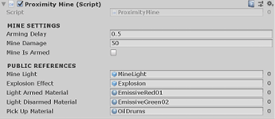
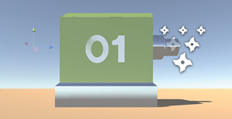
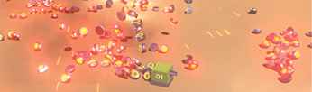

# Week 09: Top-Down Shooter: Proximity Mines
## PREPARING THE MINE

This next bit’s really fun and rewarding. I’ve prepared a _Proximity Mine_ package for you, which includes meshes, textures, materials, scripts and a prefab. It shouldn’t take much effort to get this into your game.

-	Import the **ProximityMine.unitypackage** from the **Stream** downloads.

-	In **Unity**, right-click your **Assets** folder and **Import Package » Custom Package**.
-	Find the **ProximityMine.unitypackage** and import it. An _Import_ window will pop up.
-	**Import** all package contents.
If you’ve named your folders as these PDFs have previously suggested, all assets should find
their way to their appropriate folders (eg. scripts in _Scripts,_ Materials in _Materials_, etc._)._
-	Go into your **Prefabs** folder and select the **ProximityMine** prefab.
-	Check that the **Public References** have been connected as you see here:

  

**Arming Delay:** 		This is how long (after the mine is spawned) before it goes live.

**Mine Damage:** 		This is how much damage that mine will inflict when we have a
health and damage system.

**Mine is Armed:** 		Weather or not the mine is live (boolean).

**Mine Light:** 		The object in the prefab that lights up when mine is armed.

**Light Armed Material:** 	Which material the light should use when mine is armed.

**Light Disarmed:** 		Which material the light should use when mine is disarmed.\*

**Pick Up Material:** 		Which material the light should use when mine can be picked up.

\*This is not used in the script—but available for future game mechanics.

-	At the top of the **Inspector**, hit **Open Prefab** and inspect how the mine is constructed.

**ProximityMine:** 		The parenting [Empty] object. This has the main script, a Rigidbody (for gravity), an Animator (the light’s Y position is animated).

**MineShell:**			Main mesh + colliders.

**MineLight:**			Basic mesh with a renderer. This is animated.

**PickUpTrigger:**		Not yet used in script. Can later be utilised for player pick-up.

**ProximityTrigger:**		Has its own trigger script that talks to the main _ProximityMine_ script Mine will detonate when this sphere is triggered.

-	Open the **ProximityMine** and **ProximityTrigger** scripts and add your namespace to them.

-	**Save** the scripts.
-	We need to add some new references to our **FireProjectile** script:

```C#
public class FireProjectile : MonoBehaviour
{
  [Header(“PUBLIC REFERENCES”)]
  public Transform bulletOrigin;	// Where to instantiate bullet
  public Transform mineOrigin;	  // Where to place the mine
  public GameObject bullet;		 // Prefab		
  public GameObject mine;		   // Prefab
  public AudioClip gunSound;
  public AudioClip landMineSound;

  [Header(“SETTINGS”)]
  public float timeBetweenBullets = 0.15f;
  public float timeBetweenLandMines = 0.5f;
  public float effectsDisplayTime = 0.06f;

```

-	Instantiate the mine at the given location (we’ll use an Empty GameObject for this):

```C#
void PlaceMine()
{
  // Play the landmine deploy sound
  audioSource.Play();

  // Instantiate the mine prefab at the referenced location
  Instantiate(mine, mineOrigin.position, mineOrigin.rotation);  
}
```

-	**Save** the script and head back to **Unity**.

# Week 09: Top-Down Shooter: Proximity Mines
## ADDING THE MINE’S SPAWN POINT
-	Right-click **Player01** in the **Hierarchy** and choose **Create Empty**.

-	Rename the new **Empty GameObject** to _PlaceMineLocation_.
This will be where the mine spawns into the game. We made it a child of the Player so
that the spawn location always follows the player.
-	Position the **PlaceMinePosition** Empty just behind the player, something like this:

  

-	Select **Player01** and drag **PlaceMinePosition** into the empty **Mine Origin** field in the **Inspector**.

-	Drag the **ProximityMine** prefab from the **Prefab** folder into the empty **Mine** field
in the **Inspector**.
-	Finally, check that **Player01** has the **Player** tag (via the **Tag** dropdown at the top of the
**Inspector**). The landmine’s trigger checks if the character has this tag.
-	That’s it\! **Save** the project and hit **Play** to test it out.

You should now be able to alternate between shooting (LMB) and dropping landmines
(RMB). Each should make their own unique sound.

The mine is triggered  OnTriggerEnter  to allow the Player a safe exit from the trigger zone. But you might want to change this to  OnTriggerStay—meaning that the player needs to make a quick exit before the mine goes live\! (Probably more fun).

**LANDMINE PARTY:**

For an berserk landmine party, comment out  timer = 0;  in the _Fire2_ input (in the  Update method of the _FireProjectile_ Script)...


  

## EXPLOSION UPGRADES

The standard Assets explosion is all bite, no bark—it doesn’t make any sound by default.

Also, after an explosion particle effect has played through, it still lingers as a redundant object in your Heirarchy, forever occupying memory.

We’ll make some improvements to this for use now and in the future.

**ADDING A SOUND EFFECT TO A PARTICLE EFFECT:**

-	Ensure you have the **Unity Standard Assets** in your project. If you do not:
Open the **Asset Store** window and import the **Unity Standard Assets** package.

-	Go to **Standard Assets » Particle Systems » Prefabs**.
-	Select and drag **Explosion** into the **Hierarchy**.
-	Rename **Explosion** to _ExplosionBigCustom._
-	With **ExplosionBigCustom** still selected (in the **Hierachy**), Add an **Audio Source**
component (in the **Inspector**).
-	Go into your **Audio** folder, there should be an audio clip called **Explosion**.
(If not, this is availble on Stream—import it to your Audio folder).
-	Drag the **Explosion** sound into the **AudioClip** field of _ExplosionBigCustom’s_ **Audio Source**
component.

**OBJECT EXPIRE SCRIPT:**

I’ve written a very simple script and supplied it on Stream. The script will destroy _any_ object it’s attached to after a certain amount of time—the default delay is 5 seconds.

-	Go into to your **Scripts** folder.

-	Download and import the **ObjectExpire** script from **Stream**
-	Attach the **ObjectExpire** script as a component of **_ExplosionBigCustom_*

**SAVING THE NEW EXPLOSION PREFAB:**

-	Open your **Effects** folder and drag **ExplosionBigCustom** into the folder.

-	When prompted, choose **Original Prefab**.
- Delete **ExplosionBigCustom** from the **Hierachy**.
-	Select **ExplosionBigCustom** in its folder.
-	**Disable** the **Light** component in the **Inspector** (this light seems to create unwanted lighting
artifacts when using the Post Processing Stack and doesn’t otherwise bring much to the party, so it’s best to switch it off).

Finally, we’ll replace the explosion that the proximity mine currently uses with our new and improved version:

-	Go to your **Prefabs** folder and select **ProximityMine**.

-	Replace **Explosion** with **ExplosionBigCustom** (in the **Explosion Effect** field).
-	Hit **Play** to test it out.

Explosions should make a sound and be removed from the Hierarchy after 5 seconds.

Well done\! That’s the end of this PDF.

**POST PROCESSING STACK:**

By the way, these mines look way better with a little glow. Now’s a good time to get the post processing stack into your game, if you haven’t already.

There does seem to be an issue with the stack on the current build of Unity, but here’s the work-around for that glitch:

-	Import the **Post Processing Stack** from the **Unity Asset Store.**

-	When you receive the ‘MinDrawer’ error in your _Console_, double-click the error.
This should open **MinDrawer.cs** in _Visual Studio_. If not, find it and open it manually.
-	Immediately after  ‘using UnityEngine.PostProcessing;’  add the following line:
using MinAttribute = UnityEngine.PostProcessing.MinAttribute;
-	**Save** and **close** the script. Head back to **Unity**.
-	When you receive the API prompt, choose **I Made a Backup. Go Ahead\!**

This should solve the problem. You can now create a **Post-Processing Profile** (PPP), as you
normally would. (Add a **Post-Processsing Behaviour** to your camera and connect that PPP).
