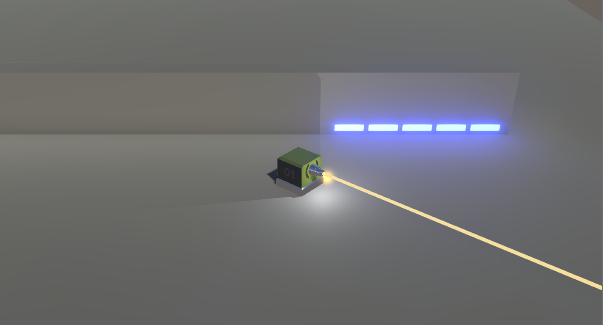
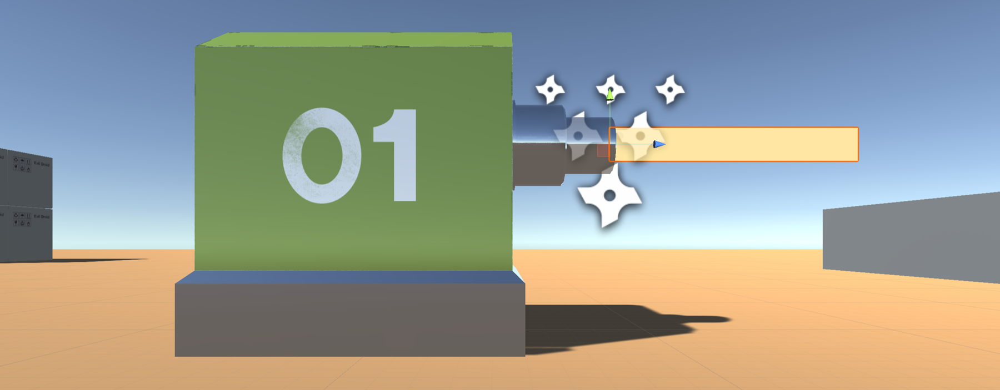
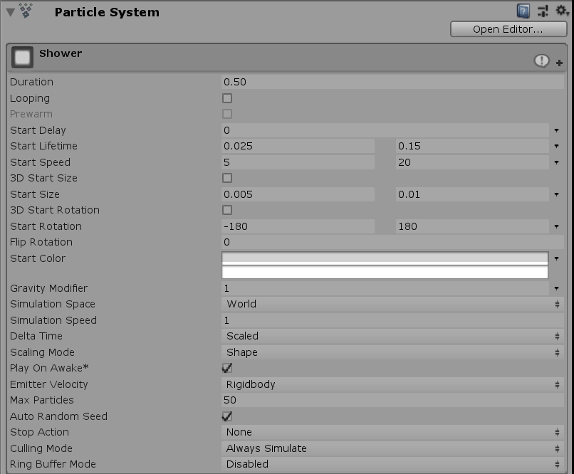

# Week 09: Top-Down Shooter: Line Renderers

## SETTING UP THE LINE RENDERER




This PDF covers how to add a line renderer to your character’s and the enemys’ guns when they fire. It looks something like you see above.

Line renderers can be used as a ‘tracer-bullet’ effect or they can be recoloured to look like laser beams. By adding more points to the line, they even be used to look like electricity or lightning. The following is taken from the Unity documentation:

The Line Renderer component takes an array of two or more points in 3D space, and draws a straight line between each one. A single Line Renderer component can therefore be used to draw anything from a simple straight line to a complex spiral. The line is always continuous; if you need to draw two or more completely separate lines, you should use multiple GameObjects, each with its own Line Renderer.

The Line Renderer does not render one-pixel-wide lines. It renders billboard lines (polygons that always face the camera) that have a width in world units and can be textured. It uses the same algorithm for line rendering as the Trail Renderer.

- In the top-right of the Unity Editor, go to **Layers » Edit Layers...**

- In an available field (eg. **User Layer 13**), _type: Shootable to create a new layer of that name._

- Select _Player01’s_ **ProjectileOrigin** in the **Hierarchy.**

- Add a **Line Renderer** component to this in the **Inspector**. A pink square will appear.

>Note: this should be centered at the end of the gun-barrell. If it isn’t, uncheck **Use World Space** in the **Line Renderer** component.

- In the Line Renderer component, expand the materials dropdown and hit the circle selector to the right of _Element 0_. The Materials assets bin will pop up.

- Find and double-click the _LineRendererMaterial_ material to select this and close the bin.(You may still need to download and import this asset from **Stream**). This will make the line renderer yellow-ish.

 - In the **Line Renderer** component, set **Cast Shadows** to **Off**.

 - Uncheck **Receive Shadows**.

 - In the **Width** graph below, drag the red line (up and down) until the yellow line is only as wide as the hole in the gun barrell.

 >Note: Its length isn’t important.

 It should look something like this:



- Finally, disable the **Line Renderer** by unchecking its main checkbox at the top-left of the component. We do this because we don’t want to see the line renderer when the game begins. We’ll enable it again via the _FireProjectile_ script.

- Open your **FireProjectile** script.

- Add the indicated variables, references and comments:

```C#
[Header(“PUBLIC REFERENCES”)]
public Transform bulletOrigin;            // Where to instantiate bullet
public Transform mineOrigin;              // Where to place the mine
public GameObject bullet;                 // Prefab
public GameObject mine;                   // Prefab
public AudioClip gunSound;
public AudioClip landMineSound;
public GameObject impactEffect;           // What to instantiate where bullet hits shootable object

[Header(“SETTINGS”)]
public float timeBetweenBullets = 0.15f;
public float timeBetweenLandMines = 0.5f;
public float effectsDisplayTime = 0.06f;
public float lineRange = 100f;            // Length of line drawn

// PRIVATE VARIABLES:
float timer;
float effectsTimer;
AudioSource audioSource;
LineRenderer lineRenderer;               // Reference to the line renderer
Ray shootRay = new Ray();                // A ray cast from projectile origin forwards (Z)
RaycastHit hitResult;                    // The object hit by raycast
int shootableMask;                       // Layer No. of shootable mask
```

- Add the below code to your **Start** method:

```C#
void Start ()
{
  // Give ‘audioSource’ a value
  audioSource = bulletOrigin.GetComponent<AudioSource>();

  // Give ‘lineRenderer’ a value
  lineRenderer = bulletOrigin.GetComponent<LineRenderer>();

  // Give ‘shootableMask’ a value
  // Returns the number of our ‘Shootable’ layer)
  shootableMask = LayerMask.GetMask(“Shootable”);
}
```

- Add the following code to your **FireBullet** method.

```C#
void FireBullet()
{
  // Instantiate the bullet at the point of origin
  Instantiate(bullet, bulletOrigin.position,
  bulletOrigin.rotation);

  // Stop the particle system (if it’s already playing)
  bulletOrigin.GetComponent<ParticleSystem>().Stop();

  // Play the particle system
  bulletOrigin.GetComponent<ParticleSystem>().Play();

  // Turn on the light
  bulletOrigin.GetComponent<Light>().enabled = true;

  // Turn on the line renderer
  lineRenderer.enabled = true;

  // Set the point at which to begin drawing the line
  lineRenderer.SetPosition(0, bulletOrigin.position);

  // Set the point at which to begin the raycast
  shootRay.origin = bulletOrigin.position;

  // Set the direction for the raycast
  shootRay.direction = bulletOrigin.forward;

  // If the raycast hits something
  if (Physics.Raycast(shootRay, out hitResult, lineRange, shootableMask))
  {
    // set end position of line to be the point where the raycast hit
    lineRenderer.SetPosition(1, hitResult.point);

    // Instantiate the bullet impact effect at the point of impact
    Instantiate(impactEffect, hitResult.point, Quaternion.identity);

  }

  else // If we don’t hit anything
  {
    // Draw a 100-unit line (lineRange) in the forward direction
    lineRenderer.SetPosition(1, shootRay.origin + shootRay.direction
    * lineRange);
  }

  // Play the BANG
  soundaudioSource.Play();
}
```

Here, we’re basically saying that we want to shoot both of these things (a line and a ray) from the ProjectileOrigin.. which is fine.. but then we need to determine the end of the line (so that it can be rendererd) which is different every time we fire the gun. So we use the raycaster to tell us what we hit and make [wherever that is] the end of the line. If we don’t hit anything, then we use the lineRange variable to say ‘draw the line but end it 100 units forwards’ which is way off screen so we’ll never notice.

- **Save** the script.

- Disable the line renderer at the same time as we switch off the flashing light:

```C#
    void DisableEffects()
    {
      // Turn off the light
      bulletOrigin.GetComponent<Light>().enabled = false;

      // Turn off the line renderer
      lineRenderer.enabled = false;
    }
  }
}
```

- **Save** the script and head back to **Unity**.

- Select **Player01**.

- Go to your **Effects** folder and select **ExplosionBigCustom** (_refer to PDF 008_).

- Hit **CTRL+D** (PC) to duplicate the prefab (**CMND+D** on Mac).

- Rename the duplicate: **BulletImpactCustom**.

- Double-click **BulletImpactCustom** (or hit **Open Prefab** at the top of the **Inspector**) to inspect the prefab. Notice that it’s made up of numerous individual particle effects.

- In the **Hierarchy**, delete everything except Shower.

  ie.  Delete **TrailsBlack** (parent and child) **TrailsWhite** (parent and child), **Fireball, Dust, Shockwave** and **SmokeBlack**.

- Select **Shower** and adjust its main **Particle System** settings to something closer to this:



- Select **BulletImpactCustom** (parent) in the **Hierarchy**.

- Replace the **ExplosionSound** in the **Audio Source** component with **BulletImpactSound**(you’ll find this on Stream).

- In the **Audio Source** component, set **Volume** to about **0.2**.

- Disable the **Explosion Physics Force** (script) component.

  We’re removing this because it isn’t the right kind of explosive force.. if we leave it on, bullet impacts will cause things to fly skyward—which isn’t very realistic.

- Exit prefab view and select **Player01** in the **Hierarchy**.

- With **Player01** selected, drag **BulletImpactCustom** into the empty **Impact Effect** field in the **Inspector**. This effect will be spawned at the point of impact whenever the line renderer hits something on the Shootable layer.

- Select the wall (or walls) in your scene.

- Using the **Layer** dropdown at the top of the **Inspector** (that’s the Layer dropdown NOT the Layers dropdown), assign your wall (or walls) to the **Shootable** layer.

- While we’re here, set your walls to **Static** (top-right of the Inspector). This tells Unity that this object won’t move—Unity can therefore include it in its light-bake, improving lighting results and saving on performance costs.

- Select the _Player01’s_ **ProjectileOrigin**.

- In the **Line Renderer** component, check / re-enable **Use World Space**.

- Hit **Play** to test.

  You should see a line being drawn briefly each time you fire—with a little shower of sparks wherever the line renderer hits a Shootable object.
