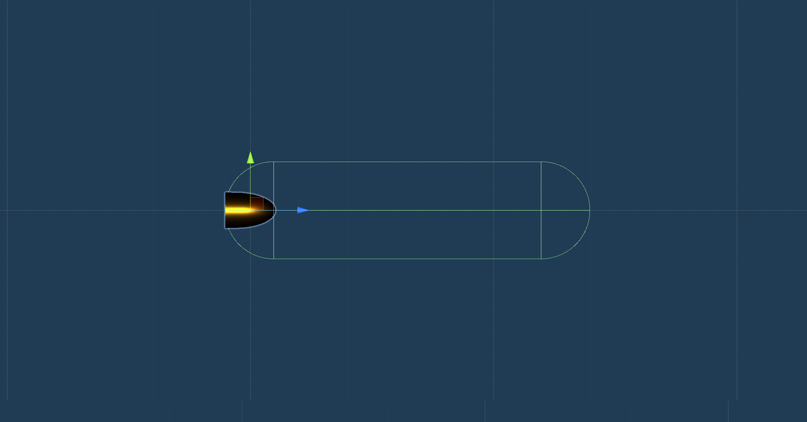
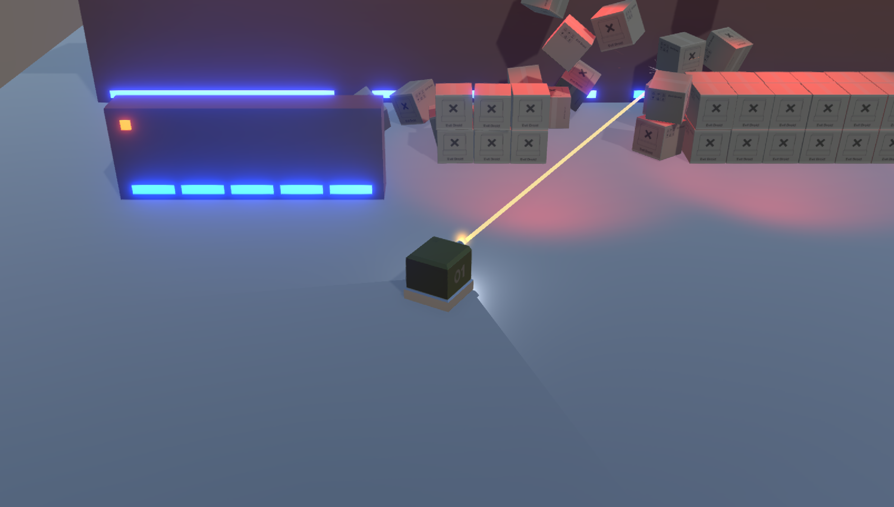
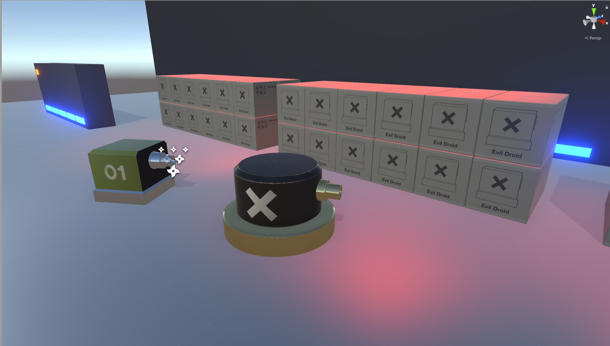
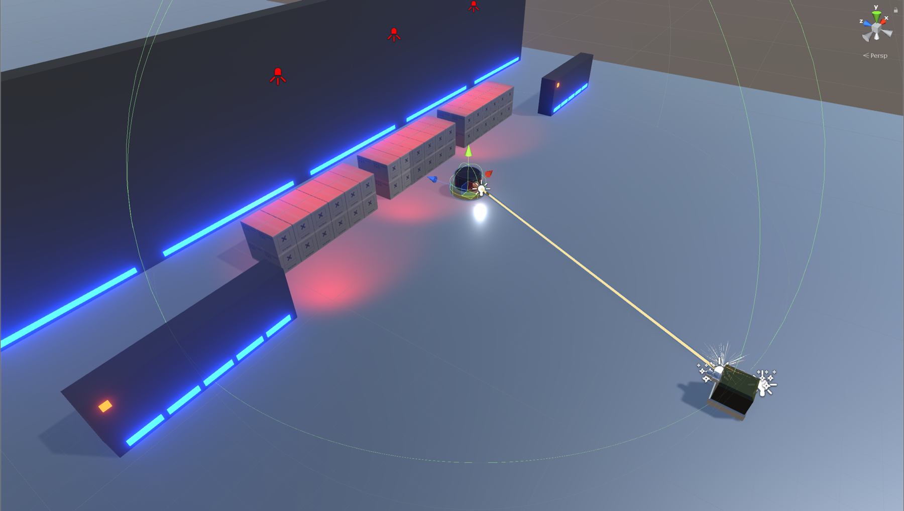
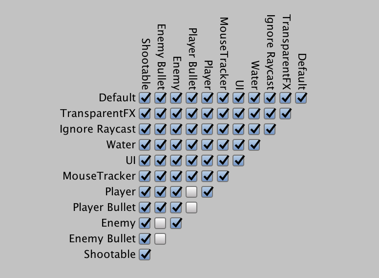

# Week 10: Top-Down Shooter: Enemy Turret

## INVISIBLE BULLETS
Having just added a line renderer, the game no longer really benefits from having the bullets also be visible... It looks a little bit odd having the line fire in one direction (very quickly) while bullets spray out in all directions.

You might want to find your _PlayerBullet_ prefab and disable its _Mesh Renderer_. The bullets will then simply be a means by which we can deliver damage to the enemy. Different bullet-types can later deal damage in different ways or to different amounts. This can be achieved by creating new ammunition types and ammunition variables and methods in the _FireProjectile_ script.

You may also want to adjust the size and visibility of the bullet impact particle effects to match the apparent strength of the gun that the line renderer suggests. You can do this by finding the BulletImpact prefab (should be in your Effects folder) and inspecting it by double-clicking it. This reveals the Shower particle effect—which you can adjust and add to.

Anyway, if you want to make the bullet invisible, check this list:

- Select your **PlayerBullet** prefab and give it a **Speed** value of about **60**. (‘Much faster than that, you may start having clipping issues).

- Open up your **PlayerBullet** prefab

- Select **PlayerBullet** (the parent object—this should have your Capsule Collider on it).

- To further synch up the bullets with the line and to reduce the chance that the bullet might clip straight through objects, increase the Capsule Collider’s radius to about **0.2** and it’s height about **1.5**. It should look something like this:





- Select the **Bullet** mesh.

- Disable the **Mesh Renderer** component.

- Exit the prefab (go back to **Scene** view)

- Select **Player01** and set **Time Between Bullets** to about **0.1**.
	This will ensure a constant flow of bullets, coinciding better with the line renderer.

- Finally, check that you have a short **Effects Display Time**. Something like **0.02**.
	These settings should all tie together pretty well.

- Hit **Play** and test it out.



The Player’s primary weapon should be looking and feeling pretty good, at this stage.

Now, let’s add some enemies.

## ADDING AN ENEMY TURRET

I’ve modeled and textured some enemies for you to use in your game. By all means create your own if you’d like to. But for now, let’s import the ones I’ve prepared.

- In Unity, right-click your **Assets** (root) folder and import the **Turret** custom package from the **Stream** downloads.

	All assets should find their way to the appropriate folders.

- Go to your **Prefabs** folder and drag the **Turret** prefab into the **Hierarchy**. This will position it at origin (0,0,0).

- Select the **Turret** (parent) and ensure it’s assigned to the **Shootable** layer.




## MAKING THE TURRET DO STUFF

**USING TAGS**

The plan here is to make the turret look for the object in the scene that has the _Player_ tag. This; from the [Unity documentation](https://docs.unity3d.com/Manual/Tags.html):

A Tag is a reference word which you can assign to one or more GameObjects. For example, you might define ‘Player’ Tags for player-controlled characters and an ‘Enemy’ Tag for non-player-controlled characters. You might define items the player can collect in a scene with a ‘Collectable’ Tag and so on.

Tags help you identify GameObjects for scripting purposes. They ensure you don’t need to manually add GameObjects to a script’s exposed properties using drag and drop, thereby saving time when you are using the same script code in multiple GameObjects.

You can read more via the link above.


## MAKING THE TURRET TRACK THE PLAYER’S MOVEMENT

- Select **Player01** and look at the top of the **Inspector** for the **Tag** dropdown.  Ensure it’s set to **Player**—(it should be, following the _Proximity Mines_ PDF).

- Go to your **Scripts** folder and create a new script called **TurretControl**.

- Open the script and add your **namespace**.

- Delete the  **Start()**  method but keep the  **Update()**  method.

We could use the following code to achieve the goalof making the turret face the player, but it would result in a sudden jump from one Y rotation to the next (to face the player) - which would look unnatural.

**Don’t copy this code.**

```C#
//Example only - do not copy this code
void Update()
{    
	Transform target = GameObject.FindWithTag(“Player”).transform;
	transform.LookAt(target.position);
}
```

A lerp (linear interpolation) can be used to smooth-out the jumping motion, but as rotation is involved, one must be careful to avoid gimbal lock. [This video](https://www.youtube.com/watch?v=zc8b2Jo7mno); explains gimble lock very well.

Quaternions are a means of avoiding the gimbal lock challenges associated with Euler angles. The mathematics of quaternions is complicated—“The quotient of two directed lines in a three-dimensional space or equivalently as the quotient of two vectors” - _Wikipedia_.

So... ya. Fun!

Unity manages the underlying complexity of quaternions, presenting the developer with more straight-forward functions. Read more about quaternions [here](https://learn.unity.com/tutorial/quaternions);.

**Long story, short:** In the _TurretControl_ script, we’ll implement a **Quaternion.Lerp**  solution instead of a **transform.LookAt**.

- Add a public variable and add to the **Update()** method as follows:

```C#
System.Collections;
System.Collections.Generic;
using UnityEngine;  
namespace TheHedgehogSonic
{
	public class TurretControl : MonoBehaviour    
	{        
		[Header(“TURRET SETTINGS”)]     
		public float dampening = 5.0f;

		void Update()
		{
	 		// Declare a Transform variable and keep it updated with player’s position
			Transform targetLocation = GameObject.FindWithTag(“Player”).transform;     

			 // This makes the turret look at the player’s X and Z but ignores the Y         
			 Vector3 playerPosition = new Vector3(targetLocation.position.x, transform.position.y, targetLocation.position.z);

			 Vector3 aim = playerPosition - transform.position;      
			 Quaternion rotate = Quaternion.LookRotation(aim);

			 // This performs the lerp      
			 transform.rotation = Quaternion.Lerp(transform.rotation, rotate, Time.deltaTime * dampening);
		}
	}
}
```

 - **Save** the script and head back to Unity.

 - Select the **Turret** prefab in its folder and **Open Prefab**.

 - Addd the **TurretControl** script as a component.

 - Check that both the parent and child objects in the Hierarchy have zero rotation in all axes.

 - Hit **Play** to test it out.

 	The turret should now rotate to face the player. You can adjust the speed of the rotation via the Dampening field in the Inspector.  

## MAKING THE TURRET SHOOT AT US:

We can adapt our existing _FireProjectile_ script for the turret. First, we’ll set up the turret:

- If you exited the **Turret** prefab, open it up again.

- Right-click the **Turret** parent object in the **Hierarchy** and choose **3D Object » Sphere**. This is going to be a trigger sphere that tells the turret that the player is within range.

- Rename the **Sphere** to TriggerSphere.

- In the **Transform** component, **Scale** the **TriggerSphere** to about (**30, 30, 30**). You can tweak this later to best suit your game.

- Disable the **TriggerSphere’s Mesh Renderer** component.

- In the **Sphere Collider** component, check the **Is Trigger** checkbox.

- The _TriggerSphere_ is currently on the _Shootable_ layer. This will cause bullets to impact on it...   

	Set the **TriggerSphere** to the **Default** layer (top of the Inspector). This will stop bullets from  impacting the trigger sphere.

- Go to your **Scripts** folder and import the **TurretFire** and **TurretTrigger** scripts from the **Stream** downloads (**right click » Import New Asset**).

- Attach the **TurretTrigger** script as a component of **TriggerSphere**.

- Drag the **Turret** (parent object) into the empty **This Turret** public reference field.

- Right-click the **Turret** parent object in the **Hierarchy** and choose **Create Empty**.

- Rename the Empty to ProjectileOrigin.

- Position **ProjectileOrigin** at the end of the turret’s gun as we did for the Player.

- Exit the prefab and select **PLAYER01’s ProjectileOrigin**.

- In the **LineRenderer** component (in the **Inspector**), click the ‘settings’ cog button (top-right of the LineRenderer component) and choose **Copy Component**.

- Reselect the **Turret’s ProjectileOrigin** in the **Hierarchy**.

- Hit the **Transform’s** settings button in the **Inspector** and **Paste Component As New**.

- In the same way, copy the Player’s **Light, Particle System** and **Audio Source** components across to the turret.

- Select the **Turret** parent object in the **Hierarchy**.

- Drag the **TurretFire** script from its folder to add it as a component of **Turret**.

- Drag the **Turret’s ProjectileOrigin** into the empty **Bullet** Origin field in the **Inspector**.

- Go to your **Prefabs** folder and Import the **TurretBullet** package from the **Stream** downloads.

 This is very similar to the _PlayerBullet_ but has its own _TurretBullet_ script that will have its  own functionality. For example, this bullet can have a different damage value to the player’s  bullet and that of other enemy units.

 This bullet is also left visible for testing purposes. You can switch off the mesh renderer  if or when you’re ready to.

- With the **Turret** (parent) selected in the **Hierarchy**, go to your **Prefabs** folder and drag the  new **TurretBullet** prefab into the empty **Turret Bullet** field in the **Inspector**.

- Import the **CannonSound** audio file from the **Stream** downloads.

- With the **Turret** (parent) selected in the **Hierarchy**, drag the **CannonSound** clip into the empty **Gun Sound** field in the **Inspector**.

- Locate your **BulletImpactCustom** prefab (it should be in your **Effects** folder) and plug it into  the last remaining field in the **Inspector**.

- In the **Prefab** options at the top of the **Hierarchy**, expand the **Overrides** dropdown  and choose **Apply All**.

This applies the changes we made to the instance of the prefab (in the Inspector) to the ‘master’ version of it (the one in the Prefabs folder).

- Select **Player01** and ensure it’s on the **Player** layer.

It should have the Player Tag and be on the Player layer.

- **Save** your scene (because: computers).

## NAMESPACES

Before we test this out, you should quickly add your namespace to the new scripts.

- Open the following scripts and add your namespace to them:   
	- TurretFire   
	- TurretTrigger   
	- TurretBullet   
	- (TurretControl should already have your namespace)

- Make sure those scripts are saved.

-  Hit Play and test it out.

	The Turret should now open fire when the Player is within range.



## UPDATING THE COLLISION MATRIX

- Select the **TurretBullet** prefab in its folder and check that it’s on the **EnemyBullet** layer.

- In the top menu bar, go to **Edit » Project Settings » Physics** and update the **Layer Collision  Matrix** as you see here:



## AFTERTHOUGHTS
If the turret has a slower rate of fire (as a big cannon might), it becomes more important that the bullet reaches the player at about the same time as the line renderer—as it’s the bullet that will deliver the damage, not the line renderer. It will be noticeable if damage is not taken at the right time.

It will be easier to test the damage that the enemy is delivering once we have the health and damage system in place because we’ll have more accurate visual feedback via the HUD.
