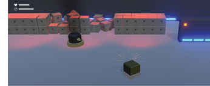

# Week 11: Top-Down Shooter: Enemy Health and Death

## ENEMY HEALTH + DEATH (AKA. PAYBACK TIME)


The turret can damage (and ultimately destroy) us, but we can’t even make a dent. That’s not fair. Let’s give the turret health and death scripts of its own and level the playing field.

-	Go to your **Scripts » Enemies** folder and import the **EnemyHealth** and **EnemyDeath**
scripts from the **Stream** downloads.

-	Select a **Turret** (parent) in your **Hierarchy** and add the **nemyHealth** script as a
component of it.

-	As with the _EnemyBullet_ script, this script is adaptable to whichever enemy uses it.
Check the **Is Turret** [exposed] boolean checkbox in the **Inspector.**

  This unit will now adhere to _Turret settings._

-	As we did with the Player, locate the **Smoke** prefab in its folder and add it as a child of
the **Turret** (parent) object—ensure its **Position** is set to **(0,0,0)**.

-	Reselect the **Turret** (parent) and drag the instance of **Smoke** into the empty **Smoke Effect** field in the **Inspector.**

-	Testing this now won’t be very rewarding, as the _PlayerBullet_ doesn’t deliver any damage to
the enemy. So, open your **PlayerBullet** script and we’ll fix that.

-	Add this variable to the start of your **PlayerBullet** script:

```C#
[Header(“BULLET SETTINGS”)]
public int bulletDamage = 50;
public float speed = 80;
public float bulletLifetime = 1;
```

-	Add the following code to the **PlayerBullet** script’s  OnCollisionEnter  method.		

```C#
    void OnCollisionEnter(Collision other)
    {
      // Create a variable of type ‘EnemyHealth’ and store the EnemyHealth script in it
      EnemyHealth enemyHealthScript = other.gameObject.GetComponentInParent<EnemyHealth>();

      // If the thing that this bullet hits has an EnemyHealth script..
      // (avoids errors when hitting non-player objects, like walls)
      if (enemyHealthScript)
      {
        // Run the EnemyHealth script’s ‘TakeDamage’ method and deliver the value of ‘bulletDamage’
        enemyHealthScript.TakeDamage(bulletDamage);
      }

      // Destroy the bullet
      Destroy(gameObject);
    }
  }
}
```

So, that was (I believe) the first time we’ve actually filled the parenthesis ( ) with a value.

We’re passing the local value of  **bulletDamage**  to whatever we hit.

Provided the enemy has an EnemyHealth script, a **TakeDamage** method and is set up to receive that value, it’ll work beautifully.

Specifically, as the _PlayerBullet_ script’s **bulletDamage** variable is an integer, the recipient’s  TakeDamage  method needs to be set up something like this:

```C#
public void TakeDamage(int damage)
```

.. where a new variable of type integer, named ‘damage’, is declared in the parenthesis.

-	Add your **namespace** (if your project is using namespaces).

-	Hop back to **Unity** breifly and open the **EnemyDeath** script.

-	Add your **namespace** to this script, too (if your project is using namespaces).

-	**Save** both scripts and head back to **Unity**.

-	Select the **Turret** (parent) in the **Hierarchy** and add the **EnemyDeath** script as a
component. It should now have both the _EnemyHealth_ and _EnemyDeath_ scripts.

-	Locate the **ExplosionBigCustom** prefab in its folder and drag it into the empty
**Explosion Effect** field in **Enemy Death (Script)** component in the **Inspector**.

-	Finally, Select the **Smoke** prefab in the **Turret’s** hierarchy and disable its **Particle System Destroyer (Script)** component, if it has one.

-	**Apply** the changes we’ve made to this prefab via the **Override** dropdown at the top of the Inspector. Any other turrets in your scene should now be ready to take damage, too.

-	Hit **Play** to test it out.

Select a turret and keep an eye on its **Unit Health** variable in the **DEBUG** section of
the **Enemy Health (Script)** component. This should go down as you pummel it with bullets.

The _Damage Critical_ flag should become active when health is equal to or is below the value
of _Unit Critical Damage Level_.
Smoke should also start bellowing from the unit when the _Damage Critical_ flag is lit.


 
