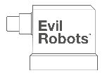
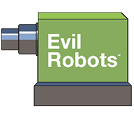
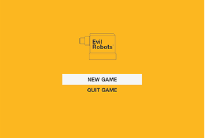
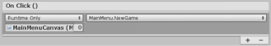

# Week 12: Top-Down Shooter: ADDING A MAIN MENU

## ADDING A MAIN MENU

Most games out there have a Main Menu—something like a lobby, where we orient the player and start exposing them to the wee world that we’ve created. Graphics and audio settings can be tweaked before starting the game or a previous save can be loaded so the player can continue from where they left off.

We’ll keep ours relatively simple this time around but you can build upon these techniques and principles in future.

- 	Save your current scene (because we’re about to create and load another one).

- 	Go to your **Scenes** folder and create a new scene called _MainMenu_.

- 	Open the new **MainMenu** scene.

- 	Hit the **2D** button in the top-left of the viewport to enter 2D mode.

- 	In the top menubar, go to **GameObject » UI » Image**. This will indeed add an image,
but it will also automatically add a canvas (with the Image as its child).

-	Rename the **Canvas** to _MainMenuCanvas_ and the **Image** Object to Background.

- With **Background** selected, use the **Anchor Presets** in the **Rect Transform** component
to stretch the Image across the whole canvas (hold **ALT + SHIFT** while clicking the
bottom-right option).

-	You can either choose a background fill colour for your menu screen or add a custom
image (import one to your Images folder and then reselect the Background Object.
Then use the Source Image circle selector to assign it to the background).

>Note: The UI layer can be made visible / invisible in the Layers drop-down (top-right). If
you can’t see anything in the viewport, check that the UI layer is visible.

>Also Note: I’ve supplied some graphics that you might want to use on this week’s Stream
page. Stuff like this:

  

You’ll find them in the **Main Menu Assets** folder.

You’ll also find icon assets there, too—should you want to apply a custom game icon.

- 	Right-click the **MainMenuCanvas** Object and choose **UI » Button**.

- 	Rename the new **Button** Object to _NewGameButton_.

- 	In the Rect **Transform component**, give the button a **Width** value of about **600** and
a **Height** value of about **80**.

-	If you’d like the button’s background to be transparent, you can dial the alpha (**A**) channel
down to zero via the **Normal Color** property in the Image component.

  The **Highlighted Color** is the button’s colour when the mouse cursor hovers over it.
The other properties are fairly self-explanatory. Style the button as you see fit.

- 	Select the Text child of the NewGameButton Object in the Hierarchy.

- 	Replace the **text** in the Text field (in the Inspector) with **‘NEW GAME’** or **‘PLAY’** or something like that.

-	If you haven’t imported the **AlteHaasGroteskBold** font from **Stream**, go into your **Fonts** folder and do so now. Alternatively, import a font of your own choosing.

-	Change the font to **AlteHaasGroteskBold** (or the one you chose, yourself).

-	Set the font size to about **40** (biggish).

- Reselect the **NewGameButton** Object in the Hierarchy and set its **Pos Y** value to **-80** in the **Rect Transform** component.

-	Duplicate the button (**CTRL+D** (PC) or **CMND+D** (Mac)) and rename the duplicate to
_QuitButton_.

-	Set its **Pos Y** value to about **-180** in the **Rect Transform** component..

- Adjust the button’s **display** text to **‘QUIT GAME’** or just **‘QUIT’**.

- If you’d like to add a title image as I’ve done, below; Import the **EvilRobotsTitle600x400**
image from the **Stream** assets to your **Images** folder, set the **Texture Type** to **Sprite**
**(2D and UI)** and hit **Apply**. Then reselect the the **MainMenu** canvas Object, right-click and
choose **UI » Image**. Assign the imported image as the **Source Image**, give it **Width** and
**Height** values of **318** and **212** (respectively) or full size (which is **600x400**). The image will
start to pixelate if you go over 600x400. Position it as you see fit.

  

-	If you don’t want your buttons to have rounded corners, select the button and remove the
**Source Image** in the **Image (Script)** component—(ie. set it to **None**).


## SCRIPTING THE MAIN MENU

- Open your **Scripts** folder and create a new folder called _UI_.

-	Go into the **UI** folder and create a **C\# script** called **MainMenu**.

-	**Open** the script and add your **namespace** (if your project uses namespaces).

-	Adjust the script so that it looks like this—note the addition of:

```C#
using UnityEngine.SceneManagement    (at the top)
```

This gives us access to the SceneManagement command library.

```C#
using System.Collections;
using System.Collections.Generic;
using Unity.Engine;
using Unity.Engine.SceneManagement;

namespace BertQ
{
  public class MainMenu : Monobehaviour
  {
    public string startLevel;		// Reference name for the first level of the game

    public void NewGame()
    {
      // This loads the first scene
      SceneManager.LoadScene(startLevel);
    }

    public void QuitGame()
    {
      // This simulates the quit (as you can only quit from a built game)
      Debug.Log(“Game exited”);

      // This closes the application
      Application.Quit();
    }
  }
}
```

-	**Save** the script and head back to **Unity**.

-	Select the **MainMenuCanvas** Object and add the **MainMenu** script as a component.

-	Open your **Scenes** folder, select your first scene (the first level in your game), hit **F2** (PC) or **ENTER** (Mac) to rename it (but don’t)—**copy** the name of your starting scene.

-	Reselect the **MainMenuCanvas** Object and paste that name into the empty **Start Level** field
in the **Main Menu (Script)** component in the **Inspector.**

>Note: This really needs to be exactly the same.

-	Select the **NewGameButton** Object and look in the bottom of the **Button (script)**
component in the **Inspector** for the **On Click()** panel...

-	Hit the little + symbol at the bottom of this panel.

-	Drag the **MainMenuCanvas** Object into the empty **None (Object)** field.

-	Use the dropdown (currently says **o Function**) to select **MainMenu » NewGame()**.

  This refers to the **NewGame** method within the **MainMenu** script.
Meaning that when the button is pressed, that method will run.



-	Select the **QuitButton** Object and repeat the above steps.

  ie.:
          •	Hit the  +  in the Inspector.
          •	Drag the **MainMenuCanvas** Object into the empty / ‘none’ field.
          •	Use the dropdown to select **MainMenu » QuitGame()**.

-	In the top menu, **go File » Save Scene** and **File » Save Project** (because computers).

-	Hit **Play** to test it out—test the **Quit** button first (because it’s about to disappear).

  You should receive a Console message saying: ‘Game exited’.

  Hitting **New Game** should launch your first scene.

  If you receive an error (when the first scene loads): Display 2 No cameras rendering,

-	Hit **Play** to stop the test.

-	Select your **Main Camera** and set its **Target Display** to **Display 2** in the **Inspector**.

-	Select the **MainMenuCanvas** and set its **Target Display** to **Display 2** in the
**Inspector**.

-	Go into **Game** view and set the **Display** to **Display 2** (top-left of viewport).

That’s it!

Make sure you test the quit button on a built game before you submit your project.

The next PDF will be the final one. It will cover how to switch levels whilst preserving the player’s score, inventory and number of lives (if you choose to do that).
