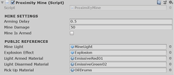

[//]: # (Document markdown file 008.md generated by Crawler 1.0.0 on Thu Apr 30 2020 15:02:12 GMT+1200)
289.106 INTRO TO GAME

  

**TUTOR:** DAVID PETERS

**EMAIL:** D.PETERS1@MASSEY.AC.NZ

**ENGINE VERSION:** UNITY 2019.1
**DOCUMENT VERSION:** 289.106.008.3

008 | PROXIMITY MINES

  

  

  

**ADDING A FLASH OF LIGHT:**

  

In this PDF, we’ll add a proximity mine that can be dropped by the player on Fire2 input (right mouse button / RMB). This mine will explode spectacularly when a character gets too close.
But first, we’ll finish up the player’s gun. Currently, a small particle effect plays when the player shoots—now we’ll add a flash of light and a sound.
We can do this by briefly enabling and disabling a light at the end of the gun.
**Note:** The following process might seem a little heavy for the simple purpose of switching a light on and off, but it also sets us up for the next section, plus it’s a pretty cool effect.
-	Select the player’s **ProjectileOrigin** object in the **Hierarchy**.
-	In the **Inspector**, add a **Light** component. Leave it set to Type: **Point**.
-	Tweak the light’s properties as you like - though, the default settings are perfectly fine.
-	Under **_Shadow Type_**, choose **Hard Shadows**.
-	Once you’re happy with how the light will look as the player fires the gun, disable the **Light**
component by unchecking the checkbox (at the top-left of the **Light** component).
We’ll re-enable it through script.

FireProjectile

t

// Turn on the light
bulletOrigin.GetComponent<Light>().enabled = true;

void DisableEffects()
{
// Turn off the light
bulletOrigin.GetComponent<Light>().enabled = false;
}

void FireBullet()

{

// Testing that the fire method is being called
// Debug.Log(“Firing bullet”);
// Instantiate the bullet at the point of origin
Instantiate(bullet, bulletOrigin.position,
bulletOrigin.rotation);
// Stop the particle system (if it’s already playing)
bulletOrigin.GetComponent<ParticleSystem>().Stop();
// Play the particle system
bulletOrigin.GetComponent<ParticleSystem>().Play();
// Turn on the light
bulletOrigin.GetComponent<Light>().enabled = true;

}
void DisableEffects()
{
// Turn off the light
bulletOrigin.GetComponent<Light>().enabled = false;
}
}
}

-	Add a line to the end of your  FireBullet  method that turns on the light—and add that  
DisableEffects  method—(which will turn off the light):
Now the light will be switched on as part of the  FireBullet  method. It will then be switched off in  DisableEffects  method when the effectsTimer  reaches 0.
-	**Save** the script and **test** it out.
There should now be a brief flash when the player fires the gun.
Now we’ll add a gunshot sound that plays when the player fires the gun. While we’re at it, we’ll
add a ‘drop landmine’ sound that’s triggered by _Fire2_ input (RBM).
LMB currently fires the gun. This will soon play a gun sound.
RMB will soon play another / different sound.
-	Import the **GunshotSound01** and **LandmineSound01** audio assets from the **Stream**
downloads to your **Audio** folder.
-	Select the player’s **ProjectileOrigin** object in the **Hierarchy**.
-	Add an **Audio Source** component.
-	Normally, we’d provide _GunshotSound01_ as the **AudioClip** (in the **Audio Source**
component). But we can just leave it empty, as we’ll load this dynamically through code.

**PLAYING MULTIPLE SOUNDS**
**THROUGH A SINGLE AUDIO SOURCE:**

FireProjectile

[Header(“SETTINGS”)]
public float effectsDisplayTime = 0.06f;
float effectsTimer;

public class FireProjectile : MonoBehaviour
{
[Header(“PUBLIC REFERENCES”)]
public Transform bulletOrigin;
public GameObject bullet;
public float timeBetweenBullets = 0.15f;
// PRIVATE VARIABLES:
float timer;

FireProjectile

-	Open your **FireProjectile** script and add the following header and variables:
The variable  effectsDisplayTime  will determine how long the light is enabled for.
A duration of  0.06  constitutes a mere flash.
We’ll make it so that the value of  effectsTimer  counts backwards from the value of  effectsDisplayTime  and then disable the light when it reaches zero.
-	Make the indicated changes to your  Update  method:
_Fire1_ input will start a countdown from the value of   effectsDisplayTime. When the timer reaches zero, the method that will switch off the light light is called (DisableEffects).
**Note:** The  DisableEffects  method doesn’t exist yet, so Visual Studio will indicate an error.
No stress—we’ll fix that in just a moment.

t

// Update is called once per frame
void Update()

{
// Tie timers to the game clock
timer += Time.deltaTime;		// counts up
effectsTimer -= Time.deltaTime;	// counts down
//	If Fire1 input is received ..

if (Input.GetButton(“Fire1”) && timer >= timeBetweenBullets)
{
// Call the ‘fire’ method
FireBullet();
// Reset timer for next bullet
timer = 0;
// Start the effects timer
effectsTimer = effectsDisplayTime;

}
// When the effects timer reaches zero
if (effectsTimer <= 0)
{
// Run DisableEffects method (below)
DisableEffects();

}
}

// Tie timers to the game clock
// counts up
effectsTimer -= Time.deltaTime;	// counts down

// Start the effects timer
effectsTimer = effectsDisplayTime;

// When the effects timer reaches zero
if (effectsTimer <= 0)
{
// Run DisableEffects method (below)
DisableEffects();

}

FireProjectile

t

// Play the BANG sound
audioSource.Play();

void FireBullet()

{

// Testing that the fire method is being called
// Debug.Log(“Firing bullet”);
// Instantiate the bullet at the point of origin
Instantiate(bullet, bulletOrigin.position,
bulletOrigin.rotation);
// Stop the particle system (if it’s already playing)
bulletOrigin.GetComponent<ParticleSystem>().Stop();
// Play the particle system
bulletOrigin.GetComponent<ParticleSystem>().Play();
// Turn on the light
bulletOrigin.GetComponent<Light>().enabled = true;
// Play the BANG sound
audioSource.Play();

}

FireProjectile

-	.. then play that clip at the end of the  FireBullet  method:
-	Now, we need to capture _Fire2_ (RMB) input and set _landMineSound_ as the current AudioClip.
Add to your  Update  method as indicated:

t

void Update()

{
// Tie timers to the game clock
timer += Time.deltaTime;		// counts up
effectsTimer -= Time.deltaTime;	// counts down
//	If Fire1 input is received ..

if (Input.GetButton(“Fire1”) && timer >= timeBetweenBullets)
{
// Set ‘gunSound’ as the current audio clip
audioSource.clip = gunSound;
// Call the ‘fire’ method
FireBullet();
// Reset timer for next bullet
timer = 0;
// Start the effects timer
effectsTimer = effectsDisplayTime;

}
//	If Fire2 input is received ..

if (Input.GetButton(“Fire2”) && timer >= timeBetweenLandMines)
{
// Set ‘landMineSound’ as the current audio clip
audioSource.clip = landMineSound;
// Reset the timer for next mine
timer = 0;
}
// When the effects timer reaches zero
if (effectsTimer <= 0)
{
// Run DisableEffects method (below)
DisableEffects();

}
}

//	If Fire2 input is received ..

if (Input.GetButton(“Fire2”) && timer >= timeBetweenLandMines)
{
// Set ‘landMineSound’ as the current audio clip
audioSource.clip = landMineSound;
// Reset the timer for next mine
timer = 0;
}

FireProjectile

public class FireProjectile : MonoBehaviour
{
[Header(“PUBLIC REFERENCES”)]
public Transform bulletOrigin;
public GameObject bullet;
public AudioClip gunSound;
public AudioClip landMineSound;
[Header(“SETTINGS”)]
public float timeBetweenBullets = 0.15f;
public float timeBetweenLandMines = 0.5f;
public float effectsDisplayTime = 0.06f;

public AudioClip gunSound;
public AudioClip landMineSound;
public float timeBetweenLandMines = 0.5f;

FireProjectile

-	Open your **FireProjectile** script.
-	Add public references (of type _AudioClip)_ for those two new audio samples and a  
timeBetweenLandMines  variable, like so:
**Note:** timeBetweenLandMines determines how often / quickly the player can put down mines.
-	Add a private variable of type _AudioSource_, (called _audioSource_) and provide a value in a
new  Start  method.
-	If _Fire1_ input is received, set _gunSound_ as the current AudioClip ... :

// PRIVATE VARIABLES:
float timer;
float effectsTimer;
AudioSource audioSource		
void Start ()
{
// Give ‘audioSource’ a value

audioSource = bulletOrigin.GetComponent<AudioSource>();

}
// Update is called once per frame
void Update()

AudioSource audioSource;
void Start ()
{
// Give ‘audioSource’ a value

audioSource = bulletOrigin.GetComponent<AudioSource>();

}		

FireProjectile

t

// Set ‘gunSound’ as the current audio clip
audioSource.clip = gunSound;

void Update()

{
// Tie timers to the game clock
timer += Time.deltaTime;		// counts up
effectsTimer -= Time.deltaTime;	// counts down
//	If Fire1 input is received ..

if (Input.GetButton(“Fire1”) && timer >= timeBetweenBullets)
{
// Set ‘gunSound’ as the current audio clip
audioSource.clip = gunSound;
// Call the ‘fire’ method
FireBullet();

**PREPARING THE MINE**

  
There’s quite an art to creating realistic rapid-fire gun sounds—we should really be using
multiple audio samples (one for the start of fire, a loopable sample for sustained fire and
another that ramps down when the player releases the button). Our solution is basic and
doesn’t produce perfect results.
It will tend to sound better, the slower your gun’s rate of fire is.
This next bit’s really fun and rewarding. I’ve prepared a _Proximity Mine_ package for you, which includes meshes, textures, materials, scripts and a prefab. It shouldn’t take much effort to get this into your game.
-	Import the **ProximityMine.unitypackage** from the **Stream** downloads.
-	In **Unity**, right-click your **Assets** folder and **Import Package » Custom Package**.
-	Find the **ProximityMine.unitypackage** and import it. An _Import_ window will pop up.
-	**Import** all package contents.
If you’ve named your folders as these PDFs have previously suggested, all assets should find
their way to their appropriate folders (eg. scripts in _Scripts,_ Materials in _Materials_, etc._)._
-	Go into your **Prefabs** folder and select the **ProximityMine** prefab.
-	Check that the **Public References** have been connected as you see here:
**Arming Delay:** 		This is how long (after the mine is spawned) before it goes live.
**Mine Damage:** 		This is how much damage that mine will inflict when we have a
health and damage system.
**Mine is Armed:** 		Weather or not the mine is live (boolean).
**Mine Light:** 		The object in the prefab that lights up when mine is armed.
**Light Armed Material:** 	Which material the light should use when mine is armed.
**Light Disarmed:** 		Which material the light should use when mine is disarmed.\*
**Pick Up Material:** 		Which material the light should use when mine can be picked up.
\*This is not used in the script—but available for future game mechanics.

FireProjectile

t

void PlaceMine()
{
// Play the landmine deploy sound
audioSource.Play();

}

// Turn on the light
bulletOrigin.GetComponent<Light>().enabled = true;
// Play the BANG sound
audioSource.Play();

}
void PlaceMine()
{
// Play the landmine deploy sound
audioSource.Play();

}
void DisableEffects()
{

FireProjectile

We’re nearly done with the code for this. We only need to add a  PlaceMine  method that plays the second sound (and will soon spawn the landmine).
-	Just after your  FireBullet  method, add a  PlaceMine  method:
-	Call the  PlaceMine  method from the  Update  method when _Fire2_ input is received:
-	**Save** the script and head back to **Unity**.
-	Select **Player01** and notice there are two empty [AudioClip] fields in the **Inspector**.
- 	From the **Audio** folder, drag **GunShotSound01** into the **Gun Sound** field.
-	Drag **LandmineSound01** into the **Land Mine Sound** field.
-	Select the player’s **ProjectileOrigin** object in the **Hierarchy**.
-	In the **Audio Source** component, uncheck **Play On Awake**.
-	Hit **Play** to test it out\!
You should hear a BANG\! when LMB is pressed and a mechanical sound when RMB is
pressed. In the _Audio Source_ component, you can see these sounds being loaded in,
as each one is required.
-	**Save** your project.

t

// Call the ‘PlaceMine’ method (below)
PlaceMine();

//	If Fire2 input is received ..

if (Input.GetButton(“Fire2”) && timer >= timeBetweenLandMines)
{
// Set ‘landMineSound’ as the current audio clip
audioSource.clip = landMineSound;
// Call the ‘PlaceMine’ method (below)
PlaceMine();
// Reset the timer for next mine
timer = 0;
}

**ADDING THE MINE’S**
**SPAWN POINT**

  

-	Right-click **Player01** in the **Hierarchy** and choose **Create Empty**.
-	Rename the new **Empty GameObject** to _PlaceMineLocation_.
This will be where the mine spawns into the game. We made it a child of the Player so
that the spawn location always follows the player.
-	Position the **PlaceMinePosition** Empty just behind the player, something like this:
-	Select **Player01** and drag **PlaceMinePosition** into the empty **Mine Origin** field
in the **Inspector**.
-	Drag the **ProximityMine** prefab from the **Prefab** folder into the empty **Mine** field
in the **Inspector**.
-	Finally, check that **Player01** has the **Player** tag (via the **Tag** dropdown at the top of the
**Inspector**). The landmine’s trigger checks if the character has this tag.
-	That’s it\! **Save** the project and hit **Play** to test it out.
You should now be able to alternate between shooting (LMB) and dropping landmines
(RMB). Each should make their own unique sound.
The mine is triggered  OnTriggerEnter  to allow the Player a safe exit from the trigger zone. But you might want to change this to  OnTriggerStay—meaning that the player needs to make a quick exit before the mine goes live\! (Probably more fun).
**LANDMINE PARTY:**
For an berserk landmine party, comment out  timer = 0;  in the _Fire2_ input (in the  Update method of the _FireProjectile_ Script)...

  

FireProjectile

public class FireProjectile : MonoBehaviour
{
[Header(“PUBLIC REFERENCES”)]
public Transform bulletOrigin;	// Where to instantiate bullet
public Transform mineOrigin;	// Where to place the mine
public GameObject bullet;		// Prefab		
public GameObject mine;		// Prefab
public AudioClip gunSound;
public AudioClip landMineSound;
[Header(“SETTINGS”)]
public float timeBetweenBullets = 0.15f;
public float timeBetweenLandMines = 0.5f;
public float effectsDisplayTime = 0.06f;

// Where to instantiate bullet
public Transform mineOrigin;	// Where to place the mine
// Prefab		
public GameObject mine;		// Prefab

-	At the top of the **Inspector**, hit **Open Prefab** and inspect how the mine is constructed.
**ProximityMine:** 		The parenting [Empty] object. This has the main script, a Rigidbody
(for gravity), an Animator (the light’s Y position is animated).
**MineShell:**			Main mesh + colliders.
**MineLight:**			Basic mesh with a renderer. This is animated.
**PickUpTrigger:**		Not yet used in script. Can later be utilised for player pick-up.
**ProximityTrigger:**		Has its own trigger script that talks to the main _ProximityMine_ script
Mine will detonate when this sphere is triggered.
-	Open the **ProximityMine** and **ProximityTrigger** scripts and add your namespace to them.
-	**Save** the scripts.
-	We need to add some new references to our **FireProjectile** script:
-	Instantiate the mine at the given location (we’ll use an Empty GameObject for this):
-	**Save** the script and head back to **Unity**.

FireProjectile

t

void PlaceMine()
{
// Play the landmine deploy sound
audioSource.Play();
// Instantiate the mine prefab at the referenced location
Instantiate(mine, mineOrigin.position, mineOrigin.rotation);  

}

// Instantiate the mine prefab at the referenced location
Instantiate(mine, mineOrigin.position, mineOrigin.rotation);

- 	Delete **ExplosionBigCustom** from the **Hierachy**.
-	Select **ExplosionBigCustom** in its folder.
-	**Disable** the **Light** component in the **Inspector** (this light seems to create unwanted lighting
artifacts when using the Post Processing Stack and doesn’t otherwise bring much to the
party, so it’s best to switch it off).
Finally, we’ll replace the explosion that the proximity mine currently uses with our new and improved version:
-	Go to your **Prefabs** folder and select **ProximityMine**.
-	Replace **Explosion** with **ExplosionBigCustom** (in the **Explosion Effect** field).
-	Hit **Play** to test it out.
Explosions should make a sound and be removed from the Hierarchy after 5 seconds.
Well done\! That’s the end of this PDF.
**POST PROCESSING STACK:**
By the way, these mines look way better with a little glow. Now’s a good time to get the post processing stack into your game, if you haven’t already.
There does seem to be an issue with the stack on the current build of Unity, but here’s the work-around for that glitch:

-	Import the **Post Processing Stack** from the **Unity Asset Store.**
-	When you receive the ‘MinDrawer’ error in your _Console_, double-click the error.
This should open **MinDrawer.cs** in _Visual Studio_. If not, find it and open it manually.
-	Immediately after  ‘using UnityEngine.PostProcessing;’  add the following line:
using MinAttribute = UnityEngine.PostProcessing.MinAttribute;
-	**Save** and **close** the script. Head back to **Unity**.
-	When you receive the API prompt, choose **I Made a Backup. Go Ahead\!**
This should solve the problem. You can now create a **Post-Processing Profile** (PPP), as you
normally would. (Add a **Post-Processsing Behaviour** to your camera and connect that PPP).
**Completed Fireprojectile script on next pages.**

**EXPLOSION UPGRADES**

The standard Assets explosion is all bite, no bark—it doesn’t make any sound by default.
Also, after an explosion particle effect has played through, it still lingers as a redundant object in your Heirarchy, forever occupying memory.
We’ll make some improvements to this for use now and in the future.
**ADDING A SOUND EFFECT TO A PARTICLE EFFECT:**

-	Ensure you have the **Unity Standard Assets** in your project. If you do not:
Open the **Asset Store** window and import the **Unity Standard Assets** package.
-	Go to **Standard Assets » Particle Systems » Prefabs**.
-	Select and drag **Explosion** into the **Hierarchy**.
-	Rename **Explosion** to _ExplosionBigCustom._
-	With **ExplosionBigCustom** still selected (in the **Hierachy**), Add an **Audio Source**
component (in the **Inspector**).
-	Go into your **Audio** folder, there should be an audio clip called **Explosion**.
(If not, this is availble on Stream—import it to your Audio folder).
-	Drag the **Explosion** sound into the **AudioClip** field of _ExplosionBigCustom’s_ **Audio Source**
component.
**OBJECT EXPIRE SCRIPT:**
I’ve written a very simple script and supplied it on Stream. The script will destroy _any_ object it’s attached to after a certain amount of time—the default delay is 5 seconds.
-	Go into to your **Scripts** folder.
-	Download and import the **ObjectExpire** script from **Stream**_._
-	Attach the **ObjectExpire** script as a component of **_ExplosionBigCustom_**_._
**SAVING THE NEW EXPLOSION PREFAB:**
-	Open your **Effects** folder and drag **ExplosionBigCustom** into the folder.
-	When prompted, choose **Original Prefab**.

**WEEK 10 - PROXIMITY MINES**

**FireProjectile continued**:

//	If Fire2 input is received ..

if (Input.GetButton(“Fire2”) && timer >= timeBetweenLandMines)
{
// Set ‘landMineSound’ as the current audio clip
audioSource.clip = landMineSound;
// Call the ‘PlaceMine’ method (below)
PlaceMine();
// Reset the timer for next mine
timer = 0;
}

}

void FireBullet()

{
// Instantiate the bullet at the point of origin
Instantiate(bullet, bulletOrigin.position, bulletOrigin.rotation);
// Stop the particle system (if it’s already playing)
bulletOrigin.GetComponent<ParticleSystem>().Stop();
// Play the particle system
bulletOrigin.GetComponent<ParticleSystem>().Play();
// Turn on the light
bulletOrigin.GetComponent<Light>().enabled = true;
// Play the BANG sound
audioSource.Play();

}
void PlaceMine()
{
// Play the landmine deploy sound
audioSource.Play();
// Instantiate the mine prefab at the referenced location
Instantiate(mine, mineOrigin.position, mineOrigin.rotation);  

}
void DisableEffects()
{
// Turn off the light
bulletOrigin.GetComponent<Light>().enabled = false;
}

}

}

// Start the effects timer
effectsTimer = effectsDisplayTime;

}
//	If Fire2 input is received ..

if (Input.GetButton(“Fire2”) && timer >= timeBetweenLandMines)
{
// Set ‘landMineSound’ as the current audio clip
audioSource.clip = landMineSound;
// Call the ‘PlaceMine’ method (below)
PlaceMine();
// Reset the timer for next mine
timer = 0;
}

}

void FireBullet()

{
// Instantiate the bullet at the point of origin
Instantiate(bullet, bulletOrigin.position, bulletOrigin.rotation);
// Stop the particle system (if it’s already playing)
bulletOrigin.GetComponent<ParticleSystem>().Stop();
// Play the particle system
bulletOrigin.GetComponent<ParticleSystem>().Play();
// Turn on the light
bulletOrigin.GetComponent<Light>().enabled = true;
// Play the BANG sound
audioSource.Play();

}
void PlaceMine()
{
// Play the landmine deploy sound
audioSource.Play();
// Instantiate the mine prefab at the referenced location
Instantiate(mine, mineOrigin.position, mineOrigin.rotation);  

}
void DisableEffects()
{
// Turn off the light
bulletOrigin.GetComponent<Light>().enabled = false;
}

}

}



**WEEK 10 - PROXIMITY MINES**

**FireProjectile**:

using System.Collections;

using System.Collections.Generic;

using UnityEngine;
namespace ManPac
{

public class FireProjectile : MonoBehaviour
{
[Header(“PUBLIC REFERENCES”)]
public Transform bulletOrigin;	// Where to instantiate bullet
public Transform mineOrigin;	// Where to place the mine
public GameObject bullet;		// Prefab		
public GameObject mine;		// Prefab
public AudioClip gunSound;
public AudioClip landMineSound;
[Header(“SETTINGS”)]
public float timeBetweenBullets = 0.15f;
public float timeBetweenLandMines = 0.5f;
public float effectsDisplayTime = 0.06f;
// PRIVATE VARIABLES:
float timer;
float effectsTimer;
AudioSource audioSource
void Start ()
{
// Give ‘audioSource’ a value

audioSource = bulletOrigin.GetComponent<AudioSource>();

}
// Update is called once per frame
void Update()

{
// Tie ‘timer’ to the game clock
timer += Time.deltaTime;
//	If Fire1 input is received ..

if (Input.GetButton(“Fire1”) && timer >= timeBetweenBullets)

{
// Set ‘gunSound’ as the current audio clip
audioSource.clip = gunSound;
// Call the ‘fire’ method
FireBullet();
// Reset timer for next bullet
timer = 0;
// Start the effects timer
effectsTimer = effectsDisplayTime;

}

using System.Collections;

using System.Collections.Generic;

using UnityEngine;
namespace ManPac
{

public class FireProjectile : MonoBehaviour
{
[Header(“PUBLIC REFERENCES”)]
public Transform bulletOrigin;	// Where to instantiate bullet
public Transform mineOrigin;	// Where to place the mine
public GameObject bullet;		// Prefab		
public GameObject mine;		// Prefab
public AudioClip gunSound;
public AudioClip landMineSound;
[Header(“SETTINGS”)]
public float timeBetweenBullets = 0.15f;
public float timeBetweenLandMines = 0.5f;
public float effectsDisplayTime = 0.06f;
// PRIVATE VARIABLES:
float timer;
float effectsTimer;
AudioSource audioSource
void Start ()
{
// Give ‘audioSource’ a value

audioSource = bulletOrigin.GetComponent<AudioSource>();

}
// Update is called once per frame
void Update()

{
// Tie ‘timer’ to the game clock
timer += Time.deltaTime;
//	If Fire1 input is received ..

if (Input.GetButton(“Fire1”) && timer >= timeBetweenBullets)

{
// Set ‘gunSound’ as the current audio clip
audioSource.clip = gunSound;
// Call the ‘fire’ method
FireBullet();
// Reset timer for next bullet
timer = 0;
// Start the effects timer
effectsTimer = effectsDisplayTime;

}
//	If Fire2 input is received ..

if (Input.GetButton(“Fire2”) && timer >= timeBetweenLandMines)
{
// Set ‘landMineSound’ as the current audio clip
audioSource.clip = landMineSound;
// Call the ‘PlaceMine’ method (below)
PlaceMine();




  
  
  
  
  
  

  
