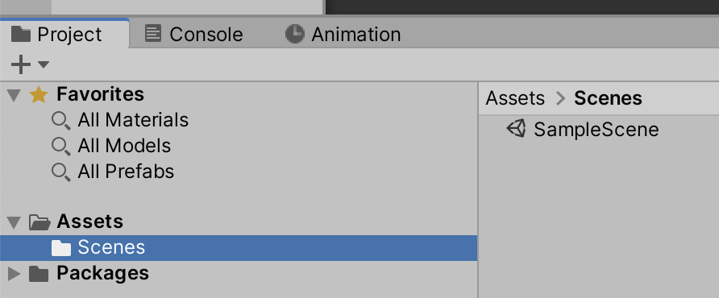
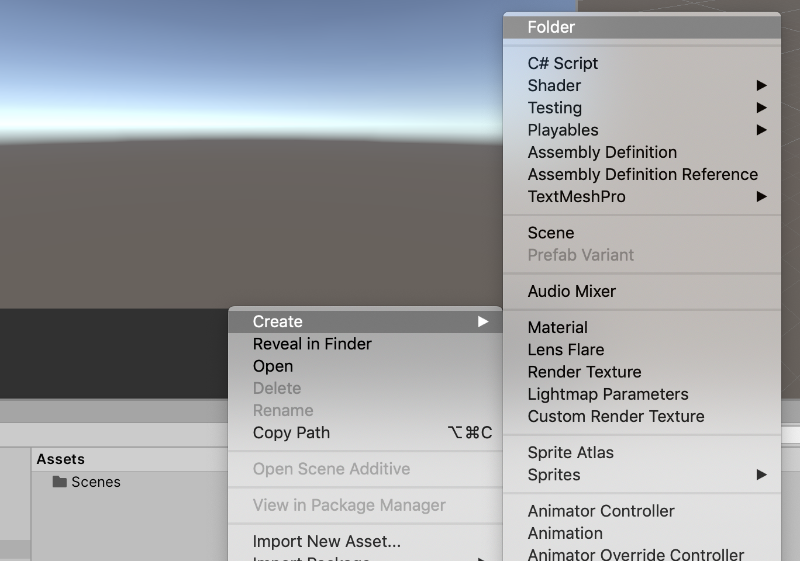
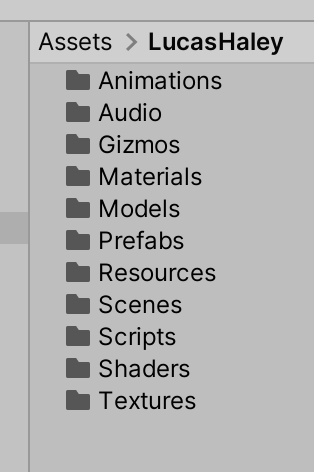

# Unit 00b: Project Setup <!-- omit in toc -->

- [Introduction](#introduction)
- [Goal](#goal)
- [Process](#process)
- [Wrap-Up](#wrap-up)
- [Further Material](#further-material)

## Introduction

The Project panel in Unity is a direct representation of your project's folder structure on the drive. So it has equivalency to the Explorer/Desktop -- if you move things in Unity's Project panel, they move on your drive too.

But more importantly, Unity has conventions -- expectations of which folders are in the Project panel. It's good to get into the habit of properly structuring your Project before you start any project.

## Goal

The goal of this unit is to set up our Project along the Unity conventions.

## Process

1. When you first create a new Unity project, your Project panel looks like this:

2. The first folder to make is for your project, or team. Right-click in the Project panel, and select **Create > Folder**.

Name this folder your name, without a space between given and surname. For example: `LucasHaley`. In future units, we'll refer to this folder as "your folder".

> When you start adding external codebases, they'll often be set up in similar ways. *If they're set up correctly*.

3. Inside your folder, we're going to set up the standard directories. Create a folder for each of the following:

- [ ] Animations
- [ ] Audio
- [ ] Gizmos
- [ ] Materials
- [ ] Models
- [ ] Prefabs
- [ ] Resources
- [ ] Scenes
- [ ] Scripts
- [ ] Shaders
- [ ] Textures

Your final setup should look something like:

> This is just a starting point. You'll often come across different ways of setting up your Project, often depending on the size of the project you're making.

## Wrap-Up

Keeping your assets organised is very important, and having a good starting organisation is critical. You should always be cleaning up your room!

## Further Material
- [Unity manual on Special Folders](https://docs.unity3d.com/Manual/SpecialFolders.html)