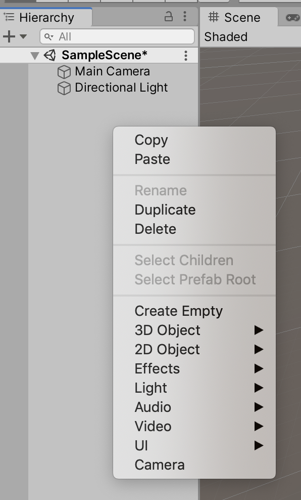
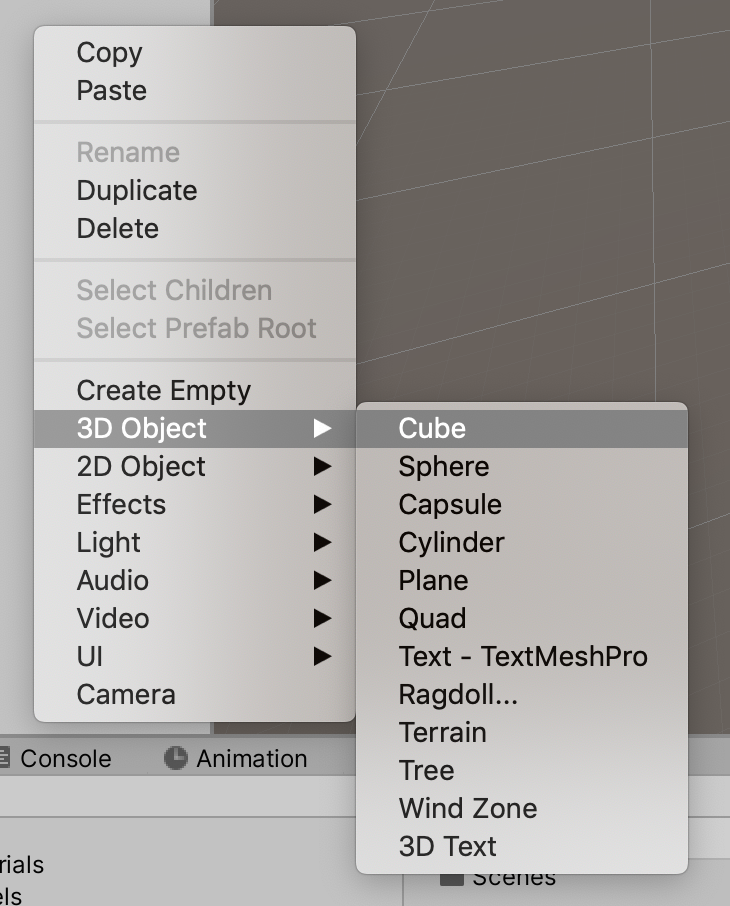
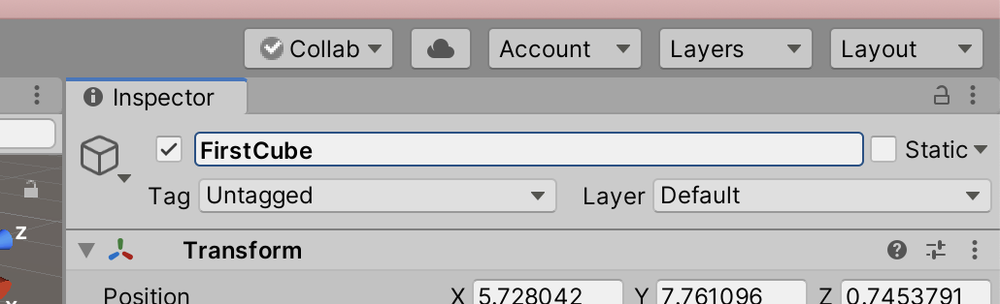

# Unit 01: Assets <!-- omit in toc -->

- [Introduction](#introduction)
- [Goal](#goal)
- [Process](#process)
  - [Creating simple geometry](#creating-simple-geometry)
    - [Manipulating the Cube](#manipulating-the-cube)
      - [Using the Manipulator Gizmo](#using-the-manipulator-gizmo)
      - [Using the Inspector Panel](#using-the-inspector-panel)
  - [Creating lights](#creating-lights)
- [Wrap-Up](#wrap-up)
- [Further Material](#further-material)

## Introduction

In Unity, the visual and audio elements of a game are called *Assets*. You can create simple assets from within Unity itself, and you can import assets from external sources. These assets will become the core of your gameplay.

## Goal

The goal of this unit is to learn how to create and import simple assets, and how to arrange them in the Hierarchy for best utility.

## Process

### Creating simple geometry

Unity has the ability to create simple geometric primitives. We'll be using these *a lot* during the course, so it's good to get to know how to make them.

1. Right-click in the Hierarchy panel, to bring up the contextual menu.

2. Choose **3d Object > Cube**.

3. While the cube is still selected, click in the name field in the Inspector panel, and change it's name to `FirstCube`.

4. All done!

> For our Top-down Shooter project, we'll start using a Cube for our player, and a Cylinder for enemies. We'll be making them a little more interesting as we go, but remember the game design truism -- **it needs to *work* more than it needs to look good**.

#### Manipulating the Cube

Now that we've made the cube, let's manipuate it. We can do this in two ways -- using the **Manipulator Gizmo**, or **numerically** in the Inspector panel.

> Make sure your cube is still selected.

##### Using the Manipulator Gizmo

1. 

##### Using the Inspector Panel

### Creating lights

Lights are made in the same way, but have different properties:

## Wrap-Up

## Further Material