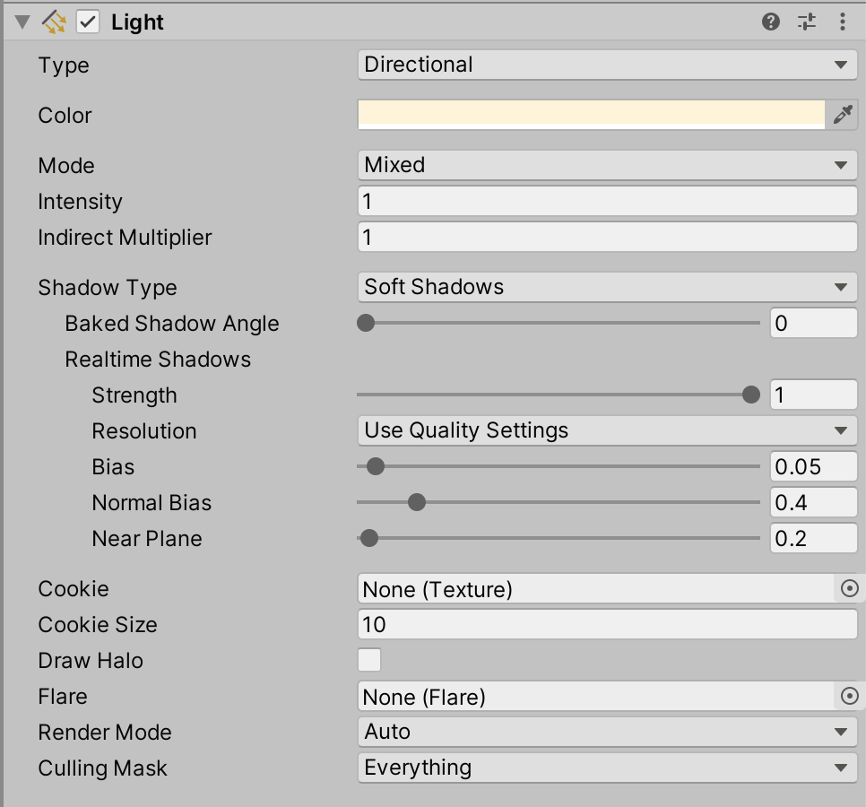

# Unit 01: Assets <!-- omit in toc -->

- [Introduction](#introduction)
- [Goal](#goal)
- [Process](#process)
  - [Creating simple geometry](#creating-simple-geometry)
    - [Manipulating the Cube](#manipulating-the-cube)
      - [Using the Manipulator Gizmos](#using-the-manipulator-gizmos)
      - [Using the Inspector Panel](#using-the-inspector-panel)
  - [Creating lights](#creating-lights)
- [Wrap-Up](#wrap-up)
- [Further Material](#further-material)

## Introduction

In Unity, the visual and audio elements of a game are called *Assets*. You can create simple assets from within Unity itself, and you can import assets from external sources. These assets will become the core of your gameplay.

## Goal

The goal of this unit is to learn how to create and import simple assets, and how to arrange them in the Hierarchy for best utility.

## Process

### Creating simple geometry

Unity has the ability to create simple geometric primitives. We'll be using these *a lot* during the course, so it's good to get to know how to make them.

1. Right-click in the Hierarchy panel, to bring up the contextual menu.

2. Choose **3d Object > Cube**.

3. While the cube is still selected, click in the name field in the Inspector panel, and change it's name to `FirstCube`.

4. All done!

> For our Top-down Shooter project, we'll start using a Cube for our player, and a Cylinder for enemies. We'll be making them a little more interesting as we go, but remember the game design truism -- **it needs to *work* more than it needs to look good**.

#### Manipulating the Cube

Now that we've made the cube, let's manipuate it. We can do this in two ways -- using the **Manipulator Gizmo**, or **numerically** in the Inspector panel.

> Make sure your cube is still selected.

##### Using the Manipulator Gizmos

1. Press the **W** key to activate the **Translate** manipulator gizmo. This tool allows you go move (translate) objects in 3d space. Grab one of the arrows to move along that axis, or one of the mini-cube planes move along two axes.

> With all of the manipulator gizmos, the axes are coloured following the RBG convention, where RGB = XYZ.

2. Press the **E** key to activate the **Rotation** manipulator gizmo. The coloured arcs allow you to rotate along those axes, but you can also grab anywhere within the gizmo to free rotate.

3. Press the **R** key to activate the **Scale** manipulator gizmo. Each coloured cube allows you to scale along that axis, and the center grey mini cube scales along all axes.

> You can constrain rotation to 15-degree increments by holding down the **Control/Command** key while rotating.

> Scaling your objects is a very expensive, when it comes to performance. When you're making games for real, you will hardly ever scale your objects in-engine; instead you'll scale it in your 3d model editor (e.g. Maya).

1. You can use all of the gizmos together by pressing the **Y** key.

> There are two different frames of reference in the Unity 3d world: **World** space and **Local** space. World space is absolute, and is directly related to the overall axes and scale of the world. Local space is relative to the selected object.
>
> You can flip between the two frames of reference using the button at the top of the UI:
>
> 
>
> We'll see more about how this works in the next unit, but for now we can see a simple difference by:
>
> 1. Select the cube, and rotate it an arbitrary amount.
> 2. Select the Translate gizmo (the W key).
>
> If the button is in **Local** space, the translate arrows align with the cube. If the button is in **World** space, the transpate arrows align with the world.
> 
> 
>
> You'll be using both modes for different reasons, but it's also just important to know this is there.

##### Using the Inspector Panel

Usng the manipulator gizmos is intuitive and immmediate, but often does not have the precision needed in game development. A more precise method to manipulate objects is by using the Inspector panel.

The contents of the inspector panel is contextual, and changes with whatever you have selected. But in general, the inspector displays **Components**. A component is a chunk of functionality, usually related to one element of the object. The **Transform** component has all the information related to the position, rotation, and scale of an object.

But there are other components as well – our cube has a **Cube (Mesh Filter)**, a **Mesh Renderer**, and a **Box Collider**.

> It's key to conceptualise each of these Inspector sections as a separate Component. This will become more important once we start coding.

1. For now, we can adjust the Transform properties of our cube. Firstly, let's reset the cube back to zero by clicking the three dots at the top right of the Transform component, called the Component Menu.

And choose **Reset**.

> If your cube disappears, it's probably just out of the Scene window frame. Double-click on the Cube in the Heirarchy to focus on it again.

2. Now we can edit the values, and move/rotate/scale the Cube as needed.

> You can also put your mouse cursor over one of the value titles, and click-drag to change the values.

### Creating lights

Lights are made in the same way, but have a different **Light** component:

The **Type** dropdown is the most important setting here, as it will change the type of light created.

> Unity is not great with lights, and cannot have too many lights in a given scene.

## Wrap-Up

Unity has the ability to create many different types of assets within the engine itself. For this project, we will mainly be concerned with:

- Cube
- Sphere
- Cylinder
- Capsule
- Plane
- Light
- AudioSource

And over the following weeks we'll be looking how each are made and manipulated.

## Further Material