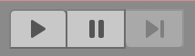
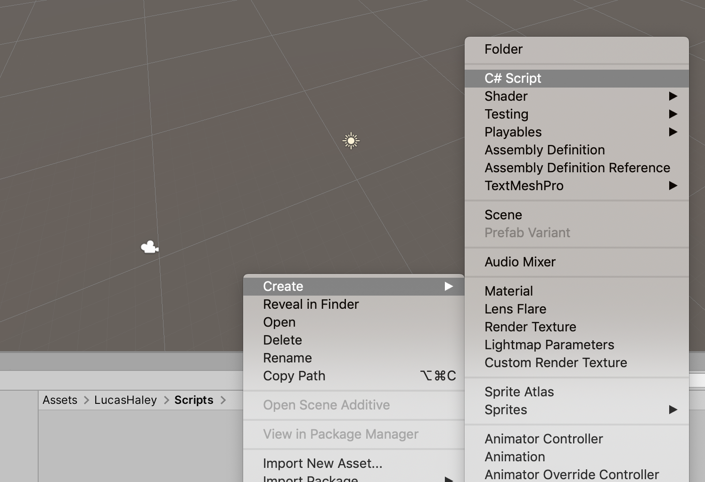
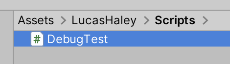
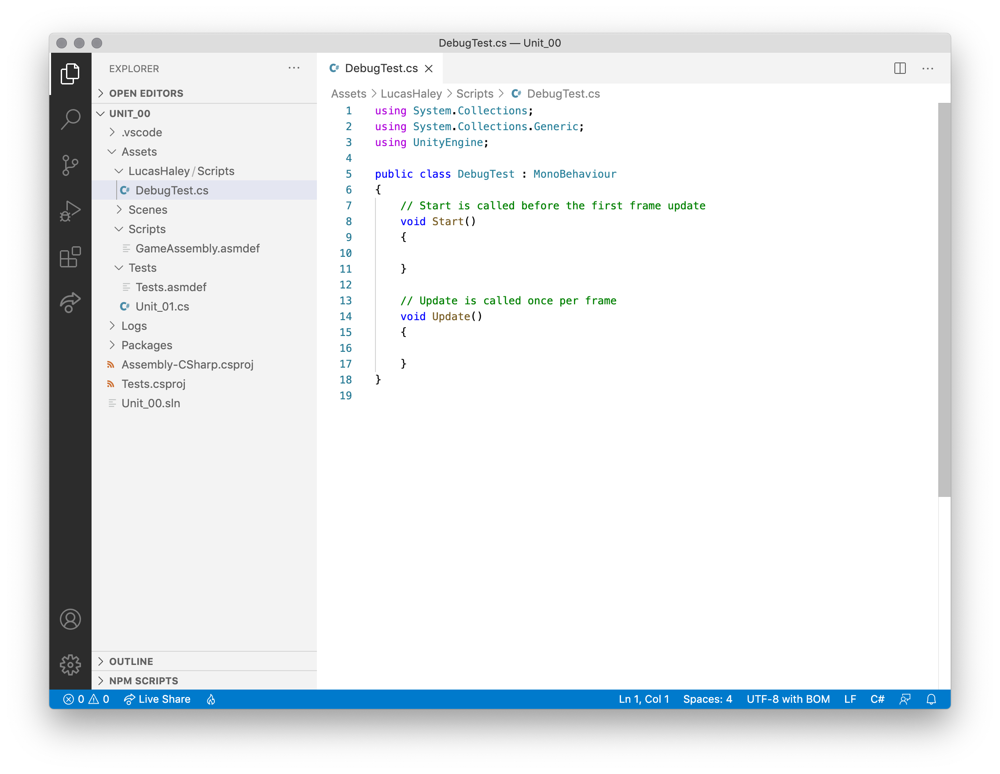
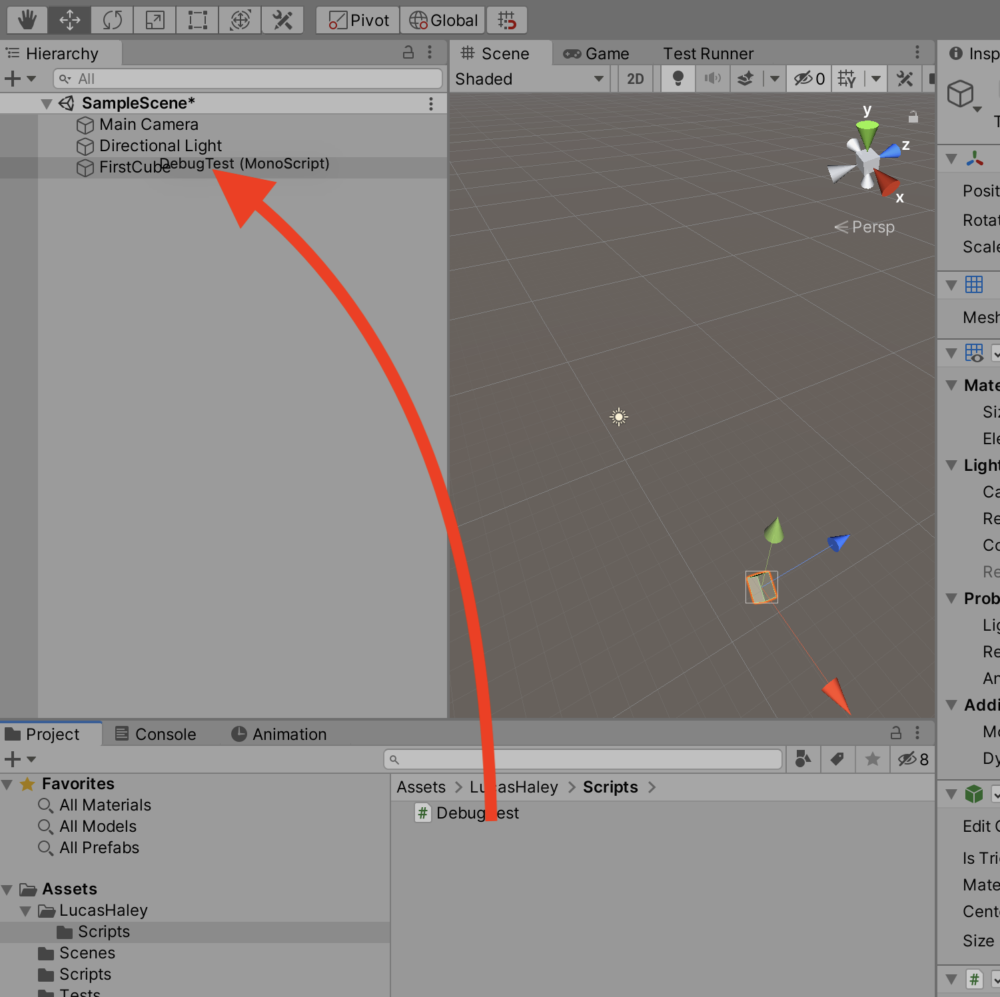
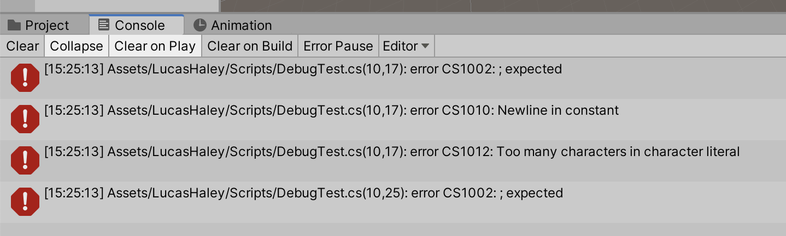
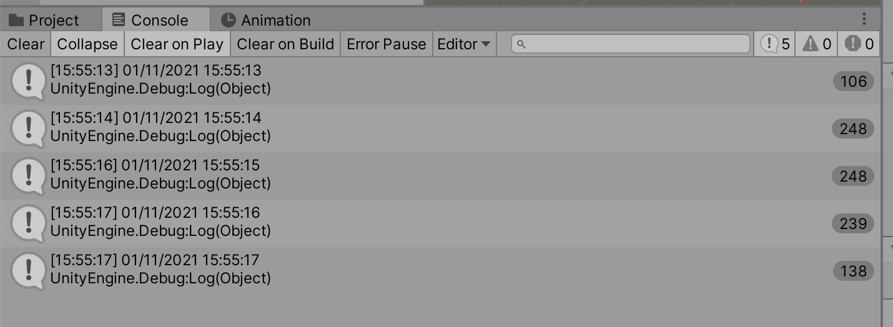

# Unit 02: Playing and Debugging <!-- omit in toc -->

- [Introduction](#introduction)
- [Goal](#goal)
- [Process](#process)
  - [Playing the game](#playing-the-game)
  - [Editing during play](#editing-during-play)
  - [Debugging using the console](#debugging-using-the-console)
- [Wrap-Up](#wrap-up)
  - [Take Home 2.1: Debug.Log](#take-home-21-debuglog)
- [Further Material](#further-material)

## Introduction

Games are meant to be played! So, as developers, we need to play our games. But we also need to be able to figure out the problems in our games –– to test and "debug" them. This unit is all about testing and debugging.

## Goal

The goal of this unit to to try the Unity play mode, and learn different techniques and issues around debugging our work. To do so, we'll also create our first script.

## Process

### Playing the game

As we saw in [Unit 00](00_Orientation.md), Unity has a **Playmode** toggle at the center top of the user interface:



1. Press the Play button. Note that it turns blue, the UI darkens, and focus automatically switches to the **Game** panel.


2. Select the `FirstCube` from the Hierarchy panel. Note that the inspector panel changes to show the Cube properties.
3. Change the Position values to zero, and note how the cube centers on the Game panel screen.
4. Click on the Position's X label, and drag left and right. Note how the cube moves left and right. Make sure to check how your position values change in the Inspector.

> Note how when Playmode is on, you **cannot** select anything in the Game panel.

5. To exit the Playmode, click on the blue Play button.

> Note that this button is a *toggle*, which means the same buttons turns it on and off. We'll see what the Pause button does shortly.

6. With the Playmode turned off, note how the Position values for the cube return to the pre-play values.

> When the Playmode is on, any edits you make to variables *do not get saved* when you turn the Playmode off. Remember this!

### Editing during play

As we saw in the last section, you can edit most of the values for objects during play. This is a critical element to game development –– playtesting. No game ever was made perfectly on the first pass. Playing, tweaking, playing again.

When we start making our game elements, we'll be tweaking speeds, damage, mass, etc. using this mode.

And remember that the values aren't saved, so make sure you've got a pad of paper nearby!

### Debugging using the console

Now we'll take a look at how we can use testing to track our scripts and discover errors in our code. We'll be making our first script!

> If you've never coded before, *do not worry*. We'll be going pretty slowly. Ask for help if you need it –– that's why we're here!

1. Navigate to the Scripts folder in your named folder in the Project panel, and in the contextual menu select **Create > C# Script**.



> Make sure you're in the correct folder! You can move the script later, but it's easier to start in the correct place.

2. *While the new script is still selected*, rename it `DebugTest`.



> If you type in the wrong name, it's probably easier to delete the script and try again. The reason for this is that the name of the file is also used in the script, and if you just rename the file without changing the text in the script, the script will fail.

3. Double-click on the new file, and the script editor will open.



By default, every new Unity script starts with this boilerplate code:

```C#
using System.Collections;
using System.Collections.Generic;
using UnityEngine;

public class DebugTest : MonoBehaviour
{
    // Start is called before the first frame update
    void Start()
    {
        
    }

    // Update is called once per frame
    void Update()
    {
        
    }
}
```
We'll go into more detail about what this all means in a future unit. For now we're going to just add some text to see how Unity handles scripts.

To start with, we'll make a mistake!

4. On line 10, type the following:

```C#
    // Start is called before the first frame update
    void Start()
    {
        This won't work.
    }
```
5. Switch back to Unity. We'll now need to add the script to the game, by dragging it from the Project panel onto the FirstCube object in the Hierarchy panel:



6. Try pressing the play button –– you'll find that you can't play, and you'll get the following errors in your Console panel:



You'll be getting these **a lot**, so let's understand them.

- After the timestamp, the first part of the line, `Assets/LucasHaley/Scripts/DebugTest.cs`, tells you which script has the problem.
- The second part, `(10,25)`, tells you which **line** and **character** has the problem. This isn't always exactly correct all the time, but usually it's a good indicator around where things do wrong. As you know, our problem is on line 10.
- The last part, `error CS1002: ; expected` gives you an idea of what the issue might be. In this case, it's looking for a semicolon at the end of every script command. The semicolon is called the **terminator**, and you'll need it at the end of every line.

> A handy tip: you can double-click on an error in the Console panel, and Unity will try to open that script and put the cursor at the right line.

6. Let's stop that line from breaking the script. In code, we can make code ignored by turning it into a comment. We'll talk more about comments later, but for now, add `// ` to the start of line 10.

```C#
    // Start is called before the first frame update
    void Start()
    {
        // This won't work.
    }
```
You'll see the line change colour. It now won't work in the game -- when you go back to Unity, those errors disappear.

Now let's do something that actually works!

7. On line 16, add the following line:

```C#
    // Update is called once per frame
    void Update()
    {
        Debug.Log(System.DateTime.Now);
    }
}
```

> Make sure you include the semicolon!

This line introduces the method `Debug.Log`. This is a super useful method that allows us to output text into the console. We can use it to check values, keep track of where we are in the code, and other uses. We'll be using it a bunch!

> System.DatTime.Now is a property that gives us the current date and time. We're just using it for something to output.

When you return to Unity –– and if you have no errors –– you should be able to press the Play button. Let it play for a bit, then hit the Pause button. In your Console, you should see something like:



You'll see the date and time you ran the game. Over on the right hand side of the panel, you might see a little oval with a number -- that's how many times that line was run. So for me, my game was running that line about 240 times per second.

You can click on the **Collapse** button to toggle if your console shows each time a Debug.Log is run, or if it combines similar output into one line.

## Wrap-Up

In this unit we took a look at how Unity handles playing out game, and how we can start to debug our code for errors. We'll be looking a lot more into coding and debugging throughout the course.

### Take Home 2.1: Debug.Log
If you're ever having issues with your code, you can use `Debug.Log` to show what's going on under the hood.

## Further Material

- [Unity Manual on the Console panel](https://docs.unity3d.com/Manual/Console.html)