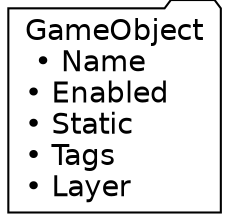
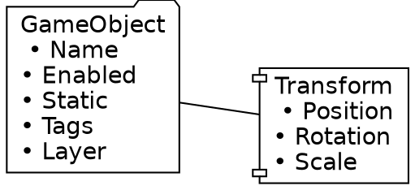
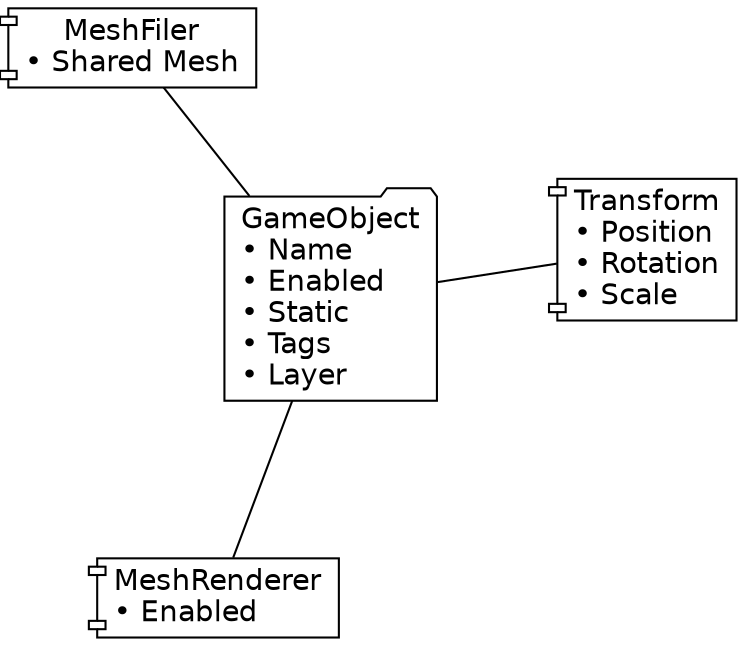
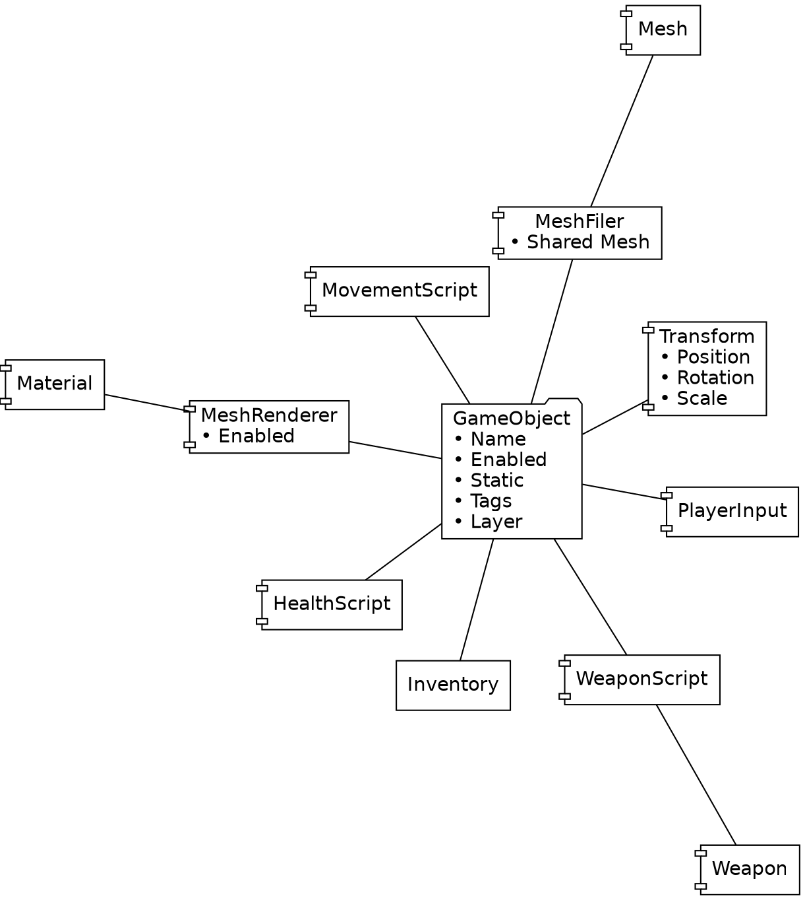

---
markdown:
    image_dir: images
    path: 02b_GameObjects.md
    ignore_from_front_matter: true
    absolute_image_path: false
---

# Unit 02_02: GameObject  <!-- omit in toc -->

- [Introduction](#introduction)
- [Goal](#goal)
- [Process](#process)
- [Wrap-Up](#wrap-up)
- [Further Material](#further-material)

## Introduction

There are certain parts of Unity that are so important, they justify their own unit. This is the case for **GameObjects**.

## Goal

The goal of this unit is to introduce the concept of the Unity GameObject.

## Process

*Everything* that is in your Hierarchy is a GameObject. It's the fundamental object that Unity uses to interact with the core game engine.

GameObjects offer some basic functionality, including important variables:

- `name`
- `layer`
- `tag`
- `activeSelf` (read only)

And some methods:

- `SetActive`
- `GetComponent`
- `Find`
- `FindWithTags`

We'll be using all of these during these units.

Here's a visual representation of a GameObject:

The magic of GameObjects happen with **Components**. Components are extra bits of functionality/code that you can arbitrarrily attach to a GameObject. Every section in the Inspector panel is a separate Component.

By default, every GameObject has one Component added automatically: the **Transform** component, that defines the GameObject in the 3d space:

We'll be adding more and more Components to our gameObjects, some of which we'll create ourselves!

When you created a new cube, you actually created a new GameObject, with a Cube MeshFilter and a MeshRenderer component attached:

And soon you'll end up with GameObjects that might look like:

Later, we'll take a look at how to access these components using `GetComponent`.

## Wrap-Up

Understanding the GameObject is critical to success in game development. This pattern exists in pretty much every game engine (Pawns in Unreal, etc).

## Further Material
- [GameObject in Unity manual](https://docs.unity3d.com/ScriptReference/GameObject.html)
