# Unit 03_01: Player Input <!-- omit in toc -->

- [Introduction](#introduction)
- [Goal](#goal)
- [Process](#process)
  - [Create a new scene](#create-a-new-scene)
  - [Create a floor](#create-a-floor)
  - [Create the player](#create-the-player)
  - [Set the camera](#set-the-camera)
  - [Get player input, part 1](#get-player-input-part-1)
  - [Challenge 1](#challenge-1)
  - [Moving the player, part 1](#moving-the-player-part-1)
  - [Get player input, part 2](#get-player-input-part-2)
  - [Moving the player, part 2](#moving-the-player-part-2)
- [Wrap-Up](#wrap-up)
  - [Take Home 3.1: GetAxis](#take-home-31-getaxis)
  - [Take Home 3.2: Screen vs World Space](#take-home-32-screen-vs-world-space)
  - [Take Home 3.3: Expose Choices](#take-home-33-expose-choices)
- [Further Material](#further-material)

## Introduction

Alright! This unit we're going to start *actually making the game*. Exciting! This is going to be a major chunk of work.

## Goal

In this unit we will make a player object in our game world, and write code to move that object around. Through this process we'll learn how scripts can manipulate components, and how we can get user input.

## Process

### Create a new scene

Let's start with a blank slate for this project.

1. In the Project panel, navigate to your folder, and the **Scenes** folder within.
2. Right-click in the panel, and in the contextual menu select **Create > Scene**.

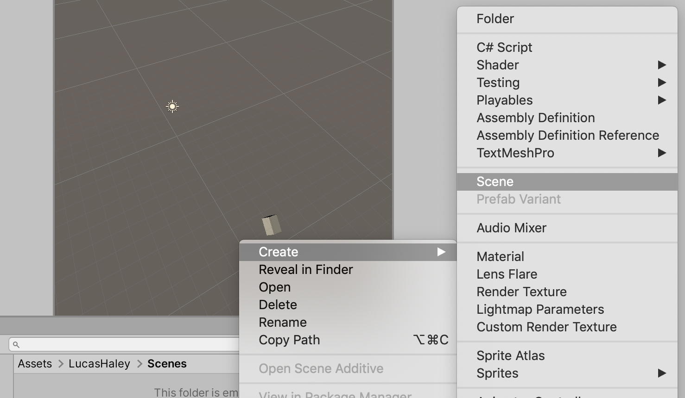

3. Rename the scene `Level_00`, and double-click on the scene to open it.

> You might be asked to save your current scene. You should.

### Create a floor

We'll create a temporary floor for our player to play on.

1. Right-click in the Hierarchy panel, and select **3D Object > Plane**.
2. Just to be sure, let's set this GameObject's position to zero. Click on the component menu on the Transform component, and select **Reset**.

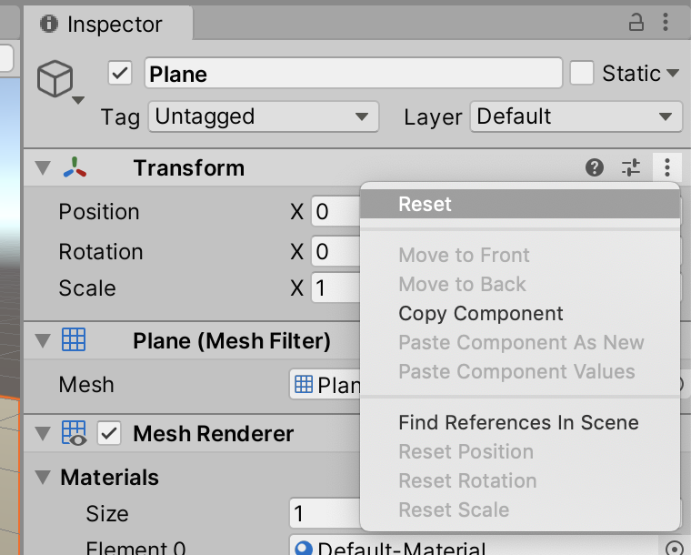

### Create the player

Before we get to coding, let's make a player object.

1. In the Hierarchy panel, right-click and select **Create Empty**. Rename this object to `Player`.

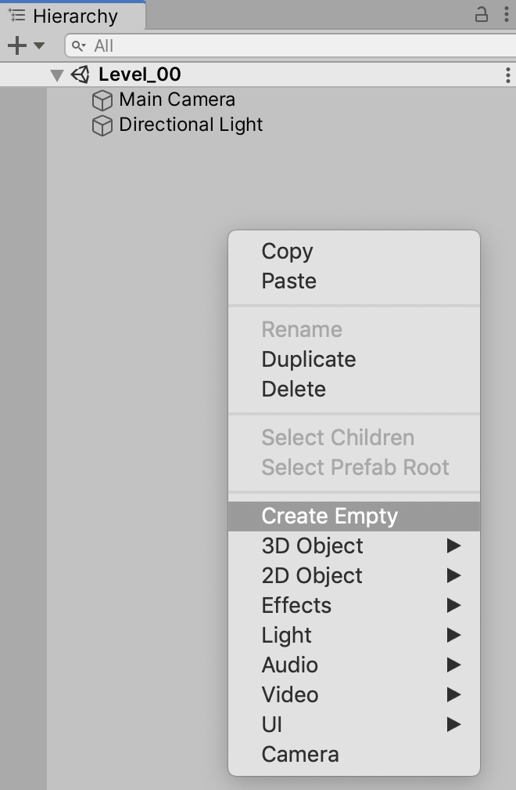

2. Just to be sure, let's set this GameObject's position to zero. Click on the component menu on the Transform component, and select **Reset**.

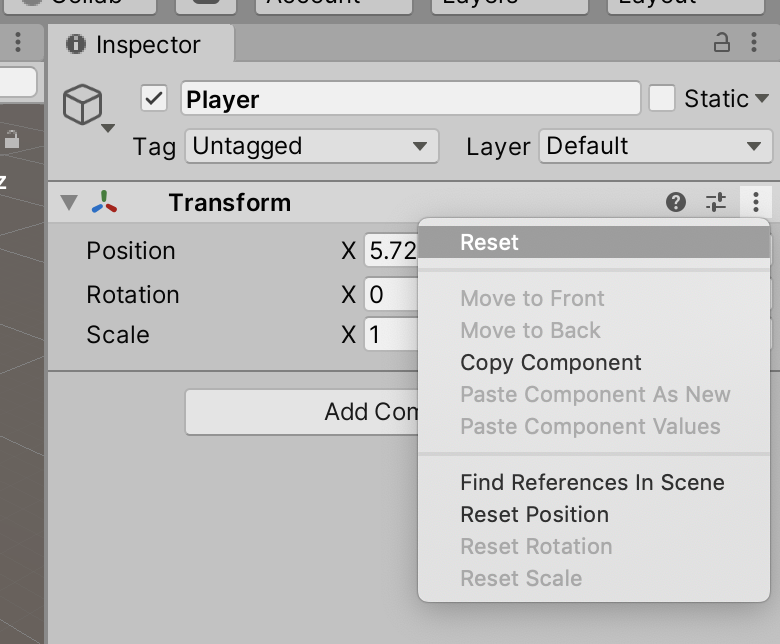

3. Right-click on the Player GameObject, and select **3D Object > Cube**.

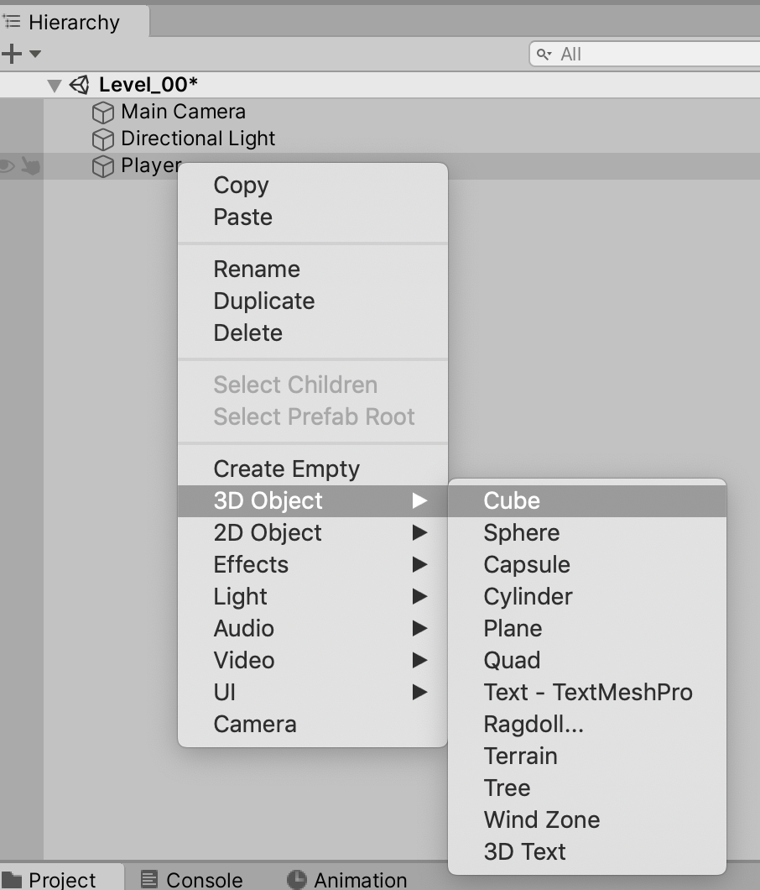

4. The pivot/position of this cube is in the middle of the cube, so to get it sitting on the floor, we need to set it's position to `0, 0.5, 0`.

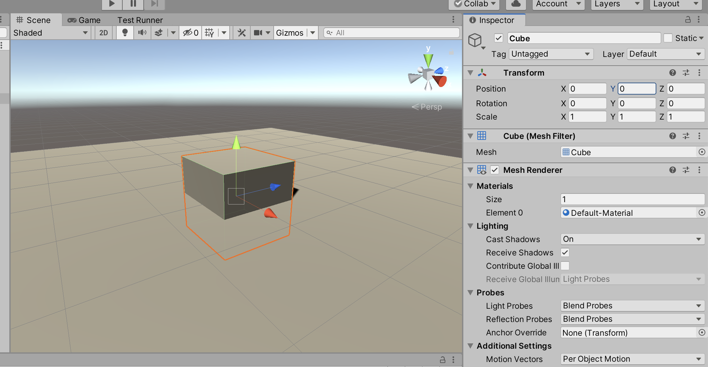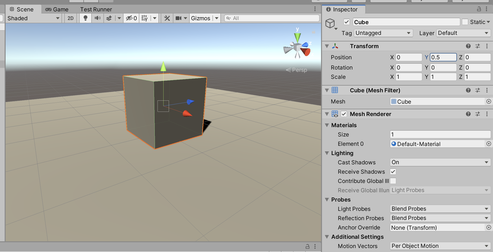

5. Next, we need a gun barrel (which will incidentally help us know which is the front direction). Right-click on the Cube, and select **3D Object > Cube** to create a child cube. Rename it `Barrel`, and set it's transform properties to:

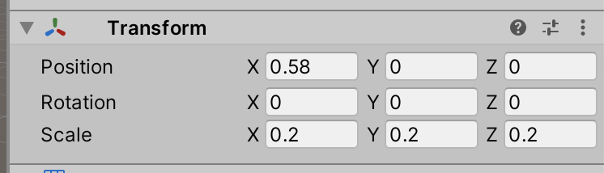

6. You should now have a player that looks like this:

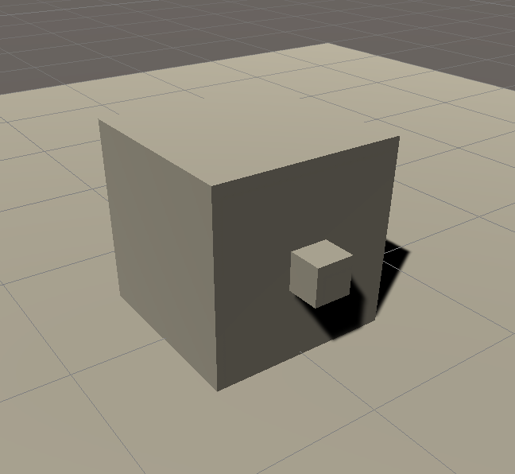

and a Hierarchy panel that looks like:

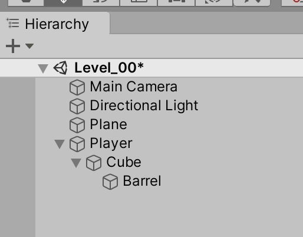

7. Lastly, let's mark this gameObject as being the player. We do this by assigning the Player **Tag**:

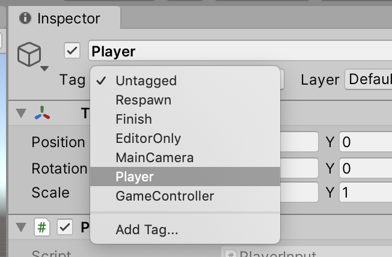

### Set the camera

When you start the playmode, your game will look like this:

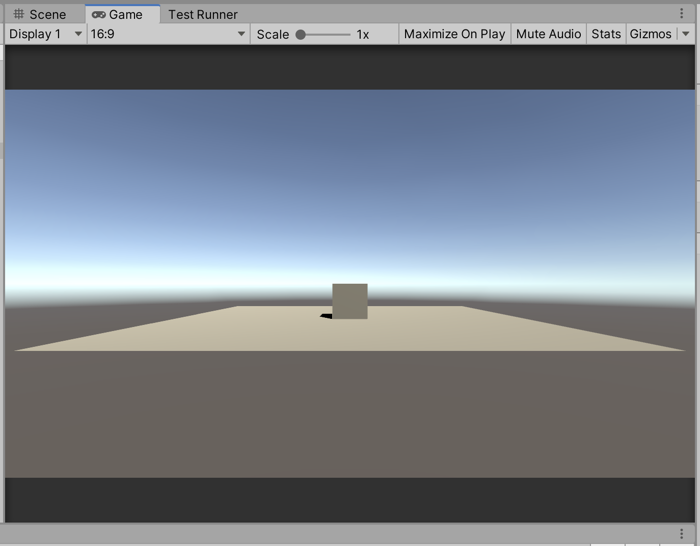

And that's no top-down shooter. Let's set the camera.

1. Select the `Main Camera` from the Hierarchy.
2. Change the Transform values to:

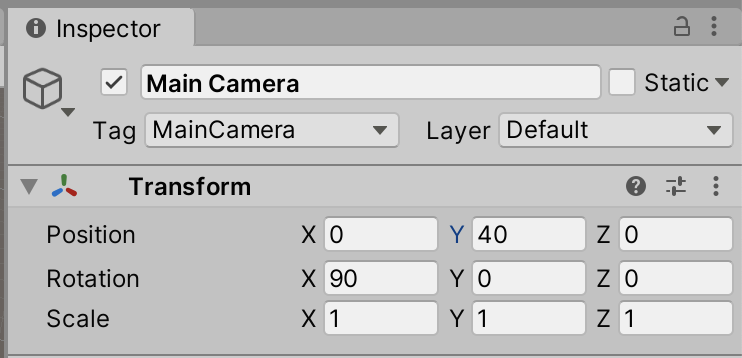

3. The Game panel should look something like this:

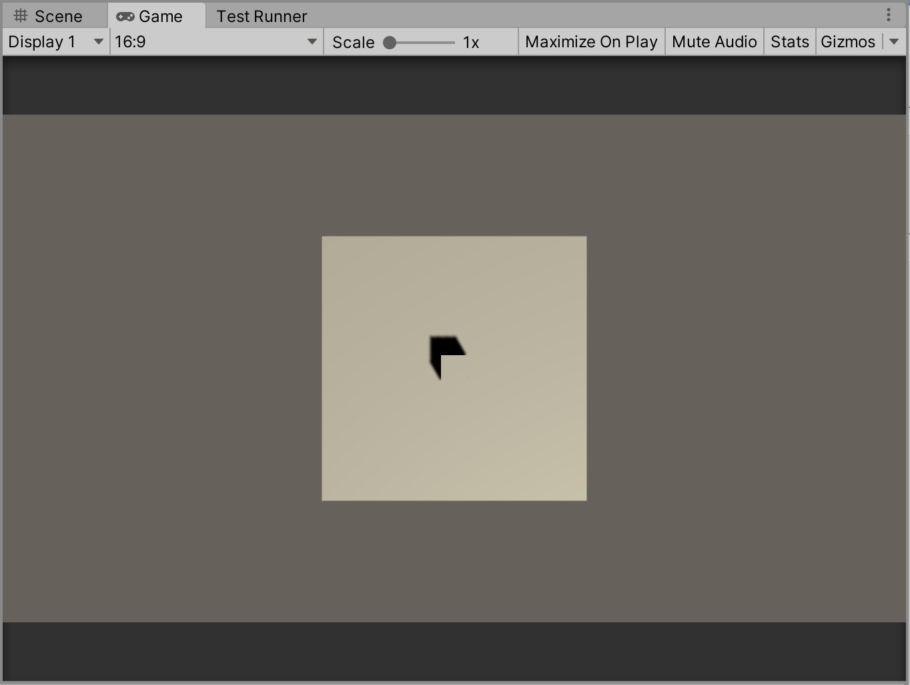

It might not be obvious from this, but we're currently using a *perspective* camera, which means parallel lines converge as they recede. For this game, we'll be using an *orthographic* camera, which makes parallel lines stay parallel.

> Feel free to change this, and any camera values, as you develop your game.

In the **Camera** component of the `Main Camera` object, change the **perspective** value to **orthographic**.

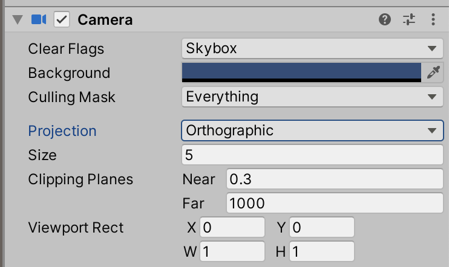

The Game panel should now look like:

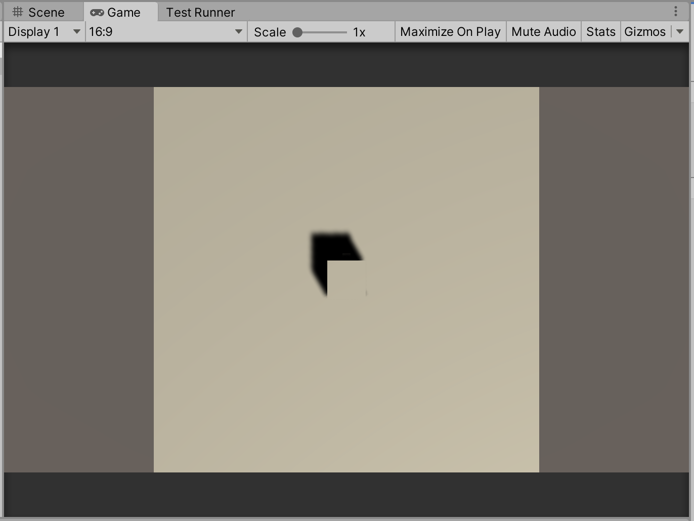

### Get player input, part 1

The next step is to get the input from the player. We'll start with grabbing keyboard input, using the standard WASD keys for player movement.

1. In the Project panel, navigate to your Scripts folder. Right-click in the Project panel, and create a new script. Name it `PlayerInput`.

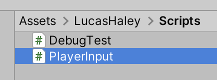

2. Drag the new script onto the `Player` GameObject in the Hierarchy panel.

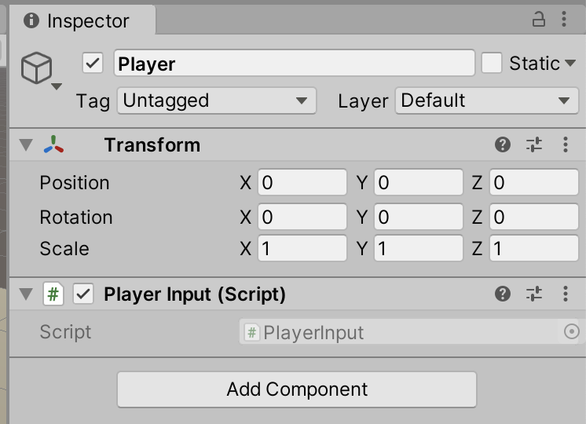

3. Open the script in the script editor.
4. Once again, you'll have the basic boilerplate code:

```C#
using System.Collections;
using System.Collections.Generic;
using UnityEngine;

public class PlayerInput : MonoBehaviour
{
    // Start is called before the first frame update
    void Start()
    {

    }

    // Update is called once per frame
    void Update()
    {

    }
}
```

5. To get the player input, we'll be using the Unity Input system.

> The Unity Input system is currently going through a major update. We'll be using the legacy input system.

The input system defines **axes** that you can use to collect player input. By default, Unity gives you things like **Horizontal**, **Vertical**, **Fire1**, **Jump**, and the like. To see the default options (or to add your own, which we'll do later) use the **Edit > Project Settings…** menu, and choose **Input Manager** from the left-hand list. You may need to click on the Axes disclosure triangle.

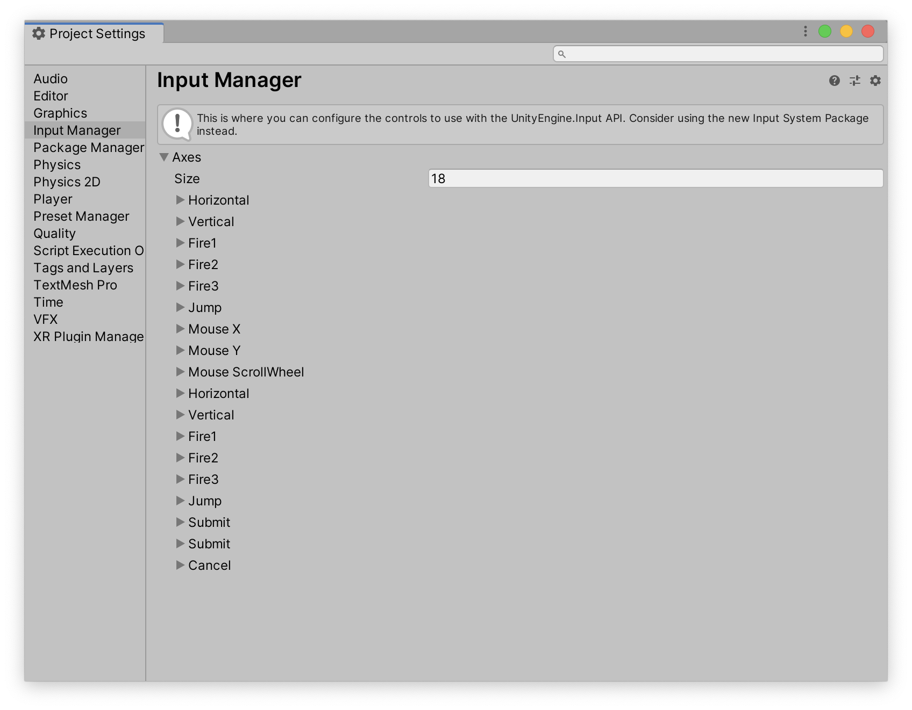

In the `Update` method, called every frame, we'll be checking if the player has pressed any of the movement buttons. Let's just make sure we can get it, by sending it to the console.

Add the following lines:

```C#
    // Update is called once per frame
    void Update()
    {
        Debug.Log(Input.GetAxis("Horizontal"));
    }
```
6. Play the game. When you press either **A** or **D** (or either the **right** or **left** arrows), the console should show output. Stop the game, and return to the script.
7. Now that we know we can get the player keyboard input, let's save it to use it later. To do so, we're going to create a **variable** to store the input value.

> Notice how the `Input.GetAxis` method returns a *number*, specifically a number between 0 and 1. It may seem weird to have a keystroke return a number, but each axis can also come from joysticks or mouse movement. We'll see how that works later.

Numbers can either be an **int** (any whole number), or a **float** (a number with decimal values). Because our input is 0-1, we need a float. Type this into your script:

```C#
public class PlayerInput : MonoBehaviour
{
    public float horizontalInput;

    // Start is called before the first frame update
```

and update your `Update` method to look like this:

```C#
    // Update is called once per frame
    void Update()
    {
        // Debug.Log(Input.GetAxis("Horizontal"));
        horizontalInput = Input.GetAxis("Horizontal");
    }
```

and save the script.

> When you return to Unity, your PlayerInput component on the Player will have a new property:
> 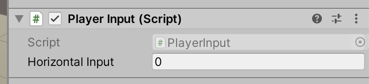
> Now, when you play the game, that property shows our input!

8. Sometimes we'll want to allow the game designers to edit values in the editor, but not this value. It's purely input only, so let's make sure our editor doesn't see it. Update your line to be:

```C#
public class PlayerInput : MonoBehaviour
{
    private float horizontalInput;

    // Start is called before the first frame update
```
And it should disappear from the editor.

### Challenge 1
We'll need to get the vertical input (the **W** and **S** keys), so have a crack at adding that code. Hint: you'll need to add two lines of code.
<details>
<summary>Challenge 1 solution</summary>

```C#
using System.Collections;
using System.Collections.Generic;
using UnityEngine;

public class PlayerInput : MonoBehaviour
{
    private float horizontalInput;
    private float verticalInput;

    // Start is called before the first frame update
    void Start()
    {

    }

    // Update is called once per frame
    void Update()
    {
        // Debug.Log(Input.GetAxis("Horizontal"));
        horizontalInput = Input.GetAxis("Horizontal");
        verticalInput = Input.GetAxis("Vertical");
    }
}
```
</details>

### Moving the player, part 1

We now have variables storing the player keyboard input each frame. We can use this data to move the player.

> We'll be looking at many different ways of moving things, but to start with we're going to use a simple `Transform` call.

1. Open the `PlayerInput` script.
2. After we collect the player input, we can apply it to the **transform** component –– which, if you remember, is where the position data is stored.
> Looking at the Unity documentation, we can see that the `Translate` method takes three inputs (and an optional fourth):
>
> `public void Translate(float x, float y, float z, Transform relativeTo);`
>
> In this case, we'll only need the x and z. The y value would make the player move towards and away from the camera, which we do not want.

Add the following line:

```C#
    // Update is called once per frame
    void Update()
    {
        // Debug.Log(Input.GetAxis("Horizontal"));
        horizontalInput = Input.GetAxis("Horizontal");
        verticalInput = Input.GetAxis("Vertical");

        transform.Translate(horizontalInput, 0f, verticalInput);
    }
```

And head back to Unity to see if it works.

3. Alright, we have movement! It's a little quick, and out of control. There are two things we need to do to control this movement better. The first is to decouple this speed from the speed of the computer.

> Remember that `Update` gets run every frame. So, the faster your computer, the more FPS you have. Which means more `Update`s in the same amount of time. So, the faster your hardware, the faster your player. That's not right.
>
> We can fix this by using the Unity property `Time.deltaTime`, which is the time elapsed since the last redraw.

In your code, change the following lines:

```C#
    // Update is called once per frame
    void Update()
    {
        // Debug.Log(Input.GetAxis("Horizontal"));
        horizontalInput = Input.GetAxis("Horizontal") * Time.deltaTime;
        verticalInput = Input.GetAxis("Vertical") * Time.deltaTime;

        transform.Translate(horizontalInput, 0f, verticalInput);
    }
```

4. The player is now a lot slower, but it's consistent across devices. Now let's control its speed using a variable. Add the following line to our variables:

```C#
public class PlayerInput : MonoBehaviour
{
    private float horizontalInput;
    private float verticalInput;
    public float translateSpeed = 10f;
```
> The `= 10f` allows us to assign a default value, and is optional.

As this is a `public` variable, when you get back to Unity, you should have a new property –– which the game designer can edit in-editor.

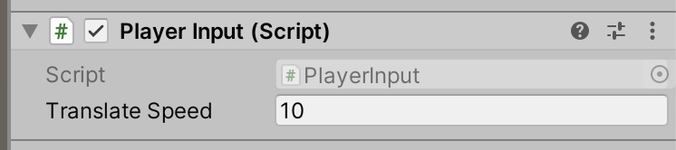

5. Now let's hook it up to the player:

```C#
    // Update is called once per frame
    void Update()
    {
        // Debug.Log(Input.GetAxis("Horizontal"));
        horizontalInput = Input.GetAxis("Horizontal") * Time.deltaTime * translateSpeed;
        verticalInput = Input.GetAxis("Vertical") * Time.deltaTime * translateSpeed;

        transform.Translate(horizontalInput, 0f, verticalInput);
    }
```
Head back to Unity, and have a go. Note that you can edit the speed directly in the editor, while the game is playing, and the speed updates immediately.

### Get player input, part 2

We've got the player moving using the keyboard. Now we're going to rotate the player using the mouse.

Unlike the player GameObject, the mouse cursor exists in a different context -- it exists in the flat 2-dimensional plane of the screen. So, unlike the game world, that has three (XYZ) coordinates, the mouse only has two -- XY. The space that the cursor lives in is called **Screen Space**, as opposed to **World Space** where the GameObjects live. We need to get the Screen space coordinates, and turn them into World space coordinates.

> This is one way of getting input from mouse position –– there are others. This method is not the strongest, but it will work fine for now. We'll take a look at **Raycasting** later.

1. Just like we did for keyboard input, the first thing we'll do is make sure we are getting input from the mouse. Add the following line to your code:

```C#
    // Update is called once per frame
    void Update()
    {
        // Debug.Log(Input.GetAxis("Horizontal"));
        horizontalInput = Input.GetAxis("Horizontal") * Time.deltaTime * translateSpeed;
        verticalInput = Input.GetAxis("Vertical") * Time.deltaTime * translateSpeed;

        transform.Translate(horizontalInput, 0f, verticalInput);

        Debug.Log(Input.mousePosition);
    }
```

And back in Unity, you should be getting mouse coordinates in screen space:

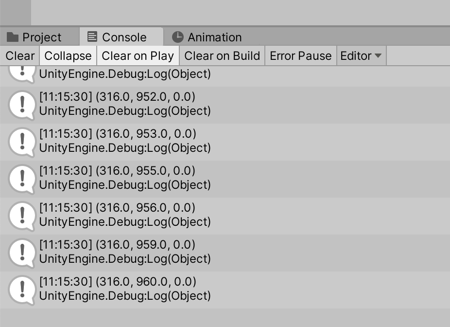

> Note how the coordinates are only in the XY axes, not Z. We're just getting the flat screen coordinates.

2. The next step is to convert those screen space coordinates into world space coordinates. The **Camera** component has a method to do just that –– but first, we need to tell Unity *which* camera we're using.

> You can have multiple cameras going at the same time in Unity. This can be useful for things like in-game closed-circuit cameras, or cool rendering tricks.

Click on the `Main Camera` object in the Hierarchy panel. If you check out the Inspector panel, in the GameObject section you can see it has the **MainCamera** tag:

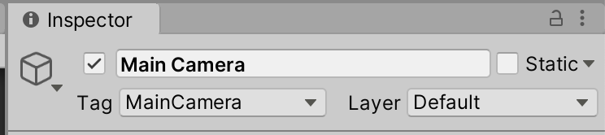

We can use this tag to get our camera. Comment out our previous line, and add this line to your code:

```C#
    // Update is called once per frame
    void Update()
    {
        // Debug.Log(Input.GetAxis("Horizontal"));
        horizontalInput = Input.GetAxis("Horizontal") * Time.deltaTime * translateSpeed;
        verticalInput = Input.GetAxis("Vertical") * Time.deltaTime * translateSpeed;

        transform.Translate(horizontalInput, 0f, verticalInput);

        // Debug.Log(Input.mousePosition);
        Debug.Log(Camera.main.ScreenToWorldPoint(Input.mousePosition));
```
Back in Unity, you should be getting world coordinates now:

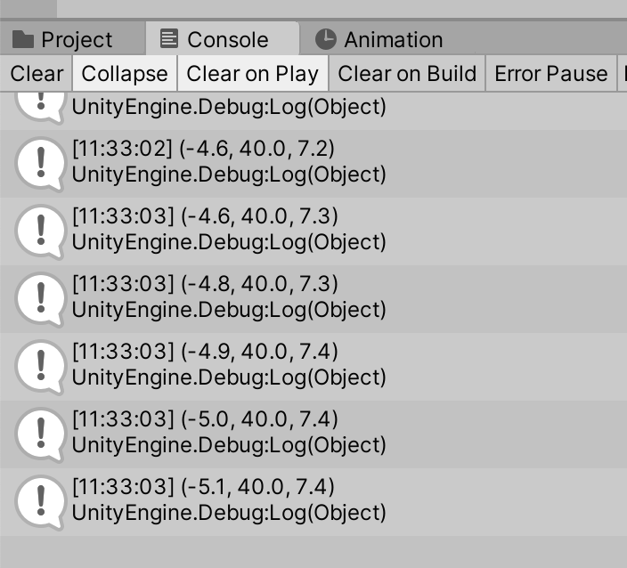

3. In the same way as we used `transform.Translate` for keyboard movement, we can use `transform.LookAt` to point our player at the mouse cursor. But first, let's save out the mouse position as a variable:

```C#
        // Debug.Log(Input.mousePosition);
        Debug.Log(Camera.main.ScreenToWorldPoint(Input.mousePosition));
        Vector3 mousePosition = Camera.main.ScreenToWorldPoint(Input.mousePosition);
```

Then we can point away using the variable:

```C#
        // Debug.Log(Input.mousePosition);
        Debug.Log(Camera.main.ScreenToWorldPoint(Input.mousePosition));
        Vector3 mousePosition = Camera.main.ScreenToWorldPoint(Input.mousePosition);
        transform.LookAt(mousePosition);
```

And try it in Unity.

> **UH OH**! We have a problem. The player is pointing upwards! In your console, you should see our Y value is consistently `40.0`. If you remember, this is the Y value we used for the Camera itself. So the method is working correctly -- it's making the player point at the mouse, which is floating 40 units above the ground!

4. Let's fix that. We're just going to do a hard fix and replace the Y value with zero. And we can also comment out the Debug line, we don't need it any more.

```C#
    // Update is called once per frame
    void Update()
    {
        // Debug.Log(Input.GetAxis("Horizontal"));
        horizontalInput = Input.GetAxis("Horizontal") * Time.deltaTime * translateSpeed;
        verticalInput = Input.GetAxis("Vertical") * Time.deltaTime * translateSpeed;

        transform.Translate(horizontalInput, 0f, verticalInput);

        // Debug.Log(Input.mousePosition);
        // Debug.Log(Camera.main.ScreenToWorldPoint(Input.mousePosition));
        Vector3 mousePosition = Camera.main.ScreenToWorldPoint(Input.mousePosition);
        mousePosition.y = 0f;
        transform.LookAt(mousePosition);
    }
```

### Moving the player, part 2

Now that we have translation and rotation for the player, have go moving around. Does it feel right? Pay special attention to how the player moves when you've rotated. When the player is pointing down, pressing the up key makes it move further down. This motion is called **relative** motion, and we get it because in our move code we use the default settings for `transform.Translate`. To quote the Unity reference: "If `relativeTo` is left out or set to `Space.Self` the movement is applied relative to the transform's local axes."

The alternative motion is **aboslute** motion, in which the up key always moves the player upwards, no matter its rotation.

If you want the up key to always move the player up, we'll need to change the  `transform.Translate` method. But we can do something a bit better -- we can make the choice for relative or absolute motion available in the editor, for the game designer to choose.

1. First, we'll make a checkbox toggle in the editor. In your code, add the following line:

```C#
public class PlayerInput : MonoBehaviour
{
    private float horizontalInput;
    private float verticalInput;
    public float translateSpeed = 10f;
    public bool useAbsoluteMotion;

    // Start is called before the first frame update
```

And note how back in Unity, we now have a checkbox:

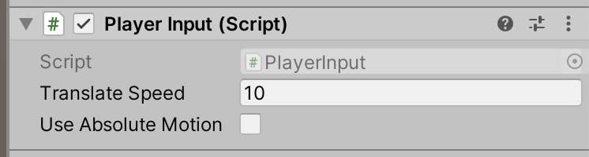

2. Now we can use that boolean value, and an `if` statement, to switch between the two types of motion. First, let's set up the `if` statement:

```C#
    // Update is called once per frame
    void Update()
    {
        // Debug.Log(Input.GetAxis("Horizontal"));
        horizontalInput = Input.GetAxis("Horizontal") * Time.deltaTime * translateSpeed;
        verticalInput = Input.GetAxis("Vertical") * Time.deltaTime * translateSpeed;

        // check if we use absolute or relative motion
        if (useAbsoluteMotion)
        {
            // use absolute
        } else {
            // use relative
            transform.Translate(horizontalInput, 0f, verticalInput);
        }
```
When you play the game now, it still works normally. But if you check the checkbox, the player stops moving –– that part of the `if` statement is still empty.

3. The Unity documentation says we can also use `Space.World`. Let's do that! Add the following line:

```C#
        // check if we use absolute or relative motion
        if (useAbsoluteMotion)
        {
            // use absolute
            transform.Translate(horizontalInput, 0f, verticalInput, Space.World);
        } else {
            // use relative
            transform.Translate(horizontalInput, 0f, verticalInput);
        }
```

Try your game with both types of movement, and decide which one you want to use for this project.

## Wrap-Up

We've started building the game proper now, ending up with the start of a player that moves when responding to player input.

### Take Home 3.1: GetAxis
To respond to keystrokes, use `Input.GetAxis`. You can also use `Input.GetKey`, but that hardcodes your keystroke.

### Take Home 3.2: Screen vs World Space
To respond mouse movement, you need to convert from `Space.Screen` to `Screen.World` before using its position data. You can also use `Raycast` as we will see later.

### Take Home 3.3: Expose Choices
Consider exposing design choices to the editor, so the game designer can choose which gameplay options they want.

## Further Material

- Unity Manual on Input
- [Input.GetAxis reference](https://docs.unity3d.com/ScriptReference/Input.GetAxis.html)
- [Time.deltaTime reference](https://docs.unity3d.com/ScriptReference/Time-deltaTime.html)
- [Transform.Translate reference](https://docs.unity3d.com/ScriptReference/Transform.Translate.html)
