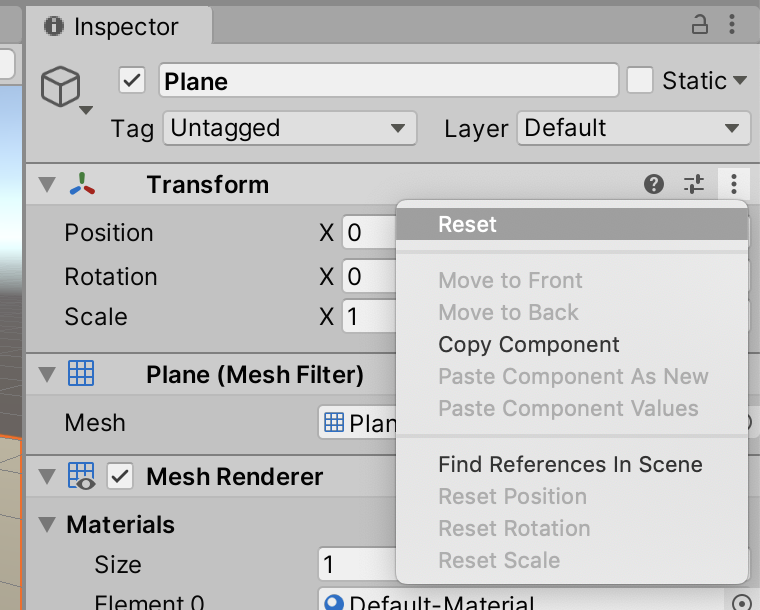
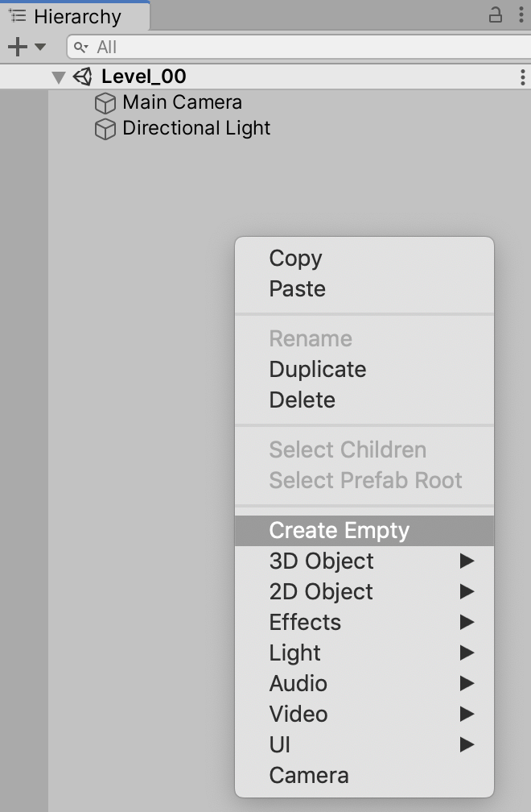
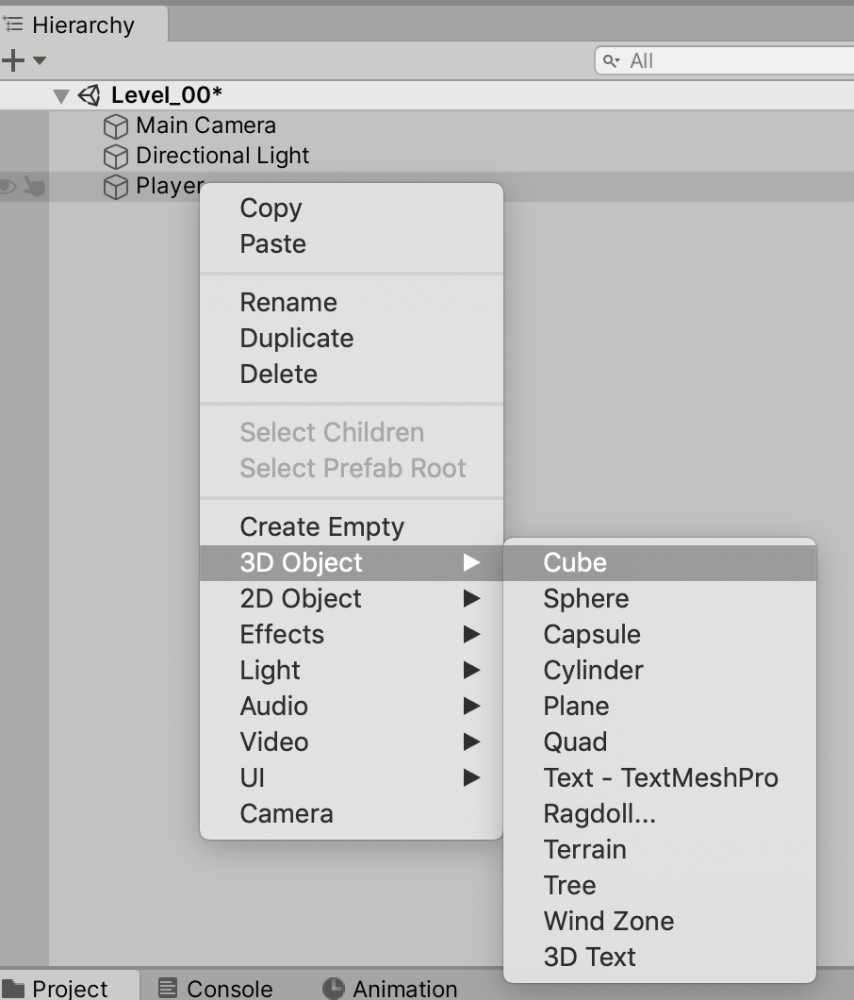
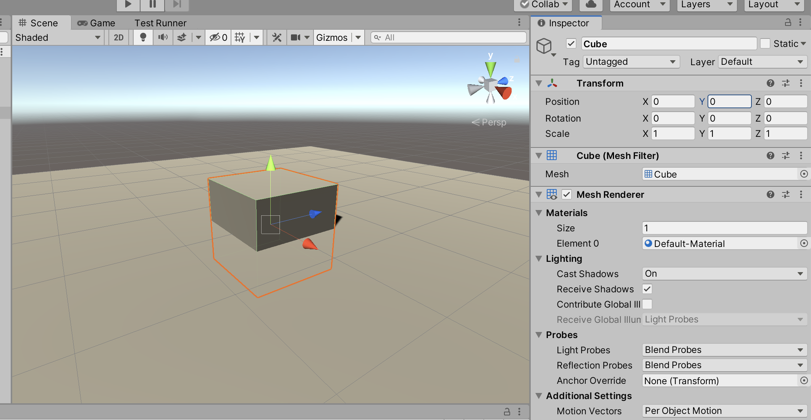
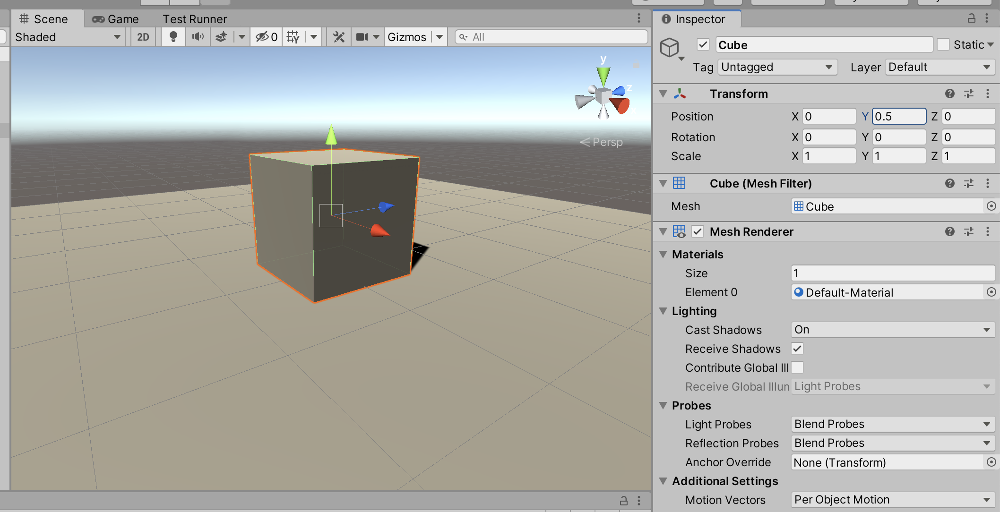
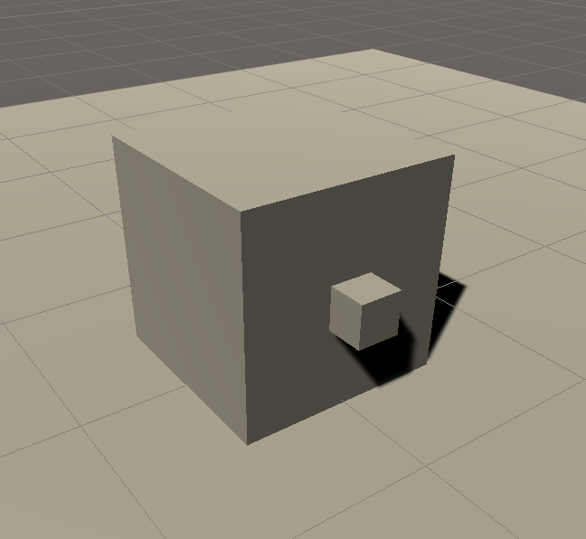
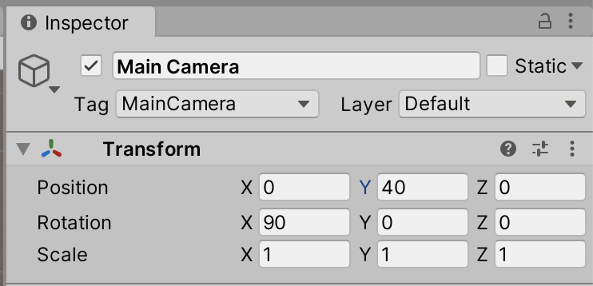
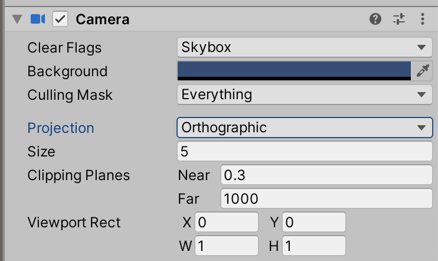
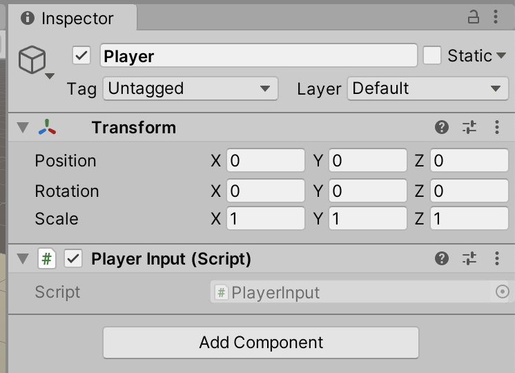

# Unit 03: Player Input <!-- omit in toc -->

- [Introduction](#introduction)
- [Goal](#goal)
- [Process](#process)
  - [Create a new scene](#create-a-new-scene)
  - [Create a floor](#create-a-floor)
  - [Create the player](#create-the-player)
  - [Set the camera](#set-the-camera)
  - [Get player input](#get-player-input)
- [Wrap-Up](#wrap-up)
- [Further Material](#further-material)

## Introduction

Alright! This unit we're going to start *actually making the game*. Exciting!

## Goal

In this unit we will make a player object in our game world, and write code to move that object around. Through this process we'll learn how scripts can manipulate components, and how we can get user input.

## Process

### Create a new scene

Let's start with a blank slate for this project.

1. In the Project panel, navigate to your folder, and the **Scenes** folder within.
2. Right-click in the panel, and in the contextual menu select **Create > Scene**.


3. Rename the scene `Level_00`, and double-click on the scene to open it.

> You might be asked to save your current scene. You should.

### Create a floor

We'll create a temporary floor for our player to play on.

1. Right-click in the Heirarchy panel, and select **3D Object > Plane**.
2. Just to be sure, let's set this GameObject's position to zero. Click on the component menu on the Transform component, and select **Reset**.



### Create the player

Before we get to coding, let's make a player object.

1. In the Heirarchy panel, right-click and select **Create Empty**. Rename this object to `Player`.



2. Just to be sure, let's set this GameObject's position to zero. Click on the component menu on the Transform component, and select **Reset**.


3. Right-click on the Player GameObject, and select **3D Object > Cube**.



4. The pivot/position of this cube is in the middle of the cube, so to get it sitting on the floor, we need to set it's position to `0, 0.5, 0`.



5. Next, we need a gun barrel (which will incidentally help us know which is the front direction). Right-click on the Cube, and select **3D Object > Cube** to create a child cube. Rename it `Barrel`, and set it's transform properties to:


6. You should now have a player that looks like this:



and a Heirarchy panel that looks like:


### Set the camera

When you start the playmode, your game will look like this:


And that's no top-down shooter. Let's set the camera.

1. Select the `Main Camera` from the Hierarchy.
2. Change the Transform values to:



3. The Game panel should look something like this:


It might not be obvious from this, but we're currently using a *perspective* camera, which means parallel lines converge as they recede. For this game, we'll be using an *orthographic* camera, which makes parallel lines stay parallel.

> Feel free to change this, and any camera values, as you develop your game.

In the **Camera** component of the `Main Camera` object, change the **perspective** value to **orthographic**.



The Game panel should now look like:


### Get player input

The next step is to get the input from the player. We'll start with grabbing keyboard input, using the standard WASD keys for player movement.

1. In the Project panel, navigate to your Scripts folder. Right-click in the Project panel, and create a new script. Name it `PlayerInput`.


2. Drag the new script onto the `Player` GameObject in the Heirarchy panel.



3. Open the script in the script editor.
4. Once again, you'll have the basic boilerplate code:

```C#
using System.Collections;
using System.Collections.Generic;
using UnityEngine;

public class PlayerInput : MonoBehaviour
{
    // Start is called before the first frame update
    void Start()
    {
        
    }

    // Update is called once per frame
    void Update()
    {
        
    }
}
```

5. To get the player input, we'll be using the Unity Input system.

> The Unity Input system is currently going through a major update. We'll be using the legacy input system.

The input system defines **axes** that you can use to collect player input. By default, Unity gives you things like **Horizontal**, **Vertical**, **Fire1**, **Jump**, and the like. To see the default options (or to add your own, which we'll do later) use the **Edit > Project Settings…** menu, and choose **Input Manager** from the left-hand list. You may need to click on the Axes disclosure triangle.


In the `Update` method, called every frame, we'll be checking if the player has pressed any of the movement buttons. Let's just make sure we can get it, by sending it to the console.

Add the following lines:

```C#
    // Update is called once per frame
    void Update()
    {
        Debug.Log(Input.GetAxis("Horizontal"));
    }
```
6. Play the game. When you press either **A** or **D** (or either the **right** or **left** arrows), the console should show output. Stop the game, and return to the script.
7. Now that we know we can get the player keyboard input, let's save it to use it later. To do so, we're going to create a **variable** to store the input value.

> Notice how the `Input.GetAxis` method returns a *number*, specifically a number between 0 and 1. It may seem weird to have a keystroke return a number, but each axis can also come from joysticks or mouse movement. We'll see how that works later.

Numbers can either be an **int** (any whole number), or a **float** (a number with decimal values). Because our input is 0-1, we need a float. Type this into your script:

```C#
public class PlayerInput : MonoBehaviour
{
    public float horizontalInput;

    // Start is called before the first frame update
```

and update your `Update` method to look like this:

```C#
    // Update is called once per frame
    void Update()
    {
        // Debug.Log(Input.GetAxis("Horizontal"));
        horizontalInput = Input.GetAxis("Horizontal");
    }
```

and save the script.

> When you return to Unity, your PlayerInput component on the Player will have a new property:
> 
> Now, when you play the game, that property shows our input!

8. Sometimes we'll want to allow the game designers to edit values in the editor, but not this value. It's purely input only, so let's make sure our editor doesn't see it. Update your line to be:

```C#
public class PlayerInput : MonoBehaviour
{
    private float horizontalInput;

    // Start is called before the first frame update
```
And it should disappear from the editor.

## Wrap-Up

## Further Material

- Unity Manual on Input
- [Input.GetAxis reference](https://docs.unity3d.com/ScriptReference/Input.GetAxis.html)