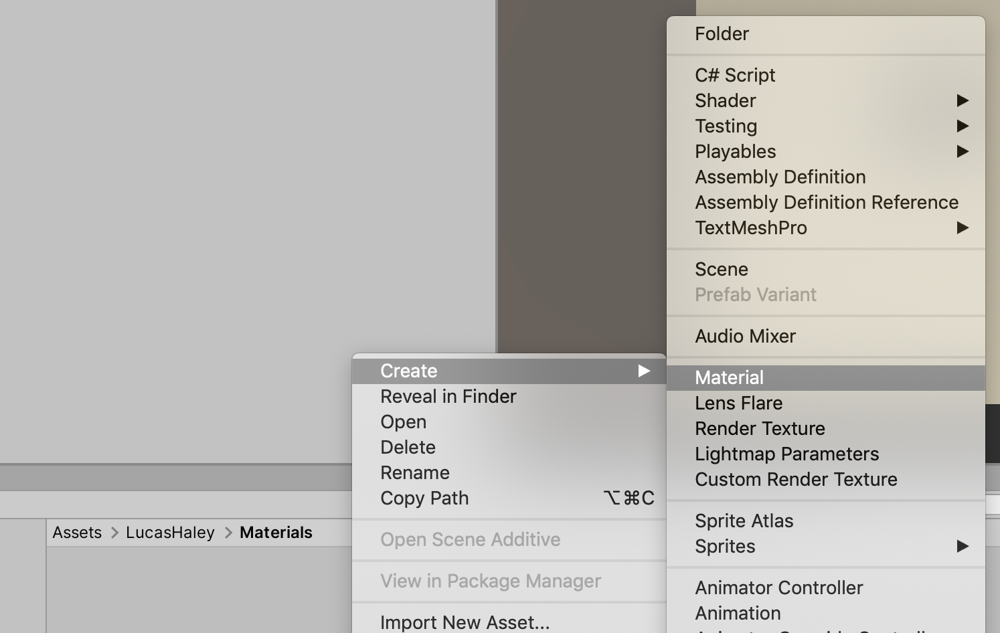
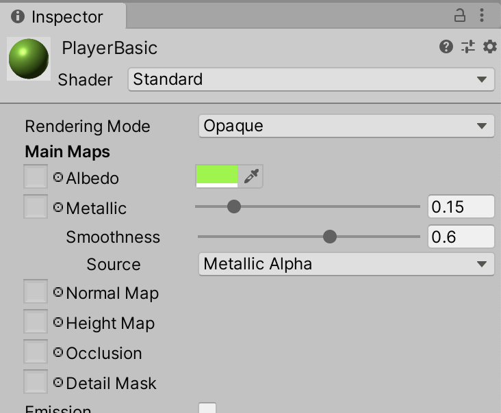
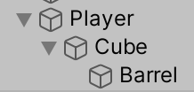
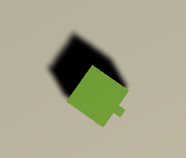

# Unit 03b: More Pretty <!-- omit in toc -->

- [Introduction](#introduction)
- [Goal](#goal)
- [Process](#process)
  - [Create a material](#create-a-material)
  - [Apply the material](#apply-the-material)
- [Wrap-Up](#wrap-up)
- [Further Material](#further-material)

## Introduction

## Goal

To create a material to colour the player.

## Process

### Create a material

1. Navigate to the Materials folder in your named folder. Right-click in the Project panel, and select **Create > Material**.

Name the new material `PlayerBasic`.

2. With the new material selected, check out the properties:

Click on the **Albedo** colour swatch, and change the colour as you like. You can also play with the **Metallic** and **Smoothness** sliders for different effects.

### Apply the material

1. Select the `Player` object in the Hierarchy panel, and click the disclosure triangle to reveal the object children.

2. Select the material in the Project panel, and drag it onto the `Cube` object inside the `Player` object.
3. Do the same for the `Barrel` object. All done!

## Wrap-Up

Creating basic materials is super easy. Later, we'll be looking at applying textures to materials, and creating our own shaders.

## Further Material