# Unit 04: Physics <!-- omit in toc -->

- [Introduction](#introduction)
- [Goal](#goal)
- [Process](#process)
  - [Create obstacles](#create-obstacles)
  - [Making Physics](#making-physics)
    - [Colliders](#colliders)
    - [Rigidbodies](#rigidbodies)
  - [Player Physics](#player-physics)
- [Wrap-Up](#wrap-up)
- [Further Material](#further-material)

## Introduction

Simulating physical behaviour is a core element to a lot of modern games -- used in jumping, shooting projectiles, dropping things, and bouncing. The math behind these interactions are quite complicated, but Unity (and other engines) do most of the heavy lifting (pun intended) for you.

## Goal

In this unit we'll investigate how Unity handles physical interactions, and we'll make our player use physical mechanics.

## Process

### Create obstacles

Before we start tackling movement, let's make something to bump up against. We're going to make a wall.

1. In the hierarchy, right click and select **Create Empty**. Name this `Wall`. Set the transform values of this object to:

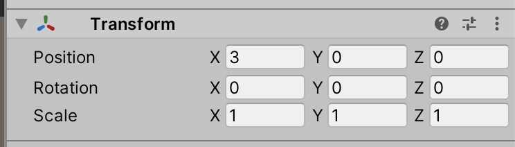

2. Select the new `Wall` object, and right-click on it. Select **3D Object > Cube**. Set the transform values of this cube to:

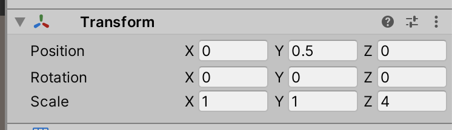

3. Your Hierarchy and Scene should now look something like:

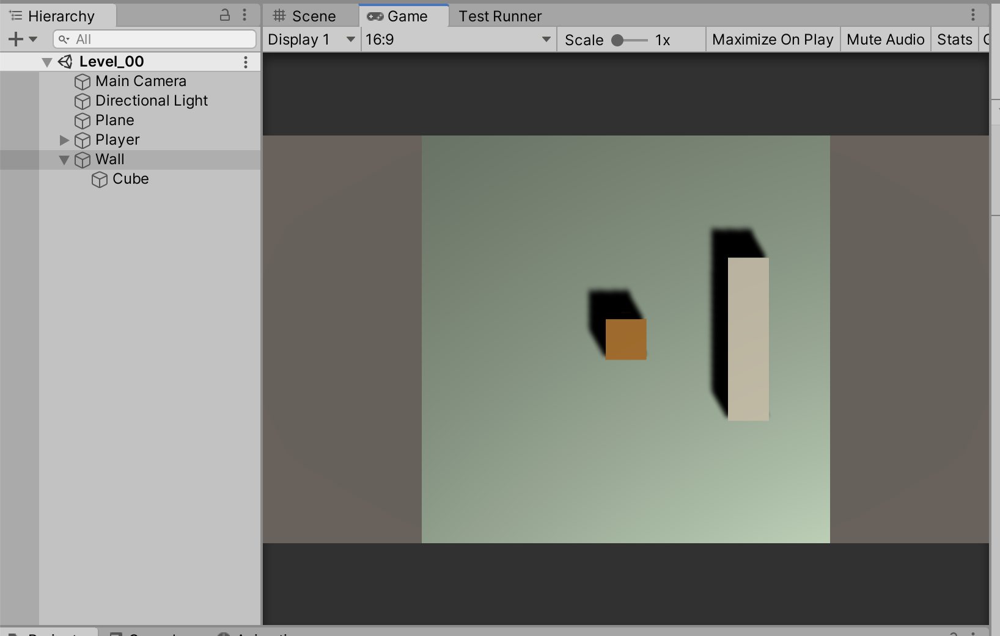

If you play the game now, you should be able to move the player right through our new wall:

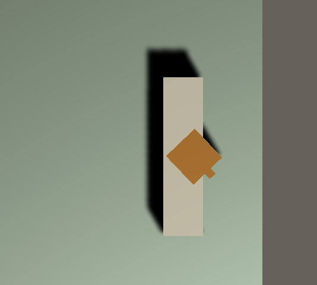

The player is not *colliding* with the wall at all. At the moment, Unity is not running the code that detects for collisions. In order to turn collisions on, we need to activate the physics components.

### Making Physics

The most basic physics components in Unity are the **Collider** and the **Rigidbody**. Both of these are components you can add to any GameObject, and are also components we'll be accessing a lot through code.

#### Colliders

Colliders define the shape of a GameObject for the purposes of physical collisions.

Unity provides several primitive colliders:

- Box Collider
- Sphere Collider
- Capsule Collider

And a Mesh collider, which can have a mesh of any shape.

> A collider, which is invisible, does not need to be the exact same shape as the GameObject’s mesh. A rough approximation of the mesh is often more efficient and indistinguishable in gameplay. Mesh colliders also start to cause issues if the mesh is at all concave. We'll take a look at mesh colliders later in the course.

Colliders can also be turned into **Triggers**, that act very similar to Colliders -- except they don't actually collide. We'll be using Triggers to sense player position, like motion detectors.

Note that the Cube we created automatically has a Box Collider attached:

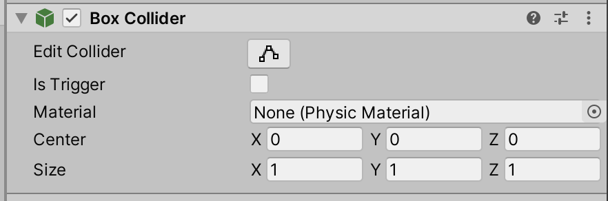

And the collider is visualised in the scene using thin green lines:

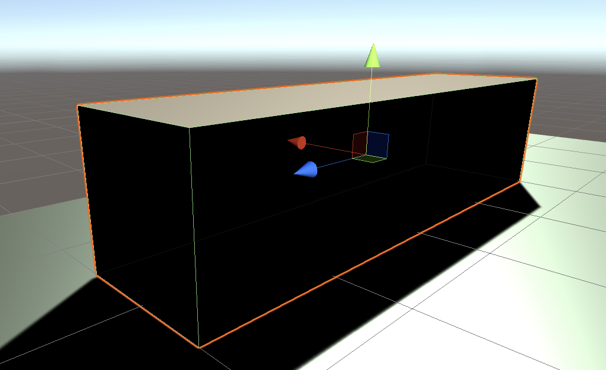

You can play with the **Size** variables of the Collider component to see how the green lines represent the Collider.

#### Rigidbodies

The only way to have a GameObject interact with the Physics engine is by adding a Rigidbody component to the GameObject.

Rigidbodies have quite a lot of variables:

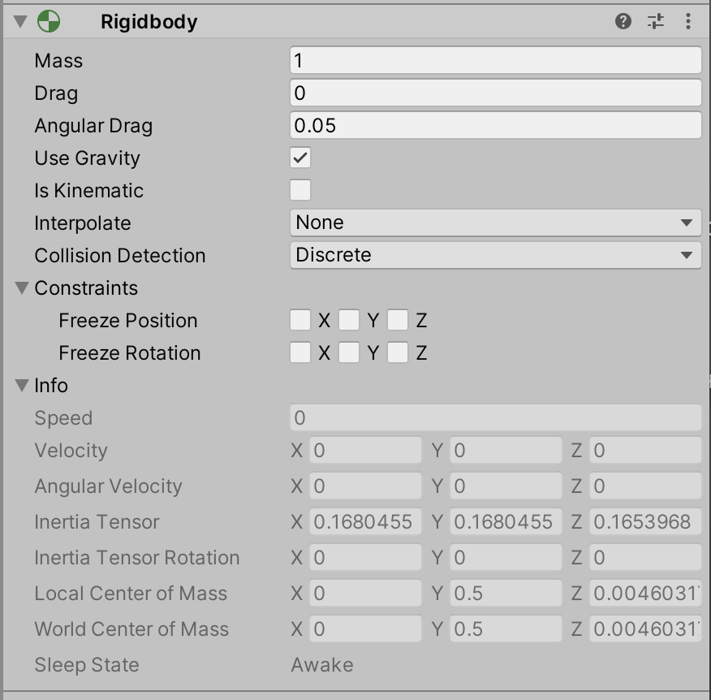

We'll be diving into most of these variables as we go. But for now, let's get physical.

1. Select your `Player` object.
2. In the Inspector panel, click the **Add Component** button. A menu pops up:

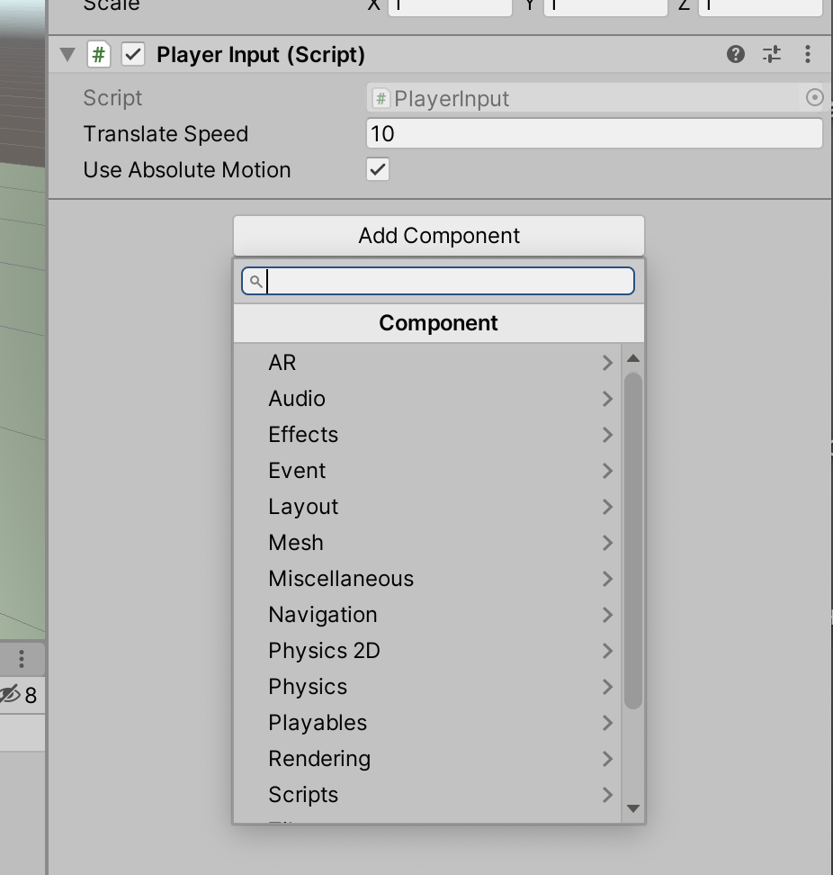

In this menu, you can select **Physics > Rigidbody**, but you can also start typing **Rigidbody** and the menu will filter results.

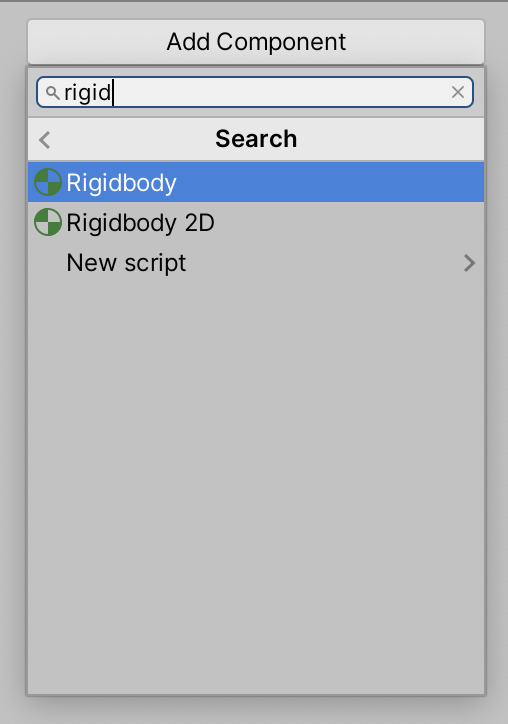

Either way, add a Rigidbody component to Player.

3. Your Player object should now look like:

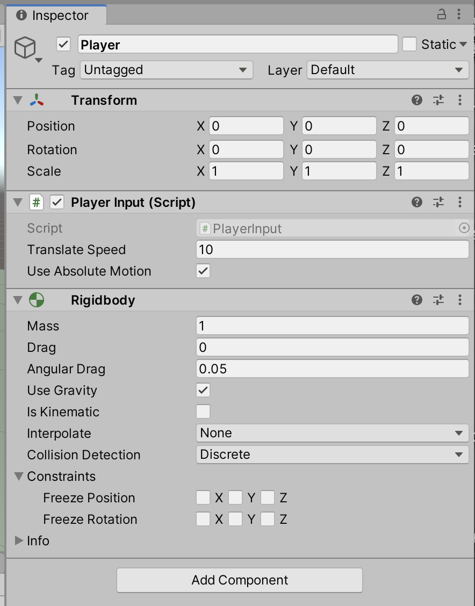

Try playing the game -- and notice how you can't pass through the wall anymore!

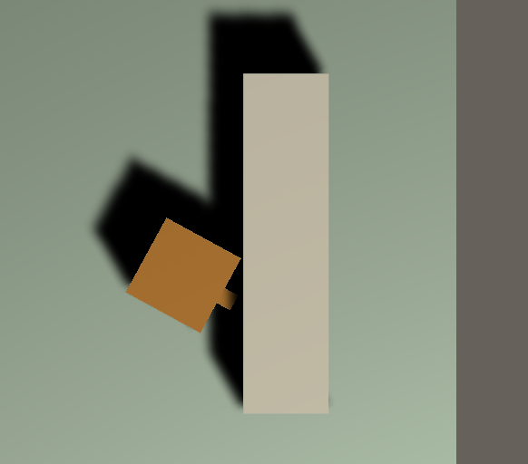

> The player now also reacts to gravity -- if we didn't have the ground plane to stop it, the player would immediately start to fall at the standard 9.8m/s². You can see this by unchecking the box next to the name of the plane, to temporarily disable it from the game:
>
> 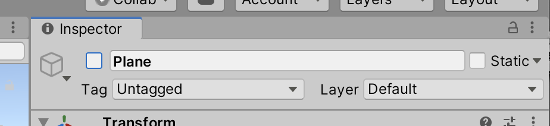
>
> When you play the game now, the player will start to fall. Because we're using an Orthographic camera, it won't be obvious -- but check out how the Player's Y position falls increasing quickly.

### Player Physics

We've now got the player engaging with the physics engine. But we can go a step further, and make the player move using physics.

Instead of moving the player using `Translate`, we're going to add physical **forces** to the character. This is the equivalent to *pushing* the player, instead of picking it up and placing it somewhere else.

This force/push is generated through the Rigidbody, using the `AddForce()` method.

Because we're pushing it, the player will also start to need a **mass** (weight) and will need to interact with surfaces and **friction**. We'll see how these settings work alongside the physics system.

We're going to add an alternative method for moving the player, and set up a toggle for the game designer, like what we made for relative/absolute motion.

1. In your `PlayerInput` script, we'll add a new boolean toggle:

```C#
public class PlayerInput : MonoBehaviour
{
    private float horizontalInput;
    private float verticalInput;
    public float translateSpeed = 10f;
    public bool useAbsoluteMotion;

    public bool usePhysicalMotion;
```

And double-check in the editor that it's working:

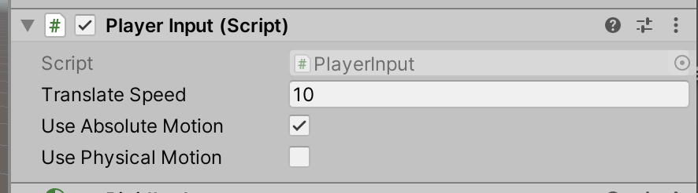

2. Next, we need to include the `AddForce` method. we can scaffold this using a similar `if` structure as before.

> At this point, we're going to be adding code that we'll later be **refactoring**. Refactoring is a critical part of coding –– but for now, just think how what we're coding now might be problematic.

```C#
    // Update is called once per frame
    void Update()
    {
        // Debug.Log(Input.GetAxis("Horizontal"));
        horizontalInput = Input.GetAxis("Horizontal") * Time.deltaTime * translateSpeed;
        verticalInput = Input.GetAxis("Vertical") * Time.deltaTime * translateSpeed;

        // check if we use absolute or relative motion
        if (useAbsoluteMotion)
        {
            // use absolute
            if (usePhysicalMotion)
            {
                // use forces
                GetComponent<Rigidbody>().AddForce(horizontalInput, 0f, verticalInput);
            } else {
                // use translate, no forces
                transform.Translate(horizontalInput, 0f, verticalInput, Space.World);
            }
        } else {
            // use relative
            transform.Translate(horizontalInput, 0f, verticalInput);
        }
```

Give the game a go. What do you notice? The player doesn't move much, huh. But it *is* moving. Check out the Transform values.

        verticalInput = Input.GetAxis("Vertical") * Time.deltaTime * translateSpeed;
        verticalInput = Input.GetAxis("Vertical") * Time.deltaTime * translateSpeed;
Making this movement more useful is a little more complicated. In the Translate version, we were able to have a `translateSpeed` variable that would multiply the speed. We can do a similar thing with the physical version –– except we also have a **mass** to work with.

> Think about how this might work: one person might be able to push a box full of Lego pieces quite easily. That same person (i.e. with the same force) might not be able to push the same size box full of rocks (i.e. with a much greater mass).

Let's see how this plays out.

3. Create a new class variable:

```C#
public class PlayerInput : MonoBehaviour
{
    private float horizontalInput;
    private float verticalInput;
    public float translateSpeed = 10f;
    public bool useAbsoluteMotion;

    public bool usePhysicalMotion;
    public float physicalSpeed = 60f;
```

4. And multiply our force by that variable:

```C#
// use forces
GetComponent<Rigidbody>().AddForce(horizontalInput * physicalSpeed, 0f, verticalInput * physicalSpeed);
```

Try out the game now. Feel free to change the `physicalSpeed` variable while playing the game. 

> You may notice that when the player gets up to speed, it starts wiggling! This is because it's a physical simulation, and the cube is dragging against the floor. There are a couple of things we can do to stop this from happening: reduce that friction, and lock the player's movement.

5. Each collider can have a special piece of data called a **Physic Material**, which defines how that collider will interact with other colliders –– how things rub against each other, and bounce off each other.

> You can see the empty slot in any Rigidbody:
>
> 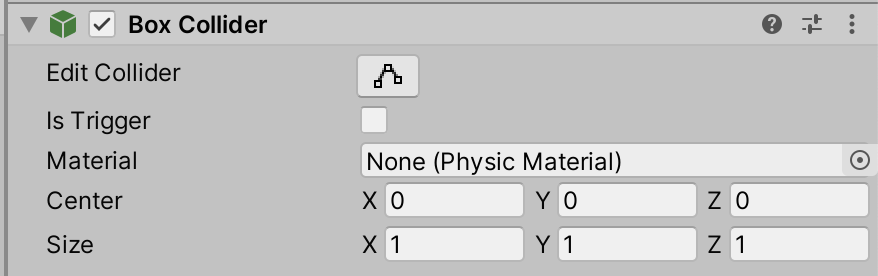

We can create a new Physic Material, and make the ground plane all slippery.

Navigate to the `PhysicMaterials` folder in your folder. Right-click in the Project panel, and select **Create > Physic Material**:

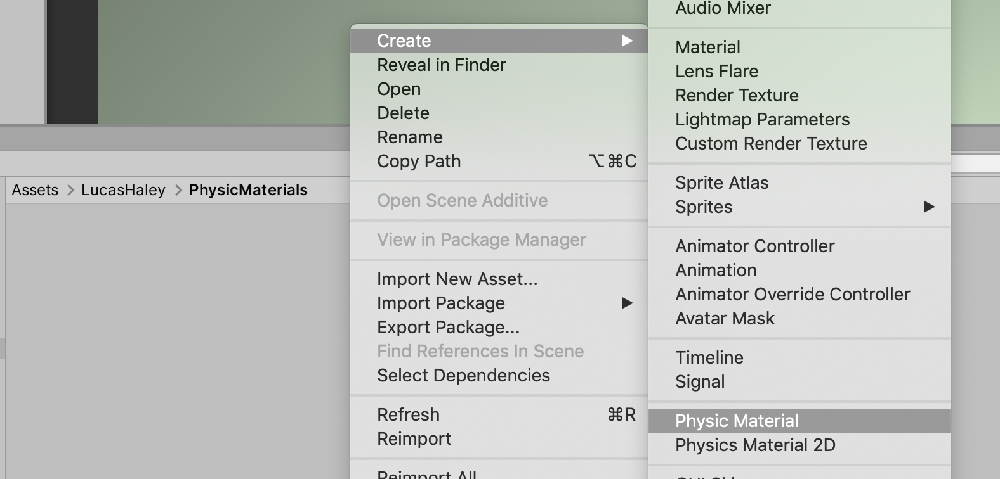

Name this new material `Ground`.

6. Select the new physic material, and check out the properties in the Inspector panel.

> Dynamic friction is friction when things are moving (i.e. to make things come to a stop), and static friction is for when things are still (i.e. to make things start to move).

Set your `Ground` material to these settings:

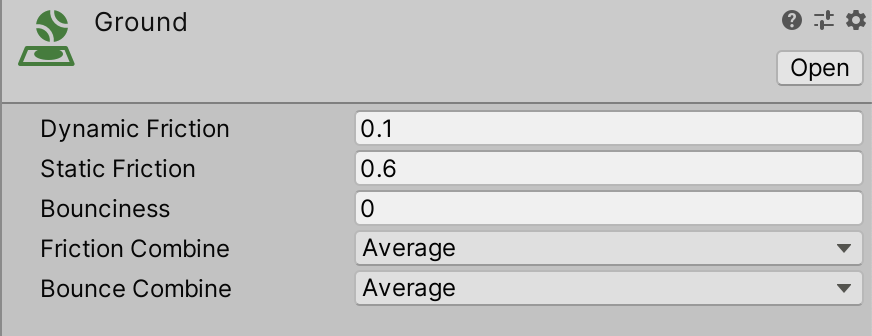

And check out how the player moves. Much nicer!

7. Next, we're going to lock of some axes of movement so our player doesn't accidentally get out of whack.

    Select the Player, and check out the Rigidbody properties. Near the bottom of the component are the **Constraints** (you may have to click the disclosure triangle). Checking these boxes will make Unity try to lock down translation and rotation.

    For our player, we want to lock any Y translation (no moving upwards), and lock any rotation on the X and Z axes:

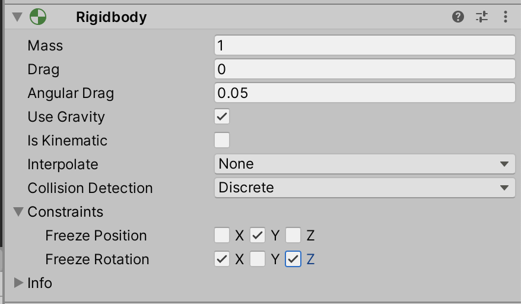

Looks good!

## Wrap-Up

Another significant unit, this time starting to engage with the Unity Physics engine.

Physics are tricky to get the "feel" right, as there are a lot of bits that interact together. You have to balance mass, drag, physic friction, impulses, and forces.

## Further Material
- [Physic Materials at Unity reference](https://docs.unity3d.com/Manual/class-PhysicMaterial.html)