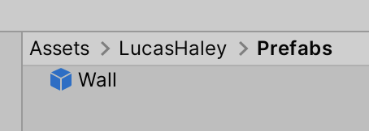
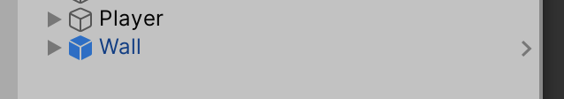
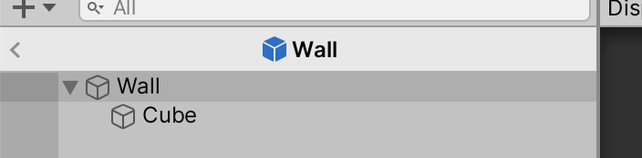

# Unit 04b: Prefabs  <!-- omit in toc -->

- [Introduction](#introduction)
- [Goal](#goal)
- [Process](#process)
- [Wrap-Up](#wrap-up)
- [Further Material](#further-material)

## Introduction

Some parts of working with Unity need their own unit. Creating Prefabs is one of those parts. It's a critical piece of Unity development to understand.

## Goal

This unit is solely to make sure you understand the idea of Prefabs, and the process to create them.

## Process

We've seen how everything that exists in the game world exists in the Hierarchy as a GameObject, and how you can attach Components to those GameObjects to add functionality.

**Prefabs** are Unity's manner to package up those GameObjects and associated Components into a **referenced template**.

It's a *template*, because once you've made a Prefab, it's super easy to duplicate it. Those duplicates are called *instances*.

Those instances are *referenced*, which means that when you change the Prefab, every instance of that template picks up the new settings. So you are able to make changes across all duplicates of a Prefab very easily.

Lastly, Prefabs allow us to create new complete GameObject packages on the fly during gameplay using *instantiation*. We'll look into how that works later.

### Creating Prefabs

For now, we are going to make a Prefab from the wall, so we can make more walls as needed.

1. Make sure you still have a `Wall` object in your Hierarchy, and that it's still at position `{0, 0, 0}`. It should also have a `Cube` child.
2. In your Project panel, navigate into the Prefabs folder in your named folder.
3. Back in the Hierarchy panel, select your `Wall` object. Then drag it from the Hierarchy panel into the Project panel.
4. In the Prefabs folder, you should now see a new Prefab, with a blue cube icon. 

And the GameObject you initially dragged has now also become an instance of the newly-created Prefab.

You can also drag that prefab from the Prefabs directory into the Scene as many times as you like, each time creating a new instance of the prefab.

### Editing Prefabs

To edit a prefab, you have to make sure you _open_ it first. There are a couple ways you can open a Prefab:

1. If there is an instance of the prefab in the Scene, you can click on the little arrow at the right-hand side of its name:

2. Or you can double-click the Prefab in the Project.

Either way, when you're editing an open Prefab, note how the UI for the Scene panel changes:

## Wrap-Up

In the next units, we'll take a look at how we can use code to instantiate new Prefab instances as we go.

## Further Material
- [Prefabs at Unity manual]()