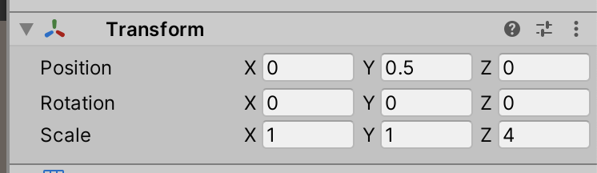
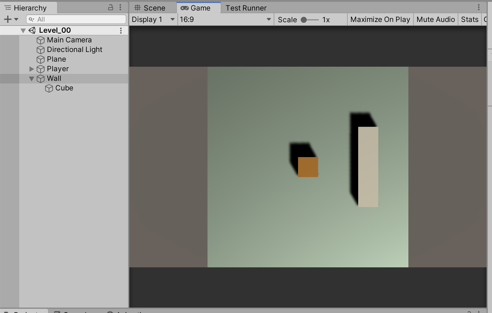
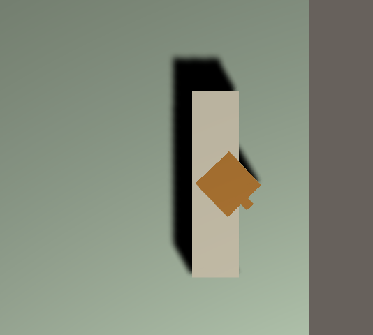
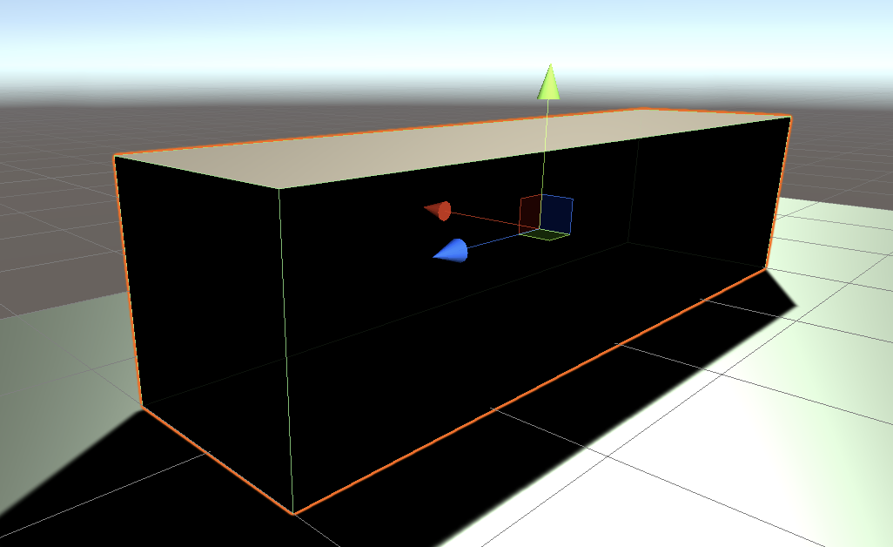
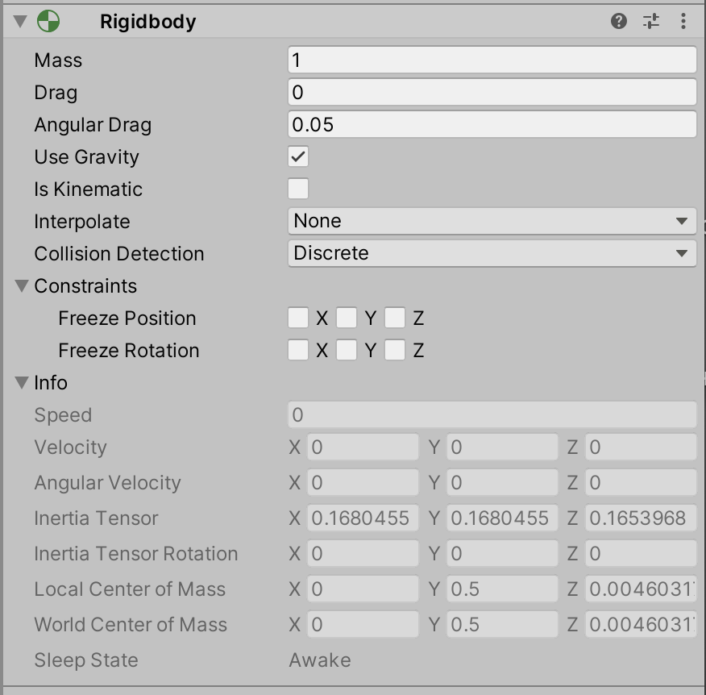

# Unit 04: Physics <!-- omit in toc -->

- [Introduction](#introduction)
- [Goal](#goal)
- [Process](#process)
  - [Create obstacles](#create-obstacles)
  - [Making Physics](#making-physics)
    - [Colliders](#colliders)
    - [Rigidbodies](#rigidbodies)
- [Wrap-Up](#wrap-up)
- [Further Material](#further-material)

## Introduction

Simulating physical behaviour is a core element to a lot of modern games -- used in jumping, shooting projectiles, dropping things, and bouncing. The math behind these interactions are quite complicated, but Unity (and other engines) do most of the heavy lifting (pun intended) for you.

## Goal

In this unit we'll investigate how Unity handles physical interactions, and we'll make our player use physical mechanics.

## Process

### Create obstacles

Before we start tackling movement, let's make something to bump up against. We're going to make a wall.

1. In the hierarchy, right click and select **Create Empty**. Name this `Wall`. Set the transform values of this object to:

2. Select the new `Wall` object, and right-click on it. Select **3D Object > Cube**. Set the transform values of this cube to:

3. Your Hierarchy and Scene should now look something like:

If you play the game now, you should be able to move the player right through our new wall:

The player is not *colliding* with the wall at all. At the moment, Unity is not running the code that detects for collisions. In order to turn collisions on, we need to activate the physics components.

### Making Physics

The most basic physics components in Unity are the **Collider** and the **Rigidbody**. Both of these are components you can add to any GameObject, and are also components we'll be accessing a lot through code.

#### Colliders

Colliders define the shape of a GameObject for the purposes of physical collisions.

Unity provides several primitive colliders:

- Box Collider
- Sphere Collider
- Capsule Collider

And a Mesh collider, which can have a mesh of any shape.

> A collider, which is invisible, does not need to be the exact same shape as the GameObject’s mesh. A rough approximation of the mesh is often more efficient and indistinguishable in gameplay. Mesh colliders also start to cause issues if the mesh is at all concave. We'll take a look at mesh colliders later in the course.

Colliders can also be turned into **Triggers**, that act very similar to Colliders -- except they don't actually collide. We'll be using Triggers to sense player position, like motion detectors.

Note that the Cube we created automatically has a Box Collider attached:

And the collider is visualised in the scene using thin green lines:

You can play with the **Size** variables of the Collider component to see how the green lines represent the Collider.

#### Rigidbodies

The only way to have a GameObject interact with the Physics engine is by adding a Rigidbody component to the GameObject.

Rigidbodies have quite a lot of variables:

We'll be diving into most of these variables as we go. But for now, let's get physical.

1. Select your `Player` object.
2. In the Inspector panel, click the **Add Component** button. A menu pops up:

In this menu, you can select **Physics > Rigidbody**, but you can also start typing **Rigidbody** and the menu will filter results.

Either way, add a Rigidbody component to Player.

3. Your Player object should now look like:

Try playing the game -- and notice how you can't pass through the wall anymore!

## Wrap-Up

## Further Material