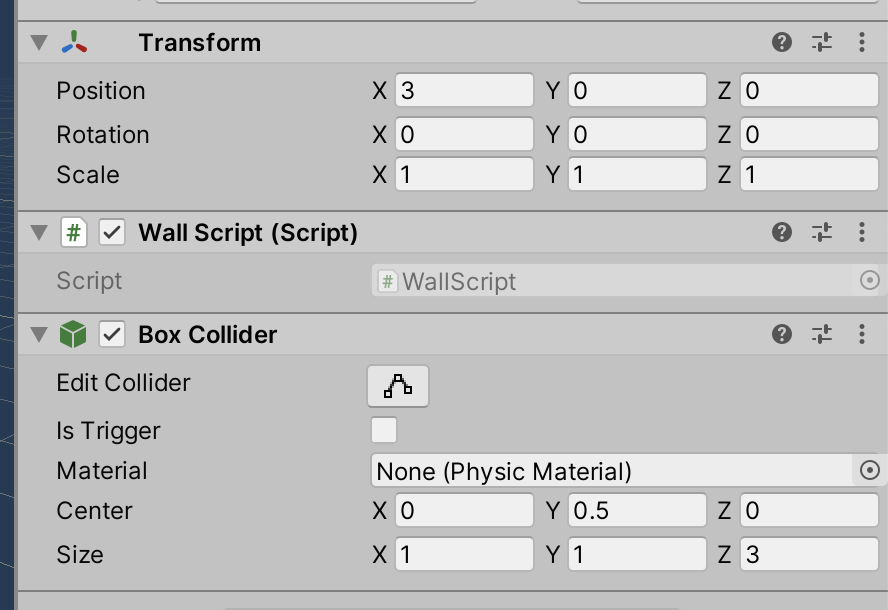

# Unit 05_05: Getting Shot <!-- omit in toc -->
- [Introduction](#introduction)
- [Goal](#goal)
- [Process](#process)
- [Wrap-Up](#wrap-up)
- [Further Material](#further-material)

## Introduction

For this unit, we'll look into how something reacts to collisions -- specifically, a collision with one of the player's bullets.

## Goal

To have one of the walls react to getting shot by changing colour.

## Process

1. We're going to use the `Wall` prefab as our target. Find it in your Project, and open the Prefab for editing.
2. Select the topmost GameObject, `Wall`, and add a new script to it called `WallScript`.
3. We're going to need to add a BoxCollider to this topmost GameObject -- set it to the following values:



You can remove the box collider from the `Cube` child object.

4. You're also going to need to make a new Material for the wall. **Re-read the Unit 03b: More Pretty information for details.**

5. The way we code collision reactions in Unity is through a special method `OnCollisionEnter`. It gets added on it's own, with a very particular set of parameters. Add the following after the `Update` method:

```C#
    void OnCollisionEnter(Collision other)
    {
        Debug.Log("Collision!");
    }
```

> When you add this method, you *must* spell it correctly, and you *must* have one parameter of type `Collision`.

When you play the game, you should get the Debug message when you shoot a wall.

6. Next, we're going to make the bullet remove itself once it hits a wall. Add the following code:

```C#
    void OnCollisionEnter(Collision other)
    {
        Debug.Log("Collision!");

        if (other.gameObject.TryGetComponent(out PlayerBullet bullet))
        {
            Destroy(bullet.gameObject);
        }
    }
```
There are a couple of things to pay attention to here. Firstly, we are using the `other` parameter from the `OnCollisionEnter` method call. This parameter is of type `Collision`, and has information about the location of the collision, and the object that has collided with us: the `other.gameObject`. We can treat this gameObject like any other gameObject.

Next, with that gameObject, we're calling the `TryGetComponent` method. We've seen the `GetComponent` method, which we can use if we're sure there's the component there. In this case, it might not be a `PlayerBullet` that's colliding with the wall -- it could be the player, enemy bullets, and the like. The `TryGetComponent` allows us to get the `PlayerBullet` script *is there is one*, and fail gracefully if not.

> We're also using `Destroy` on the bullet from the `WallScript`, which should make you hesitant –– it goes against our goals of encapsulation. We can refactor and improve later.

7. Now we can change the colour of the wall when it's been hit. Add the following to the `OnCollisionEnter` code:

```C#
    void OnCollisionEnter(Collision other)
    {
        Debug.Log("Collision!");

        if (other.gameObject.TryGetComponent(out PlayerBullet bullet))
        {
            Destroy(bullet.gameObject);
            GetComponentInChildren<Renderer>().material.color = Color.red;
        }
    }
```

And test the game. When you shoot it with a bullet, the wall should turn red.

> The `GetComponentInChildren<Renderer>().material.color` call is a brute-force way of changing the colour of something. Later, we'll look at how this can be replaced with damage to enemies.

## Wrap-Up

In this unit, we were introduced to the `OnCollisionEnter` method. There are more methods that work in conjunction with it, including `OnCollisionStay` and `OnCollisionExit`. Can you guess what they do, and how you might use them?

## Further Material
- [Unity Manual on OnCollisionEnter](https://docs.unity3d.com/ScriptReference/Collider.OnCollisionEnter.html)
- [Unity Manual on TryGetComponent](https://docs.unity3d.com/ScriptReference/GameObject.TryGetComponent.html)
