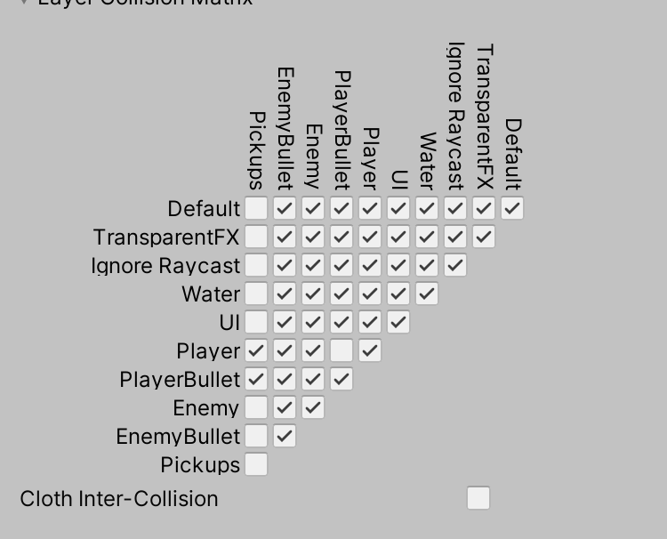
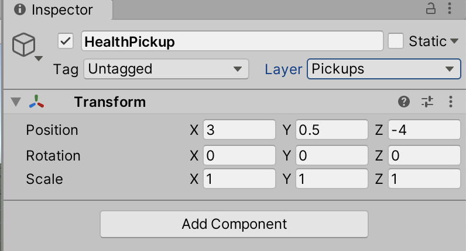
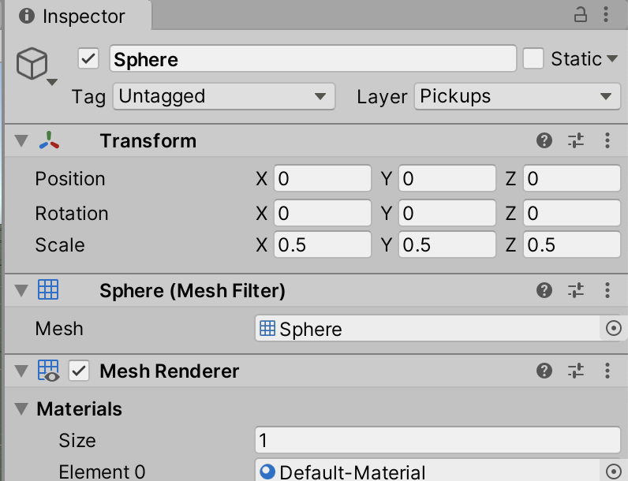
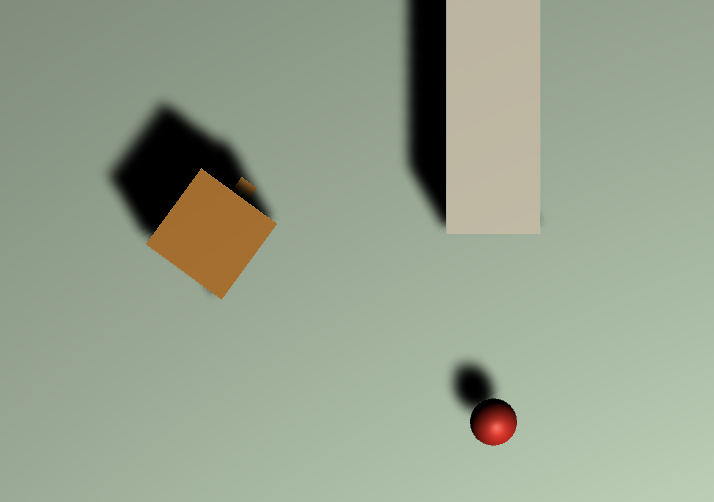
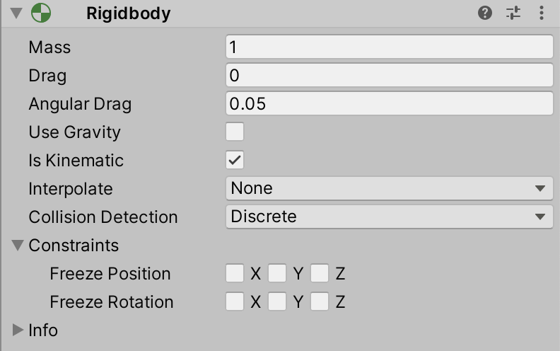
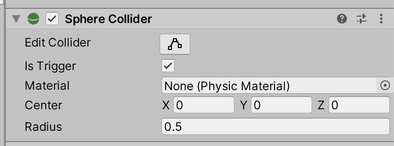

# Unit 05_09: More Health <!-- omit in toc -->
- [Introduction](#introduction)
- [Goal](#goal)
- [Process](#process)
  - [Updating the Health script](#updating-the-health-script)
  - [Create the Health pickup prefab](#create-the-health-pickup-prefab)
  - [Create the scripts](#create-the-scripts)
- [Wrap-Up](#wrap-up)
- [Further Material](#further-material)

## Introduction

We now have a working health system, that decreases the health score when the player enters the PainZone and respawns when the player dies. This unit we'll work on recovering that health!

## Goal

This unit allows the player to collect pickups that recover damage.

## Process

### Updating the Health script

> The first thing we're going to do is set up a maximum health the player can have. This way, when we do add health back, the player can't collect more that what they start with.

1. Open your `Health` script in the editor. It should look something like this:

```C#
using System.Collections;
using System.Collections.Generic;
using UnityEngine;

public class Health : MonoBehaviour
{
    public int health = 20;

    public void Damage(int damage)
    {
        // Take the damage passed into this method
        health -= damage;

        // If we have zero or less health, then call the Death script
        // that is attached to this GameObject.
        if (health <= 0)
        {
            Debug.Log("I'm DEAD");
            if (gameObject.TryGetComponent(out Death death))
            {
                death.HandleDeath();
            }
            else
            {
                Debug.Log("No Death script attached.");
            }
        }
    }

    // This was our first pass at the bullet
    // But if we kept going with this pattern, we'd need a separate if condition
    // for each and every type of collision.
    // Instead, the Bullet will tell us how much damage to take.

    /*
    void OnCollisionEnter(Collision other)
    {
        if (other.gameObject.TryGetComponent(out PlayerBullet bullet))
        {
            Damage(bullet.damage);
            Destroy(bullet.gameObject);
        }
    }
    */
}
```

2. Let's change that first class variable, and add a maximum.

```C#
public class Health : MonoBehaviour
{
    public int currentHealth = 20;
    public int maxHealth = 20;
```

> Note that you'll also have to change the name of the health variable throughout the rest of the class! There are at least two other places you'll need to change the name.

3. Next let's make a new method that allows us to recover health:

```C#
    public void Recover(int recovery)
    {
        // Apply the recovery
        currentHealth += recovery;

        // If our current health is more than our maximum allowed
        // then clamp it
        if (currentHealth > maxHealth)
        {
            currentHealth = maxHealth;
        }
    }
```

> Make sure to add this method *outside* of the `Damage` method, not inside!

4. While we're at it, let's make a full recovery:

```C#
    public void RecoverFull()
    {
        currentHealth = maxHealth;
    }
```

5. We can then go into our `PlayerDeath` script to reset our health when the player respawns. You might recognise this pattern from the `PainZone` script!

```C#
    public override void HandleDeath()
    {
        // Debug.Log("Player has died!");
        GetComponent<Rigidbody>().position = spawnLocation;
        GetComponent<Rigidbody>().rotation = spawnRotation;

        GetComponent<Rigidbody>().velocity = Vector3.zero;
        GetComponent<Rigidbody>().angularVelocity = Vector3.zero;

        // Restore the player health to maximum
        if (TryGetComponent<Health>(out Health health))
        {
            health.RecoverFull();
        }
    }
```

> Note how the `PlayerDeath` script doesn't know or care what the max health value actually is. That's nice encapsulation!

### Create the Health pickup prefab

> Now we need to make a health pickup for the player to collect.

1. In your hierarchy, create a new Empty GameObject. While it's still selected, right-click on it to make a child Sphere. Rename the GameObject to `HealthPickup`, and scale the Sphere to 0.5 on all axes.
2. Create a new Layer called "Pickups", and assign the `HealthPickup` to that layer.
3. In your Project Settings, turn off all collisions for the Pickups layer except for the Player (and the PlayerProjectiles, if you want to be able to shoot pickups):



> You should end up with something like the following:




> Ensure that your `HealthPickup` has a y value of 0.5, and that your Sphere's location is zeroes.

> Feel free to make a new material for your pickup to change the colour. See the "More Pretty" unit for more information.



4. Add a `Rigidbody` component to the `HealthPickup` object, and set it to *not* use gravity, and to be **Kinematic**.



> Making a rigidbody **Kinematic** means it isn't affected by collisions, but still registers them.

5. In the Sphere object, set the `SphereCollider` to be a Trigger.



> We're doing this just in case our collision with the pickup causes any weird physics issues.

6. Lastly for now, drag your `HealthPickup` into your **Prefabs** directory in your Project to create a prefab.

### Create the scripts

> We're going to make a parent object just like we did for the `Death` script. We're not quite sure what that parent functionality might be, but we can guess we're also going to have at least ammo pickups as well, so let's anticipate similar functionality.

1. In your **Scripts** directory in your Project, right-click and create a new script called `Pickup`. Edit it's class to look like:

```C#
public abstract class Pickup : MonoBehaviour
{
    // This script is empty… for now.
}
```

> Make sure to get the `abstract` in there.

2. Next, create another script called `HealthPickup`. Edit the class declaration:

```C#
public class HealthPickup : Pickup
{
    public int healthBoost = 10;
}
```

3. For our pickup, we're mainly looking for the player to collide with it. So we need the `OnCollisionEnter` method:

```C#
public class HealthPickup : Pickup
{
    public int healthBoost = 10;

    private void OnTriggerEnter(Collider other)
    {
        Debug.Log("Collided with pickup!");
    }
}
```
4. Edit your `HealthPickup` prefab, and add the `HealthPickup` script to it.

> Now when you test, you should get the debug message on collision.

5. Now let's actually make it give us health. Change the trigger code:

```C#
    private void OnTriggerEnter(Collider other)
    {
        Debug.Log("Collided with pickup!");
        if (other.gameObject.TryGetComponent<Health>(out Health health))
        {
            health.Recover(healthBoost);
        }

        Destroy(gameObject);
    }
```

> You should now be able to collect the pickup, and if you need health, it'll give you some!

## Wrap-Up

We now have a system for pickups, which can be repurposed for things like ammo and armour -- once we get those going!

## Further Material
