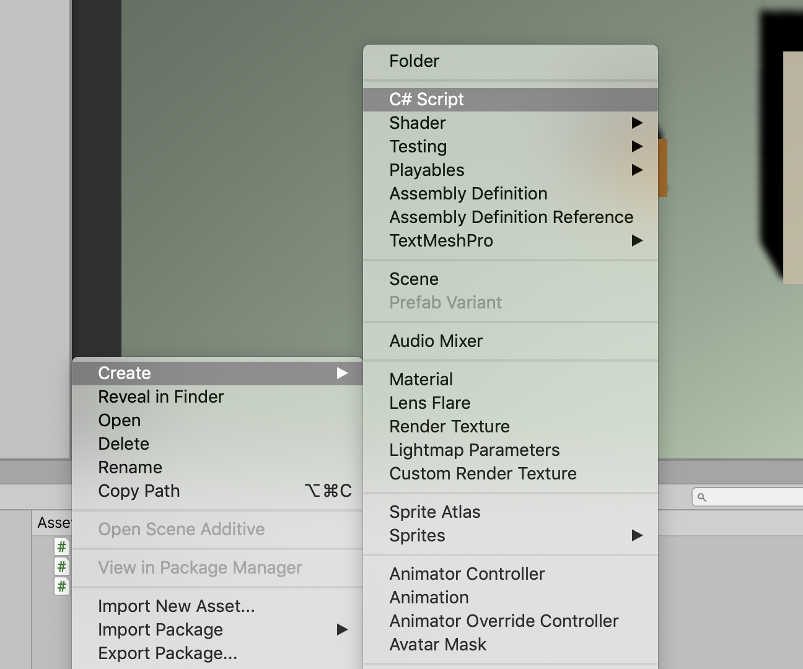
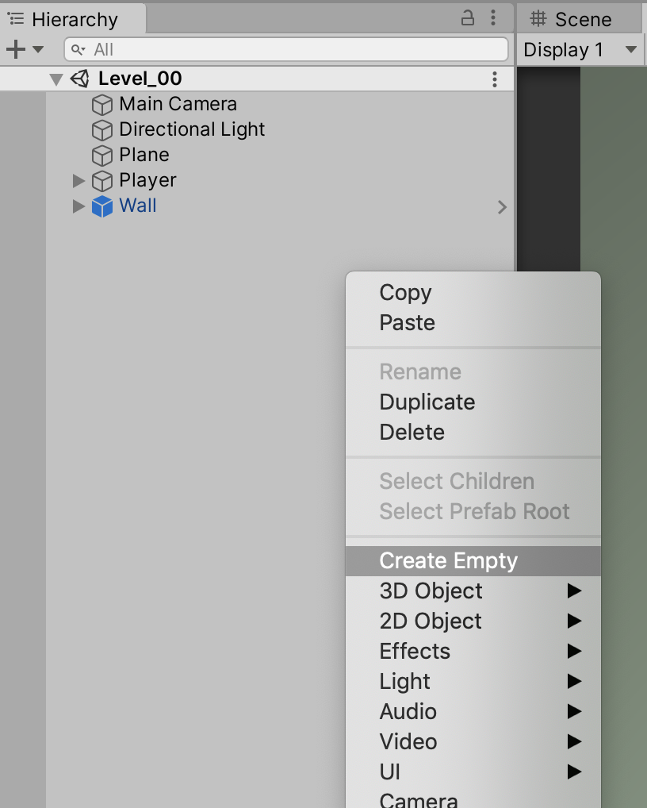
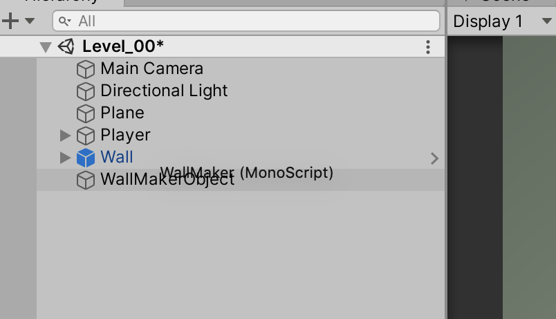
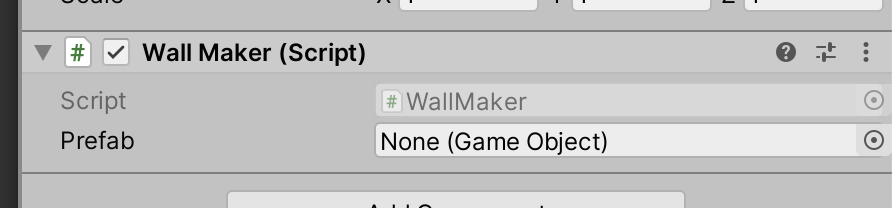
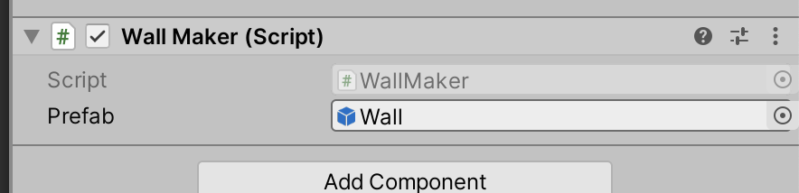
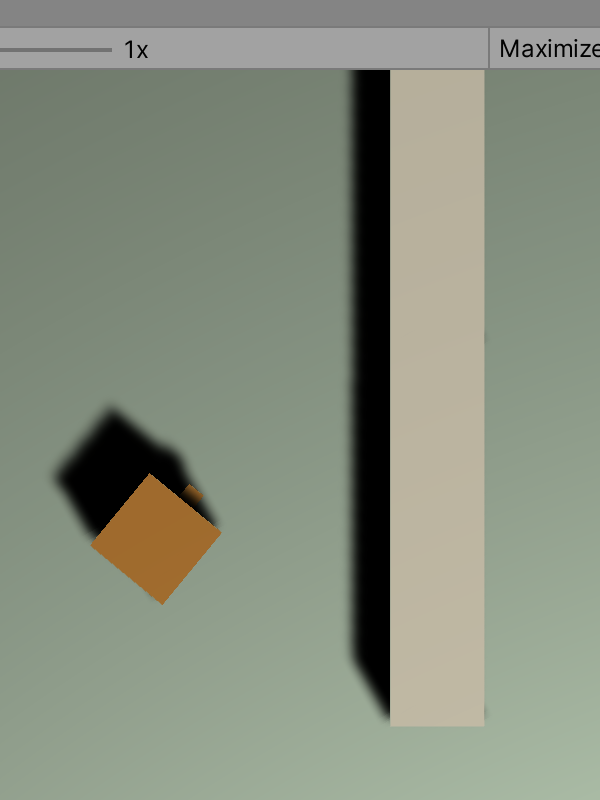
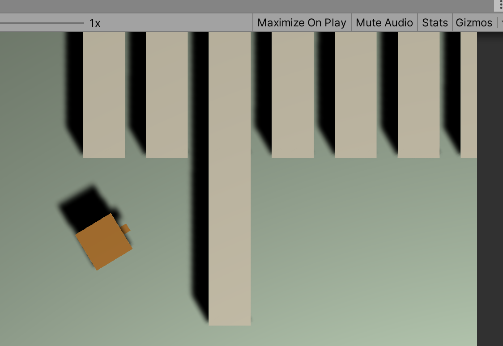
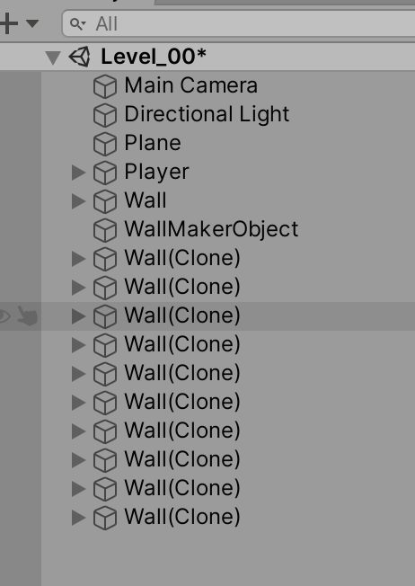
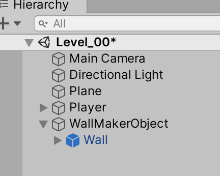

# Unit 05: Instantiation  <!-- omit in toc -->
- [Introduction](#introduction)
- [Goal](#goal)
- [Process](#process)
- [Wrap-Up](#wrap-up)
- [Further Material](#further-material)
  
## Introduction

In this unit we will introduce the Unity concept of **Instantiation**. This is another one of those core Unity concepts that we will be using over and over again -- this time, we'll be looking at how to create new GameObjects on the fly, from within code. This process of Instantiation is used to create projectiles, special effects, lights, enemies, power-ups – and almost anything else – at runtime.

## Goal

The goal of this unit is to instantiate a Prefab during runtime from code.

## Process

In order to instantiate something, it first needs to be a Prefab. Make sure to review the Prefabs unit if you're unsure about how to make one.

For this unit, we'll use the **Wall** prefab from that unit.

1. In the Project tab, navigate to your Scripts folder. Right-click, and create a new C# script.



Call it `WallMaker`.

2. Next, we'll need something in the Scene to drop our script on. In the Scene tab, right-click and create a new empty GameObject.



Call it `WallMakerObject`.

3. Drag the `WallMaker` script onto your new `WallMakerObject` GameObject.



4. Open the script in your editor. The first thing we will do is create a reference variable to our prefab. Add this line right after your class definition:

```C#
public class WallMaker : MonoBehaviour
{
    public GameObject prefab;
    
    // Start is called before the first frame update
```
When you click back to Unity, make sure you've got a new slot in your MakeWall component.



5. In your hierarchy, navigate to your Prefabs directory. This next step can be a little tricky: click and drag from your `Wall` prefab into the new slot in your `WallMaker` component. Make sure it's one step -- *do not* click once, then click again to drag. You'll change the Inspector context away from the `WallMaker` component. If that happens, just click the `WallMakerObject`, and try again. You'll want to end up with `Wall` in the slot.



6. Switch back to the code editor. Next we're going to have the script create a new wall when the game starts, using the `Start` method.

```C#
    // Start is called before the first frame update
    void Start()
    {
        Instantiate(prefab, new Vector3(1.5f, 0f, 4f), Quaternion.identity);
    }
```

The `Instantiate` method call has a lot of different variations (check out the Unity script reference for more information), but this is the most basic. It takes three parameters: the prefab to create, the location to create it, and the rotation to set it to upon creation. In this case, we'll make a new Vector3 for position (here's another opportunity for refactoring). For the rotation, `Quaternion.identity` is the zero rotation, so it will use whatever rotation is set up in the prefab.

7. Check your code, and play the game. You'll see a new wall created!



While your game is playing, check out your Scene tab. You'll see a new object called `Wall (clone)`, which is your dynamically created wall.

8. Next, we'll spice it up a bit by creating multiple walls. We can quickly do this by adding a `for` loop:

```C#
    void Start()
    {
        for(int i = 0; i < 10; i++)
            Instantiate(prefab, new Vector3(1.5f * i, 0f, 4f), Quaternion.identity);
    }
```

> Note how we're multiplying the `x` value by our iterator `i`.

9. Check code and play. You should see a whole bunch of walls now.



10. You should also see many walls in your scene, too.



If you can imagine, once we're starting to create projectiles and enemies, the scene can get quite messy with all those `clones`. So, to clean it up, we're going to make all walls sit under the `WallMakerObject`.

11. First, drag the existing `Wall` under the `WallMakerObject`.



12. Next, we need to tell our Instantiate method call to create new walls under this same group. We can do this by adding a fourth parameter, the `Transform` of the group we want. Which, in this case, is just `transform`:

```C#
    Instantiate(prefab, new Vector3(1.5f * i, 0f, 4f), Quaternion.identity, transform);
```

But you can specify any transform.

13. Check and play. If it's working correctly, all new walls are made under the group, which can be collapsed to tidy up. Neat!

## Wrap-Up

Instantiation is a very important technique in Unity. In the next unit, we'll see how we can use it to create projectiles.

## Further Material
[Unity Reference on Instantiate](https://docs.unity3d.com/ScriptReference/Object.Instantiate.html)