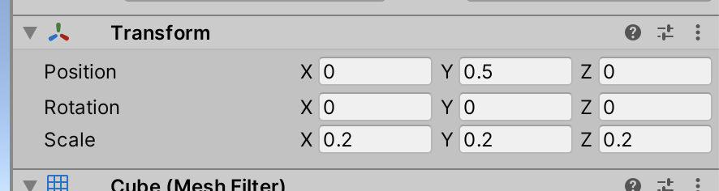
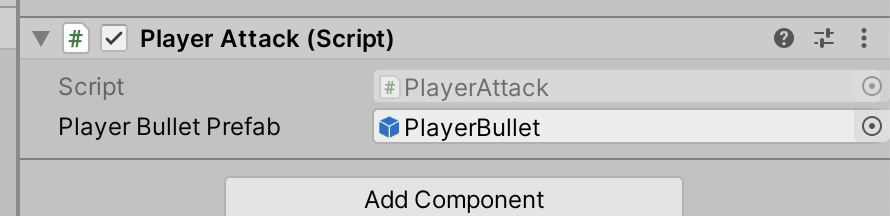
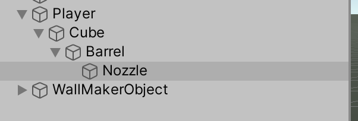
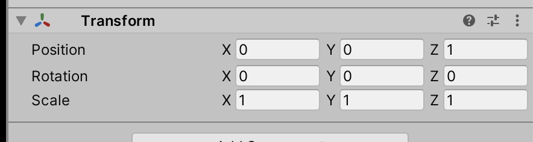
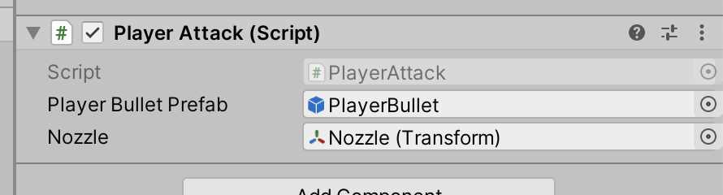
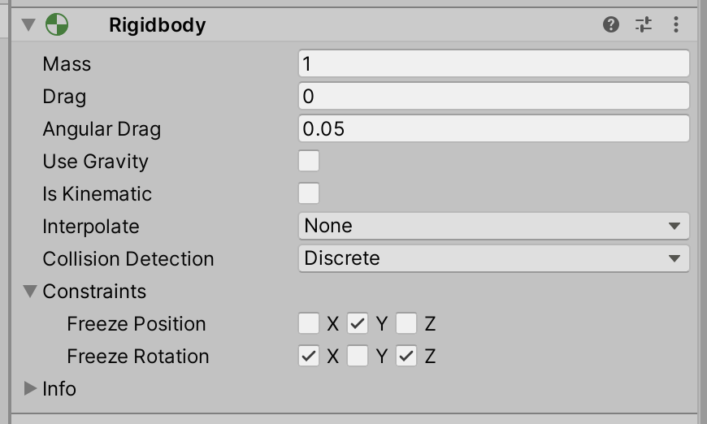

# Unit 05b: Projectiles  <!-- omit in toc -->

- [Introduction](#introduction)
- [Goal](#goal)
- [Process](#process)
  - [Player Input](#player-input)
  - [Instantiate](#instantiate)
  - [Making the bullets move](#making-the-bullets-move)
  - [Clean up](#clean-up)
- [Wrap-Up](#wrap-up)
- [Further Material](#further-material)

## Introduction

Now that we know how to interpret player input and instantiate, we're going to make our player shoot projectiles.

## Goal

PEW PEW PEW

## Process

To complete this unit, we'll need a new script. Navigate to your Scripts folder and create a new script called `PlayerAttack`. Make sure to drag it onto the Player object in the Scene.

### Player Input

1. The first step in making projectiles is to poll for user input. We're going to do a slightly different method than when we polled for movement input, principally because firing is more of an on/off state, whereas movement isn't (especially when we hook up joystick controllers). So instead of `GetAxis`, we'll use `GetButtonDown`:

```C#
    // Update is called once per frame
    void Update()
    {
        if (Input.GetButtonDown("Fire1"))
        {
            Debug.Log("Fire!");
        }
    }
```

For now we'll just `Debug.Log` the output. Check and play, and make sure you get the log output when you press the left mouse button.

2. Cool, that was easy.


### Instantiate

As with our wall example, we first need to have a Prefab. Let's make a player bullet.

1. In the scene, create a new Cube and name it `PlayerBullet`.
2. Set its Transform to the following values:



3. Drag the GameObject into your Prefabs folder in the Project to make a new prefab. Afterwards, you should delete the PlayerBullet from the Hierarchy.
4. Head back to our code. Just like our wall example, we want to make a prefab variable slot.

```C#
public class PlayerAttack : MonoBehaviour
{
    public GameObject playerBulletPrefab;
    
    // Start is called before the first frame update
    void Start()
```

And back in Unity, drag the PlayerBullet prefab into the new slot.



5. Before we start making the bullets, we want to create a location where our bullets will spawn from. Our player has a barrel, but we want our bullets to instantiate right in front of the tip of the barrel. Expand your player object in the Scene all the way. Then right-click on the Barrel, and create a new Empty object. Name it `Nozzle`.



And set the Nozzle transform to the following values:



6. Back in the code, let's create a variable reference to the Nozzle.

```C#
public class PlayerAttack : MonoBehaviour
{
    public GameObject playerBulletPrefab;
    public Transform nozzle;
    
    // Start is called before the first frame update
```
And drag the Nozzle object from the Scene to the new slot.



7. Now we can tie it together, and instantiate a projectile!

```C#
    void Update()
    {
        if (Input.GetButtonDown("Fire1"))
        {
            Debug.Log("Fire!");
            Instantiate(playerBulletPrefab, nozzle.position, nozzle.rotation);
        }
    }
```

> Note how we're using the rotation of the nozzle to set the initial rotation for the bullet. This way, the bullet will be pointing in the same direction as the nozzle.

Check and play, and see how you can now make bullets. They don't move, or do anything else, but we're making them.

### Making the bullets move

We're going to use physics for our bullets, so we set it up just like the player.

1. The first step is to add a Rigidbody to the bullet prefab. Double-click the PlayerBullet prefab in the Project (remember how to edit Prefabs, right?), and add a Rigidbody component to the Prefab. Turn off Gravity, and set the constraints like the player.



Just with that simple change, the game has already improved! Check and play, and see how you can scatter bullets and run into them. FUN

2. Next, we're going to make the bullets move. Remembering our object-oriented practices, we're going to **encapsulate** the bullet movement inside of the bullet. We could very easily make the firing code make the bullet move, but that's not good coding. Instead, make a new script called `PlayerBullet` and add it to the PlayerBullet prefab.
3. In the PlayerBullet script, we're going to make a reference variable to the Rigidbody component, and a speed variable.

```C#
public class PlayerBullet : MonoBehaviour
{
    public Rigidbody rbody;
    public float speed = 10;
    
    // Start is called before the first frame update
```

4. We want the bullet to start moving once the bullet is created. We can't use the default `Start` method, as the game has already started. Instead we'll use `Awake`, which happens right after an object is created.

```C#
    // Start is called before the first frame update
    void Awake()
    {
        rbody = GetComponent<Rigidbody>();
        rbody.AddRelativeForce(Vector3.forward * speed);
    }
```

> Note we are using `AddRelativeForce` instead of `AddForce`. This is because the bullet may be facing any direction, and we want to move in its relative forward direction.

Check and play the game. The bullets now move, but not by much. We could improve this by increasing the `speed` variable, but there's a better way.

5. If you check out the [Unity Reference on AddRelativeForce](https://docs.unity3d.com/ScriptReference/Rigidbody.AddRelativeForce.html), you'll see there's a second default parameter called a `ForceMode`. A ForceMode determines how the force gets applied. For player movement, the default ForceMode `Force` was fine. But for bullets, we're looking for a sharp, sudden force applied, instead of a slow, cumulative addition. For this, we need to use the `Impulse` ForceMode. Change the code to:

```C#
    rbody.AddRelativeForce(Vector3.forward * speed, ForceMode.Impulse);
```

Now, come on, that's fun.

### Clean up

There's plenty we can do to clean this all up and improve it. How about making a bullet group? What about adding a material to the bullet? Maybe you can figure out how to make a second type of bullet, triggered by the right mouse button?

We do end up with a lot of bullets in our scene. Normally, they'd hit something and blow up or sometime. We'll take a look at that later, but for now we can get the bullet to clean itself up after a certain lifespan.

1. Add a new `lifespan` float variable, and set it to be 1f.
2. Add the following code:

```C#
    void Awake()
    {
        rbody = GetComponent<Rigidbody>();
        rbody.AddRelativeForce(Vector3.forward * speed, ForceMode.Impulse);
        Destroy(gameObject, lifespan);
    }
```

And now the bullet cleans itself up.

## Wrap-Up

Now we're starting to look like a game. We've dynamically instantiated bullets, and made them move.

## Further Material