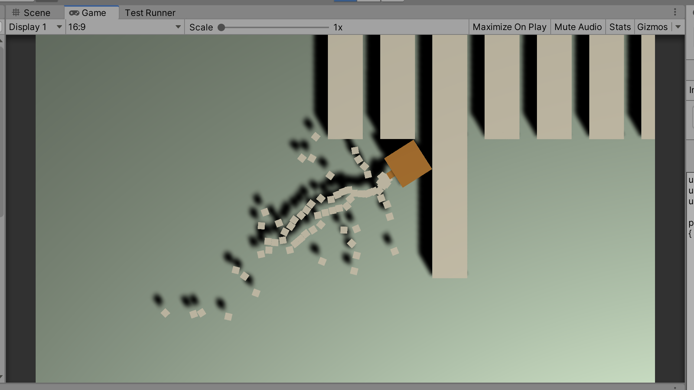

# Unit 05c: More Projectiles  <!-- omit in toc -->

- [Introduction](#introduction)
- [Goal](#goal)
- [Process](#process)
  - [Rapid Fire](#rapid-fire)
- [Wrap-Up](#wrap-up)
- [Further Material](#further-material)

## Introduction

In the last unit we got the player shooting a bullet when the left mouse button is clicked. This time, we're going to look into rapid-fire bullets. Through this process, we'll learn about coroutines, another important structure in Unity development.

## Goal

PEWPEWPEWPEWPEWPEWPEWPEWPEWPEWPEWPEWPEWPEWPEW

## Process

To complete this unit, we'll need be editimng the `PlayerAttack` script that we made in the last unit.

### Rapid Fire

1. The existing code looks like this:

```C#
    // Update is called once per frame
    void Update()
    {
        if (Input.GetButtonDown("Fire1"))
        {
            Debug.Log("Fire!");
        }
    }
```

which shoots one bullet every time we click the button. Make sure you've got this working first.

2. Instead of checking if the button has been pushed down, we're just going to check if it is already down. We can do this by changing one method:

```C#
    // Update is called once per frame
    void Update()
    {
        if (Input.GetButton("Fire1"))
        {
            Debug.Log("Fire!");
        }
    }
```

Play the game, and hold down the left mouse button. NOW WE'RE TALKING!



3. As crazy fun as this is, we need to be able to rein it in. At the moment, there are too many bullets being instantiated, so much that they are colliding with each other and causing them to spray out. So let's slow down the pace of the bullets.

In order to do this, we need set up a **coroutine**.

> When you call a function, it runs to completion before returning. This effectively means that any action taking place in a function must happen within a single frame update; a function call can’t be used to contain a procedural animation or a sequence of events over time. A coroutine is like a function that has the ability to pause execution and return control to Unity but then to continue where it left off on the following frame.

In Unity, coroutines are based upon IEnumerators, a way of iterating through things easily. In this case, it'll iterate through a loop with a timer.

To start, add a new class variable:

```C#
public class PlayerAttack : MonoBehaviour
{
    public GameObject playerBulletPrefab;
    public Transform nozzle;
    public float reloadTime = 0.6f;
```

4. Next, we're going to add a boolean class variable called `reloading`:

```C#
public class PlayerAttack : MonoBehaviour
{
    public GameObject playerBulletPrefab;
    public Transform nozzle;
    public float reloadTime = 0.6f;
    public bool reloading;
```

> This boolean is acting as a basic **state machine**. State machines are systems that games use to keep track of state in the game -- the state of different objects. We'll be using them more as we progress in game development.

5. Next, we're going to make a new method, set up as a coroutine. Add this after the `Update` method:

```C#
    IEnumerator Reload()
    {
        reloading = true;
        yield return new WaitForSeconds(reloadTime);
        reloading = false;
    }
```

In this method, we set the `reloading` boolean to true, then we wait for the `reloadTime` time, then we set the `reloading` boolean to false.

> The `yield return` statement basically returns the coroutine back to the main routine, without executing the code that follows.

6. Now we need to call our new coroutine from our `Update` function:

```C#
    void Update()
    {
        if (Input.GetButton("Fire1") && !reloading)
        {
            Debug.Log("Fire!");
            Instantiate(playerBulletPrefab, nozzle.position, nozzle.rotation);
            StartCoroutine("Reload");
        }
    }
```

Note that we add an extra check to the `if` statement -- so it checks if the left mouse button is down *and* we're **not** reloading.

Then we call the coroutine following the creation of the new bullet.

Give it a go! And in the editor you can change the reload time as you like.

## Wrap-Up

This type of coroutine is quite common in game development, where you need to have something repeat at regular intervals.

## Further Material
- [Unity Manual on Coroutines](https://docs.unity3d.com/Manual/Coroutines.html)
- [Unity Manual on WaitForSeconds](https://docs.unity3d.com/ScriptReference/WaitForSeconds.html)