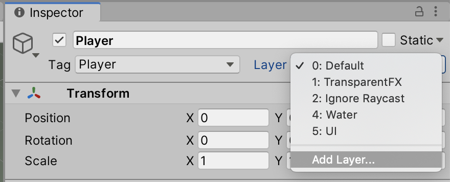
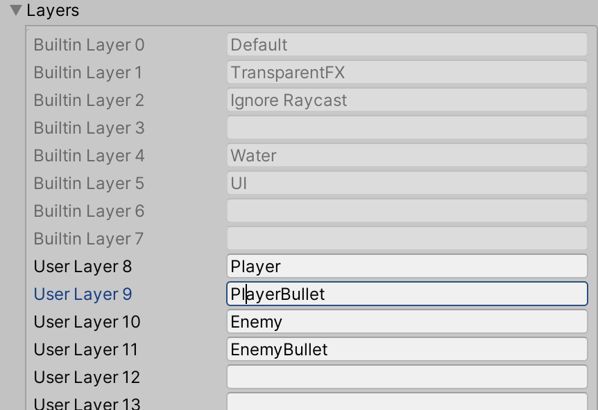
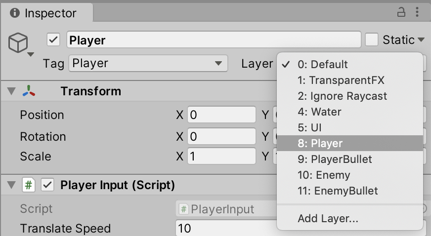
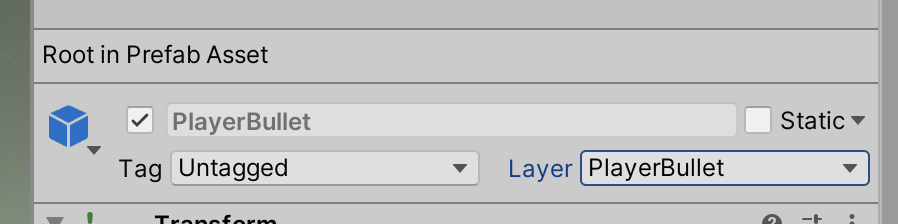
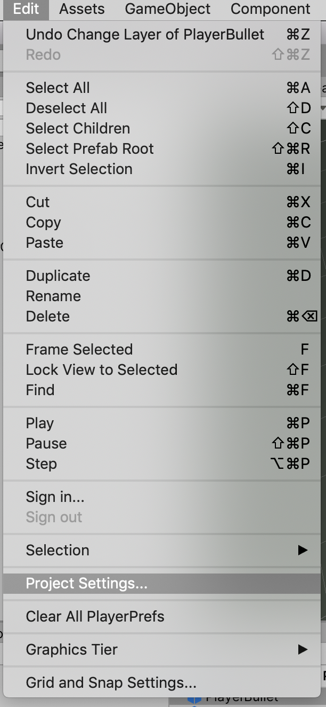
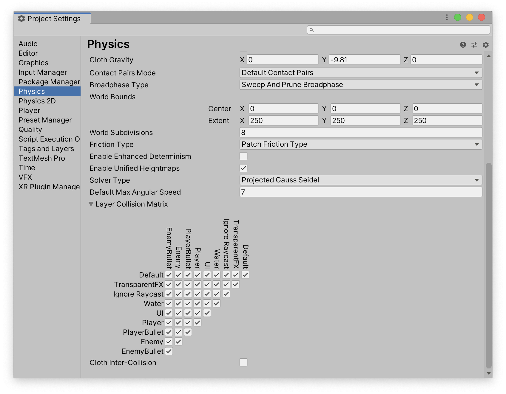

# Unit 05f: Health <!-- omit in toc -->
- [Introduction](#introduction)
- [Goal](#goal)
- [Process](#process)
- [Wrap-Up](#wrap-up)
- [Further Material](#further-material)

## Introduction

Now that we can get hit by a bullet, let's create a system to handle health. Through this, we'll start taking a look at more encapsulation and inheritance techniques.

## Goal

To have allow entities (players and enemies) to have health.

## Process

1. We're going to use the `Wall` prefab as our target. Find it in your Project, and open the Prefab for editing.
2. Select the topmost GameObject, `Wall`, and add a new script to it called `Health`. Open it in your editor.
3. Add a new public variable:

```C#
public class Health : MonoBehaviour
{
    public int health = 20;
```

4. Next, we need to add a method that handles damage. This will be a simple wrapper with a debug for now.

```C#
    public void Damage(int damage)
    {
        Debug.Log("OWWW: " + damage);
    }
```

5. Now we need to step over to our bullet, and add information about how much damage it does. Open your `PlayerBullet` script, and add a new class variable:

```C#
public class PlayerBullet : MonoBehaviour
{
    public Rigidbody rbody;
    public float speed = 10f;
    public float lifespan = 1f;

    public int damage = 4;
```

6. Next, we need to add our `OnCollisionEnter` method. But unlike what we did for the GettingShot unit, we're going to add it to the **Bullet**. That way, the bullet can collide with anything it comes into contact with.

> This demonstrates encapsulation -- the bullet handles when it hits something.

So, back in the `PlayerBullet` script, add:

```C#
    private void OnCollisionEnter(Collision other)
    {
        if (other.gameObject.TryGetComponent(out Health health))
        {
            health.Damage(damage);
            Destroy(gameObject);
        }
    }
```

> When you test this, it probably won't work! You might see the bullet for a fraction of a second, and then it disappears. This is because the bullet is colliding with the *player*! In order to fix this, we need to set up some **layers**.

7. With the `Player` selected, click on the **Layer** drop-down menu in the Inspector.



Select `Add Layer…`.
8. In the **Layers** inspector, add the following layers:



9. Click back on the Player, and set its layer to `Player`.



> If it asks you if you want to change all children -- you do.

10. In your Prefab directory, select the `PlayerBullet` and set its layer to `PlayerBullet`.



11. Now we're going to see how all this works together. Under the **Edit** menu, select **Project Settings**:



12. This will bring up the **Project Settings** panel. Select **Physics** on the left of this panel, and scroll to the bottom of the panel. You'll see the **Layer Collision Matrix**.



> This matrix has one checkbox for every combination of layer interactions. If the checkbox is checked, everything in the corresponding two layers will collide. If it's unchecked, they will not.

13. *Uncheck* the checkbox that connects `Player` and `PlayerBullet`. This will turn off collisions between those two layers.

> When you test the game, the player bullet should no longer collide with the player.

14. We're now going to work on our `Damage` method. This method will decrease the value of our `health` variable –– but we also need to keep track of when we get down to 0, as we don't want to slip into negative numbers. Add the following code:

```C#
    public void Damage(int damage)
    {
        // Debug.Log("OWWW: " + damage);
        health -= damage;
        if (health <= 0)
        {
            Debug.Log("I'm DEAD");
        }
    }
```

> Now when you test, you should get the message after 5 hits.

> Next, we need to *do* something with this information. The problem is that what that is will change depending on what is dying! When the **player** dies, we'll probably want to respawn, and potentially reduce the lives count. When an **enemy** dies, we'll probably want to destroy it. This means we'll need different scripts for each!

> TIn order to do this effectively, we need to start working with **inheritance**. We're going to have multiple classes for different types of object death, but we're not going to know what the name of those scripts are going to be. So we're going to make a **superclass** called `Death`, and **subclass** that. That way, we can just check for children of the `Death` class.

8. In your `Scripts` directory, make a new script called `Death`. Open it in your editor.
9. We're going to need to change the class declaration, as this will be an **abscract** superclass:

```C#
public abstract class Death : MonoBehaviour
{
```

> By making this class **abstract**, we're saying that we will never actually use this class, only subclass it.

10. Replace the body of the class with:

```C#
{
    public abstract void HandleDeath();
}
```

> This sets up a method called `HandleDeath`, that all subclasses will need to implement.

> That's it for our superclass!

11.  On your `Wall` object, create a new script called `WallDeath`. Open it in the editor.
12.  Change the class declaration to inherit from `Death`:

```C#
public class WallDeath : Death
```

13. Then, we need to implement the method:

```C#
    public override void HandleDeath()
    {
        Destroy(gameObject);
    }
```

> Pretty simple -- in this case, we just destroy the wall.

14. Getting there! Next, back in the `Health` script we need to grab the child of `Death` and tell it to `HandleDeath`:

```C#
    public void Damage(int damage)
    {
        // Debug.Log("OWWW: " + damage);
        health -= damage;
        if (health <= 0)
        {
            // Debug.Log("I'm DEAD");
            if (gameObject.TryGetComponent(out Death death))
            {
                death.HandleDeath();
            }
            else
            {
                Debug.Log("No Death script attached.");
            }
        }
    }
```

> Note that in our `TryGetComponent` call, we're using the **superclass** name. This works, as it will grab *any* subclass and use that.

> You can try making a simple sphere, add a `Health` script, and create a new `SphereDeath` script. That should work too!

> Take a look at our `PlayerBullet` class -- surely this is another opportunity for this same structure! Create a `Bullet` class, and subclass it to make all sorts of different projectiles.

## Wrap-Up
We can now have an object take damage, and handle some instances of death.

We also have a pattern we can use of using a superclass, instancing subclasses, and looking for the superclass.


## Further Material
