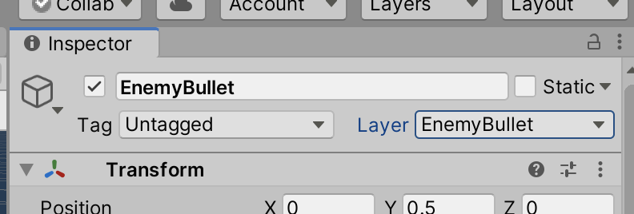
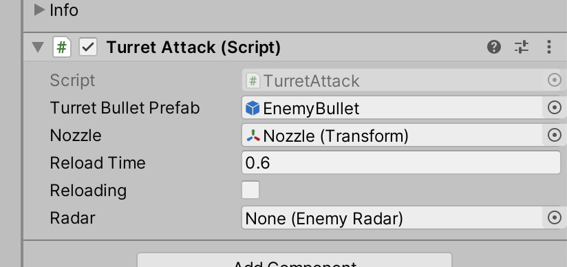

# Unit 09: Autonomous Behaviour

- [Unit 09: Autonomous Behaviour](#unit-09-autonomous-behaviour)
  - [Introduction](#introduction)
  - [Goal](#goal)
  - [Process](#process)
    - [Create a turret](#create-a-turret)
    - [Scripting the turret, first pass](#scripting-the-turret-first-pass)
  - [Wrap-Up](#wrap-up)
  - [Further Material](#further-material)

## Introduction

In this unit, we'll be making **enemies**. About time, too! These enemies will have *behaviour* associated with them, which will control what they do and how they act.

## Goal

To create opponents in our game, adding challenge to the gameplay.

## Process

### Create a turret

> The first type of enemy we are going to make is a turret. It will stay in one location, and rotate to aim at the player. It will also shoot projectiles that will damage the player.

> These first steps are very much like when we created the door -- start looking for these patterns!

1. In your Hierarchy, create a new empty GameObject and call it `Turret`. Add a Cylinder to it. Then add a Cube to the Cylinder (Turret contains Cylinder,Cylinder contains Cube).
2. Set the Transform of the Cube to be:

|         |x   |y   |z   |
|---      |:-: |:-: |:-: |
|Position |0   |0.5 |0.5   |
|Rotation |0   |0   |0   |
|Scale    |0.2   |0.2   |0.2 |

3. Lastly, add an empty GameObject at the tip of the cube, and name it "Nozzle". Just like we did with the player.
3. Add a `Rigidbody` component to the `Turret`. Set it to not use gravity, and to be Kinematic.

> Feel free to add materials, etc.

### Scripting the turret, first pass

> We're now going to start to add some behaviour. The first thing we want to do is have the turret know when the player is nearby. We're going to use the same technique we used to create the `PainZone` in the health script section: a trigger.

1. On your `Turret` object, add a **SphereCollider**. Set it to be a trigger, with a radius of 4.
2. Create a new script on your `Turret` object, called `EnemyRadar`. Open it in the editor.
3. After the `Update` method, create two new methods:

```C#
    private void OnTriggerEnter(Collider other)
    {
        Debug.Log("Entered radar");
    }
    private void OnTriggerExit(Collider other)
    {
        Debug.Log("Exited radar");
    }
```
> Oooh we have a new built-in method here: `OnCollisionExit`. As you can probably guess, it gets called whenever something exits the trigger zone. Neat!

> Test this, and make sure it all works so far. Also, note how you can also set off the message by shooting a bullet towards the turret! This is because at the moment, *anything* that enters the trigger will set it off. Let's change that so it's just the player.

> You could do this using the Layer Collision Matrix, like we did for projectiles; but let's try a new way. We're going to check within code.

4. Add a new `if` condition to your code:

```C#
    private void OnTriggerEnter(Collider other)
    {
        if (other.gameObject.CompareTag("Player"))
        {
            Debug.Log("Entered radar");
        }
    }
```

> This will force a check for the "Player" tag. So make sure your player has that tag!

> You might also have a case that it no longer works -- if this happens, it might be because you do not have a collider at the top level of your Player. Collisions and Triggers are only set off with Colliders, so find your topmost GameObject in the Player that has a Collider, and tag that object with "Player".

5. Now we're going to use this information to change the *state* of the Turret. Add a new class variable at the top of the class:

```C#
public class EnemyRadar : MonoBehaviour
{
    public GameObject player;
    public bool isActive;
 ```

 6. And let's set it in our trigger methods:

```C#
    private void OnTriggerEnter(Collider other)
    {
        if (other.gameObject.CompareTag("Player"))
        {
            Debug.Log("Entered radar");
            isActive = true;
        }
    }
    private void OnTriggerExit(Collider other)
    {
        if (other.gameObject.CompareTag("Player"))
        {
            Debug.Log("Exited radar");
            isActive = false;
        }
    }
 ```

 > Check to make sure the checkbox turns on when you get close.

> Now let's turn the turret to face the player. We're going to use the very simple but effective `Transform.LookAt()` method. We'll check if we're active, and if we are, face the player.

7. In your `Update` method, add the following code:

```C#
    void Update()
    {
        if (isActive)
        {
            transform.LookAt(player.transform);
        }
    }
```

> Not too complex! Test it, check if it's working.

> Now we're going to plunder the `PlayerAttack` script, to harvest the code. This approach is okay for prototyping, but ultimately copy-pasting code is a terrible idea, and you should be looking for ways to refactor.

8. Create a new script on the top level of the Turret, called `TurretAttack`. We're going to grab the code from `PlayerAttack`, and change the references to the player projectile:

```C#
public class TurretAttack : MonoBehaviour
{
    public GameObject turretBulletPrefab;
    public Transform nozzle;
    public float reloadTime = 0.6f;
    public bool reloading;
    
    // Start is called before the first frame update
    void Start()
    {
        
    }

    // Update is called once per frame
    void Update()
    {
        if (Input.GetButton("Fire1") && !reloading)
        {
            Debug.Log("Fire!");
            Instantiate(turretBulletPrefab, nozzle.position, nozzle.rotation);
            StartCoroutine("Reload");
        }
    }
    
    IEnumerator Reload()
    {
        reloading = true;
        yield return new WaitForSeconds(reloadTime);
        reloading = false;
    }
}
```

> Just changing the name of the prefab isn't going to make this work. We're still missing two things: how to replace the `GetButton` part of the `Update` method, and how to tie this script to the `EnemyRadar` script we just made.

> Instead of checking for a button down, we're going to check if the radar is active. To do this, we need to have this script know about the radar script.

9. At the top of the class, add a new class variable:

```C#
public class TurretAttack : MonoBehaviour
{
    public GameObject turretBulletPrefab;
    public Transform nozzle;
    public float reloadTime = 0.6f;
    public bool reloading;

    public EnemyRadar radar;
```

> Note how we can make the *type* of the variable the name of a script we've made. This strengthens the connection, as the editor can predict what variables and methods we now have access to.

> You *can* set this connect now in the editor, but let's set that connection in code.

10. Add the following to your `Start` method:

```C#
    void Start()
    {
        radar = GetComponent<EnemyRadar>();
    }
```

> See how we are using the *type* in the carets "<>"? This is us playing nicely with types! Not putting a cat into a bottle!

11. Now we can change the firing condition to check if the radar is active:

```C#
    void Update()
    {
        if (radar.isActive && !reloading)
        {
            Debug.Log("Fire!");
            Instantiate(turretBulletPrefab, nozzle.position, nozzle.rotation);
            StartCoroutine("Reload");
        }
    }
```

> So now, instead of checking if the mouse button is down, we're simply checking if the player is within the radar range.

12. In the editor, drag your `Nozzle` object into the Nozzle slot in the `TurretAttack` component.

> We can't forget the projectile! We *can* test now, but without an enemy bullet, not much will happen.

13. In your Project panel, navigate to your Prefabs directory. You can click on the `PlayerBullet` prefab, and select **Edit > Duplicate** menu. Rename the new prefab `EnemyBullet`, and double-click it to edit.
14. In the prefab, set its Layer to `EnemyBullet` (which you made earlier):



15. Exit editing the prefab, select the `Turret` in the Hierarchy, and drag the `EnemyBullet` prefab into the `turretBulletPrefab` slot in the `TurretAttack` component:



> Test out the game -- the turret should turn to face the player, and start shooting!

> There are quite a lot of issues here, though. Plenty of opportunity to refactor. Some points to pay attention to:
> - The `EnemyBullet` prefab is using the `PlayerBullet` script. Seems like we should either make a new script for the enemy, or rename the existing script. Looking ahead at the functionality we may want, we might want to have a separate script for enemy projectiles. But the core functionality is the same, so maybe we can turn the existing script into a parent script, and subclass all the variations.
> - The turret code is hard-coded to check for a `EnemyRadar` script. But what if we didn't want a radar? Or if we wanted a different type of trigger method? We can probably abstract this out to be more flexible.
> - We're also almost-wholesale copy-pasting from the `PlayerAttack` script. That should definitely change.

## Wrap-Up

In this, our first pass at autonomous behaviour, we were able to create a very rudimentary radar using the same technique as our earlier `PainZone` technique. We then connected this to a modified `PlayerAttack` script, using a direct GetComponent connection with a definite type. We also starting tracking the turret *state* using a simple boolean.

## Further Material