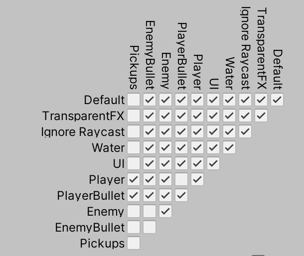
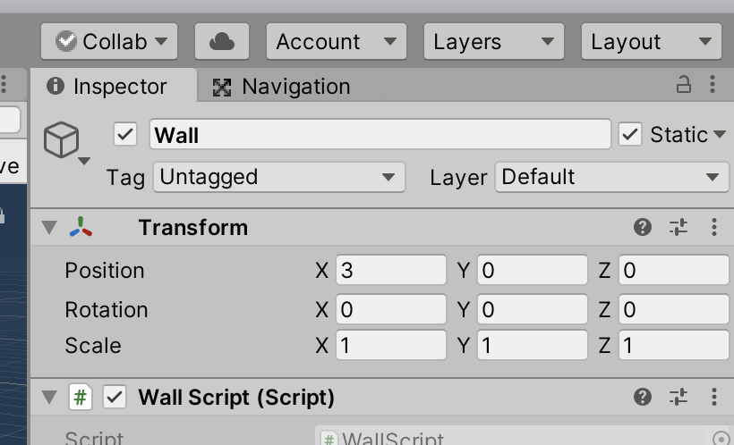
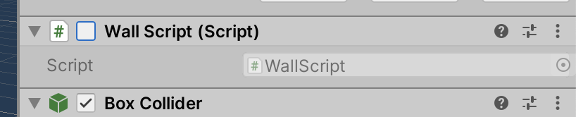
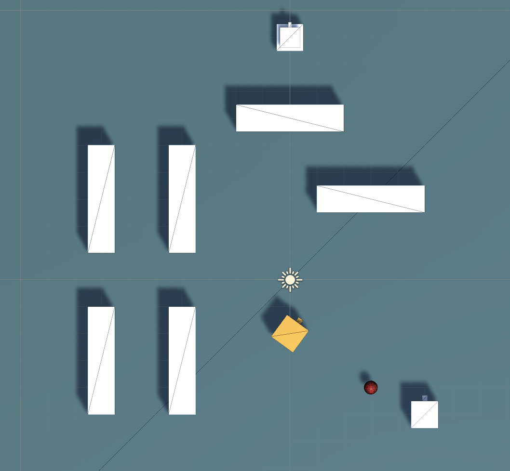
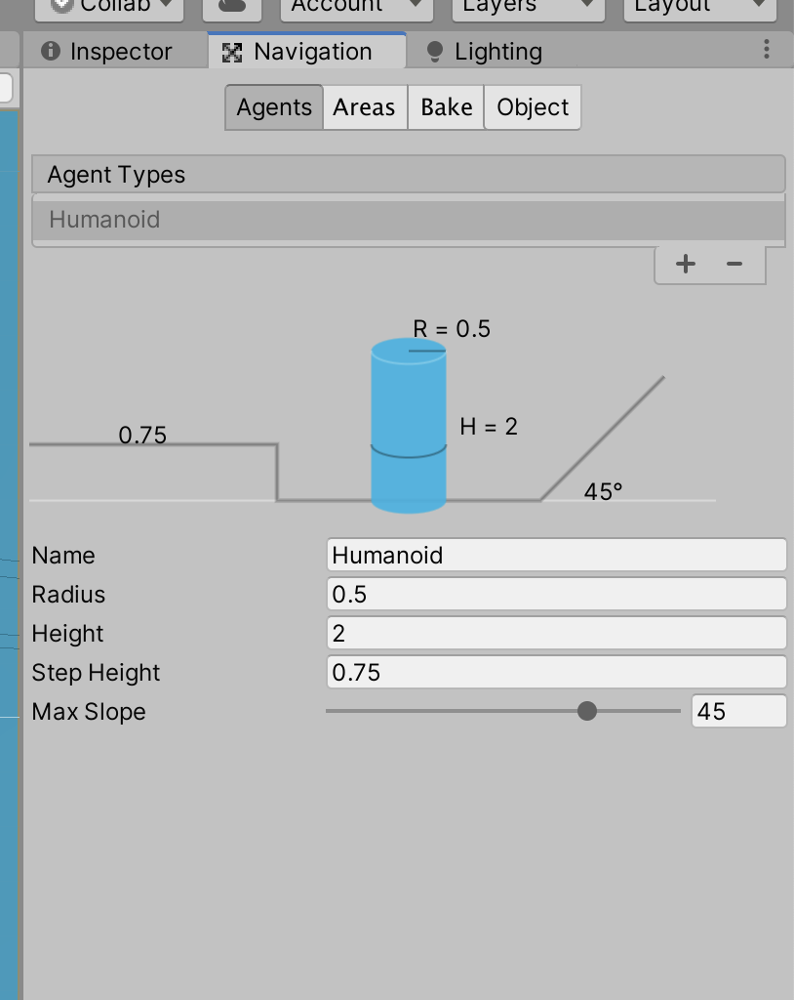
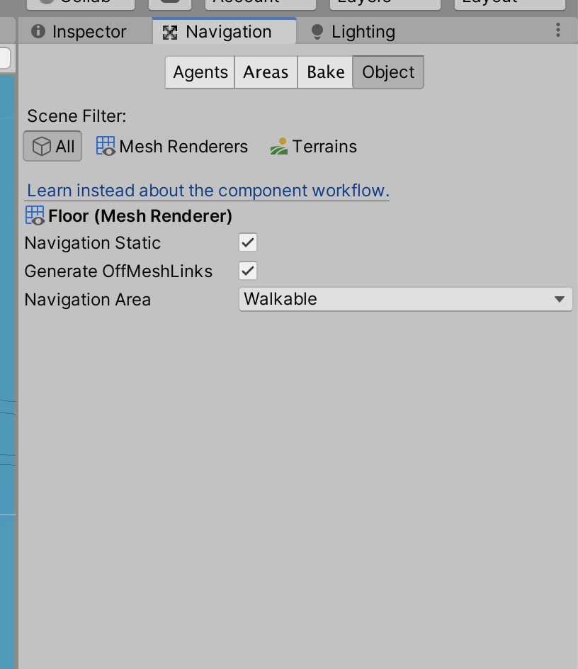
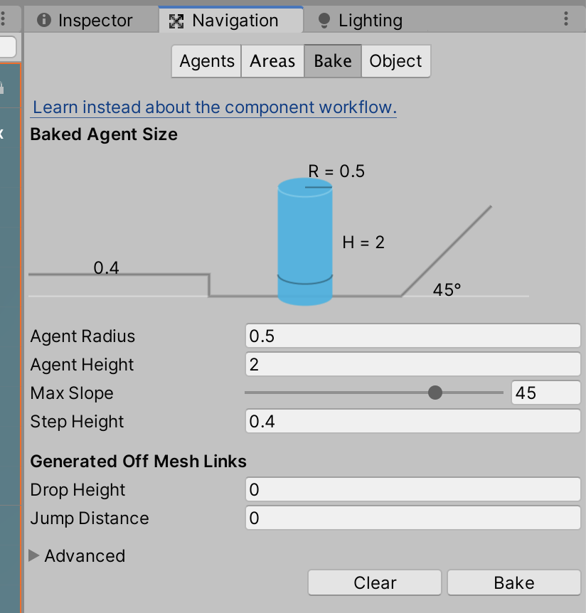
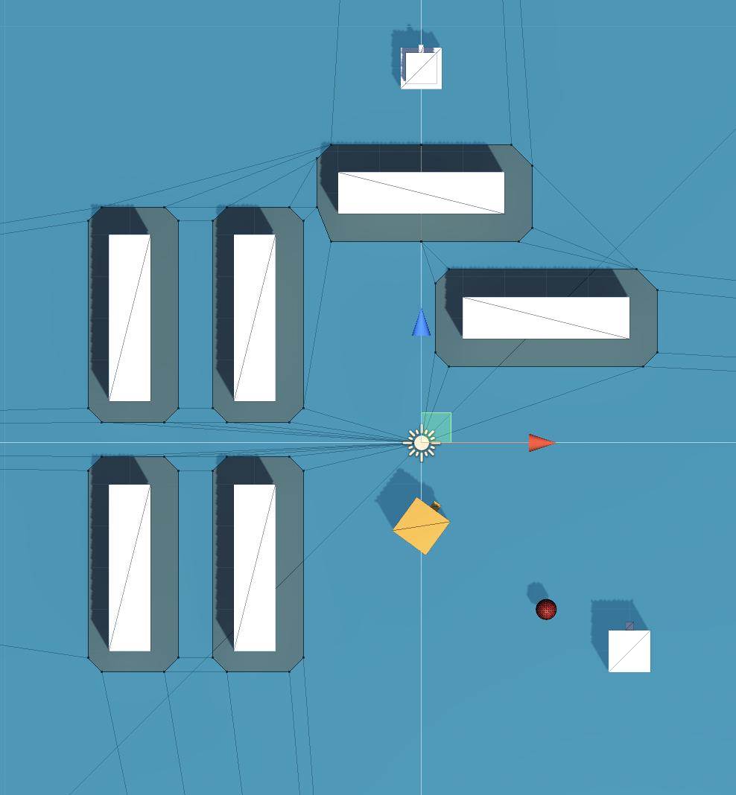

# Unit 09c: More Autonomous Behaviour

- [Unit 09c: More Autonomous Behaviour](#unit-09c-more-autonomous-behaviour)
  - [Introduction](#introduction)
  - [Goal](#goal)
  - [Process](#process)
    - [Create a tank](#create-a-tank)
    - [Moving the tank, first pass](#moving-the-tank-first-pass)
    - [Making the Tank shoot](#making-the-tank-shoot)
    - [Moving the tank, second pass](#moving-the-tank-second-pass)
      - [Setting up the scene](#setting-up-the-scene)
      - [Creating the NavMesh](#creating-the-navmesh)
  - [Wrap-Up](#wrap-up)
  - [Further Material](#further-material)

## Introduction

We now have a rudimentary enemy turret. Next, we're going to look at making an enemy that moves around!

## Goal

To make an enemy that persues the player while shooting at it.

## Process

### Create a tank

> The next type of enemy we are going to make is a tank. It will persue the player around the level. It will also shoot projectiles that will damage the player.


1. In your Hierarchy, create a new empty GameObject and call it `Tank`. Create the following hierarchy within it:

- Tank (empty gameObject)
  - Body (Cube)
    - Turret (Cube)
      - Barrel (Cube)
        - Nozzle (empty gameObject)

> Feel free to add materials, etc.

### Moving the tank, first pass

> We're now going to start to add some behaviour. We're going to reuse the `Radar` script from the Turret, so the Tank only starts attacking when the player in in range.

1. To the top-most `Tank` object, add a SphereCollider and the `EnemyRadar` script. Set the SphereCollider to be a Trigger, and the radius to 6.

> If you test the game, the Tank should rotate to look at the player when the player is in range. Neat!
>
> Next we're simply going to make the Tank move forward -- which, because we're already aiming at the player, means it'll go after the player.

2. Create a new script on the `Tank` called `TankMovement`, and open it in the editor.
3. We need to hook the movement script up with the `EnemyRadar` script, just like we did with the `TurretAttack` script:

```C#
public class TankMovement : MonoBehaviour
{
    public EnemyRadar radar;
    
    // Start is called before the first frame update
    void Start()
    {
        radar = GetComponent<EnemyRadar>();
    }
```

> Test, and check that the `radar` field in the editor gets filled out when you play the game.
>
> Now let's do something with this connection!

4. In the `Update` function, we're going to check if the radar is active, and if so, move forward:

```C#
    // Update is called once per frame
    void Update()
    {
        if (radar.isActive)
        {
            transform.Translate(Vector3.forward);
        }
    }
```

> Test the game, and move the player close to the Tank. Notice how the Tank moves towards the player… possibly too quickly. Let's fix that.
> >
> Remember that the `Update` function runs every redraw, which has inconsistent speed depending on the speed of the computer. We're going to even this out with the classic Time.deltaTime trick. Remember this trick.

5. Change the code to:

```C#
        transform.Translate(Vector3.forward * Time.deltaTime);
```

> Better! We're being chased now, without being overrun every frame. Let's get some control over the Tank's speed.

6. Add a new class variable:

```C#
public class TankMovement : MonoBehaviour
{
    public EnemyRadar radar;
    public float translateSpeed = 4f;
```

7. And modify the movement to use it:

```C#
        transform.Translate(Vector3.forward * Time.deltaTime * translateSpeed);
```

> Alright! We have the Tank following the player, and we can control its speed.

### Making the Tank shoot

> Now that we have the Tank moving, let's make it shoot too.
>
> Just to make it work for now, we can reuse the TurretAttack script -- after all, it does everything we need! The reason we might want to make a different script is if we ever want to significantly change the functionality. For now, it's good.

1. Add a `TurretAttack` script to the `Tank`. Drag the `Nozzle` from the `Tank` object into the Nozzle slot. Drag the `EnemyBullet` prefab into the prefab slot. Set the ReloadTime to 0.2.

> Now the Tank also shoots at us! Superb. But, just like the Turret, it is impossible to destroy. Let's fix that too.

2. Add a `Health` script to the `Tank`.

> If, when you test, the Tank starts losing health even without being it, it probably means that the `EnemyBullet` prefab is set to collide with the `Enemy`. You can fix that in the **Edit > Project Settings…** menu. Make sure there is no check in the intersection between `EWnemyBullet` and `Enemy`:
> 
> 

> Now we need to get rid of the Tank when it loses all of its health. For now, we can just use the `TurretDeath` script.

3. Add a `TurretDeath` script to the `Tank`.

> We now have a decent working Tank enemy, that chases us and shoots at us.
>
> The main issue is that the Tank does not take the enironment into consideration. It will drive into walls, without any thought of going around them. They're currently pretty basic. Let's go deeper.

### Moving the tank, second pass

#### Setting up the scene

> The next section will be quite involved. Don't be put off! Ask questions! But, ultimately, if you want to stick with the basic movement, you can.
>
> Let's take care of some general housekeeping, before we get to the details. If you still have a `WallMakerObject` in your scene, either disable it or delete it. It'll make things screwy (that's a technical term). Next, if you haven't already, create many walls in between your Tank and your player. Use the prefab `Wall`, as we need to make some small changes to it.

1. Open your `Wall` prefab. **Important:** make sure you're opening the prefab for editing, and not just changing an instance of the Wall.
2. At the top right of the Inspector, set the `Wall` to be **static**:



> If it asks if you want to change all the children, do so.

> By setting the Wall to static, it means it will not move during gameplay, so the navigation can be baked in around it before the game starts.

3. Disable the `WallScript`, if you have one, by unchecking the checkbox next to the name:



> Our walls will no longer be destroyable for now.

4. Lastly, set the `Floor` (or `Plane` depending in how it's named) to static as well.

> My little level will look like this:



#### Creating the NavMesh

> Next, we're going to create a **NavMesh**. This is a invisible representation of the traversable areas of your level. It gets generated outside of gameplay, and applied to any horizontal surface. It compensates for any static objects, so autonomous agents can avoid them.

1. First, we need to open the Navigation panel, located at **Window > AI > Navigation**. It might pop up in the same spot as your Inspector, and may look like (depending on the selected tab):


 

2. In the Hierarchy, select the `Floor`. Then, in the Navigation panel, select the Bake tab and click the Bake button (awkward naming).



> After a short moment, my `Floor` now looks like this:



> The light areas are traversable, and the dark areas near the walls are not. 

## Wrap-Up


## Further Material