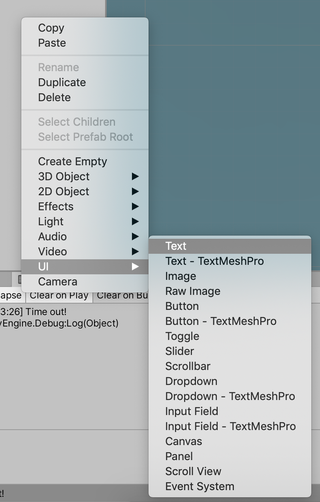
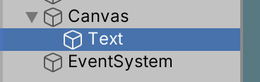
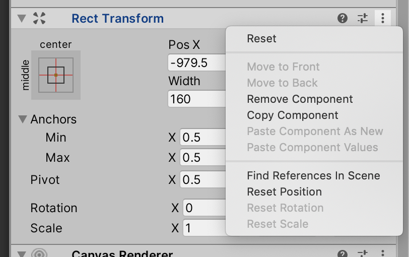
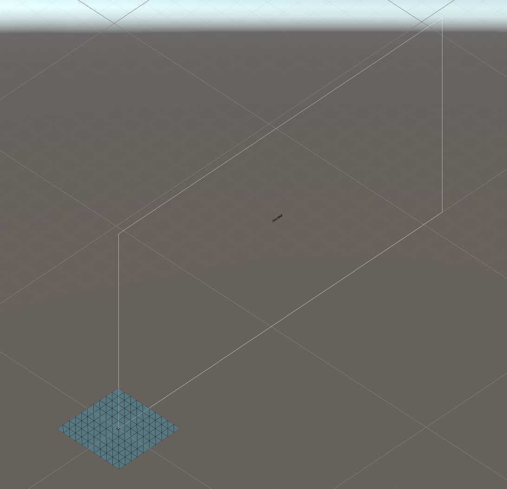
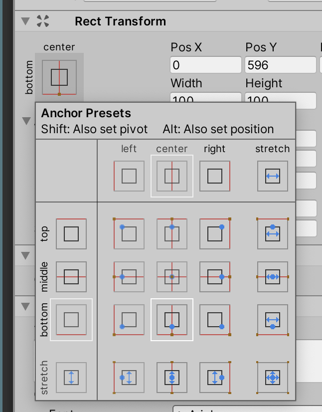
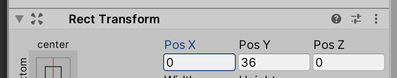
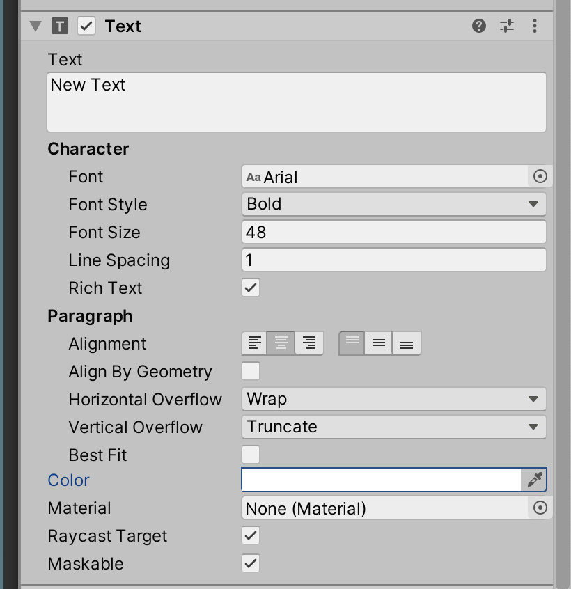
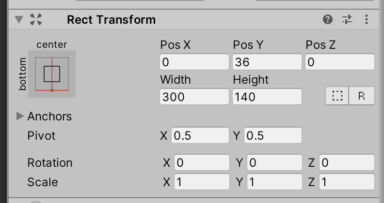
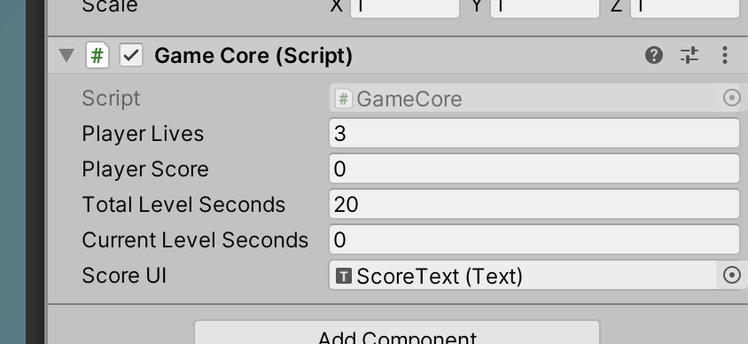
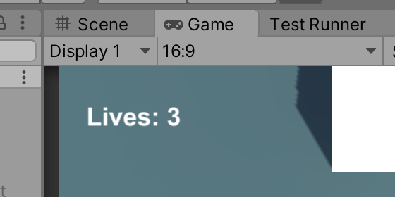

# Unit 10b: User Interface  <!-- omit in toc -->

- [Introduction](#introduction)
- [Goal](#goal)
- [Process](#process)
  - [Create the text UI](#create-the-text-ui)
  - [Connect the game variables to the UI](#connect-the-game-variables-to-the-ui)
  - [Complete code](#complete-code)
    - [GameCore.cs](#gamecorecs)
- [Wrap-Up](#wrap-up)
- [Further Material](#further-material)

## Introduction

In the GameState unit, we created some game-wide variables for player lives and score. But those variables are only viewable in the editor. So in this unit we'll be creating some UI to put those values up on the screen.

## Goal

To add user interface elements to the game.

## Process

### Create the text UI

1. In the Hierarchy, right-click and select **UI > Text**.



> Note how when you do this, Unity autoamtically creates a `Canvas` object and an `EventSystem`.
> 
> We'll  be playing with the Canvas a little, but don't worry about the EventSystem just yet.

2. Make sure you've got the `Text` object selected, and change its name to `ScoreText`. Then click on the component menu for the `RectTransform` component, and reset its transform:



> Switch from your Scene panel to the Game panel, and you should be able to see a tiny "New Text" in the middle of the game screen.
> Back in the Scene panel, zoom out *really* far. Eventually you'll see the Canvas as a large rectangle in the x-y plane:
> 

> Now we're going to position the text, so it's not sitting in the middle of the screen. First, we're going to **anchor** the text to the bottom of the screen. Anchoring makes the text stick to a relative position on the screen -- so on different screen resolutions, the text stays relative to an edge or corner.

3. Click on the anchor icon in the RectTransform component, to bring up the anchor menu. Select the middle-bottom icon.



> You may notice the `Pos Y` value changes. This is because we've changed where the position is measured from -- now we're measuring Y from the bottom of the screen. Let's now set the position.

4. Change the `Pos Y` value to 36:



> The "New Text" should now jump to near the bottom of the screen.

> We're now going to format the text a little. Feel free to play around with the formatting to match your game. Firstly, let's set the text formatting.

5. Set your `Text` component to these values:



> When you change these values, your text might disappear. Don't worry -- it's just that the *frame* around the text is too small to show the text, so it clips the text. You can make the frame larger in the RectTransform component by increasing the width and height:
> 

### Connect the game variables to the UI

> Now that we have a text UI component, let's hook up our score variable to show it.

1. Back in your `GameCore` script, add the UnityEngine.UI library to the top of your script:

```C#
using System;
using System.Collections;
using System.Collections.Generic;
using UnityEngine;
using UnityEngine.UI; // makes the UI accessible in code

public class GameCore : MonoBehaviour
```

2. Then add a class variable to connect to the Text object on-screen:

```C#
public class GameCore : MonoBehaviour
{
    public int playerLives = 3;
    public int playerScore = 0;

    public float totalLevelSeconds = 20f; // we're going to set this low just for testing
    public float currentLevelSeconds;

    public Text scoreUI;
```

3. Then in the `Update` method, we can set the text to the score value:

```C#
    private void Update()
    {
        currentLevelSeconds -= Time.deltaTime;
        if (currentLevelSeconds <= 0f)
        {
            // Game over!
            Debug.Log("Time out!");
        }
        
        // Update the on-screen score
        scoreUI.text = playerScore.ToString();
    }
```

> Note the `ToString()` method -- with some coding languages, we can't explicitly change a number (`int`) to letter (`String`). Remember the cat in the bottle? We can't fit a number cat into a text bottle. But the `ToString()` method allows it to fit!

4. Lastly, we need to connect the `ScoreText` object in our Hierarchy to the `scoreUI` slot in the `GameCore` component.



> Now when you test, you should be able to get the score on the screen! Next, we're going to add a Text to show the lives. This will be slightly different, as we'll also add some text to show "Lives:" before the value.

1. Repeat the steps above to create a Text, and make it anchored to the top-left corner. Add the class variable (`livesUI`).
2. Then add a new line to `Update`, which outputs both text and the lives value:

```C#
    private void Update()
    {
        currentLevelSeconds -= Time.deltaTime;
        if (currentLevelSeconds <= 0f)
        {
            // Game over!
            Debug.Log("Time out!");
        }
        
        // Update the on-screen score
        scoreUI.text = playerScore.ToString();
        // Update the on-screen lives:
        livesUI.text = "Lives: " + playerLives.ToString();
    }
```

> Now you'll have the text in the corner:
> 

### Complete code
#### GameCore.cs

```C#
using System;
using System.Collections;
using System.Collections.Generic;
using UnityEngine;
using UnityEngine.UI; // makes the UI accessible in code

public class GameCore : MonoBehaviour
{
    public int playerLives = 3;
    public int playerScore = 0;

    public float totalLevelSeconds = 20f; // we're going to set this low just for testing
    public float currentLevelSeconds;

    public Text scoreUI;
    public Text livesUI;

    void Start()
    {
        currentLevelSeconds = totalLevelSeconds;
    }

    private void Update()
    {
        currentLevelSeconds -= Time.deltaTime;
        if (currentLevelSeconds <= 0f)
        {
            // Game over!
            Debug.Log("Time out!");
        }
        
        // Update the on-screen score
        scoreUI.text = playerScore.ToString();
        // Update the on-screen lives:
        livesUI.text = "Lives: " + playerLives.ToString();
    }

    public void DecreasePlayerLives()
    {
        playerLives--;
        if (playerLives <= 0)
        {
            // Game over, dude!
            Debug.Log("Game over!");
        }
    }

    public void IncreasePlayerScore(int value)
    {
        playerScore += value;
    }
}
```

## Wrap-Up

In this unit, we created some Text UI elements, and connected them to our code. If you have further values to display, continue to make other UI elements!

## Further Material
- [UI Text in the Unity Manual](https://docs.unity3d.com/Packages/com.unity.ugui@1.0/manual/script-Text.html)