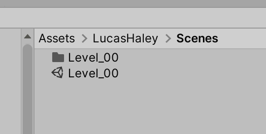
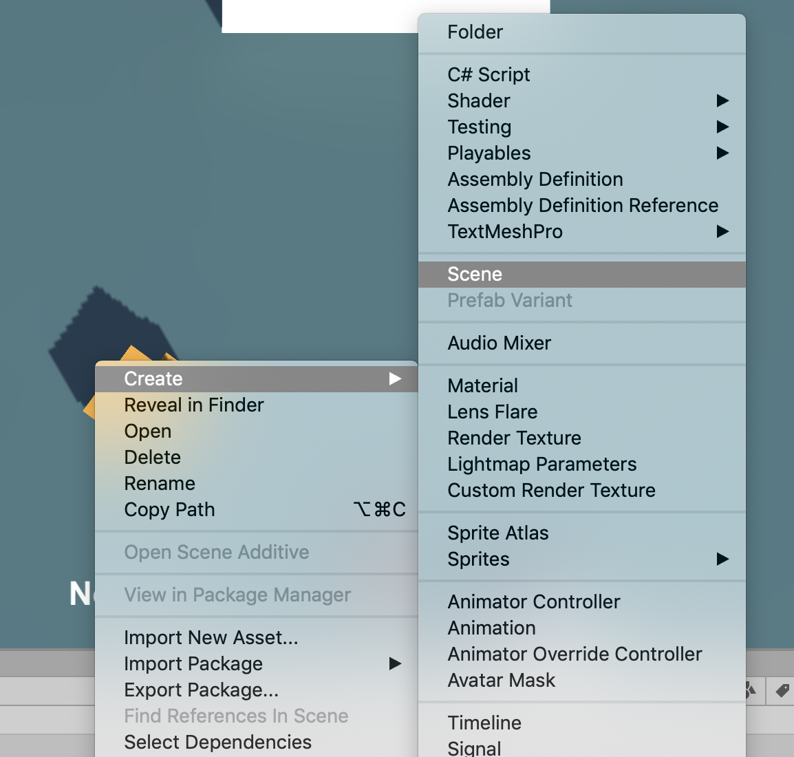
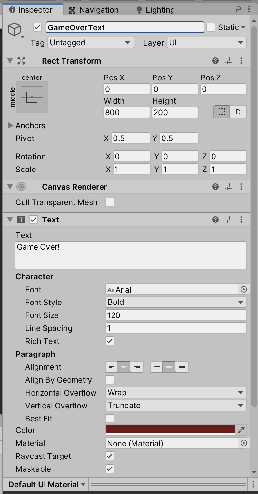
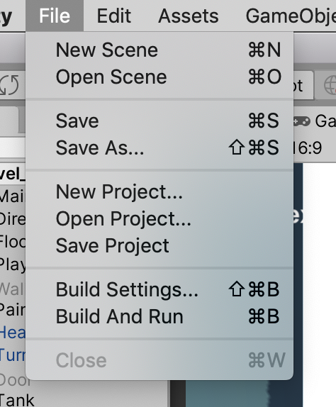
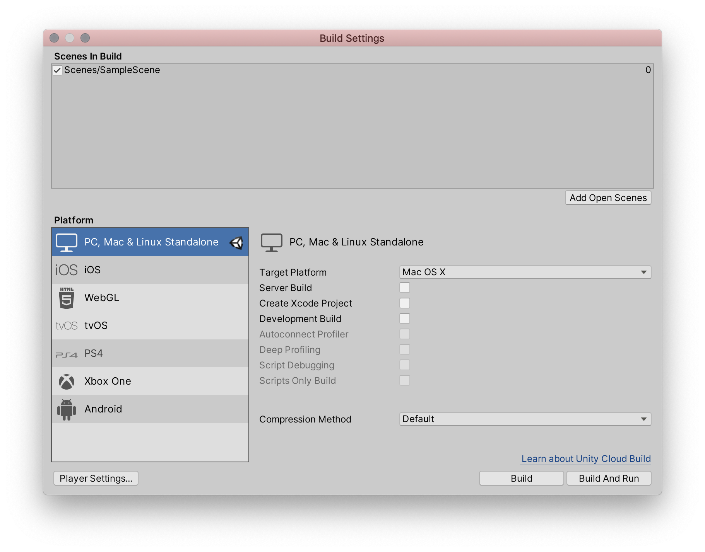
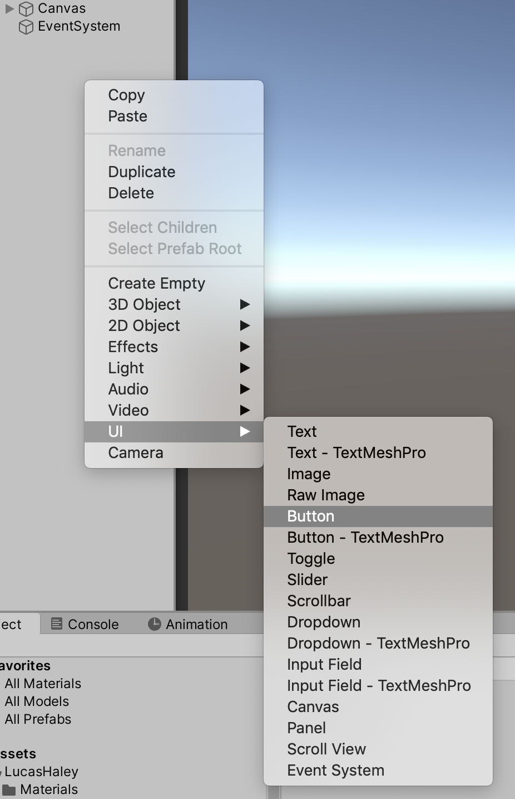
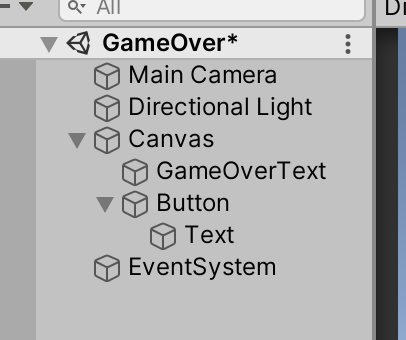
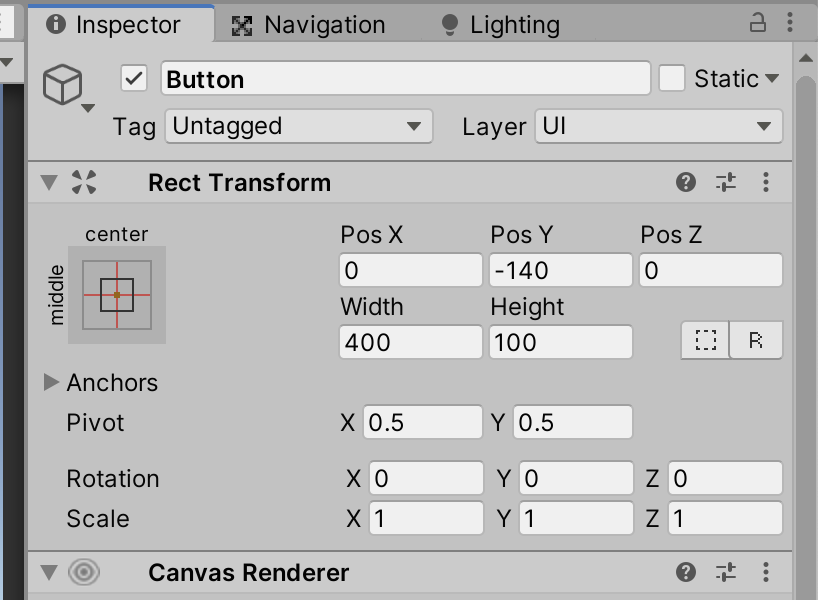
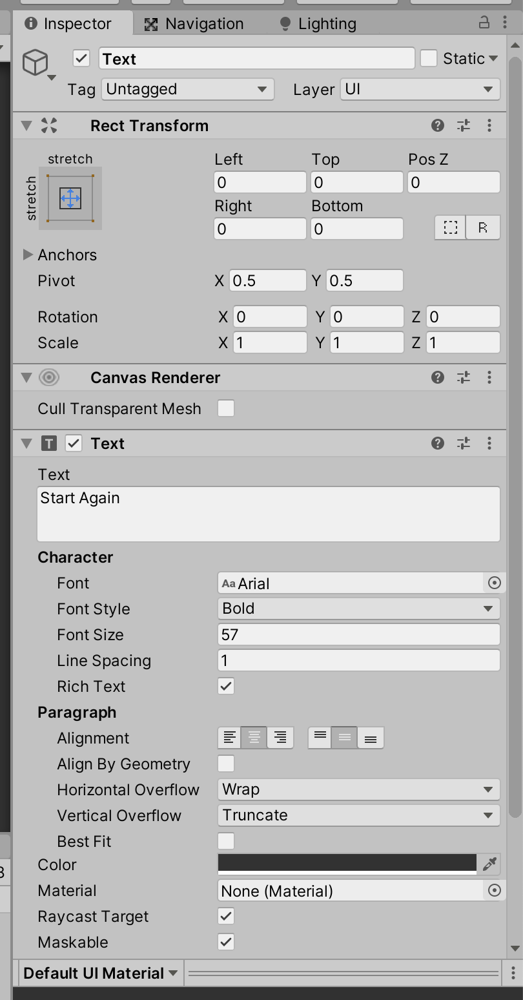

# Unit 10c: Scene Management <!-- omit in toc -->

- [Introduction](#introduction)
- [Goal](#goal)
- [Process](#process)
  - [Create the game over scene](#create-the-game-over-scene)
  - [Switch scenes at game over](#switch-scenes-at-game-over)
  - [Keeping the GameCore](#keeping-the-gamecore)
  - [Restarting the game](#restarting-the-game)
- [Wrap-Up](#wrap-up)
- [Further Material](#further-material)

## Introduction

In the previous two units, we introduced Game-wide variables and on-screen user interface. We need to get to those before we get to Scene Management, which has some trickiness in Unity. But we're ready now!

## Goal

In this unit, we will introduce scene management by switching to a "game over" screen when the game is… over.

## Process

### Create the game over scene

> To begin, we're going to create the Game Over screen. This is going to be a new **scene** in Unity.

1. Save your current work, and in the Project panel navigate to the `Scenes` folder in your named folder:



2. Right-click in the Project panel, and select **Create > Scene**. Name the scene `GameOver`.



3. Double-click on the new scene to edit it.
4. Like you did in the User Interface unit, create a new UI Text, and set its components to be:



> It's not beautiful, but it'll work for now. We'll be adding more functionality later.

5. Save your scene.

### Switch scenes at game over

> At the moment, we have two ways to reach the Game Over screen: when the player loses all lives, and when the timer runs out (you may have one or the other). Let's make one place for us to say the game is over, and those separate conditions can call that one point.

1. In your `GameCore` script, add the link to the scene management library:

```C#
using System;
using System.Collections;
using System.Collections.Generic;
using UnityEngine;
using UnityEngine.UI; // makes the UI accessible in code
using UnityEngine.SceneManagement; // makes the scene manager accessible
```

2. Then create a new `GameOver` method:

```C#
    public void GameOver()
    {
        
    }
```

3. In this method, we'll use the `SceneManager` to load a new scene using the `GameOver` scene name:

```C#
    public void GameOver()
    {
        SceneManager.LoadScene("GameOver");
    }
```

> Not too difficult! Now we need to call this method from the different points that the game can be over.

4. In your `DecreasePlayerLives` method in `GameCore`, add the following:

```C#
    public void DecreasePlayerLives()
    {
        playerLives--;
        if (playerLives <= 0)
        {
            // Game over, dude!
            Debug.Log("Game over!");
            GameOver();
        }
    }
```

> Almost there. The last step we need to do is make the build settings aware of the GameOver scene.

5. Under the **File** menu, select **Build Settings…**.



6. This brings up the Build Settings:



> Here is where we are able to set which platform we're building for, and other settings. For us right now, we want to pay attention to the large area at the top of the panel, where it says **Scenes in Build**.
> These scenes are the scenes that will be included in the final build of the game. When you have multiple levels, each level will be a scene, and each scene needs to be included here.
> The first scene in this list will be the first scene loaded, so when we create a splash screen, make sure it's at the very top of this list.

7. While you're still editing the `GameOver` scene, click the **Add Open Scenes** button.

> Switch back to your level scene, and try losing the game. Hopefully it switches to the Game Over scene!

### Keeping the GameCore

> You might have noticed that when we switch scenes, *nothing* from the previous scene comes with us. It's just the new scene, and nothing more.
> If we wanted to show the final score in our game over scene, we can't! We no longer have access to the `GameCore` object, which has our score. Unity does not automatically carry any data or objects from one scene to the next.
> But there is a way to designate some objects to carry over! Let's get the `GameCore` object to carry.

1. In your `GameCore` script, add the following to the `Start` method:

```C#
    void Start()
    {
        currentLevelSeconds = totalLevelSeconds;
        DontDestroyOnLoad(this.gameObject);
    }
```

> Here, we are calling `DontDestroyOnLoad`, and specifying the current GameObject. This preserves the GameCore object when we switch scenes, so if you wanted to add a final score UI element, go ahead!

### Restarting the game

> Now we're going to implement a system to start the game over again.

1. In your `GameOver` scene, right-click in the Hierarchy and select **UI > Button**:



> Note how this creates a Button object, as well as a Text object within the button:
> 
> 

2. Rename the button to `RestartGameButton`, and set the following settings in the Button and the Text:




> You can test the scene, and you should be able to click on the button.

3. Create a new empty gameObject, name it `GameOver`, and attach a new script called `GameOver`.
4. At the top, make the `UnityEngine.Events` and `UnityEngine.UI` libraries available:

```C#
using System.Collections;
using System.Collections.Generic;
using UnityEngine;
using UnityEngine.Events;
using UnityEngine.UI;

public class GameOver : MonoBehaviour
```

5. Then create the following `Start` method:

```C#
    void Start()
    {
        Button restartButton = GameObject.Find("RestartGameButton").GetComponent<Button>();
        UnityAction restartAction = GameObject.FindObjectOfType<GameCore>().RestartGame;
        restartButton.onClick.AddListener(restartAction);
    }
```

> Working through this code, here is what happens: first, we get a link to the button. Make sure you've named your button in the editor! Next, we create a `UnityAction` from the `RestartGame` method in the GameCore object. A `UnityAction` is a special kind of type that holds a referene to a method. You might use these more in the coming advanced courses. Lastly, we make the button call the UnityAction we've created when the button is clicked.

> Now test your game from your level scene, and make sure you can both reach the game over screen, and can click the restart button.

> You may notice that there are some issues when we restart -- possibly your UI text might not be linked any more, and your level isn't reset. We'll add some details to the `GameCore` code to help.

6. In `GameCore`, add a new variable, and change the old `playerLives` name:

```C#
public class GameCore : MonoBehaviour
{
    public int startingPlayerLives = 3;
    public int currentPlayerLives;
```

7. You'll also need to edit your `DecreasePlayerLives` to reflect the new name change:

```C#
    public void DecreasePlayerLives()
    {
        currentPlayerLives--;
        if (currentPlayerLives <= 0)
        {
```

8. Then we need to make a new `ResetGame` method. This is where we'll do everything we need to set the game back up. In our current state, we need to reset the lives, the score, and the timer:

```C#
    void ResetGame()
    {
        currentLevelSeconds = totalLevelSeconds;
        currentPlayerLives = startingPlayerLives;
        currentLevelSeconds = totalLevelSeconds;

        // connect the text UI
    }
```

9. We can now use this new method in the `RestartGame` method:

```C#
    public void RestartGame()
    {
        SceneManager.LoadScene("Level_00");
        ResetGame();
    }
```

> Now we've got another issue. When we restart the game, we end up with **two** `GameCore` objects. This is a downside to the `DontDestoryOnLoad`, one that would be better handled with a robust Singleton object. But for now we'll edit the `GameCore` `Start` method to delete any new ones if we already have one.

10. Edit your `Start` method:

```C#
    void Start()
    {
        GameCore[] cores = GameObject.FindObjectsOfType<GameCore>();
        Debug.Log(cores.Length);
        if (cores.Length > 1)
        {
            Destroy(this.gameObject);
        }

        ResetGame();
        DontDestroyOnLoad(this.gameObject);
    }
```

> This code just checks if we have more than one `GameCore`, and if we do, we delete the new one.

## Wrap-Up

There's a lot of complicated stuff going on here. Make sure you go slowly so you comprehend some of the complexity. Then try setting up a system where you can have the player start a new level when the current level is done!

## Further Material
- [DontDestroyOnLoad in the Unity manual](https://docs.unity3d.com/ScriptReference/Object.DontDestroyOnLoad.html)