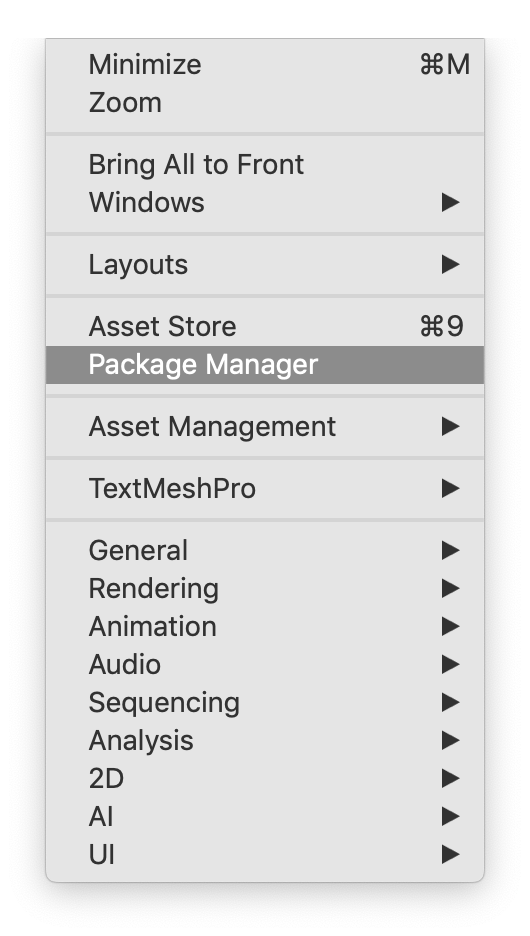
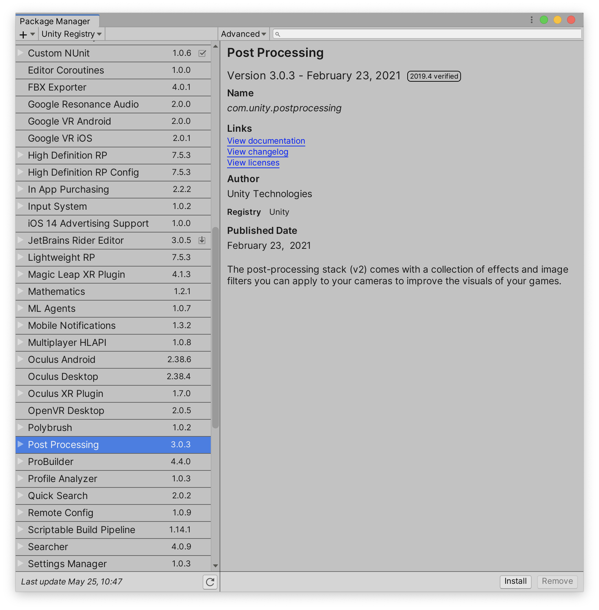
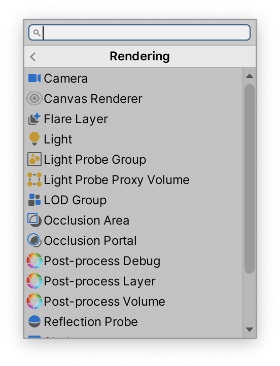
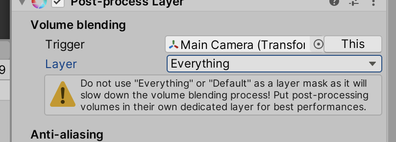
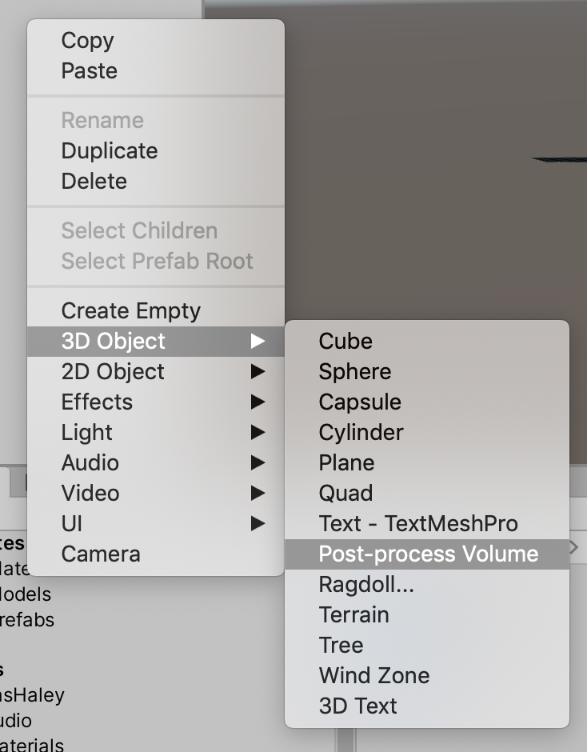
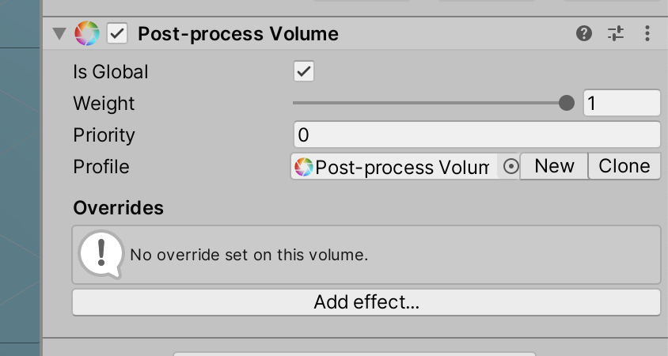
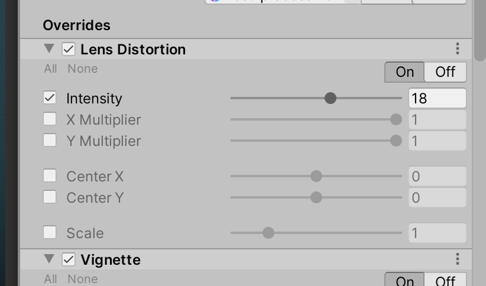

# Unit 12: Post-Processing <!-- omit in toc -->

- [Introduction](#introduction)
- [Goal](#goal)
- [Process](#process)
  - [Install the Post-processing Package](#install-the-post-processing-package)
  - [Setting up the camera](#setting-up-the-camera)
  - [Setting up the volume](#setting-up-the-volume)
- [Wrap-Up](#wrap-up)
- [Further Material](#further-material)

## Introduction

Modern games have a lot of tricks and techniques to make them visually interesting and beautiful. We're not that concerned at this level about making things super attractive, but there is a simple way to turn up the cool -- using **Post-processing**. Post-processing happens after the entire screen in rendered, but before it's shown on the screen. At this stage, we can play around with the rendered image just as if it were an image in Photoshop.

## Goal

To add simple post-processing to the game.

## Process

### Install the Post-processing Package

> Unity has many, many extra "packages" of functionality that can be added. A lot of these are in Beta, and are either instable, constantly changing, or simply not finished. You have been warned.
> To install a package, we use the **Package Manager**.

1. Go to the **Window > Package Manager** menu:

2. This brings up the Package Manager:

> You might need to wait a couple of seconds as Unity pulls data from online.

3. Scroll down to **Post Processing**, and click on the **Install** button at the bottom right.

> Unity will install this package in your Project in the **Packages** folder.

### Setting up the camera

> Now we need to do two things: tell the camera to use post-processing, and create a post-process volume.

1. Select your `Main Camera`, and add a new component of type **Rendering > Post-process Layer**.

> The new component has a bunch of settings, but the main one we're concerned about is the **Layer** setting. This setting applied the effect to only the checked layers.

5. In the `Layers` dropdown menu, select **Everything**.

> You'll get a warning about applying the effect to Everything. It's a good warning, and normally you *wouldn't* do this, but our games are small enough that it won't be a big deal.

### Setting up the volume

> Now we need to set up the post-process volume. Unity uses volumes -- cubes -- that specifies where the volume is applied. This way, you can have different post-process effects in different areas. For this game, we'll apply across the whole game.

1. Right-click in the Hierarchy, and choose **3d Object > Post-process Volume**:

> This creates a new gameObject with a Post-process volume component.

2. In the Post-process volume component, turn on `Is Global`:

3. Click the `New` button in the `Profile` slot to create a new profile.

> A profile is a selection of effects to apply.

4. You can now click the `Add Effect…` button to add new effects.

> Note that in order to change a value in any of the effects, you need to turn on the checkbox next to the name of the value. This way, Unity will optimise for only those values that are checked.

> Have fun with the effects!

## Wrap-Up

In this unit, we installed a Unity Package, which allowed us to add a post-process volume. Keep in mind that Packages are often difficult to use.

## Further Material

- [Unity Manual on Post-Process Volumes](https://docs.unity3d.com/Packages/com.unity.postprocessing@3.1/manual/index.html)